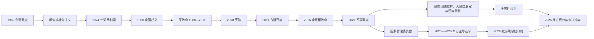

# 军人统治与国内冲突

## 时间

1962年至今；本文核验至2026年7月。

## 概括

1962年奈温以防止联邦分裂为由推翻吴努政府，军队从内战中的强势机构转为国家最高政治组织。“缅甸式社会主义”把主要企业国有化并限制对外联系，经济停滞、货币废止和一党压制最终引发1988年全国抗议。新军政府镇压示威、拒绝承认1990年选举结果，却在2011年后依据2008年宪法启动有限文官化。

2015年全民盟胜选并未结束军方的宪法特权。2021年军方推翻民选政府，城市不合作运动、人民防卫军和既有民族武装逐渐汇成全国性战争。2023年后军方在若干边境和内陆地区失去据点，转而更依赖空袭、炮击、征兵与地方民兵。2025—2026年军方组织排除主要反对力量的选举，敏昂莱于2026年转任总统；机构称谓恢复宪法形式，但战争、领土分割和合法性冲突并未结束。

## 军人政治的形成背景

- 独立后共产党、克伦及其他民族武装迅速起兵，国防军在保卫首都和交通线过程中形成全国性组织、情报与经济网络。
- 1958—1960年奈温看守政府经议会授权执政，为军方直接管理官僚、企业和地方行政提供经验。
- 掸族等推动更大联邦自治，吴努政府又把佛教定为国教；军方把联邦谈判解释为国家解体风险，但政变也终止了和平修宪空间。
- 贡榜王朝和殖民省界把差异很大的低地与边疆纳入同一国家，1947年彬龙承诺、自治权和资源分配始终没有形成所有族群接受的制度。
- 国防军把自身塑造成唯一跨地区、跨政党的“国家统一守护者”，军队商业、土地和预算利益又使其难以接受真正受文官监督。

## 分阶段发展

### 革命委员会与“缅甸式社会主义”（1962—1974）

1962年3月2日奈温发动政变，逮捕总统温貌、总理吴努和多名少数民族政治领袖，废除1947年宪法。革命委员会以军官为核心，解散议会，禁止或压制政党。7月仰光大学学生抗议遭军队射击，学生会大楼被炸毁，显示新政权以安全逻辑处理政治反对。

政府提出“缅甸式社会主义”，1963—1964年把银行、贸易、工业和大量商业国有化，限制外国投资与移民商业网络。缅甸社会主义纲领党成为唯一合法政治组织；军官和国家企业替代市场中介。政策试图建立经济自主和平均主义，却造成管理低效、黑市扩张、技术与资本外流。

### 一党共和国、经济危机与1988年起义（1974—1988）

1974年宪法建立缅甸联邦社会主义共和国，革命委员会形式结束，但社会主义纲领党垄断候选人、国家机关和群众组织。奈温先任总统，1981年后虽退出国家元首职位，仍以党主席控制主要决策。工人罢工和吴丹葬礼危机在1974年遭镇压，显示宪法化没有带来政治开放。

少数民族地区继续实施“切断粮食、资金、情报和新兵”的“四断”战略，造成迁村和长期人道影响。中国支持的缅甸共产党在东北建立根据地，克钦、克伦、掸等组织各自战争或谈判，国家从未真正垄断全部领土。

1987年政府突然废止大额纸币且补偿不足，大量储蓄化为乌有；同年缅甸被列为最不发达国家。1988年学生冲突演变为全国罢工和“8888运动”。奈温下台后盛伦、貌貌先后接任，仍无法恢复秩序。9月18日军队再次夺权，造成大量伤亡。

### 军政府重组与封闭统治（1988—2003）

国家恢复法律和秩序委员会废除一党宪法，承诺选举并局部开放市场。1989年官方把英文国名由Burma改为Myanmar，也更改多处地名；反对者认为未经民选授权，国际使用长期不一。昂山素季领导全国民主联盟成为主要反对党，她多次被软禁。

1990年选举中全民盟赢得绝大多数议席，军政府拒绝移交政权，称议员只能参与制宪。军队继续镇压低地反对派，同时在1989年缅共瓦解后与若干民族武装签订分别停火，允许部分组织保留武器和经济地盘。停火降低某些战线强度，却没有解决联邦权力、毒品、资源或地方治理问题。

1992年丹瑞接替苏貌，军政委员会1997年改名国家和平与发展委员会。同年缅甸加入东盟。政府依靠天然气、宝石、木材、军队企业和边境贸易获得收入；制裁、制度不透明和教育医疗投入不足限制广泛发展。

### 路线图、番红花革命与2008年宪法（2003—2011）

钦纽提出“七步民主路线图”，制宪会议在军方设定框架下重启。2005年中央机关迁往内比都，既改善战略纵深，也使首都远离最大城市社会。2007年燃油价格上涨引发僧侣参与的“番红花革命”，军警镇压并拘捕示威者。

2008年气旋纳尔吉斯重创伊洛瓦底江三角洲，救援迟缓加深治理批评。灾后不久举行宪法公投。新宪法为现役军官保留两院四分之一议席；修宪通常需超过四分之三支持，军方因此拥有否决权；国防、内政和边境事务部长由总司令提名，并设紧急状态移交权力机制。

2010年选举由亲军方联邦巩固与发展党获胜，全民盟抵制。2011年丹瑞解散军政府，登盛任总统。军人脱下制服进入政党、议会和企业，军方并未退出政治，而是把直接统治转为受宪法保护的双重权力。

### 有限开放与文军共治（2011—2016）

登盛政府释放部分政治犯、放宽媒体和结社限制、允许昂山素季参加2012年补选，并推动劳工、汇率和投资改革。西方逐步解除部分制裁，通信、金融和外资增长。政府与多个民族武装谈判，2015年签署全国停火协议，但克钦独立军、佤邦等关键组织未参加，协议从未覆盖全国。

开放同时释放土地征收、宗教民族主义和长期公民权矛盾。若开邦佛教徒与罗兴亚穆斯林2012年发生大规模暴力，隔离营地和行动限制持续。军方仍能独立作战，文官行政无法控制全部安全政策。

### 全民盟政府与制度上限（2016—2021）

2015年全民盟大选获压倒性胜利。因宪法禁止配偶或子女为外国国籍者任总统，昂山素季不能参选，议会创设国务资政职位使其成为文官政府实际领导；廷觉、后来的温敏担任总统。军方保有安全部门、议会配额和独立预算体系。

2017年若开罗兴亚救世军袭击安全据点后，军方发动大规模“清剿行动”，村庄焚毁、杀戮和性暴力指控促使七十多万人逃往孟加拉国。联合国调查人员指控严重国际罪行；军方否认或淡化，多数国内政党也未建立包容的罗兴亚公民权方案。昂山素季政府的国际信誉显著受损。

2020年全民盟再次大胜。军方和联邦巩固与发展党指控选民名册与投票舞弊；国内外观察没有发现足以改变结果的系统性证据。新议会开会前夕，军方拘捕国家领导人并宣布紧急状态。

### 2021年政变、抗议与全国性战争（2021—2023）

2021年2月1日国防军夺权，敏昂莱领导国家管理委员会。公务员、医护、教师、银行人员发动公民不服从运动，城市青年组织抗议。军警以实弹、拘捕和酷刑镇压后，部分反对者进入边疆受训或组建人民防卫军。

2020年当选议员组成联邦议会代表委员会，随后建立民族团结政府，宣布废除2008年宪法并倡议联邦民主宪章。民族团结政府、地方人民防卫军与民族武装之间合作程度不一；既有组织也会依据本民族领土、安全和对外关系采取独立策略。

军方在实皆、马圭等中部地区采用焚村、空袭和“四断”措施；反军方武装袭击据点、行政人员与补给线。影子行政、地方防务和民族政权并存，司法、教育、税收与人道援助碎片化。2022年军方处决民运人士，是数十年来首次恢复执行死刑，和解空间进一步收窄。

### “1027行动”、征兵与军方失地（2023—2025）

2023年10月，缅甸民族民主同盟军、德昂民族解放军和若开军组成的“三兄弟联盟”发动“1027行动”，夺取掸邦北部多个城镇、口岸和军营。中国斡旋促成阶段停火，但战线反复。若开军在若开邦扩大控制；克钦、克伦、克耶及中部反军方力量也在不同战区推进。

2024年军政府启动此前未执行的兵役法，应对兵员损失和逃亡；征兵加速青年外流。军方仍掌握空军、重炮、主要城市、中央银行和国际承认的一部分国家机关，不能仅凭失去边境城镇认定其即将崩溃。俄罗斯和中国等关系、能源与边贸收入为其提供外部资源；邻国同时与地方武装接触以保护边境。

2025年3月强震重创曼德勒、实皆及周边，持续战事、道路控制和互不信任阻碍救援。7月军方结束连续紧急状态，解散国家管理委员会，改设由敏昂莱领导的国家安全与和平委员会，并由纽梭出任过渡政府总理，为分阶段选举准备。

### 军方主导选举与2026年制度重组（2025—2026）

2025年12月至2026年1月，军方在可控制地区分三阶段举行选举。全国民主联盟已被解散，许多反对人士被监禁、流亡或参与抵抗；战区大量选区无法投票。亲军方联邦巩固与发展党获压倒优势，军方又依宪法直接任命四分之一议员。联合国、东盟多国和反对组织质疑选举的自由、包容与代表性。

2026年3月新议会开会，4月3日敏昂莱被总统选举团选为第十一任总统，4月10日宣誓。纽梭和南妮妮艾任副总统；敏昂莱依法辞去国防军总司令，叶温乌接任。总统成为正式政府首脑，过渡总理职位结束。大量部长为前军官或前军政府成员，因此变化主要是把军方权力重新嵌入2008年宪法机关，而非完成不受军队支配的文官化。

截至2026年7月，敏昂莱政府控制内比都、主要中央机关和相当部分城市交通线；民族团结政府、人民防卫军及多个民族武装分别控制或影响其他地区。国家存在相互竞争的法律、税收、军队和行政网络，冲突仍未结束。完整正式与实际领导序列见[国家元首、政府首脑与军政领导表](/%E4%BA%BA%E6%96%87%E7%A7%91%E5%AD%A6/%E5%8E%86%E5%8F%B2/%E4%B8%9C%E5%8D%97%E4%BA%9A/%E7%BC%85%E7%94%B8/%E5%9B%BD%E5%AE%B6%E5%85%83%E9%A6%96%E3%80%81%E6%94%BF%E5%BA%9C%E9%A6%96%E8%84%91%E4%B8%8E%E5%86%9B%E6%94%BF%E9%A2%86%E5%AF%BC%E8%A1%A8.md)。

## 统治与并立权力结构

| 层级 / 阵营 | 2026年7月主要机构 | 实际能力与限制 |
| --- | --- | --- |
| 总统政府 | 总统敏昂莱、两名副总统、联邦内阁、亲军议会多数 | 控制正式中央机关、货币、外交席位和多数重武器；选举代表性与领土控制受质疑。 |
| 国防军 | 总司令叶温乌及陆海空军 | 拥有空军、重炮、军工和宪法议席；承受伤亡、逃亡、征兵困难和多战线压力。 |
| 民族团结政府 | 代总统杜瓦拉希拉、总理曼温凯丹及各部 | 以2020年民选授权和反政变运动主张合法性；依赖地下、流亡与地方合作，行政控制不连续。 |
| 人民防卫军 | 民族团结政府名义协调的全国及地方部队 | 在中部和城市周边开展游击、据点战；训练、军备、指挥和纪律标准不一。 |
| 民族武装组织 | 佤、若开、克钦、克伦、德昂、果敢等不同组织 | 部分拥有长期领土、行政和外部联系；目标从高度自治到联邦改革不等，并非统一阵营。 |
| 地方社会与人道网络 | 社区组织、宗教团体、跨境援助及流亡机构 | 维持教育、医疗和避难；受封锁、空袭、征收及国际准入限制。 |

## 重要事件

| 时间 | 事件 | 过程与影响 |
| --- | --- | --- |
| 1962-03-02 | 奈温政变 | 终止1947年议会宪政，军队成为长期最高政治力量。 |
| 1962—1964 | 学运镇压与国有化 | 一党军政和“缅甸式社会主义”制度化。 |
| 1974 | 社会主义共和国成立 | 军政转为一党宪法形式，实权结构基本不变。 |
| 1974 | 吴丹葬礼危机 | 学生与僧侣抗议遭镇压，暴露社会不满。 |
| 1987 | 纸币废止 | 储蓄损失成为1988年起义的重要直接诱因。 |
| 1988-08—09 | “8888运动”与再次政变 | 全国抗议遭武力镇压，军政府重组。 |
| 1990 | 全民盟赢得选举 | 军政府拒绝交权，政治合法性争议延续数十年。 |
| 1997 | 缅甸加入东盟 | 区域接触扩大，但国内军政未结束。 |
| 2005 | 迁都内比都 | 中央行政和军事地理重新布局。 |
| 2007 | 番红花革命 | 僧侣参与的抗议遭镇压。 |
| 2008 | 纳尔吉斯气旋与宪法公投 | 灾害治理危机中通过保障军方特权的新宪法。 |
| 2011 | 登盛政府成立 | 直接军政府结束，有限政治和经济开放开始。 |
| 2015—2016 | 全民盟胜选组阁 | 文官政府掌一般行政，军方宪法权力保留。 |
| 2017 | 罗兴亚危机 | 大规模难民外逃和国际罪行指控使国家关系、族群与军权矛盾集中爆发。 |
| 2020 | 全民盟再次大胜 | 军方拒绝接受结果，政变风险急升。 |
| 2021-02-01 | 军事政变 | 民选政府被拘押，抗议、公民不服从和武装抵抗形成。 |
| 2021-04—09 | 民族团结政府与“防卫战争” | 反政变机构建立并转向全国武装协调。 |
| 2023-10 | “1027行动” | 民族武装夺取大批据点，改变军方长期保持的战场优势。 |
| 2024 | 启动征兵法 | 显示兵员压力，并加速青年逃离和社会抵触。 |
| 2025-03 | 强震 | 灾害与战争叠加，救援、基础设施和治理能力受重创。 |
| 2025-12—2026-01 | 军方主导分阶段选举 | 亲军党控制议会，主要反对力量被排除，国际承认有限。 |
| 2026-04 | 敏昂莱转任总统 | 直接军政府外观转为宪法政府，军事权力网络继续主导。 |

## 军人统治持续与危机深化的原因

### 军方持续掌权的条件

- 国防军拥有全国性指挥、重武器、情报、军工和企业体系，长期比文官政党更能独立调动资源。
- 多条族群战争使“安全与统一”成为军方合法化叙事，也让地方社会难以形成单一反对联盟。
- 2008年宪法把军方议席、部长提名、紧急权和修宪否决写入制度，开放不等于文官完全控制。
- 天然气、矿产、边境贸易、军队企业和外部伙伴减少国际制裁单独迫使军方退场的能力。

### 结构性衰弱

- 长期军事化损害教育、医疗、货币与投资，政变后资本、人才和行政人员大量流失。
- “四断”、空袭和大规模拘捕使中部缅族社会也转向武装抵抗，军方不再只面对遥远边疆叛乱。
- 多战线造成守军分散、补给线延长和征兵困难；依靠空中优势不能自动恢复地面行政。
- 罗兴亚危机、2021年政变和有争议选举削弱国际合法性，东盟斡旋也因各方目标不一进展有限。

### 直接触发与未决结局

2021年政变的直接触发是军方拒绝接受2020年选举结果和新议会开幕，但更深层原因是军方不愿失去宪法外的政治、经济与司法豁免。镇压和平抗议促使反对运动军事化；“1027行动”又把分散战线连接为对军方控制的系统性挑战。2025—2026年选举和总统就任改变法定职位，不足以解决权力分享、联邦自治、战时责任与安全保障，因此本阶段仍在延续，不能写成某一方已经“灭亡”。

## 演变关系

- 前一节点：[英属缅甸与独立](/%E4%BA%BA%E6%96%87%E7%A7%91%E5%AD%A6/%E5%8E%86%E5%8F%B2/%E4%B8%9C%E5%8D%97%E4%BA%9A/%E7%BC%85%E7%94%B8/%E8%8B%B1%E5%B1%9E%E7%BC%85%E7%94%B8%E4%B8%8E%E7%8B%AC%E7%AB%8B.md)。
- 领导序列：[国家元首、政府首脑与军政领导表](/%E4%BA%BA%E6%96%87%E7%A7%91%E5%AD%A6/%E5%8E%86%E5%8F%B2/%E4%B8%9C%E5%8D%97%E4%BA%9A/%E7%BC%85%E7%94%B8/%E5%9B%BD%E5%AE%B6%E5%85%83%E9%A6%96%E3%80%81%E6%94%BF%E5%BA%9C%E9%A6%96%E8%84%91%E4%B8%8E%E5%86%9B%E6%94%BF%E9%A2%86%E5%AF%BC%E8%A1%A8.md)。
