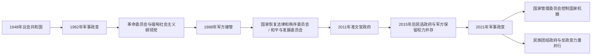

# 国家元首、政府首脑与军政领导表

## 范围与口径

本表覆盖1948年独立至2026年7月。缅甸先后实行议会共和国、革命委员会军政、社会主义一党共和国、军政府、2008年宪法下的总统制以及2021年政变后的并立政权。职位名称与实际权力多次脱节，因此国家元首、政府首脑、军政最高领导和反政变机构分表列出。

2021年后存在合法性冲突：军方控制首都、中央机关与武装部队，2025—2026年组织的选举和新议会排除或解散主要反对力量，未获广泛国际承认；民族团结政府则以2020年民选议员和反政变力量为基础主张合法代表权，却不控制全国统一行政。表中并列记录，不把任何一方的政治主张写成无争议事实。

## 国家权力结构演变图

国家元首、政府首脑与军队总司令在不同政体下的重要性差异很大。尤其在军政时期，法定总统或总理未必是实际最高决策者，因此三类职位分表记录。

## 国家元首

| 顺序 / 性质 | 姓名 | 职位与任期 | 产生方式 / 与前任关系 | 关键事件 / 备注 |
| --- | --- | --- | --- | --- |
| 1 | **苏瑞泰**（Sao Shwe Thaik） | 总统，1948-01-04—1952-03-16 | 制宪议会选出；独立后首任 | 掸族土司，象征彬龙联合与联邦建国。 |
| 2 | 巴宇（Ba U） | 总统，1952-03-16—1957-03-13 | 国会选出 | 任内议会政府面对共产党、克伦及其他武装冲突。 |
| 3 | 温貌（Win Maung） | 总统，1957-03-13—1962-03-02 | 国会选出 | 奈温政变时被捕，1947年宪政中止。 |
| — | **奈温** | 联邦革命委员会主席，1962-03-02—1974-03-02 | 军事政变夺权 | 兼实际国家元首和政府首脑，建立“缅甸式社会主义”。 |
| 4 | **奈温** | 社会主义共和国总统，1974-03-02—1981-11-09 | 一党制人民议会选举 | 1981年卸任总统后仍以社会主义纲领党主席掌最高权力至1988年。 |
| 5 | 山友（San Yu） | 总统，1981-11-09—1988-07-27 | 一党制议会选举 | 名义国家元首，奈温仍是主要决策者。 |
| 6 | 盛伦（Sein Lwin） | 总统，1988-07-27—1988-08-12 | 社会主义纲领党危机接班 | 因镇压抗议及持续示威迅速辞职。 |
| 代理 | 埃哥（Aye Ko） | 代总统，1988-08-12—1988-08-19 | 副总统代行 | 盛伦辞职至貌貌就任之间短暂代行。 |
| 7 | 貌貌（Maung Maung） | 总统，1988-08-19—1988-09-18 | 一党制议会选举 | 短暂提出选举，旋被军方国家恢复法律和秩序委员会推翻。 |
| — | **苏貌**（Saw Maung） | 军政府主席，1988-09-18—1992-04-23 | 政变后成立军政委员会 | 兼实际国家元首和总理；1992年由丹瑞接替。 |
| — | **丹瑞**（Than Shwe） | 军政府主席，1992-04-23—2011-03-30 | 军内接班 | 先后领导国家恢复法律和秩序委员会、国家和平与发展委员会，长期为实际最高领导。 |
| 8 | **登盛**（Thein Sein） | 总统，2011-03-30—2016-03-30 | 2010年选举后由总统选举团选出 | 军政府形式结束，开启有限改革和对外开放。 |
| 9 | 廷觉（Htin Kyaw） | 总统，2016-03-30—2018-03-21 | 全民盟控制的议会选出 | 昂山素季因宪法限制不能任总统，廷觉为正式元首；因健康辞职。 |
| 代理 | 敏瑞（Myint Swe） | 代总统，2018-03-21—2018-03-30 | 第一副总统依法代行 | 温敏就任前短暂代行。 |
| 10 | 温敏（Win Myint） | 总统，2018-03-30—2021-02-01（被军方拘押） | 全民盟议会多数选出 | 政变后军方宣布其职权中止；民族团结政府阵营仍视其为被拘押的民选总统。 |
| 代理 | 敏瑞 | 军方体制下代总统，2021-02-01—2024-07-22实际履职；名义延续至2025-08-07去世 | 军方援引宪法紧急状态条款 | 将国家权力移交国防军总司令；2024年因病把职务交敏昂莱代行。其法律地位遭反政变阵营否定。 |
| 代理 | **敏昂莱**（Min Aung Hlaing） | 军方体制下代总统，2024-07-22—2026-04-10 | 接替病休的敏瑞代行 | 同时领导军政机关；2025年重组国家安全与和平委员会并组织选举。 |
| 11 | **敏昂莱** | 总统，2026-04-10—至今；4月3日当选 | 军方配额和亲军政党占优势的新议会选出 | 截至2026年7月在任；军方称恢复宪政政府，反对派和多国机构质疑选举包容性与自由程度。 |

国家元首届次采用缅甸政府常见编号：革命委员会和军政府主席属于实际国家元首，但不计入宪法总统序号；代理总统也不另编正式届次。

## 政府首脑

| 顺序 / 性质 | 姓名 | 职位与任期 | 执政基础 | 关键事件 / 备注 |
| --- | --- | --- | --- | --- |
| 1（第一次） | **吴努**（U Nu） | 总理，1948-01-04—1956-06-12 | 反法西斯人民自由同盟 | 领导独立初期政府，应对共产党、克伦等叛乱。 |
| 2 | 巴瑞（Ba Swe） | 总理，1956-06-12—1957-02-28 | 反法西斯人民自由同盟 | 吴努暂退党务期间组阁。 |
| 1（第二次） | 吴努 | 总理，1957-02-28—1958-10-28 | 反法西斯人民自由同盟“廉洁派” | 联盟分裂后把权力移交看守政府。 |
| 3 | **奈温** | 看守总理，1958-10-28—1960-04-04 | 军方支持、议会授权 | 恢复秩序并组织1960年选举，随后交权。 |
| 1（第三次） | 吴努 | 总理，1960-04-04—1962-03-02 | 联邦党选举胜利 | 佛教国教和联邦改革争论加深；被政变推翻。 |
| 实际政府首脑 | 奈温 | 革命委员会主席，1962-03-02—1974-03-02 | 军政委员会 | 总理职位在革命委员会体制下不作为独立权力中心。 |
| 4 | 盛温（Sein Win） | 总理，1974-03-04—1977-03-29 | 社会主义纲领党 | 1974年宪法后的首任总理。 |
| 5 | 貌貌卡（Maung Maung Kha） | 总理，1977-03-29—1988-07-26 | 社会主义纲领党 | 经济危机和1988年抗议中下台。 |
| 6 | 吞丁（Tun Tin） | 总理，1988-07-26—1988-09-18 | 社会主义纲领党 | 一党政权末期短暂任职，军方接管后离任。 |
| 7 | **苏貌** | 总理，1988-09-18—1992-04-23 | 国家恢复法律和秩序委员会 | 与军政府主席合一。 |
| 8 | **丹瑞** | 总理，1992-04-23—2003-08-25 | 军政府 | 后把总理职务交钦纽，仍任军政府主席和最高领导。 |
| 9 | 钦纽（Khin Nyunt） | 总理，2003-08-25—2004-10-18 | 军情系统与军政府 | 提出“七步路线图”，在军内斗争中被罢免。 |
| 10 | 梭温（Soe Win） | 总理，2004-10-19—2007-10-12 | 军政府 | 患病期间登盛多次代理，任内去世。 |
| 11 | 登盛 | 总理，2007-10-24—2011-03-30 | 军政府 | 2007年起代理并正式就任；后转任总统。 |
| — | 总统兼政府首脑 | 2011-03-30—2021-02-01 | 2008年宪法 | 不设总理；总统领导内阁。2016—2021年国务资政昂山素季是文官政府实际政治领袖。 |
| 12 | **敏昂莱** | 军方看守政府总理，2021-08-01—2025-07-31 | 国家管理委员会 | 同时任委员会主席和国防军总司令，实权远高于普通总理。 |
| 13 | 纽梭（Nyo Saw） | 军方过渡政府总理，2025-07-31—2026-04-10 | 国家防务与安全委员会任命 | 负责选举前后行政；新政府成立后任第一副总统。 |
| — | 总统兼政府首脑 | 2026-04-10—至今 | 2008年宪法下的新政府 | 不另设总理；敏昂莱以总统身份领导政府。 |

## 实际军政最高领导与权力分配

| 时期 | 实际最高领导 / 机构 | 与正式国家机关的关系 |
| --- | --- | --- |
| 1948—1958、1960—1962 | 民选总理吴努与议会 | 总统主要为礼仪元首；军队在内战中扩张组织和经济影响。 |
| 1958—1960 | 看守总理兼军方领袖奈温 | 经议会授权执政，但军队首次直接主导中央行政。 |
| 1962—1988 | **奈温**、革命委员会与社会主义纲领党 | 军政、一党和国家企业结合；1981年后奈温虽非总统，仍以党主席掌权。 |
| 1988—1992 | **苏貌**与国家恢复法律和秩序委员会 | 废除一党宪法，军政委员会直接行使立法、行政和司法权。 |
| 1992—2011 | **丹瑞**与军政府 | 总理更换不改变丹瑞作为军政府主席、国防军总司令和最高决策者的地位。 |
| 2011—2016 | 总统登盛；国防军总司令敏昂莱 | 文官化政府推进改革，军方依2008年宪法保留四分之一议席、三大安全部和自主指挥权。 |
| 2016—2021 | 国务资政**昂山素季**、总统廷觉 / 温敏；总司令敏昂莱 | 全民盟掌一般行政和议会多数，军方掌国防、内政、边境事务及修宪否决权，形成双重权力。 |
| 2021—2025 | **敏昂莱**与国家管理委员会 | 政变后集中军政、立法和行政权；全国民主联盟政府被拘押，反政变机构与武装抵抗形成。 |
| 2025-07—2026-04 | 代总统兼国家安全与和平委员会主席敏昂莱；总理纽梭 | 机构改名并举行分阶段选举，最高战略和军事决策仍由敏昂莱主导。 |
| 2026-04至今 | 总统**敏昂莱**；国防军总司令叶温乌（Ye Win Oo）；亲军议会多数 | 敏昂莱依法辞去总司令后转任总统，军方配额、亲军政党与大量前军官内阁使军事影响延续。 |

## 民族团结政府与反政变代表机构

| 职位 / 机构 | 人物与任期 | 性质与控制范围 |
| --- | --- | --- |
| 联邦议会代表委员会（CRPH） | 2021年2月成立 | 由部分2020年当选议员组成，宣布拒绝承认政变。 |
| 民族团结政府代总统 | **杜瓦拉希拉**（Duwa Lashi La），2021-04-16至今 | 反政变阵营的代国家元首；截至2026年7月仍在任。 |
| 民族团结政府总理 | **曼温凯丹**（Mahn Win Khaing Than），2021-04-16至今 | 领导流亡与地下政府；截至2026年7月仍在任。 |
| 人民防卫军及地方行政 | 2021年至今 | 名义受民族团结政府协调，但各地指挥、财政和行政整合程度不同。 |
| 民族武装组织 | 多个长期组织与新联盟 | 部分与民族团结政府合作，部分保持独立战略或分别停火，不构成单一指挥体系。 |

## 相关笔记

- 独立与议会时期：[英属缅甸与独立](/%E4%BA%BA%E6%96%87%E7%A7%91%E5%AD%A6/%E5%8E%86%E5%8F%B2/%E4%B8%9C%E5%8D%97%E4%BA%9A/%E7%BC%85%E7%94%B8/%E8%8B%B1%E5%B1%9E%E7%BC%85%E7%94%B8%E4%B8%8E%E7%8B%AC%E7%AB%8B.md)
- 军人统治与内战：[军人统治与国内冲突](/%E4%BA%BA%E6%96%87%E7%A7%91%E5%AD%A6/%E5%8E%86%E5%8F%B2/%E4%B8%9C%E5%8D%97%E4%BA%9A/%E7%BC%85%E7%94%B8/%E5%86%9B%E4%BA%BA%E7%BB%9F%E6%B2%BB%E4%B8%8E%E5%9B%BD%E5%86%85%E5%86%B2%E7%AA%81.md)
