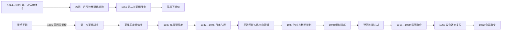

# 英属缅甸与独立

## 时间

1824—1962年：包括英国分期征服、殖民统治、日本占领、独立建国与议会政府。

## 概括

英国以三次英缅战争逐步吞并若开、丹那沙林、下缅甸和上缅甸，1886年废除贡榜王权并把全国并入英属印度。低地被纳入稻米出口、港口金融和印度洋劳工市场，掸、克钦、钦等边疆则多由土司或地方首领间接统治。殖民政府把低地“部长区”和边疆“排除区”分开治理，既建立现代疆界与官僚制度，也加深核心—边疆、土地债务和族群政治裂缝。

日本1942年占领后扶植巴莫政府，昂山等民族主义者先借日本军事援助反英，后因主权落空与占领压迫转向盟军。1947年昂山与部分边疆领袖签订彬龙协议，同年遇刺；1948年缅甸在未加入英联邦的条件下独立。吴努议会政府面对共产党、克伦等武装叛乱、国民党残军、联邦权力争议和执政联盟分裂。1958年军方看守政府虽曾交还权力，1962年奈温仍以国家统一为由发动政变。

## 英国征服背景与过程

### 第一次英缅战争（1824—1826）

贡榜王朝吞并若开并扩张到曼尼普尔、阿萨姆后，与英属印度边界直接接触。难民、属地归属和边境追击不断升级；双方都高估自身能力。英军以海军控制仰光，却因季风、疾病、补给和内陆作战付出巨大代价。1826年《杨达波条约》迫使缅甸割让若开、丹那沙林，放弃阿萨姆和曼尼普尔主张并支付赔款。

英国起初分别由孟加拉和印度总督体系管理新领地，殖民行政尚未覆盖缅甸核心王国。赔款、边界和外交代表争议持续削弱曼德勒王朝财政与主权。

### 第二次英缅战争与下缅甸吞并（1852）

英国商船、仰光地方官和赔偿争端被海军外交放大。英军攻占仰光、勃固等地，未与缅甸签成正式和约便单方面吞并下缅甸。蒲甘王因战败被敏东王推翻；曼德勒王国失去最重要港口、三角洲和关税收入。

1862年若开、丹那沙林和勃固合并为“英属缅甸”，由首席专员治理。英国修筑港口和河运体系，仰光取代传统王都成为经济中心；上缅甸仍保持独立。

### 第三次英缅战争与王朝灭亡（1885—1886）

敏东王改革铸币、税收、工场和外交，试图在英法竞争中维持独立。锡袍王即位后的宫廷清洗削弱政治基础，曼德勒与英国公司围绕柚木罚款及法国关系发生冲突。英国把商业争端、法国影响和“保护贸易”作为最后通牒依据。

1885年英军沿伊洛瓦底江迅速占领曼德勒，锡袍王投降并被流放印度。1886年英国宣布吞并上缅甸。王朝军队解体不等于地方立即平定；王族支持者、乡村首领、土匪和反殖民武装持续抵抗，英军用扫荡、集体惩罚、迁村和村长连带责任到1890年代才控制多数低地。

## 殖民统治结构

| 时段 | 名义最高权威 | 行政首脑 | 实际结构 |
| --- | --- | --- | --- |
| 1826—1862年割让地区 | 英国东印度公司 / 印度总督，1858年后英国君主 | 若开、丹那沙林、勃固的专员 | 各区分别治理，以治安、税收和港口贸易为先。 |
| 英属缅甸（1862—1897） | 印度总督 | 首席专员；阿瑟·菲尔为首任 | 低地直属专员、县和镇区官僚，地方村长负责税收与治安。 |
| 印度缅甸省（1897—1923） | 英国君主、印度总督 | 副总督；弗雷德里克·弗赖尔为首任 | 上下缅甸归一省，边疆仍以土司、政治官和间接统治分开管理。 |
| 二元行政省（1923—1937） | 印度总督 | 缅甸总督 / 省长及立法机关 | 教育、卫生等“移交部门”由本地部长负责，财政、警务等保留部门受总督控制。 |
| 单独殖民地（1937—1942） | 英国君主与缅甸事务大臣 | 阿奇博尔德·科克伦、雷金纳德·多曼-史密斯先后任总督 | 与印度分离，有两院立法和本地总理，但总督保留否决、安全与边疆权力。 |
| 日本占领（1942—1945） | 日本天皇、大本营与第15军 | 军政机关；1943年后巴莫任“缅甸国”国家元首 | 独立外观受日本军事、物资和外交控制；缅甸国民军由昂山等领导。 |
| 英国恢复（1945—1948） | 英国君主 | 多曼-史密斯复职，后由休伯特·兰斯任末任总督 | 总督与行政会议共治；1946年后昂山、继而吴努领导的反法西斯人民自由同盟取得实际组阁地位。 |
| 独立联邦（1948—1962） | 民选总统 | 总理和内阁 | 1947年宪法议会制；边疆邦和军队保有强势组织，中央控制从未覆盖全部国土。 |

### 单独殖民地总督与本地政府首脑

| 角色 | 人物 | 任期 | 备注 |
| --- | --- | --- | --- |
| 总督 | 阿奇博尔德·科克伦 | 1936-05—1941-05 | 主持1937年与印度分离后的首届殖民政府。 |
| 总督 | 雷金纳德·多曼-史密斯 | 1941-05—1946-08 | 日军占领期间在印度流亡，1945年返回；因恢复殖民秩序方针与民族主义者冲突。 |
| 总督 | **休伯特·兰斯** | 1946-08—1948-01-04 | 末任总督，与昂山谈判并监督独立移交。 |
| 首任殖民地总理 | 巴莫 | 1937—1939年 | 殖民宪制下首任政府首脑，后在日占时期任国家元首。 |
| 总理 | 吴布（U Pu） | 1939—1940年 | 联盟重组后短期执政。 |
| 总理 | 吴苏（U Saw） | 1940—1942年 | 战时被英国拘留；1947年因策划刺杀昂山等人被判处死刑。 |
| 战时国家元首 | **巴莫** | 1943-08-01—1945-03/05 | 日本扶植的“缅甸国”元首，主权受日军严重限制。 |
| 行政会议副主席 | **昂山** | 1946-09—1947-07-19 | 实际负责自治过渡；遇刺前完成独立、国防与彬龙谈判。 |
| 过渡政治领袖 | **吴努** | 1947-07—1948-01-04 | 昂山遇刺后领导反法西斯人民自由同盟并成为独立首任总理。 |

早期首席专员、副总督和1923年前后省级长官属于英属印度行政链，并非缅甸主权国家元首；殖民时期不能把他们与独立总统混排为一条“统治世系”。

## 殖民经济与社会变化

### 稻米、土地与金融

苏伊士运河、蒸汽船和全球粮食需求推动伊洛瓦底江三角洲开垦。英国以私有土地、现金税和可转让契约替代王朝时期多层权利。印度放贷者，尤其切蒂亚尔金融网络，为开垦提供信用；米价下跌、利息和歉收又使许多农民失地。1930年代全球萧条造成大规模债务、佃农化和移民冲突。

### 移民与“复合社会”

作为英属印度一省时，人员跨孟加拉湾流动不受现代国际边界限制。印度行政人员、码头工、商人和专业人士大量进入仰光及下缅甸；华人和其他亚洲商人也参与港口经济。城市就业竞争、殖民统计和分工把族群边界政治化。1930、1938年发生反印度和宗教暴力，不能只解释为古老仇恨，而与经济危机、劳工市场和殖民分类直接相关。

### 低地与边疆分治

殖民政府在低地拆除王室、重组僧团管理并实行直接县制；掸邦土司、克钦山地、钦山地和克伦部分区域则置于不同边疆制度。军队招募也较多依赖克伦、克钦、钦等群体，缅族佛教低地参军比例一度较低。二战后谈判必须同时解决“缅甸从英国独立”和“边疆是否、如何加入联邦”两个问题。

### 教育、僧侣与民族主义

传教和世俗学校培养律师、教师、学生与公务员，却削弱寺院教育地位。1906年青年佛教徒协会、1920年大学罢课、我缅人协会和学生联盟把宗教文化、反种族歧视、经济自治与政治独立结合。“德钦”青年以殖民者自称的主人称号反讽英国统治，昂山、吴努等均由学生政治进入全国运动。

## 反殖民运动与二战

### 萨耶山起义与宪制民族主义

1930—1932年，萨耶山以佛教王权象征、反税和土地不满发动乡村起义。殖民政府以大规模军事、拘捕和处决镇压。起义显示农民债务、王权消失和行政侵入已结合为政治危机。

1935年《缅甸政府法》使缅甸1937年与印度分离，建立本地总理和议会。分离可减少印度移民和获得独立行政，也把缅甸民族运动与全印反殖民力量分开；民族主义者内部意见分裂。

### “三十志士”、日本占领与倒戈

昂山等青年在日本协助下受训，1941年组织缅甸独立军随日军进入。许多人把日本视为驱逐英国的工具，但日军解散膨胀的独立军，改组为规模受控的缅甸防卫军。1943年日本宣布名义独立，巴莫任国家元首，昂山任国防部长；外交、军队调动和资源仍受日本控制。

强征、通货膨胀、物资征用和军政暴力使支持下降。共产党、人民革命党和缅甸国民军组成反法西斯组织。1945年3月27日昂山率军转向反日，与盟军合作；这一天后来成为武装部队日。战争使军队同时获得民族解放合法性和独立政治组织，为战后文军关系埋下根基。

## 独立谈判与联邦建国

1946年反法西斯人民自由同盟大规模动员，英国承认若不与昂山谈判便难以恢复稳定。1947年1月《昂山—艾德礼协议》确定一年内移交权力、选举制宪议会和边疆参与原则。

2月彬龙会议由昂山与掸、克钦、钦代表达成协议，承诺自治、财政支持和共同争取独立。克伦只派观察员，若开、孟等没有以同等地位签署；因此彬龙是关键政治承诺，却不是全体族群完成一致建国的“最终契约”。

1947年7月19日昂山及多名行政会议成员遇刺。吴苏被判为主谋并处决，英国官员是否更广泛牵涉长期有争议，缺乏足以确证的证据。吴努接续领导制宪和权力移交。1948年1月4日缅甸联邦独立，并选择不加入英联邦。

## 议会政府与内战（1948—1962）

### 建国危机（1948—1951）

独立数月内，缅甸共产党转入武装斗争，人民志愿组织分裂，克伦民族联盟与政府冲突升级。1949年叛军逼近仰光，政府控制范围极度收缩；国防军在奈温整编下保住首都和主要交通线。克伦籍总司令史密斯·敦被奈温取代，军队领导结构逐渐缅族化。

中国国民党残军1950年代进入掸邦，以边境基地、毒品与外援维持，缅甸多次向联合国交涉并展开军事行动。外部武装和冷战使边疆治理更加军事化。

### 议会重建与中立外交（1951—1958）

吴努政府恢复选举，推动土地国有化、教育和佛教文化政策，并在外交上采取不结盟路线，参与万隆会议、同时与印度、中国和西方往来。大米出口提供财政，但行政腐败、战区和族群不平等限制改革。

反法西斯人民自由同盟在1958年分裂为吴努“廉洁派”和觉迎等“稳定派”。为避免议会危机，吴努把政府交给奈温领导的看守内阁。军方整顿行政、清查组织和推进边境军事行动，并于1960年按承诺举行选举。

### 吴努复位与1962年政变

1960年吴努的联邦党胜选复位。政府1961年把佛教确立为国教，引起基督教少数民族担忧；掸邦领袖推动“真正联邦”方案，讨论各邦平等、资源和分离条款。军方认为政党竞争、宗教政策和联邦改革将使国家瓦解。

1962年3月2日奈温逮捕政府和民族领袖，废除1947年宪法。直接触发是联邦研讨与军方的统一恐惧，更深层则是军队在内战中形成的自主权、议会联盟碎片化及彬龙承诺没有转化为各方认可的联邦制度。完整总统、总理和实际军政领导序列见[国家元首、政府首脑与军政领导表](/%E4%BA%BA%E6%96%87%E7%A7%91%E5%AD%A6/%E5%8E%86%E5%8F%B2/%E4%B8%9C%E5%8D%97%E4%BA%9A/%E7%BC%85%E7%94%B8/%E5%9B%BD%E5%AE%B6%E5%85%83%E9%A6%96%E3%80%81%E6%94%BF%E5%BA%9C%E9%A6%96%E8%84%91%E4%B8%8E%E5%86%9B%E6%94%BF%E9%A2%86%E5%AF%BC%E8%A1%A8.md)。

## 重要事件

| 时间 | 事件 | 过程与影响 |
| --- | --- | --- |
| 1824—1826 | 第一次英缅战争 | 英军代价高昂但获若开、丹那沙林，殖民边界进入缅甸。 |
| 1852 | 第二次英缅战争 | 英国吞并下缅甸，王朝失去港口和三角洲财政。 |
| 1885—1886 | 第三次战争与全面吞并 | 锡袍王被流放，贡榜王朝灭亡。 |
| 1886—1890年代 | 地方反殖民抵抗 | 英军以扫荡和村庄连带责任建立低地控制。 |
| 1906 | 青年佛教徒协会成立 | 文化复兴逐步转向政治民族主义。 |
| 1920 | 大学罢课 | 学生运动成为反殖民组织核心。 |
| 1930—1932 | 萨耶山起义 | 农民债务、反税和佛教王权象征结合，遭军事镇压。 |
| 1937 | 缅甸与印度分治 | 成为单独殖民地并设本地总理，边疆仍受总督特别控制。 |
| 1941—1942 | 日军与缅甸独立军进入 | 英国撤退，日本占领开始。 |
| 1943 | 名义“缅甸国”成立 | 巴莫任元首，实际主权受日本军方限制。 |
| 1945-03-27 | 缅甸国民军反日 | 昂山阵营倒向盟军，获得战后谈判地位。 |
| 1947-01 | 昂山—艾德礼协议 | 确定制宪与独立时间表。 |
| 1947-02 | 彬龙协议 | 与部分边疆民族约定共同独立及自治原则。 |
| 1947-07-19 | 昂山等遇刺 | 建国领导层遭重创，吴努接续权力移交。 |
| 1948-01-04 | 缅甸联邦独立 | 殖民统治结束，议会共和国成立。 |
| 1948—1949 | 共产党、克伦等叛乱 | 新国家迅速陷入多线内战，军队地位上升。 |
| 1950年代 | 国民党残军问题 | 掸邦军事化、边境经济和冷战介入加深。 |
| 1958—1960 | 奈温看守政府 | 军队首次经议会授权全面管理中央政府，随后按期交权。 |
| 1960 | 吴努胜选复位 | 议会民主恢复，但宗教与联邦争议加剧。 |
| 1962-03-02 | 奈温政变 | 1947年宪政终止，进入长期军人统治。 |

## 殖民统治结束与议会制度失败的原因

### 殖民统治结束

- 日本击败英国并武装缅甸民族主义者，摧毁殖民威望；战后英国缺乏长期军事重占的资源。
- 反法西斯人民自由同盟拥有罢工、军队和全国组织能力，英国难以绕过昂山建立稳定政府。
- 印度即将独立、全球非殖民化与英国国内财政压力使快速移交成为现实选择。
- 直接过程是昂山—艾德礼协议、制宪选举、彬龙会议和1948年权力移交；昂山遇刺改变领导层，却未逆转独立时间表。

### 议会制度崩溃

- 殖民低地—边疆分治与不完整的彬龙参与，使自治、军队整合和资源分享缺少共同答案。
- 建国即爆发多线内战，国防军以生存战功形成脱离文官控制的组织合法性。
- 执政联盟、僧侣、工会和地方党派不断分裂，政府依赖个人协调，制度化政党和司法监督薄弱。
- 冷战、国民党残军和周边支持网络让边疆冲突长期化。
- 1962年并非不可避免：1958—1960年军方曾交还权力；最终政变是军方在联邦改革争论中主动选择取消宪政，而非议会已经自动消失。

## 演变关系

- 前一节点：[东吁与贡榜王朝](/%E4%BA%BA%E6%96%87%E7%A7%91%E5%AD%A6/%E5%8E%86%E5%8F%B2/%E4%B8%9C%E5%8D%97%E4%BA%9A/%E7%BC%85%E7%94%B8/%E4%B8%9C%E5%90%81%E4%B8%8E%E8%B4%A1%E6%A6%9C%E7%8E%8B%E6%9C%9D.md)。
- 后一节点：[军人统治与国内冲突](/%E4%BA%BA%E6%96%87%E7%A7%91%E5%AD%A6/%E5%8E%86%E5%8F%B2/%E4%B8%9C%E5%8D%97%E4%BA%9A/%E7%BC%85%E7%94%B8/%E5%86%9B%E4%BA%BA%E7%BB%9F%E6%B2%BB%E4%B8%8E%E5%9B%BD%E5%86%85%E5%86%B2%E7%AA%81.md)。
- 领导序列：[国家元首、政府首脑与军政领导表](/%E4%BA%BA%E6%96%87%E7%A7%91%E5%AD%A6/%E5%8E%86%E5%8F%B2/%E4%B8%9C%E5%8D%97%E4%BA%9A/%E7%BC%85%E7%94%B8/%E5%9B%BD%E5%AE%B6%E5%85%83%E9%A6%96%E3%80%81%E6%94%BF%E5%BA%9C%E9%A6%96%E8%84%91%E4%B8%8E%E5%86%9B%E6%94%BF%E9%A2%86%E5%AF%BC%E8%A1%A8.md)。
