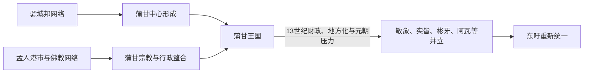

# 骠、孟与蒲甘王国

## 时间

前1千纪—13世纪末

## 概括

骠人在伊洛瓦底江中上游建立贝克塔诺、哈林、室利差呾罗等城邦，参与印度洋与中国西南之间的贸易；孟人则在下缅甸形成以直通等港市为中心的文化网络。9世纪后缅语人群在蒲甘地区崛起，11世纪的阿奴律陀把上、下缅甸多处中心纳入同一王权，奠定此后缅甸国家的核心区域。

骠城邦与早期孟人港市都不是拥有一套可连续排列君主的单一王朝。现存铭文、考古和外来记载只能确认若干城市与统治称号，不能用后世传说补成“完整世系”；因此本页仅为形成连续国家王统的蒲甘列世系。

## 建立背景与崛起机制

- 伊洛瓦底江流域的灌溉农业、宝石与森林物产，为内陆城邦提供财政和交换基础。
- 骠城邦吸收印度宗教、历法和书写传统，同时经云南与中国王朝往来；各城兴衰时间重叠，并无证据表明长期受一个首都统一统治。
- 下缅甸孟语人群利用海上贸易和港市网络传播上座部佛教。传统叙事把直通描绘为统一王国，但其11世纪以前的王统与疆界证据不足。
- 南诏在9世纪对骠城邦的战争、人口迁移以及上缅甸灌溉区重组，为蒲甘中心成长创造空间。
- 蒲甘君主以军役、地方领主效忠、王田和宗教捐献组织资源；阿奴律陀向下缅甸扩张并把佛教圣物、僧侣和工匠集中到蒲甘。

## 统治结构

| 政治体 | 中心 | 权力结构与特征 |
|---|---|---|
| 骠城邦 | 贝克塔诺、哈林、室利差呾罗 | 城墙城市各有地方王权，依靠灌溉、贸易与佛教联系 |
| 孟人港市 | 下缅甸与泰国湾沿岸 | 多港口、多中心，统治范围随贸易和军事联盟变化 |
| 蒲甘王国 | 蒲甘 | 国王直接控制核心灌溉区，外围由王族、地方首领与贡属统治；寺院拥有大量免税土地 |

## 蒲甘王世系

蒲甘在1044年阿奴律陀以前的在位年主要出自后世王家编年，铭文不足，年代只能视为传统纪年。1287年后王权已瓦解，觉苏瓦与苏涅只是元朝和敏象势力之下的名义君主。

| 顺序 | 国王 | 在位时间 | 与前任关系 | 关键事件 / 备注 |
|---|---|---|---|---|
| 1 | 毗因比亚（Pyinbya） | 846—876年 | 传统王统成员 | 传统称849年营建蒲甘城墙 |
| 2 | 丹奈（Tannet） | 876—904年 | 前王之子 | 早期事迹多属编年传统 |
| 3 | 萨莱昂威（Sale Ngahkwe） | 904—934年 | 篡位者 | 据编年推翻丹奈 |
| 4 | 登科（Theinhko） | 934—956年 | 前王之子 | 被良乌苏罗汉杀死 |
| 5 | 良乌苏罗汉（Nyaung-u Sawrahan） | 956—1001年 | 篡位者 | 后世称“黄瓜王”；史实细节不明 |
| 6 | 宫错姜漂（Kunhsaw Kyaunghpyu） | 1001—1021年 | 登科王族后裔，夺位 | 被继子基索、索格德废黜，后短暂复位说法有争议 |
| 7 | 基索（Kyiso） | 1021—1038年 | 良乌苏罗汉之子、前王继子 | 与弟共同夺权 |
| 8 | 索格德（Sokkate） | 1038—1044年 | 基索之弟 | 在决斗传统中被阿奴律陀杀死 |
| 9 | **阿奴律陀**（Anawrahta） | 1044—1077年 | 宫错姜漂之子 | 统一核心流域，扩张至下缅甸，扶持上座部佛教 |
| 10 | 苏卢（Sawlu） | 1077—1084年 | 阿奴律陀之子 | 处理孟人叛乱失败，被俘身亡 |
| 11 | **江喜陀**（Kyansittha） | 1084—1112/1113年 | 阿奴律陀部将及王族 | 平定叛乱，整合孟、骠与缅人精英，营建阿难陀寺 |
| 12 | 阿隆悉都（Alaungsithu） | 1112/1113—1167年 | 江喜陀外孙 | 巡行属地、发展水利与贸易，晚年被子杀害 |
| 13 | 那腊都（Narathu） | 1167—1171年 | 前王之子，弑父夺位 | 营建达玛扬基寺；死因有多种记载 |
| 14 | 那腊登迦（Naratheinkha） | 1171—1174年 | 前王之子 | 被弟那罗波帝悉都推翻 |
| 15 | **那罗波帝悉都**（Narapatisithu） | 1174—1211年 | 前王之弟 | 重整宫廷与地方秩序，蒲甘文化成熟 |
| 16 | 梯罗明罗（Htilominlo） | 1211—1235年 | 前王之子 | 大规模寺院营建延续，宗教免税地产扩张 |
| 17 | 加苏瓦（Kyaswa） | 1235—1249年 | 前王之子 | 王室财政开始明显承压 |
| 18 | 乌兹那（Uzana） | 1249—1256年 | 前王之子 | 在位事迹有限，死于意外的记载有差异 |
| 19 | **那腊底哈勃德**（Narathihapate） | 1256—1287年 | 前王之子 | 与元朝冲突，逃离蒲甘后被杀；中央王权崩溃 |
| 20 | 觉苏瓦（Kyawswa） | 1289—1297年 | 前王之子 | 受敏象掸族三兄弟控制，向元朝寻求册封后被废 |
| 21 | 苏涅（Saw Hnit） | 1297—1325年 | 觉苏瓦之子 | 仅为蒲甘地方名义君主，不再统治原王国 |

## 重要事件

- 5—9世纪，骠城邦以城墙、灌溉和佛教寺院为核心，连接印度洋、中国西南和伊洛瓦底江贸易。
- 7—9世纪，中国文献记录骠国与南诏、唐朝往来；832年前后南诏攻破骠人中心并迁走人口，上缅甸权力格局重组。
- 849年的传统纪年把毗因比亚营建城墙视为蒲甘城市形成标志，但早期王统仍主要依赖后世编年。
- 1044年阿奴律陀即位，随后控制皎施灌溉区、南北交通与下缅甸通道。
- 传统称1057年蒲甘攻取直通；战争的具体过程与直通王国规模存在争议，但孟人文化和僧侣确实深刻影响蒲甘。
- 江喜陀与阿隆悉都时期，王权通过巡行、铭文、寺院捐献和多族群宫廷巩固，蒲甘平原形成密集佛塔景观。
- 13世纪，免税宗教地产累积削弱王室可征税土地，地方领主和边疆势力自主性上升。
- 1277—1287年蒲甘与元朝发生边境战争；蒙古压力并非唯一原因，却加速了已经出现的财政和地方危机。
- 1297年敏象三兄弟废黜觉苏瓦，蒲甘作为统一王国实际终结。

## 鼎盛条件与衰亡原因

蒲甘的鼎盛建立在皎施灌溉农业、伊洛瓦底江交通、战争动员和佛教王权的结合上。国王向寺院赠地既制造合法性，也把地方精英、僧团和技术人口纳入共同文化。长期看，大量土地及劳动力转为免税寺产，王室财政和军役基础收缩；边疆领主与掸族军事集团逐渐独立。外部的元军进攻破坏北部防线，直接触发则是那腊底哈勃德逃亡、遇害与继承崩溃。此后并非“一战灭国”，而是多个区域中心分割旧王国。

## 演变关系

骠与孟人传统为蒲甘提供城市、宗教和书写资源。蒲甘瓦解后，敏象、实皆、彬牙、阿瓦、勃固和掸邦等势力并立，经过长期竞争才进入[东吁与贡榜王朝](/%E4%BA%BA%E6%96%87%E7%A7%91%E5%AD%A6/%E5%8E%86%E5%8F%B2/%E4%B8%9C%E5%8D%97%E4%BA%9A/%E7%BC%85%E7%94%B8/%E4%B8%9C%E5%90%81%E4%B8%8E%E8%B4%A1%E6%A6%9C%E7%8E%8B%E6%9C%9D.md)。
