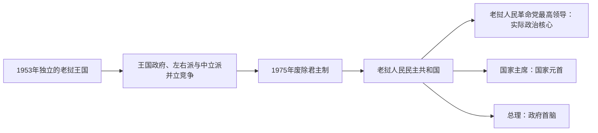

# 1953年以来老挝国家领导人表

## 范围与读法

本表从1953年完全独立列至2026年7月，并将国王 / 国家主席、政府首脑和老挝人民革命党最高领导分开。1953—1975年的王国虽有宪法、议会和内阁，王族派系、军队、外国援助方与巴特寮各掌握部分权力；1975年后的人民民主共和国由老挝人民革命党领导，党总书记通常比礼仪性国家职务更能说明实际最高权力。

## 国家权力结构演变图

王国时期的国王、首相和内战各派实际权力并不总是一致；1975年以后，党总书记或中央最高职位、国家主席与总理构成三条需要分别核对的任职序列。

## 老挝王国君主

| 顺序 | 国王 | 作为统一老挝国王的在位 | 继承与关键说明 |
|---:|---|---|---|
| 1 | **西萨旺·冯** | 1946—1959年 | 原为琅勃拉邦国王；1946年统一王国建立后成为全老挝国王，1953年取得完全独立。 |
| 2 | **西萨旺·瓦达纳** | 1959—1975年 | 前王之子；在中立派、右派与巴特寮内战中尽量维持王室调停，1975年12月退位。 |

## 王国时期政府首脑

| 顺序 | 政府首脑 | 任期 | 政治位置与关键说明 |
|---:|---|---|---|
| 1 | **梭发那·富马亲王** | 1951—1954年10月 | 独立时在任，主张中立并寻求整合巴特寮。 |
| 2 | 卡代·敦·萨索里 | 1954—1956年3月 | 亲西方政府，强化中央政府与王国军。 |
| 1 | 梭发那·富马（复任） | 1956—1958年8月 | 第一次联合政府，巴特寮成员进入内阁。 |
| 3 | 富伊·萨纳尼空 | 1958—1959年12月 | 右派力量上升，联合安排破裂。 |
| — | 顺吞·巴塔马冯将军 | 1959年12月31日—1960年1月7日 | 军方临时过渡。 |
| 4 | 古·阿派 | 1960年1—6月 | 看守政府。 |
| 5 | 宋萨尼·冯科德拉达纳亲王 | 1960年6—8月 | 右派政府，被贡勒政变推翻。 |
| 1 | 梭发那·富马（复任） | 1960年8—12月 | 贡勒支持的中立政府；内战中离开万象。 |
| — | 贵宁·奔舍那 | 1960年12月11—13日 | 中立派短暂代理，未获各方普遍承认。 |
| 6 | **文翁亲王** | 1960年12月—1962年6月 | 由富米·诺萨万等右派军人支持，控制万象政府。 |
| 1 | **梭发那·富马（再复任）** | 1962年6月—1975年12月 | 第二次联合政府名义首脑；1964年后国家实际上分区作战，1973年再建联合安排。 |

## 人民民主共和国国家主席

| 顺序 | 国家主席 / 代理者 | 任期 | 与实际权力的关系 |
|---:|---|---|---|
| 1 | 苏发努冯亲王 | 1975—1991年 | 首任国家主席；1986年后因健康原因不再日常履职。 |
| — | 富米·冯维希 | 1986—1991年代理 | 代行国家主席职责。 |
| 2 | **凯山·丰威汉** | 1991—1992年 | 同时为人民革命党最高领导，1991年宪法后转任国家主席。 |
| 3 | 诺哈·冯沙万 | 1992—1998年 | 革命元老；党内最高权力由坎代·西潘敦掌握。 |
| 4 | 坎代·西潘敦 | 1998—2006年 | 同时为党最高领导，党政权力再次集中。 |
| 5 | 朱马利·赛雅贡 | 2006—2016年 | 同时任党总书记。 |
| 6 | 本扬·沃拉吉 | 2016—2021年 | 同时任党总书记。 |
| 7 | **通伦·西苏里** | 2021年至今 | 同时任党总书记；2026年3月获第十届国会再次选为国家主席。 |

## 人民民主共和国政府首脑

| 顺序 | 总理 / 政府委员会主席 | 任期 | 关键说明 |
|---:|---|---|---|
| 1 | **凯山·丰威汉** | 1975—1991年 | 同时为党总书记；领导社会主义改造并在1986年启动新经济机制。 |
| 2 | 坎代·西潘敦 | 1991—1998年 | 军事与党内资历深厚，后转任国家主席。 |
| 3 | 西沙瓦·乔本潘 | 1998—2001年 | 继续市场改革与区域合作。 |
| 4 | 本扬·沃拉吉 | 2001—2006年 | 后任国家副主席、党总书记和国家主席。 |
| 5 | 波松·布帕万 | 2006—2010年 | 任内推进水电、矿业和外资项目，提前辞职。 |
| 6 | 通辛·坦马冯 | 2010—2016年 | 强调行政管理与发展计划。 |
| 7 | 通伦·西苏里 | 2016—2021年 | 推动反腐、财政整顿和对外平衡，后转任党总书记及国家主席。 |
| 8 | 潘坎·维帕万 | 2021—2022年 | 面对疫情、债务、通货膨胀和货币压力，任期中辞职。 |
| 9 | **宋赛·西潘敦** | 2022年至今 | 2022年12月就任；2026年3月获第十届国会再次选任，截至2026年7月仍为总理。 |

## 老挝人民革命党最高领导

| 顺序 | 最高领导人 | 任期 | 职称与实际作用 |
|---:|---|---|---|
| 1 | **凯山·丰威汉** | 1955—1992年 | 先任老挝人民党、后任人民革命党总书记；1975年后为实际最高领导。 |
| 2 | 坎代·西潘敦 | 1992—2006年 | 任党中央主席；先任总理，后任国家主席。 |
| 3 | 朱马利·赛雅贡 | 2006—2016年 | 恢复使用总书记职称，并兼国家主席。 |
| 4 | 本扬·沃拉吉 | 2016—2021年 | 党总书记兼国家主席。 |
| 5 | **通伦·西苏里** | 2021年至今 | 2026年1月在党十二大后连任总书记；截至2026年7月为党和国家最高领导。 |

## 权力结构说明

| 时段 | 法定结构 | 实际权力分布 |
|---|---|---|
| 1953—1959年 | 国王、首相、议会和王国军 | 王族政治家、地方军区和法国 / 美国援助网络并存。 |
| 1959—1962年 | 国王名下的多届政府 | 右派富米集团、中立派贡勒—梭发那、巴特寮和外国支持者各据一方。 |
| 1962—1975年 | 梭发那联合政府 | 名义中立；万象政府、巴特寮控制区、北越军和美国支持力量分区运作。 |
| 1975—1991年 | 国家主席、最高人民议会、政府委员会 | 人民革命党政治局居最高地位，凯山兼党总书记和政府首脑。 |
| 1991年至今 | 国家主席、国会和政府 | 宪法确认人民革命党为政治体系领导核心；党总书记是实际最高领导。 |

## 相关笔记

- 主阶段：[独立、革命与现代老挝](/%E4%BA%BA%E6%96%87%E7%A7%91%E5%AD%A6/%E5%8E%86%E5%8F%B2/%E4%B8%9C%E5%8D%97%E4%BA%9A/%E8%80%81%E6%8C%9D/%E7%8B%AC%E7%AB%8B%E3%80%81%E9%9D%A9%E5%91%BD%E4%B8%8E%E7%8E%B0%E4%BB%A3%E8%80%81%E6%8C%9D.md)
- 前期王统：[分裂王国与法属老挝](/%E4%BA%BA%E6%96%87%E7%A7%91%E5%AD%A6/%E5%8E%86%E5%8F%B2/%E4%B8%9C%E5%8D%97%E4%BA%9A/%E8%80%81%E6%8C%9D/%E5%88%86%E8%A3%82%E7%8E%8B%E5%9B%BD%E4%B8%8E%E6%B3%95%E5%B1%9E%E8%80%81%E6%8C%9D.md)
