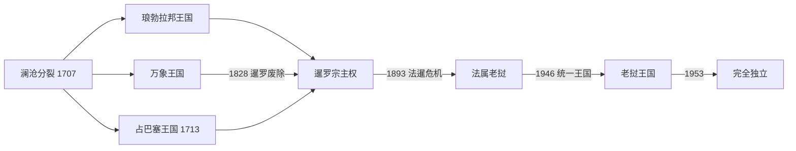

# 分裂王国与法属老挝

## 时间

1707—1953年

## 概括

澜沧分裂为琅勃拉邦、万象和占巴塞等王国后，各王室在暹罗、越南、缅甸和中国之间寻求支持。18世纪末暹罗确立优势并迁走大量人口。19世纪法国以保护越南、湄公河探险和殖民竞争为由向内陆扩张，1893年迫使暹罗放弃湄公河东岸，形成法属老挝。

三个王国彼此并立，不能合并成一条“老挝国王世系”。万象于1828年灭亡，占巴塞1904年降为地方行政单位；只有琅勃拉邦王室在法国保护下保留王号，并于1946—1947年成为统一老挝王国的王室。

## 分裂背景与权力结构

- 1707年，在阿瑜陀耶调停下，吉萨拉控制琅勃拉邦，塞塔提腊二世保有万象；1713年诺卡萨在南方建立占巴塞。
- 各国仍以勐邦、王族分封、贡赋和寺院维持统治，边界与效忠对象并不固定。
- 1778—1779年暹罗攻占万象和占巴塞，并迫使琅勃拉邦臣服；此后曼谷确认王位、扣留王族人质并征调军役。
- 1893年后法国在万象设行政中心，由印度支那总督、老挝高级驻扎官及各省驻扎官掌握外交、财政和司法实权。
- 琅勃拉邦国王在王畿保留礼仪和部分地方行政；万象没有恢复本地王统，占巴塞王室1904年后只保留亲王与地方官身份。

## 万象王世系

| 顺序 | 国王 | 在位时间 | 与前任关系 | 关键事件 / 备注 |
|---|---|---|---|---|
| 1 | **塞塔提腊二世／赛翁惠** | 1707—1730年 | 澜沧末代争位者 | 分裂后保有万象；在越南与暹罗之间维持关系 |
| 2 | 翁隆（Ong Long） | 1730—1767年 | 前王之子 | 长期统治，中央对属勐控制有限 |
| 3 | 翁本／西里本亚桑（Ong Bun / Bunsan） | 1767—1778年；1780—1781年复位 | 前王之弟 | 受缅甸、暹罗夹击；1778年逃亡，后短暂复位 |
| 4 | 南塔森（Nanthasen） | 1781—1795年 | 前王之子 | 由曼谷释放并册立；攻打川圹与琅勃拉邦，后被暹罗废黜 |
| 5 | 因塔翁（Inthavong） | 1795—1805年 | 前王之弟 | 暹罗属王，昭阿努任副王 |
| 6 | **昭阿努／阿努冯**（Anouvong） | 1805—1828年 | 前王之弟 | 1826年试图摆脱暹罗；战败被俘，万象被毁，王国废除 |

## 琅勃拉邦王世系

不同材料常把暹罗批准、正式加冕和实际掌权年份混用，19世纪若干即位年相差一至两年。表中将复位、摄政与占领单列。

| 顺序 | 国王 / 摄政 | 在位时间 | 与前任关系 | 关键事件 / 备注 |
|---|---|---|---|---|
| 1 | **吉萨拉**（Kitsarat） | 1707—1713年 | 苏里亚旺萨之孙 | 夺取琅勃拉邦，促成澜沧正式分裂 |
| 2 | 翁坎（Ong Kham） | 1713—1723年 | 王族 | 被因塔松政变推翻，流亡兰纳 |
| 3 | 因塔松（Inthasom） | 1723—1749年 | 吉萨拉之弟或近亲 | 长期统治，王族支系繁多 |
| 4 | 因塔拉翁萨（Intharavongsa） | 1749年 | 前王之子 | 在位约八个月后让位 |
| 5 | 索提卡·库曼（Sotika Koumane） | 1749—1768年 | 前王之兄 | 1765年后受缅甸控制，被弟推翻 |
| 6 | 苏里亚旺萨二世（Surinyavong II） | 1768—1788年 | 前王之弟 | 借军力夺位；先向缅甸、后向暹罗臣服 |
| — | 暹罗占领及王位空缺 | 1788/1791—1792年 | — | 王族被带往曼谷，具体空位起年有异说 |
| 7 | 阿努鲁塔（Anurutha） | 1792—约1793年；1794—1819年复位 | 因塔松之子 | 由暹罗册立；短暂被拘押后复位，晚年由子摄政 |
| 8 | 曼塔图拉（Manthaturath） | 1819—1837年；此前任摄政 | 前王之子 | 拒绝参加昭阿努反暹罗战争，借暹越竞争扩大影响 |
| — | 温胶（Unkeo） | 1837—1838年摄政 | 王族 | 等待曼谷确认继承 |
| 9 | 苏卡森（Sukha-Söm） | 1838—1850年 | 曼塔图拉之子 | 曾在曼谷为人质，获暹罗册立 |
| 10 | 占塔拉（Chantharath） | 1850—1868年 | 前王之弟 | 在暹罗宗主权下经营对华关系，应对霍人袭扰 |
| 11 | 温坎（Oun Kham） | 1868—1895年 | 前王之弟 | 1887年琅勃拉邦遭霍军洗劫；转向法国保护 |
| 12 | 萨卡林（Zakarine / Sakkalin） | 1895—1904年；1888年后曾任摄政 | 前王之子 | 法国保护国时期国王；加冕年份在1892、1894、1895等说法间有差异 |
| 13 | **西萨旺·冯**（Sisavang Vong） | 1904—1945/1946年为琅勃拉邦国王 | 前王之子 | 法国培养的君主；1945年先宣布、后试图撤回独立，1946年成为统一老挝国王 |

## 占巴塞统治者世系

1778年后占巴塞为暹罗属国，曼谷常在王位空缺时直接任命地方统治者。1828年后的“国王”实为获暹罗确认的属王；1904年后王国降为省级政权。

| 顺序 | 国王 / 统治者 | 在位时间 | 与前任关系 | 关键事件 / 备注 |
|---|---|---|---|---|
| 1 | **诺卡萨**（Nokasad） | 1713—1737年 | 苏里亚旺萨之外孙 | 建立占巴塞，组织南部勐邦与人口迁入 |
| 2 | 赛亚库曼（Sayakumane） | 1737—1791年 | 前王之子 | 1778年失去独立，后被暹罗送回作为属王 |
| 3 | 法伊纳（Fay Na） | 1791—1811年 | 非直系王族，由暹罗任命 | 代表曼谷重整南部统治 |
| 4 | 诺孟（No Muong） | 1811—1813年 | 前王之子 | 暹罗属王 |
| 5 | 马诺伊（Manoi） | 1813—1819年 | 赛亚库曼之侄 | 在位至万象王子接掌 |
| 6 | 昭约（Nho / Chao Yo） | 1819—1827年 | 昭阿努之子 | 被父亲安置于占巴塞；反暹罗战争失败后被俘 |
| 7 | 惠（Huy） | 1828—1840年 | 诺卡萨曾孙 | 暹罗在吞并后确认的属王 |
| 8 | 纳克（Nark） | 1841—1851年 | 前王之弟 | 曼谷确认继位 |
| 9 | 布阿（Boua） | 1851—1853年摄政及国王 | 惠之子 | 死后王位空缺 |
| — | 王位空缺 | 1853—1856年 | — | 由副王或暹罗官员处理事务 |
| 10 | 坎奈（Kham Nai） | 1856—1858年 | 惠之子 | 在位短暂 |
| — | 昭朱摄政 / 空位 | 1858—1863年 | — | 等待曼谷任命 |
| 11 | 坎苏克（Kham Souk） | 1863—1899年 | 惠之子 | 1893年后辖区被法暹边界分割 |
| 12 | 拉萨达奈（Ratsadanay） | 1900—1904年为国王；其后为地方亲王 | 前王之子 | 1904年法国取消王国地位；1946年家族放弃独立王位主张 |

## 法属时期的实际权力结构

| 角色 | 权力范围 | 说明 |
|---|---|---|
| 法属印度支那总督 | 对外、军事、殖民政策与高层任命 | 驻河内，决定老挝在联邦内的资源分配 |
| 老挝高级驻扎官及省驻扎官 | 财政、司法、警察、税收和工程 | 行政中心在万象；法国官员人数少，常借越南籍和本地官员执行 |
| 琅勃拉邦国王 | 王畿礼仪、部分地方行政与象征合法性 | 不能独立处理外交、军事和主要财政 |
| 地方勐主与村社 | 征税、劳役和日常调解 | 在偏远地区保留较强实际影响 |
| 1945—1953年政府 | 王室、法国、自由老挝及独立派并存 | 权力随日军政变、法国复殖和谈判多次改变 |

法国领事、上 / 下老挝指挥官、高级驻扎官、日本控制者和战后专员的连续序列见[法国统治时期行政首脑表](/%E4%BA%BA%E6%96%87%E7%A7%91%E5%AD%A6/%E5%8E%86%E5%8F%B2/%E4%B8%9C%E5%8D%97%E4%BA%9A/%E8%80%81%E6%8C%9D/%E6%B3%95%E5%9B%BD%E7%BB%9F%E6%B2%BB%E6%97%B6%E6%9C%9F%E8%A1%8C%E6%94%BF%E9%A6%96%E8%84%91%E8%A1%A8.md)。

## 重要事件

- 1707年澜沧分裂为琅勃拉邦与万象；1713年占巴塞另立，三个王室并行。
- 1765—1769年缅甸东吁军进入老挝与兰纳，各王国分别向缅甸或暹罗寻求保护。
- 1778—1779年暹罗军攻占万象和占巴塞，并迫使琅勃拉邦臣服；玉佛被带至曼谷，大量人口迁往湄公河西岸。
- 1826—1828年昭阿努反抗暹罗失败，万象城被毁、居民大规模迁移，万象王国被废除。
- 1860—1880年代霍人战争冲击北部；1887年琅勃拉邦遭洗劫，法国以保护王室为扩大势力的理由。
- 1893年法国军舰进入湄南河口，暹罗被迫放弃湄公河东岸；法国把不同河谷与山地群体纳入“老挝”殖民单元。
- 1904年法暹条约调整边界，占巴塞王国被降为地方行政单位，琅勃拉邦成为唯一保留王号的王室。
- 1940—1941年法泰战争后，部分湄公河西岸领土暂交泰国；战后归还法国统治。
- 1945年3月日本解除法国殖民机构，西萨旺·冯宣布独立；日本投降后自由老挝短暂执政，法国随后复殖。
- 1949年老挝在法兰西联盟内取得有限独立，1953年法老条约确认完全主权。

## 衰落、殖民化与独立原因

分裂王国的结构弱点是人口和财政规模有限、地方勐邦自主、继承规则不稳以及三王室相互借外援。暹罗以军力、人质、册封和人口迁徙逐步取得实际控制；昭阿努战争失败是万象灭亡的直接触发。

19世纪后期，暹罗正推动中央集权，却缺乏在湄公河东岸持续部署的能力；法国依托越南殖民地、炮舰和外交压力介入。1893年危机是殖民化的直接过程。法国统治固定了现代老挝的大部分边界，但投资有限，且通过王室和地方精英间接治理。二战瓦解法国威望，战后民族主义、区域战争和法国无力长期维持殖民成本，共同促成1953年独立。

## 演变关系

前接[早期政权与澜沧王国](/%E4%BA%BA%E6%96%87%E7%A7%91%E5%AD%A6/%E5%8E%86%E5%8F%B2/%E4%B8%9C%E5%8D%97%E4%BA%9A/%E8%80%81%E6%8C%9D/%E6%97%A9%E6%9C%9F%E6%94%BF%E6%9D%83%E4%B8%8E%E6%BE%9C%E6%B2%A7%E7%8E%8B%E5%9B%BD.md)。1946—1947年以琅勃拉邦王室为核心建立统一老挝王国，1953年独立后转入[独立、革命与现代老挝](/%E4%BA%BA%E6%96%87%E7%A7%91%E5%AD%A6/%E5%8E%86%E5%8F%B2/%E4%B8%9C%E5%8D%97%E4%BA%9A/%E8%80%81%E6%8C%9D/%E7%8B%AC%E7%AB%8B%E3%80%81%E9%9D%A9%E5%91%BD%E4%B8%8E%E7%8E%B0%E4%BB%A3%E8%80%81%E6%8C%9D.md)。
