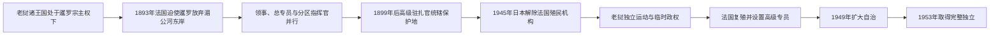

# 老挝法国统治时期行政首脑表

## 范围与制度变化

本表列法国自1880年代进入琅勃拉邦至1953年法老条约确认完全独立期间的主要行政首脑，并补列独立后处理法兰西联盟和日内瓦善后的高级专员至1955年。1895—1899年上、下老挝曾由不同高级指挥官并行管理，不能把他们误排成单一连续职务。代理任期与正职重叠时，表示正职离任期间代行职责。

## 殖民行政演变图

老挝国王在保护国时期继续作为法定君主存在，但外交、财政和省级行政逐步受法国驻扎官控制；1945年以后又出现日本军方、老挝独立派和复归法国机构的权力重叠。

## 领事、总专员与上、下老挝指挥官

| 顺序 | 行政首脑 | 任期 | 职称与辖区 |
|---:|---|---|---|
| 1 | **Auguste Pavie** | 1887—1894年6月 | 驻琅勃拉邦副领事及法国扩张的主要谈判者。 |
| 1 | Auguste Pavie | 1894—1895年4月 | 总专员；法暹危机后整合新取得地区。 |
| 2 | Armand Tournier | 1895—1899年 | 下老挝高级指挥官，驻孔岛 / 占巴塞。 |
| 3 | Joseph Vacle | 1895—1897年 | 上老挝代理高级指挥官，首次，驻琅勃拉邦。 |
| 4 | Louis Paul Luce | 1897—1898年 | 上老挝代理高级指挥官。 |
| 3 | Joseph Vacle | 1898—1899年 | 上老挝代理高级指挥官，第二次。 |
| 5 | Léon Boulloche | 1895—1896年 | 高级驻扎官；早期统一职位与上下区机构有重叠。 |

## 高级驻扎官

| 顺序 | 行政首脑 | 任期 | 备注 |
|---:|---|---|---|
| 1 | Armand Tournier | 1899—1903年 | 1899年行政重组后的高级驻扎官。 |
| — | Georges Mahé | 1903—1906年 | 代理，首次。 |
| — | Louis Laffont | 1906—1907年 | 代理。 |
| 2 | Georges Mahé | 1907—1912年 | 第二次掌职，转为正任。 |
| — | Ernest Outrey | 1910—1911年 | 代马埃履职。 |
| — | Louis Aubry de la Noë | 1912—1913年 | 代理。 |
| — | Claude Garnier | 1913年7—10月 | 代理，首次。 |
| — | Jean Bourcier Saint-Chaffray | 1913—1914年2月 | 代理。 |
| 3 | Claude Garnier | 1914—1918年 | 第二次掌职。 |
| 4 | Jules Bosc | 1918—1931年 | 长期正任。 |
| — | Joël Daroussin | 1921—1923年 | 代博斯克履职。 |
| — | Jean-Jacques Dauplay | 1925—1926年 | 代博斯克履职。 |
| — | Paul Le Boulanger | 1928年5—12月 | 代博斯克履职。 |
| — | Paul Le Boulanger | 1931年3—5月 | 代理，第二段任期。 |
| — | Pierre Pagès | 1931年3月获任 | 未实际到任。 |
| 5 | Yves Châtel | 1931年5—6月 | 正任，任期极短。 |
| — | Paul Le Boulanger | 1931年6—11月 | 再次代理。 |
| — | Jules Thiebaut | 1931年11月—1932年2月 | 代理。 |
| 6 | Aristide Le Fol | 1932—1933年 | 正任。 |
| — | Adrien Roques | 1933年12月—1934年1月 | 代理，首次。 |
| — | Louis Eckert | 1934年1—7月 | 代理。 |
| — | Adrien Roques | 1934年7—8月 | 代理，第二次。 |
| 7 | Eugène Eutrope | 1934—1938年 | 正任。 |
| — | Frédéric Marty | 1934—1935年 | 代厄特罗普履职。 |
| 8 | André Touzet | 1938—1940年 | 正任。 |
| — | Adrien Roques | 1940—1941年 | 代理，第三次。 |
| 9 | Louis Brasey | 1941—1945年 | 正任；1945年3月日本政变后被拘押。 |

## 日本控制、法国复殖与高级专员

| 顺序 | 行政首脑 | 任期 | 权力性质 |
|---:|---|---|---|
| 1 | Sako Masanori | 1945年3—8月 | 日本驻万象军司令，掌握军事控制。 |
| 2 | Ishibashi | 1945年4—8月 | 日本驻琅勃拉邦最高顾问。 |
| 3 | Hans Imfeld | 1945年8月—1946年4月 | 法国专员；先在部分地区恢复机构，与老挝自由政府冲突。 |
| 4 | Jean de Raymond | 1946—1947年 | 法国专员；法国重新占领与统一王国谈判时期。 |
| — | Maurice Michaudel | 1947—1948年 | 代理专员。 |
| — | Alfred Valmary | 1948—1949年 | 代理专员。 |
| 5 | Robert Régnier | 1949—1953年4月 | 专员；法兰西联盟自治阶段。 |
| 6 | Miguel de Pereyra | 1953年4月—1954年1月 | 高级专员；任内签署完全独立条约。 |
| 7 | Michel Breal | 1954—1955年 | 最后高级专员；处理日内瓦会议后法国职能撤出，不再是老挝国内行政统治者。 |

## 实际权力边界

| 时段 | 法国机构 | 老挝王室、地方勐与政府 |
|---|---|---|
| 1893—1899年 | 以领事、军事远征和上下区指挥官确立边界与征税 | 琅勃拉邦国王保留王畿权威，其他地区由地方勐主与法国军政并行。 |
| 1899—1945年3月 | 高级驻扎官控制外交、财政、司法、警察和省级任命 | 琅勃拉邦王室保留礼仪及部分地方事务；偏远勐邦仍依本地首领治理。 |
| 1945年3—8月 | 日本军与顾问掌握军事和对外权力 | 西萨旺·冯宣布独立；佩差拉政府扩大老挝人行政权。 |
| 1945—1946年 | 法国军政逐步恢复 | 老挝自由政府一度控制万象等地，后退往泰国。 |
| 1946—1949年 | 法国专员监督统一王国、国防和外交 | 1947年宪法建立国王、议会与内阁。 |
| 1949—1953年 | 法方保留防务外交等关键权限 | 王国自治扩大，民族主义、巴特寮与法越战争推动完全独立。 |
| 1953年以后 | 高级专员仅处理条约和撤军善后 | 老挝政府获得主权，但国内战争与外国军队问题转入日内瓦框架。 |

## 相关笔记

- [分裂王国与法属老挝](/%E4%BA%BA%E6%96%87%E7%A7%91%E5%AD%A6/%E5%8E%86%E5%8F%B2/%E4%B8%9C%E5%8D%97%E4%BA%9A/%E8%80%81%E6%8C%9D/%E5%88%86%E8%A3%82%E7%8E%8B%E5%9B%BD%E4%B8%8E%E6%B3%95%E5%B1%9E%E8%80%81%E6%8C%9D.md)
- [1953年以来国家领导人表](/%E4%BA%BA%E6%96%87%E7%A7%91%E5%AD%A6/%E5%8E%86%E5%8F%B2/%E4%B8%9C%E5%8D%97%E4%BA%9A/%E8%80%81%E6%8C%9D/1953%E5%B9%B4%E4%BB%A5%E6%9D%A5%E5%9B%BD%E5%AE%B6%E9%A2%86%E5%AF%BC%E4%BA%BA%E8%A1%A8.md)
