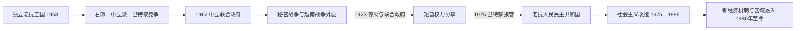

# 独立、革命与现代老挝

## 时间

1953年至今（现任信息核验至2026年7月）

## 概括

老挝1953年取得完全独立时，中央政府对山地、边境和原巴特寮根据地的控制仍不完整。日内瓦协议两次试图以中立和联合政府避免老挝成为冷战战场，但右派、中立派与巴特寮分别依赖美国、苏联、北越及其他外援，国内权力长期分区。越南战争中的胡志明小道经过老挝东部，美国以秘密军事援助和大规模空中行动介入，内战由本国政治冲突转为区域战争的一部分。1975年巴特寮在印度支那力量对比逆转后接管全国，废除君主制并建立老挝人民民主共和国。1986年以后，人民革命党在维持一党领导的同时实行市场改革，国家由“内陆封闭”转向依靠跨境交通、水电、矿业、旅游和区域投资，但债务、货币、资源依赖、未爆弹与发展不均仍是长期问题。

## 主要政治阶段与权力结构

| 阶段 | 时间 | 核心过程 | 实际权力结构 |
|---|---|---|---|
| 独立与第一次联合尝试 | 1953—1959年 | 日内瓦协议、巴特寮两省安排、1957年联合政府 | 国王、万象政府、王国军、巴特寮与外国顾问并存 |
| 政变与三方内战 | 1959—1962年 | 右派强化、贡勒政变、万象战斗、三亲王谈判 | 右派、中立派、巴特寮各有军队和控制区 |
| 中立名义下的秘密战争 | 1962—1973年 | 第二次日内瓦会议、联合政府崩解、胡志明小道与空战 | 名义政府在万象；巴特寮—北越控制东部，右派—美国网络控制西部与部分山地 |
| 停火与革命接管 | 1973—1975年 | 万象协定、第三次联合政府、巴特寮逐步进入城市 | 联合机构名义分享权力，人民革命党掌握组织和军事主动 |
| 革命政权初期 | 1975—1986年 | 废除君主制、国有化、合作化、再教育与难民外流 | 人民革命党政治局、凯山领导的政府和安全体系 |
| 新经济机制以后 | 1986年至今 | 市场化、宪法制度、东盟融入和跨境基础设施 | 一党领导，国家主席、国会和政府按党内决策运行 |

完整君主、国家主席、总理和党最高领导序列见[1953年以来国家领导人表](/%E4%BA%BA%E6%96%87%E7%A7%91%E5%AD%A6/%E5%8E%86%E5%8F%B2/%E4%B8%9C%E5%8D%97%E4%BA%9A/%E8%80%81%E6%8C%9D/1953%E5%B9%B4%E4%BB%A5%E6%9D%A5%E5%9B%BD%E5%AE%B6%E9%A2%86%E5%AF%BC%E4%BA%BA%E8%A1%A8.md)。

## 独立、日内瓦安排与第一次联合政府

1953年法老条约确认老挝完全主权。1954年第一次日内瓦会议要求外国军队撤离，承认巴特寮部队在丰沙里、桑怒两省临时集结，并计划通过选举和谈判整合。问题在于王国政府军、巴特寮和北越力量并未在同一时间真正解除武装；美国也未签署最终宣言，而是逐渐成为万象政府的主要资助者。

梭发那·富马主张中立与和解，1957年同其异母兄弟、巴特寮领袖苏发努冯达成协议，巴特寮成员进入政府，部分部队纳入王国军。1958年补选中左翼力量表现强劲，引起右派和美国担忧。援助压力、军队整编失败和互不信任使联合政府瓦解；1959年巴特寮领导人被捕或转入地下，战事重新扩大。

## 1960年政变、三方竞争与第二次中立化

1960年8月，伞兵军官贡勒以反腐和恢复中立为名发动政变，拥立梭发那·富马。右派将领富米·诺萨万与文翁亲王在南方组织反政府力量并获美国、泰国支持；巴特寮和苏联支持中立派，北越军也扩大行动。12月右派军攻入万象，贡勒部队退往石缸平原。老挝由此形成右派、中立派和巴特寮三方政治军事格局。

1962年第二次日内瓦会议再次确认老挝中立，并由梭发那·富马、文翁和苏发努冯所代表的“三亲王”组成联合政府。外国军队名义上须撤出，然而核查机制薄弱，各方都保留部队和补给网络。1963年中立派外长贵宁·奔舍那遇刺，贡勒阵营分裂；1964年政变未遂后，联合政府只剩形式，内战全面恢复。

## 秘密战争与越南战争外溢

北越把老挝东部作为通往南越的补给走廊，修建和维护胡志明小道。巴特寮依靠北越军队和后勤逐步控制东北和东部。美国为了避免公开违反中立安排，主要通过中央情报机构、泰国基地、王国空军和地方盟军介入；王宝领导的苗族部队在川圹和龙镇一带承担侦察、阻截和地面作战。苏联、中国和北越也分别向中立派或巴特寮提供运输、训练与装备。

1964—1973年，美国对老挝实施持续空中行动，目标包括胡志明小道、石缸平原和巴特寮阵地。轰炸造成平民伤亡、迁移和大量未爆弹，至今影响农业和基础设施。与此同时，地面战线反复变化：王国军及盟军在雨季或旱季取得局部优势，北越—巴特寮部队又以人数、补给和纵深恢复阵地。没有任何一届万象内阁能独立控制全国军队和外交。

1973年越南和平协议改变区域形势，同年《万象协定》在老挝停火，成立临时民族联合政府和全国政治联合委员会。巴特寮部队进入主要城市，双方保留各自军力。1975年金边和西贡相继被革命力量占领，美国撤出援助，王国军士气崩溃。巴特寮以群众示威、接管行政、解除对方武装和谈判相结合，逐城取得控制。12月2日，全国人民代表大会废除君主制，西萨旺·瓦达纳退位，人民民主共和国成立。

## 革命政权初期

新政权由老挝人民革命党领导，苏发努冯任国家主席，凯山·丰威汉任总理兼党总书记。政府国有化银行和大型商业，限制私人贸易，推动农业合作化，并把原王国军政人员送入“再教育营”。前国王及王室成员被迁往北部营地，其具体死亡日期长期不明。许多官员、商人、城市居民和苗族家庭逃往泰国，再移民欧美，造成技术人员和社会网络流失。

老挝与越南1977年签署友好合作条约，越南顾问和军队在安全、干部训练与反叛乱中发挥重要作用。原王国军残部、苗族武装及其他反对力量在部分山区继续活动，但难以挑战中央政权。僵硬定价、货币改革、合作化阻力、生产下降和泰国边境贸易中断使经济困难。1979年前后政府放松部分集体化和贸易限制，表明政策已开始纠偏。

## 新经济机制、宪法化与区域融入

1986年党四大提出“新经济机制”，允许家庭经营、私人商业、市场价格和外国投资，国有企业逐步获得经营自主。改革没有改变一党政治：人民革命党仍决定干部任命和政策方向。1991年通过共和国首部成文宪法，设国家主席、国会和政府，并规定人民革命党为政治体系的领导核心。

冷战结束后，老挝减少对单一援助来源的依赖。1997年加入东盟，2013年加入世界贸易组织；与泰国、越南、中国及其他邻国的桥梁、公路、铁路和电网连接扩大。水电、矿业、橡胶与土地特许经营为政府带来收入，也引发移民安置、环境、土地权和对单一资源出口依赖的问题。旅游业和城镇服务增长，但山区教育、医疗和交通仍明显落后。

2021年中老铁路开通，使万象与中国铁路网连接，并推动“陆锁国变陆联国”的发展战略。大型基础设施可降低长期运输成本，却也伴随高额外债、外汇不足和偿债风险。疫情后通货膨胀、基普贬值和生活成本上升加剧财政压力。政府一方面吸引外资和扩大电力出口，另一方面尝试整顿税收、国企和公共债务。

2026年1月，老挝人民革命党十二大再次选举通伦·西苏里为总书记；3月第十届国会再次选举其为国家主席，并再次选举宋赛·西潘敦为总理。截至2026年7月，这一党政领导结构延续。

## 重要事件

| 时间 | 事件 | 结果与长期影响 |
|---|---|---|
| 1953年10月 | 法老条约确认完全主权 | 现代老挝王国正式独立。 |
| 1954年 | 第一次日内瓦会议 | 确立中立与巴特寮两省集结安排，但未解决军队整合。 |
| 1957年 | 第一次联合政府 | 巴特寮进入合法政治，旋因互不信任瓦解。 |
| 1959年 | 巴特寮领导人被捕、战事扩大 | 政治竞争再次军事化。 |
| 1960年8—12月 | 贡勒政变及万象战斗 | 形成右派、中立派和巴特寮三方格局。 |
| 1962年 | 第二次日内瓦会议 | 再次确认中立并成立三方联合政府。 |
| 1963—1964年 | 中立派分裂、联合政府失效 | 秘密战争全面化。 |
| 1964—1973年 | 大规模空中战争 | 人口迁移和未爆弹遗留成为长期问题。 |
| 1969—1972年 | 石缸平原反复攻防 | 显示内战与北越—美国区域战略完全交织。 |
| 1973年 | 《万象协定》 | 建立停火与第三次联合政府。 |
| 1975年12月2日 | 人民民主共和国成立 | 君主制终结，人民革命党取得全国政权。 |
| 1977年 | 老越友好合作条约 | 确立长期安全与政治同盟。 |
| 1979年起 | 放松合作化与部分贸易限制 | 革命初期经济政策开始调整。 |
| 1986年 | 新经济机制 | 市场改革成为长期经济路线。 |
| 1991年 | 共和国宪法通过 | 党领导下的国家机构正式制度化。 |
| 1997年 | 加入东盟 | 区域外交和经济联系扩大。 |
| 2013年 | 加入世界贸易组织 | 进一步纳入国际贸易规则。 |
| 2021年 | 中老铁路开通 | 跨境交通能力提高，债务与收益问题并存。 |
| 2026年 | 党、国家和政府领导续任 | 通伦—宋赛领导结构延续至2026—2030任期。 |

## 王国衰落与革命胜利原因

- **结构因素**：法国殖民时期留下的官僚、教育和交通基础薄弱；山地河谷分隔，中央征税和军队整合困难。
- **政治因素**：王族与军人派系竞争，政府频繁更替；两次联合政府都未建立统一指挥和可信的权力分享。
- **外部压力**：美国、北越、苏联、泰国和越南战争把老挝变成代理战场，援助强化各派而非国家机构。
- **组织差异**：人民革命党和巴特寮拥有较稳定的干部、根据地及北越后勤；王国政府依赖外援和城市行政，军心更易随援助中断崩溃。
- **直接触发**：1975年金边、西贡相继失守和美国撤援改变力量对比，巴特寮以政治接管和军事优势完成全国夺权。

## 共和国稳定、改革动力与长期挑战

- **稳定来源**：一党干部体系、军队与公安统一、与越南的安全合作降低了再次内战的可能。
- **改革动力**：计划经济效率低、援助不足和农村合作化失败迫使政府自1979年起纠偏，1986年把市场改革制度化。
- **增长条件**：区域和平、外资、水电矿业、跨境贸易和基础设施改善创造财政及就业来源。
- **结构风险**：经济规模小、工业基础有限、资源出口集中、外债和外汇脆弱，使外部价格与融资变化容易传导到民生。
- **社会与环境问题**：未爆弹、土地特许、移民安置、山地贫困和技能不足限制包容性发展。
- **政治延续性**：党内有定期换届和职务分工，但没有竞争性多党轮替；国家主席兼党总书记通常是实际最高领导。

## 演变关系

前接[分裂王国与法属老挝](/%E4%BA%BA%E6%96%87%E7%A7%91%E5%AD%A6/%E5%8E%86%E5%8F%B2/%E4%B8%9C%E5%8D%97%E4%BA%9A/%E8%80%81%E6%8C%9D/%E5%88%86%E8%A3%82%E7%8E%8B%E5%9B%BD%E4%B8%8E%E6%B3%95%E5%B1%9E%E8%80%81%E6%8C%9D.md)。内战与胡志明小道必须同[越南历史](/%E4%BA%BA%E6%96%87%E7%A7%91%E5%AD%A6/%E5%8E%86%E5%8F%B2/%E4%B8%9C%E5%8D%97%E4%BA%9A/%E8%B6%8A%E5%8D%97/README.md)对照；1975年的区域政权转折也与[柬埔寨历史](/%E4%BA%BA%E6%96%87%E7%A7%91%E5%AD%A6/%E5%8E%86%E5%8F%B2/%E4%B8%9C%E5%8D%97%E4%BA%9A/%E6%9F%AC%E5%9F%94%E5%AF%A8/README.md)相互关联。
