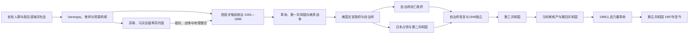

# 菲律宾历史

菲律宾历史的主线是：多中心海岛社会进入南海贸易和伊斯兰网络；西班牙以马尼拉、堂区和贡赋体系整合多数低地；美国以战争取得主权后建立文官政府和有限自治；日本占领打断独立过渡；1946年共和国独立，经历精英民主、马科斯戒严和1986年后的宪政恢复。群岛从未在各时期受到同等程度控制，理解吕宋、米沙鄢、苏禄和棉兰老差异比寻找一个虚构的“统一古王朝”更重要。

## 历史主线

殖民前政治以聚落、港口、河谷和海域为单位，南部苏丹国又以伊斯兰王统连接婆罗洲与棉兰老。西班牙利用本地首领与修会治理低地，却无法彻底征服南部和高地。19世纪出口经济、教育和改革受阻共同推动民族主义；1896年革命削弱殖民国家，美西战争则让美国取代西班牙。美国在镇压第一共和国后逐步“菲化”行政，1935年设自治邦。日本占领期间，流亡自治邦、日军和第二共和国并行。独立共和国沿用总统制与地方选举，1972年戒严摧毁竞争性制度，1986年后恢复宪政但政治家族、社会不平等和武装冲突延续。

## 阶段导航

| 顺序 | 阶段 | 时间 | 简要概括 |
|---:|---|---|---|
| 1 | [殖民前群岛社会](/%E4%BA%BA%E6%96%87%E7%A7%91%E5%AD%A6/%E5%8E%86%E5%8F%B2/%E4%B8%9C%E5%8D%97%E4%BA%9A/%E8%8F%B2%E5%BE%8B%E5%AE%BE/%E6%AE%96%E6%B0%91%E5%89%8D%E7%BE%A4%E5%B2%9B%E7%A4%BE%E4%BC%9A.md) | 史前—1565年 | 考古人群、barangay、港邦、南海贸易与南部苏丹国 |
| 2 | [西班牙殖民菲律宾](/%E4%BA%BA%E6%96%87%E7%A7%91%E5%AD%A6/%E5%8E%86%E5%8F%B2/%E4%B8%9C%E5%8D%97%E4%BA%9A/%E8%8F%B2%E5%BE%8B%E5%AE%BE/%E8%A5%BF%E7%8F%AD%E7%89%99%E6%AE%96%E6%B0%91%E8%8F%B2%E5%BE%8B%E5%AE%BE.md) | 1565—1898年 | 马尼拉殖民国家、堂区贡赋、大帆船、改革与革命 |
| 3 | [美国统治与日本占领](/%E4%BA%BA%E6%96%87%E7%A7%91%E5%AD%A6/%E5%8E%86%E5%8F%B2/%E4%B8%9C%E5%8D%97%E4%BA%9A/%E8%8F%B2%E5%BE%8B%E5%AE%BE/%E7%BE%8E%E5%9B%BD%E7%BB%9F%E6%B2%BB%E4%B8%8E%E6%97%A5%E6%9C%AC%E5%8D%A0%E9%A2%86.md) | 1898—1946年 | 美菲战争、文官政府、自治邦、日占和盟军重返 |
| 4 | [独立后的菲律宾共和国](/%E4%BA%BA%E6%96%87%E7%A7%91%E5%AD%A6/%E5%8E%86%E5%8F%B2/%E4%B8%9C%E5%8D%97%E4%BA%9A/%E8%8F%B2%E5%BE%8B%E5%AE%BE/%E7%8B%AC%E7%AB%8B%E5%90%8E%E7%9A%84%E8%8F%B2%E5%BE%8B%E5%AE%BE%E5%85%B1%E5%92%8C%E5%9B%BD.md) | 1946年至今 | 第三共和国、戒严威权、民主恢复与邦萨摩洛进程 |

## 专题表

| 专表 | 覆盖范围 |
|---|---|
| [西班牙殖民菲律宾最高行政首脑表](/%E4%BA%BA%E6%96%87%E7%A7%91%E5%AD%A6/%E5%8E%86%E5%8F%B2/%E4%B8%9C%E5%8D%97%E4%BA%9A/%E8%8F%B2%E5%BE%8B%E5%AE%BE/%E8%A5%BF%E7%8F%AD%E7%89%99%E6%AE%96%E6%B0%91%E6%9C%80%E9%AB%98%E8%A1%8C%E6%94%BF%E9%A6%96%E8%84%91%E8%A1%A8.md) | 1565—1899年117段正任、代理、审问院代政及英占并行关系 |
| [美国统治与日本占领行政首脑表](/%E4%BA%BA%E6%96%87%E7%A7%91%E5%AD%A6/%E5%8E%86%E5%8F%B2/%E4%B8%9C%E5%8D%97%E4%BA%9A/%E8%8F%B2%E5%BE%8B%E5%AE%BE/%E7%BE%8E%E5%9B%BD%E7%BB%9F%E6%B2%BB%E4%B8%8E%E6%97%A5%E5%8D%A0%E8%A1%8C%E6%94%BF%E9%A6%96%E8%84%91%E8%A1%A8.md) | 军事总督、文官总督、高级专员、自治邦总统、日军与扶植政权 |
| [菲律宾国家元首与副总统表](/%E4%BA%BA%E6%96%87%E7%A7%91%E5%AD%A6/%E5%8E%86%E5%8F%B2/%E4%B8%9C%E5%8D%97%E4%BA%9A/%E8%8F%B2%E5%BE%8B%E5%AE%BE/%E8%8F%B2%E5%BE%8B%E5%AE%BE%E5%9B%BD%E5%AE%B6%E5%85%83%E9%A6%96%E4%B8%8E%E5%89%AF%E6%80%BB%E7%BB%9F%E8%A1%A8.md) | 第一共和国至2026年7月的总统、副总统、空缺和争议主张 |

## 重要转折与时间节点

| 时间 | 转折 | 意义 |
|---|---|---|
| 公元900年 | 拉古纳铜版铭文 | 证明早期书写、法律与跨区域交流 |
| 约15—16世纪 | 苏禄、马京达瑙苏丹制发展 | 南部形成延续至殖民时期的伊斯兰政治传统 |
| 1565、1571年 | 宿务据点与马尼拉首府 | 西班牙持续殖民统治成形 |
| 1762—1764年 | 英占马尼拉 | 显示首都占领与群岛实际控制并不等同 |
| 1872、1896年 | Gomburza与菲律宾革命 | 改革民族主义转向群众性反殖民战争 |
| 1898—1902年 | 主权转让与美菲战争 | 美国以战争取代西班牙成为殖民者 |
| 1935、1942年 | 自治邦成立与日本占领 | 独立过渡建立后被太平洋战争打断 |
| 1946年 | 独立共和国成立 | 美国殖民主权终结，安全和经济联系延续 |
| 1972、1986年 | 戒严与人民力量革命 | 威权体制建立后崩溃，宪政民主恢复 |
| 2014—2019年 | 邦萨摩洛和平协议与自治区成立 | 主要摩洛冲突转入自治治理 |
| 2026年5—7月 | 副总统弹劾审理 | 家族联盟破裂并检验宪法问责；截至7月尚无罢免结果 |

## 区域联系

- 上级：[东南亚历史](/%E4%BA%BA%E6%96%87%E7%A7%91%E5%AD%A6/%E5%8E%86%E5%8F%B2/%E4%B8%9C%E5%8D%97%E4%BA%9A/README.md)
- 文明区域：[海岛东南亚历史](/%E4%BA%BA%E6%96%87%E7%A7%91%E5%AD%A6/%E5%8E%86%E5%8F%B2/%E4%B8%9C%E5%8D%97%E4%BA%9A/%E6%B5%B7%E5%B2%9B%E4%B8%9C%E5%8D%97%E4%BA%9A/README.md)
- 邻近主线：[文莱历史](/%E4%BA%BA%E6%96%87%E7%A7%91%E5%AD%A6/%E5%8E%86%E5%8F%B2/%E4%B8%9C%E5%8D%97%E4%BA%9A/%E6%96%87%E8%8E%B1/README.md)、[马来西亚历史](/%E4%BA%BA%E6%96%87%E7%A7%91%E5%AD%A6/%E5%8E%86%E5%8F%B2/%E4%B8%9C%E5%8D%97%E4%BA%9A/%E9%A9%AC%E6%9D%A5%E8%A5%BF%E4%BA%9A/README.md)
