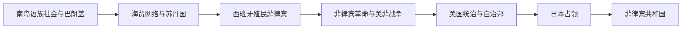

# 菲律宾历史

菲律宾历史由多岛屿、多语言的海洋社会发展而来。殖民前聚落参与南海贸易，苏禄和棉兰老形成穆斯林苏丹国；西班牙以马尼拉为中心建立殖民统治并传播天主教，美国统治引入大众教育和选举制度，日本占领后共和国独立，但精英政治、地方权力与社会运动持续互动。

## 阶段导航

| 顺序 | 阶段 | 时间 | 核心变化 |
|---|---|---|---|
| 1 | [殖民前群岛社会](/%E4%BA%BA%E6%96%87%E7%A7%91%E5%AD%A6/%E5%8E%86%E5%8F%B2/%E4%B8%9C%E5%8D%97%E4%BA%9A/%E8%8F%B2%E5%BE%8B%E5%AE%BE/%E6%AE%96%E6%B0%91%E5%89%8D%E7%BE%A4%E5%B2%9B%E7%A4%BE%E4%BC%9A.md) | 16世纪以前 | 海洋聚落、贸易网络与南部苏丹国 |
| 2 | [西班牙殖民菲律宾](/%E4%BA%BA%E6%96%87%E7%A7%91%E5%AD%A6/%E5%8E%86%E5%8F%B2/%E4%B8%9C%E5%8D%97%E4%BA%9A/%E8%8F%B2%E5%BE%8B%E5%AE%BE/%E8%A5%BF%E7%8F%AD%E7%89%99%E6%AE%96%E6%B0%91%E8%8F%B2%E5%BE%8B%E5%AE%BE.md) | 1565—1898年 | 马尼拉殖民国家、天主教化与民族革命 |
| 3 | [美国统治与日本占领](/%E4%BA%BA%E6%96%87%E7%A7%91%E5%AD%A6/%E5%8E%86%E5%8F%B2/%E4%B8%9C%E5%8D%97%E4%BA%9A/%E8%8F%B2%E5%BE%8B%E5%AE%BE/%E7%BE%8E%E5%9B%BD%E7%BB%9F%E6%B2%BB%E4%B8%8E%E6%97%A5%E6%9C%AC%E5%8D%A0%E9%A2%86.md) | 1898—1946年 | 殖民战争、有限自治和太平洋战争 |
| 4 | [独立后的菲律宾共和国](/%E4%BA%BA%E6%96%87%E7%A7%91%E5%AD%A6/%E5%8E%86%E5%8F%B2/%E4%B8%9C%E5%8D%97%E4%BA%9A/%E8%8F%B2%E5%BE%8B%E5%AE%BE/%E7%8B%AC%E7%AB%8B%E5%90%8E%E7%9A%84%E8%8F%B2%E5%BE%8B%E5%AE%BE%E5%85%B1%E5%92%8C%E5%9B%BD.md) | 1946年至今 | 共和国、戒严统治与民主恢复 |

## 重要转折

| 时间 | 事件 | 意义 |
|---|---|---|
| 1565年 | 西班牙建立宿务殖民据点 | 持续殖民统治开始 |
| 1571年 | 马尼拉成为殖民中心 | 美洲—亚洲大帆船贸易形成 |
| 1896年 | 菲律宾革命爆发 | 卡蒂普南推动反殖民战争 |
| 1898—1902年 | 主权转让与美菲战争 | 美国取代西班牙成为殖民者 |
| 1946年 | 菲律宾共和国独立 | 美国正式承认主权 |
| 1972—1986年 | 马科斯戒严体制 | 威权统治与反对运动发展 |
| 1986年 | 人民力量革命 | 马科斯下台，宪政民主恢复 |

## 区域联系

- 上级：[海岛东南亚历史](/%E4%BA%BA%E6%96%87%E7%A7%91%E5%AD%A6/%E5%8E%86%E5%8F%B2/%E4%B8%9C%E5%8D%97%E4%BA%9A/%E6%B5%B7%E5%B2%9B%E4%B8%9C%E5%8D%97%E4%BA%9A/README.md)
- 邻近主线：[文莱历史](/%E4%BA%BA%E6%96%87%E7%A7%91%E5%AD%A6/%E5%8E%86%E5%8F%B2/%E4%B8%9C%E5%8D%97%E4%BA%9A/%E6%96%87%E8%8E%B1/README.md)、[马来西亚历史](/%E4%BA%BA%E6%96%87%E7%A7%91%E5%AD%A6/%E5%8E%86%E5%8F%B2/%E4%B8%9C%E5%8D%97%E4%BA%9A/%E9%A9%AC%E6%9D%A5%E8%A5%BF%E4%BA%9A/README.md)

## 直接上级

- [东南亚历史](/%E4%BA%BA%E6%96%87%E7%A7%91%E5%AD%A6/%E5%8E%86%E5%8F%B2/%E4%B8%9C%E5%8D%97%E4%BA%9A/README.md)
