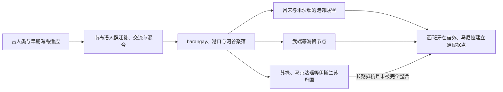

# 殖民前群岛社会

## 时间

史前时代至1565年；1521年起已有西班牙航行者接触，但尚未形成持续殖民统治。

## 概括

菲律宾群岛的早期历史不是一个统一王朝由盛而衰的历史，而是不同岛屿、河谷、港口和海域不断结盟、分裂与迁徙的历史。政治规模从数十户的聚落到控制港口、河口或贸易航线的复合首领邦不等；吕宋、米沙鄢、苏禄与棉兰老的制度、宗教和社会称谓也不完全相同。16世纪西班牙文献所称的 **barangay（巴朗盖）** 是理解基层组织的重要入口，却不能反推所有更早社会都具有相同规模或结构。

## 考古与文字证据

| 时段 | 证据 | 可说明的问题 | 不能过度推断之处 |
|---|---|---|---|
| 距今约6.7万—5万年 | 卡亚俄洞发现的吕宋人化石 | 吕宋很早已有古人类活动 | 不能直接等同于今日族群祖先 |
| 距今约4.7万年以来 | 巴拉望塔邦洞人骨、石器与利用洞穴遗迹 | 现代人类长期居住和海岛适应 | 遗址年代与人群连续性仍需分层讨论 |
| 约公元前2000年后 | 巴丹群岛、吕宋北部的陶器、语言与航海文化比较 | 南岛语人群及其技术沿海路扩散 | 这是迁徙、交流与混合过程，不是一次完全替代 |
| 公元900年 | 拉古纳铜版铭文 | 债务、身份与跨区域法律词汇已出现；文本含古马来语、梵语等成分 | 文中地名辨识和政治隶属关系仍有争议 |
| 约4—13世纪 | 武端出土 balangay 船与金工、贸易遗物 | 棉兰老东北部存在成熟造船和区域交换 | 不等于存在覆盖全岛的“武端帝国” |
| 10—13世纪 | 中国文献中的麻逸、蒲端等 | 群岛港口参与南海朝贡与商业网络 | “麻逸”等地的精确位置和范围存在争议 |

## 聚落、权力与社会机制

- **达图与首领权力**：达图的权威来自亲属网络、战士与随从、债务关系、祭仪声望、财富再分配以及控制贸易。权力通常需要协商，不能把达图简单理解为拥有固定疆界的欧洲式封建君主。
- **联盟与港邦**：若干 barangay 可因婚姻、防务、掠袭或贸易组成联盟；强势港口向周边索取贡礼，却未必能进行日常行政。统治范围常随首领个人关系而变化。
- **社会分层**：吕宋文献中的 maginoo、maharlika、timawa、alipin，与米沙鄢地区的称谓和权利不完全对应。alipin 包含债务依附、家内服务、附属农户等多种状态，不宜一概译成近代种植园式奴隶。
- **亲属与性别**：双系亲属、婚姻交换和收养有助于连接聚落；女性可拥有财产、参与贸易或继承首领地位。babaylan 等祭司角色常由女性或跨越常规性别角色者承担，但具体形态因地区而异。
- **习惯法与书写**：纠纷由首领和长老依据习惯、赔偿与宣誓处理。16世纪已可见 baybayin 等音节文字；公元900年的铜版铭文使用的是更早的卡维系书写传统，二者不能混为一谈。

## 地区差异

| 地区 | 主要节点 | 政治与经济特征 |
|---|---|---|
| 马尼拉湾与吕宋中部 | 汤都、马尼拉、纳马扬及邻近聚落 | 控制河海转运，与文莱、华商和吕宋内陆交换；1571年前夕存在并列首领而非统一“马尼拉王国” |
| 吕宋北部与邦阿西楠 | 河谷农业聚落、卡波洛安等传统政权 | 稻作、金矿和沿海贸易并存；伊富高等高地社会有自己的梯田、祭仪与政治组织 |
| 米沙鄢 | 宿务、麦克坦、班乃、保和等港口与联盟 | 海上贸易、战斗与掠袭相互交织；纹身、战士集团和奴役俘虏见于早期记载 |
| 武端与棉兰老北部 | 武端港邦 | 造船、黄金和跨海交换突出，与中国及岛屿东南亚往来 |
| 苏禄群岛 | 苏禄苏丹国 | 约15世纪形成苏丹制，连接婆罗洲、马六甲海峡、棉兰老与海产贸易；早期谱系部分依据后世王统传统 |
| 棉兰老南部与拉瑙 | 马京达瑙、布阿扬、拉瑙诸苏丹／达图 | 16世纪伊斯兰化深化，河谷、湖区和海岸权力并立，没有单一政权长期统合全岛 |

所谓“马贾阿斯联盟”等叙事主要来自较晚记录与口述传统；可作为地方历史记忆研究，但不能在缺乏同期证据时写成确定统一王朝。

## 海洋经济与文化演变

稻作、旱作、椰子和林产采集、渔业、盐业、黄金、蜂蜡、珍珠与海参构成不同生态区的交换基础。华商带来陶瓷、丝织品和金属货币，群岛商人又与婆罗洲、马鲁古和马来半岛连接。港口繁荣依赖季风航行和腹地供给，也会因航线转移、战争、首领更替或自然灾害迅速衰落。

印度宗教政治词汇、伊斯兰教与本地祖灵祭仪并存。伊斯兰化首先沿苏禄和棉兰老贸易网络展开，通过婚姻、学者和统治家族形成苏丹制；到16世纪时并未覆盖整个群岛。天主教化以前的地方信仰也并非一套全国统一宗教。

## 重要节点

| 时间 | 事件或过程 | 意义 |
|---|---|---|
| 距今约6.7万—5万年 | 吕宋古人类活动 | 将群岛人类史推进至远早于南岛语扩散的阶段 |
| 约公元前2000年后 | 南岛语人群和航海技术扩展 | 奠定多数菲律宾语言及海洋生活方式的长期基础 |
| 公元900年 | 拉古纳铜版铭文纪年 | 显示书写、债务解除和跨区域术语网络 |
| 10—13世纪 | 麻逸、蒲端等见于中国海贸记录 | 港口进入南海商业体系 |
| 约13—15世纪 | 伊斯兰教沿苏禄海域传播 | 南部开始形成以苏丹制为核心的新政治合法性 |
| 约15世纪中叶 | 苏禄苏丹国形成 | 串联婆罗洲—苏禄—棉兰老贸易与亲属网络 |
| 16世纪初 | 马京达瑙苏丹制发展 | 棉兰老南部伊斯兰政权扩张，但与布阿扬等势力竞争 |
| 1521年 | 麦哲伦船队到达，麦克坦战斗中麦哲伦身亡 | 证明欧洲远航已抵群岛，也显示地方首领可拒绝外来宗主要求 |
| 1543年 | “菲律宾群岛”名称开始用于部分岛屿 | 殖民地理称谓逐渐形成，尚不等于实际占领 |
| 1565年 | 莱加斯皮在宿务建立永久据点 | 殖民前政治网络开始被持续纳入西班牙军事、贡赋和传教体系 |

## 演变关系

西班牙征服并非一次性取代旧社会。殖民者依靠部分本地首领征税、迁村和传教，原有亲属与地方权力转化为 principalia 等殖民中介；南部苏丹国、高地和边远岛屿则长期保持不同程度自主。后续见[西班牙殖民菲律宾](/%E4%BA%BA%E6%96%87%E7%A7%91%E5%AD%A6/%E5%8E%86%E5%8F%B2/%E4%B8%9C%E5%8D%97%E4%BA%9A/%E8%8F%B2%E5%BE%8B%E5%AE%BE/%E8%A5%BF%E7%8F%AD%E7%89%99%E6%AE%96%E6%B0%91%E8%8F%B2%E5%BE%8B%E5%AE%BE.md)。

## 上级

- [菲律宾历史](/%E4%BA%BA%E6%96%87%E7%A7%91%E5%AD%A6/%E5%8E%86%E5%8F%B2/%E4%B8%9C%E5%8D%97%E4%BA%9A/%E8%8F%B2%E5%BE%8B%E5%AE%BE/README.md)
- [海岛东南亚历史](/%E4%BA%BA%E6%96%87%E7%A7%91%E5%AD%A6/%E5%8E%86%E5%8F%B2/%E4%B8%9C%E5%8D%97%E4%BA%9A/%E6%B5%B7%E5%B2%9B%E4%B8%9C%E5%8D%97%E4%BA%9A/README.md)
