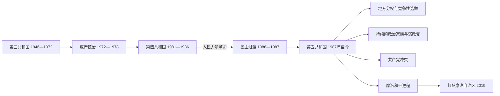

# 独立后的菲律宾共和国

## 时间

1946年7月4日至今；现状核验至2026年7月。

## 概括

独立后的菲律宾延续总统制、两院国会、司法审查和地方选举，也继承了殖民时期的土地集中、对美安全与市场联系、地方政治家族和区域不平衡。1946—1972年的竞争性选举未能解决贫困、佃农和国家能力问题；费迪南德·马科斯以危机与反共为由在1972年实施戒严，把民选政府改造成家族、军队与裙带资本支撑的威权体制。1986年人民力量革命恢复民主，1987年宪法设置任期和权力制衡，但弱政党、政治世家、金钱选举、共产党叛乱和棉兰老冲突继续塑造国家。

完整总统、副总统、职位空缺与争议主张见[菲律宾国家元首与副总统表](/%E4%BA%BA%E6%96%87%E7%A7%91%E5%AD%A6/%E5%8E%86%E5%8F%B2/%E4%B8%9C%E5%8D%97%E4%BA%9A/%E8%8F%B2%E5%BE%8B%E5%AE%BE/%E8%8F%B2%E5%BE%8B%E5%AE%BE%E5%9B%BD%E5%AE%B6%E5%85%83%E9%A6%96%E4%B8%8E%E5%89%AF%E6%80%BB%E7%BB%9F%E8%A1%A8.md)。

## 政治分期与实际权力

| 阶段 | 时间 | 宪制形式 | 实际权力特征 |
|---|---|---|---|
| 第三共和国 | 1946—1972年 | 1935年宪法下总统制与两院国会 | 国民党、自由党轮替，地主—地方家族、总统和美国影响相互制约 |
| 戒严统治 | 1972—1978年 | 总统以戒严令、命令和1973年宪法集中权力 | 国会关闭，军队、总统府和亲信企业主导；司法与媒体受压制 |
| 临时议会与第四共和国 | 1978—1986年 | Batasang Pambansa 议会框架；1981年后名义半总统／议会混合 | 马科斯先兼总理，后由塞萨尔·维拉塔任总理；关键权力仍在总统、军方和家族网络 |
| 革命过渡政府 | 1986—1987年 | 科拉松·阿基诺以临时“自由宪法”重建机构 | 清除旧宪制并筹组制宪委员会，同时面对军人政变压力 |
| 第五共和国 | 1987年至今 | 1987年宪法下总统制、两院国会和司法审查 | 竞争性选举与公民社会恢复；政党个人化、联盟流动和政治世家仍很强 |

## 第三共和国：重建、冷战与精英民主

### 罗哈斯与基里诺：独立而高度依赖

1946年独立时，马尼拉和工业交通体系仍受战争重创。罗哈斯政府接受《贝尔贸易法》和“平等权利”修宪，使美国公民和企业在自然资源利用上获得接近菲律宾人的待遇；1947年军事基地协议又让美国长期使用基地。这些安排换取重建援助和市场准入，也限制经济政策自主。

日本占领时期的合作审查很快让位于政治和解，许多战前精英重返权力。中吕宋虎克抗日军因土地、武装解除和选举代表被排斥而转为叛乱。基里诺政府一面开展重建和中央银行制度，一面在腐败指控、治安和对美关系间承压。

### 麦格赛赛至马卡帕加尔：改革与未解的不平等

麦格赛赛利用军政改革、地方申诉机制、美国援助和分化招安削弱虎克叛乱，建立“亲民总统”形象；1957年空难使其改革中断。加西亚提出“菲律宾人优先”，试图扩大本国资本；马卡帕加尔实施外汇自由化和土地改革，并在1962年把官方独立纪念日从7月4日改为6月12日，强调1898年革命传统。

这一时期选举具有竞争性，新闻和国会相对活跃，却以候选人个人、家族和地方庇护为中心。土地改革执行有限，人口增长、城乡差距和教育扩张共同制造新的社会期待。

## 马科斯崛起、戒严与第四共和国

马科斯1965年当选、1969年连任。第二任期前后的基础设施扩张依靠外债，竞选支出和通货膨胀加重财政压力。学生运动、共产党重建及新人民军出现，棉兰老暴力和土地迁移又推动摩洛民族解放阵线形成。政府把真实冲突、犯罪和政治暴力合并为“国家濒临崩溃”的叙事。

1972年9月马科斯签署并宣布第1081号公告，以反共和秩序为名实施戒严。军警拘捕反对派、关闭媒体和国会，总统通过命令立法。1973年宪法名义转向议会制，实际过渡安排让马科斯继续掌权。亲属和盟友取得糖、椰子、建筑、银行与媒体等领域利益，军官也因职位和预算成为体制支柱。基础设施、出口加工与海外劳务政策产生长期影响，但债务、寻租、强迫征收和人权侵害不能用“发展”叙事抵消。

1981年马科斯形式上解除戒严并建立第四共和国；议会和总理职位恢复，实权仍高度集中。全球利率上升、第二次石油冲击、债务与裙带企业亏损使经济恶化。1983年贝尼格诺·阿基诺二世回国遇刺，商界、中产阶层、教会、左翼与传统反对派的抗议扩大。1986年提前大选出现严重舞弊争议；国防部长恩里莱和军官拉莫斯倒戈，平民在EDSA保护叛离军人，美国也撤回对马科斯的支持。马科斯家族离境，科拉松·阿基诺就任。

### 威权体制衰落的多重原因

- **结构性因素**：个人化继承、裙带垄断和军政分肥削弱制度纠错；外债型增长对利率和国际市场高度敏感。
- **社会压力**：土地与工资矛盾、学生和工人运动、人权受害者家属、教会网络及独立媒体形成跨阶层反对。
- **外部压力**：债务危机和美国政策转变减少政权可用资源与外交保护。
- **直接触发**：阿基诺遇刺破坏体制合法性；1986年选举争议、军队分裂和群众保护行动使强制机关无法统一执行镇压。

## 民主恢复与第五共和国

### 科拉松·阿基诺与拉莫斯

科拉松·阿基诺废除旧议会，推动1987年宪法，以总统单一六年任期、司法审查、权利法案和独立宪政机构限制威权复归。新人民军仍活跃，军中旧网络发动多次政变。1988年土地综合改革保留多种豁免和补偿安排，未彻底打破大庄园。1991年《地方政府法》把卫生、农业、社会服务和财政权限下放，也让地方创新与地方家族垄断同时增强；同年参议院拒绝续签美军基地条约。

拉莫斯以联盟政府稳定军政关系，推动电力、通信和市场改革，并于1996年与摩洛民族解放阵线签署和平协议。经济增长和自由化增强信心，但私有化与区域收益不均引发争论；1997年亚洲金融危机暴露外部脆弱性。

### 埃斯特拉达与阿罗约

埃斯特拉达以面向穷人的大众形象当选，却因贪腐指控遭弹劾。审判中止后，军警精英和大规模抗议转向副总统阿罗约，最高法院认可其2001年继任；支持者称其为宪法继承，反对者则认为再次以街头动员替代完整选举问责。阿罗约任内实行增值税等财政改革、扩大基础设施和反恐合作，经济保持增长；2004年选举录音争议、紧急状态、政治杀戮和腐败指控持续损害合法性。

### 阿基诺三世与杜特尔特

阿基诺三世以反腐和“良政”议程上台，公共财政、服务业和投资改善。政府2013年对中国提起南海仲裁，2016年裁决否定“九段线”内若干海洋权利主张。与摩洛伊斯兰解放阵线的谈判形成2014年全面和平协议，但2015年马马萨帕诺行动造成警员、MILF成员和平民死亡，拖延立法。

杜特尔特2016年以强硬治安和反马尼拉精英形象当选。禁毒行动造成大批死亡，官方执法、法外处决指控和国际刑事司法争议交织。2017年亲“伊斯兰国”武装占领马拉维部分城区，政府在棉兰老实施戒严并以长期城市战收复。2018年《邦萨摩洛组织法》通过，2019年邦萨摩洛穆斯林棉兰老自治区成立，为MILF从武装组织转向自治执政提供框架。2020年疫情造成封控、失业、教育中断和公共卫生压力。

### 马科斯二世政府（2022—2026年7月）

费迪南德·R·马科斯二世与萨拉·杜特尔特以“团结”联盟赢得2022年选举。政府处理疫后恢复、食品与能源价格、基础设施、气候灾害和主权基金争议；安全政策重新强化与美国、日本等伙伴的合作，并在2023年扩大《加强防务合作协议》可使用地点。南海补给与海警对峙加剧，外交需在经济联系与海洋权利之间平衡。

马科斯与杜特尔特家族的竞选联盟随后破裂。众议院在2026年5月通过对副总统萨拉·杜特尔特的弹劾，参议院于7月上旬开始审理；截至2026年7月，她尚未因参议院定罪而被罢免，仍是副总统。总统费迪南德·R·马科斯二世也仍在任，任期按宪法预计至2028年6月。

## 现行国家结构（核验至2026年7月）

| 机构 | 产生方式与任期 | 主要权力 | 关键制衡 |
|---|---|---|---|
| 总统 | 全国直选，六年单一任期 | 国家元首、政府首脑、统帅，任命内阁并执行法律 | 国会预算和调查、弹劾、司法审查、独立委员会 |
| 副总统 | 与总统分开直选，六年；可连任一次 | 宪定第一继承人；具体行政职责取决于总统任命或副总统办公室项目 | 可与总统来自不同联盟，也可遭弹劾 |
| 参议院 | 24席全国选举，每三年改选一半 | 立法、条约同意、弹劾审判 | 与众议院相互同意法案，总统否决和法院审查 |
| 众议院 | 选区议员与政党名单议员 | 立法、预算，弹劾案由此提出 | 参议院和司法制衡；地方家族影响较强 |
| 最高法院与下级法院 | 总统从司法与律师委员会名单任命 | 宪法解释、司法审查和终审 | 任职保障、弹劾与宪法程序 |
| 地方政府 | 省、市、自治市、barangay 选举 | 地方服务、规划、部分税费和治安协调 | 内政监督、审计、选举与地方议会 |
| 邦萨摩洛自治区 | 自治议会产生首席部长；与中央分权 | 伊斯兰个人法、地方行政、发展与部分财政权限 | 宪法、组织法、政府间机制及中央保留权力 |

截至2026年7月，总统为**费迪南德·R·马科斯二世**，副总统为**萨拉·Z·杜特尔特**。菲律宾总统和副总统分别选举，因此二人政治决裂不会自动解除任何一方职务。

## 经济与社会长期变化

- **从农业出口到劳务与服务**：糖、椰子、香蕉和矿业仍重要；1970年代后海外劳工制度化，侨汇成为家庭消费、教育和外汇的重要来源。21世纪业务流程外包、电子制造、旅游和数字服务扩大。
- **增长与不平等并存**：大马尼拉、宿务等城市群吸纳人口和资本，住房、交通与非正规就业压力上升。土地集中、教育质量差异和岛际基础设施差距限制向上流动。
- **人口与文化**：英语、菲律宾语和多种区域语言共存；天主教多数、穆斯林与本地信仰传统共同构成社会。强大家庭与海外网络既提供福利，也使国家服务不足由私人承担。
- **灾害与气候风险**：台风、地震、火山和海平面上升反复冲击财政、迁移和粮食安全；地方能力与贫困决定灾害后果并不平均。
- **媒体与公民社会**：报刊、广播、教会、非政府组织和街头运动在推翻威权和监督选举中作用显著；同时面临所有权集中、网络虚假信息、骚扰与暴力风险。

## 武装冲突与和平进程

### 共产党叛乱

1968年菲律宾共产党重建，1969年新人民军成立，以土地、贫困和国家暴力为动员基础。戒严扩大其人员和地域；1986年后多轮和谈、停火与军事行动交替。组织在分裂、领导人死亡、地方治理和“红色标签化”争议中衰减，但截至2020年代仍未完全结束。

### 摩洛冲突

20世纪移民、土地登记、地方暴力和中央国家扩张改变棉兰老人口与权力格局。摩洛民族解放阵线1970年代起武装斗争，1976年《的黎波里协议》和1996年最终和平协议建立有限自治。摩洛伊斯兰解放阵线从MNLF分出，经过长期谈判，于2014年签署全面和平协议；2019年邦萨摩洛自治区取代原穆斯林棉兰老自治区。自治转型降低主要组织与政府的战争，却仍受解除武装、家族冲突、贫困、阿布沙耶夫与邦萨摩洛伊斯兰自由战士等问题牵制。

## 重要事件

| 时间 | 事件 | 历史意义 |
|---|---|---|
| 1946年7月4日 | 美国承认独立 | 第三共和国开始，殖民贸易与基地关系仍延续 |
| 1947年 | 平等权利修宪与军事基地协议 | 确立战后对美经济、安全框架 |
| 1946—1954年 | 虎克叛乱与镇压 | 土地问题被纳入冷战反共，塑造军政和农村政策 |
| 1962年 | 独立纪念日改为6月12日 | 国家记忆由美国承认转向1898年革命 |
| 1965、1969年 | 马科斯当选与连任 | 债务型建设、政治极化和权力集中加速 |
| 1968—1969年 | 菲律宾共产党与新人民军建立 | 长期共产党叛乱形成 |
| 1972年9月 | 戒严实施 | 竞争性民主转为个人化威权统治 |
| 1973年 | 新宪法生效 | 议会制名义掩盖总统持续集中权力 |
| 1983年8月21日 | 贝尼格诺·阿基诺二世遇刺 | 反对联盟和经济信心危机扩大 |
| 1986年2月 | 提前大选与人民力量革命 | 马科斯下台，民主过渡开始 |
| 1987年 | 新宪法生效 | 重建总统任期限制、两院国会和权利保障 |
| 1991年 | 地方政府法、参议院拒绝基地续约 | 权力下放并调整对美关系 |
| 1996年 | 政府与MNLF和平协议 | 摩洛自治进程的重要阶段 |
| 2001年 | 埃斯特拉达离任、阿罗约继任 | 宪法继承与街头政治合法性争论并存 |
| 2013—2016年 | 南海仲裁案 | 形成海洋权利的法律依据，但执行依赖外交与力量平衡 |
| 2014年 | 与MILF签署全面和平协议 | 为邦萨摩洛新自治安排奠基 |
| 2017年 | 马拉维战事 | 暴露跨国圣战网络与城市反恐挑战 |
| 2018—2019年 | 邦萨摩洛组织法与自治区成立 | 主要摩洛和平进程从协议转入自治治理 |
| 2020—2022年 | 新冠疫情 | 公共卫生、教育、就业和政府债务承压 |
| 2022年 | 马科斯二世、萨拉·杜特尔特当选 | 两大政治家族联盟执政，后迅速分裂 |
| 2026年5—7月 | 副总统弹劾与参议院审理 | 检验宪法问责、家族竞争和制度独立性；截至7月尚无罢免结果 |

## 演变关系

前接[美国统治与日本占领](/%E4%BA%BA%E6%96%87%E7%A7%91%E5%AD%A6/%E5%8E%86%E5%8F%B2/%E4%B8%9C%E5%8D%97%E4%BA%9A/%E8%8F%B2%E5%BE%8B%E5%AE%BE/%E7%BE%8E%E5%9B%BD%E7%BB%9F%E6%B2%BB%E4%B8%8E%E6%97%A5%E6%9C%AC%E5%8D%A0%E9%A2%86.md)。

## 上级

- [菲律宾历史](/%E4%BA%BA%E6%96%87%E7%A7%91%E5%AD%A6/%E5%8E%86%E5%8F%B2/%E4%B8%9C%E5%8D%97%E4%BA%9A/%E8%8F%B2%E5%BE%8B%E5%AE%BE/README.md)
