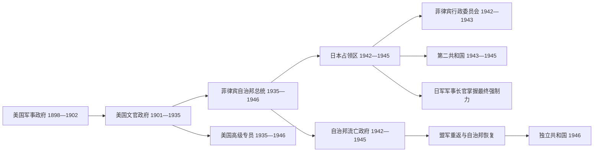

# 美国统治与日本占领行政首脑表

## 范围与权力边界

本表把1898—1946年的并行权力分开列示。美国军事总督、文官总督、自治邦总统与美国高级专员并非同一种职位；1942—1945年又同时存在自治邦流亡政府、日军占领司令部和日本扶植的民政机关。只有把这些序列并排阅读，才能避免把名义职位误写成实际最高权力。

## 美国军事政府

| 顺序 | 军事总督 | 任期 | 权力与事件 |
|---|---|---|---|
| 1 | Wesley Merritt | 1898年8月14日—8月30日 | 占领马尼拉后发布军事统治公告 |
| 2 | Elwell S. Otis | 1898年8月30日—1900年5月5日 | 美菲战争初期最高军政长官 |
| 3 | Arthur MacArthur Jr. | 1900年5月5日—1901年7月4日 | 战争扩展为反游击作战，任内阿奎纳多被俘 |
| 4 | Adna Chaffee | 1901年7月4日—1902年7月4日 | 与塔夫脱文官政府并存，负责仍在抵抗地区的军事管制 |

1901年7月至1902年7月出现军事总督与文官总督并存：文官政府管理已转交的行政部门，军方继续负责仍被视为战区的地区。

## 美国文官政府与总督

| 顺序 | 首脑 | 任期 | 身份 | 权力与事件 |
|---|---|---|---|---|
| 1 | William Howard Taft | 1901年7月4日—1904年2月1日 | 文官总督 | 菲律宾委员会主席转任；1902年后成为唯一殖民行政首脑 |
| 2 | Luke Edward Wright | 1904年2月1日—1905年11月3日 | 文官总督，后改称总督 | 总督职称在1905年恢复 |
| 3 | Henry Clay Ide | 1905年11月3日—1906年9月19日 | 总督 | 延续委员会政府 |
| 4 | James Francis Smith | 1906年9月20日—1909年11月11日 | 总督 | 任内1907年菲律宾议会开会 |
| 5 | William Cameron Forbes | 1909年11月11日—1913年9月1日 | 总督 | 基础设施与殖民行政扩展 |
| 6 | Newton W. Gilbert | 1913年9月1日—10月6日 | 代理总督 | 交接期代理 |
| 7 | Francis Burton Harrison | 1913年10月6日—1921年3月5日 | 总督 | 大规模“菲化”，任内《琼斯法》实施 |
| 8 | Charles Yeater | 1921年3月5日—10月14日 | 代理总督 | 交接期代理 |
| 9 | Leonard Wood | 1921年10月14日—1927年8月7日 | 总督 | 加强总督否决与监督权，引发与菲律宾政治领袖冲突 |
| 10 | Eugene Allen Gilmore | 1927年8月7日—12月27日 | 代理总督 | 伍德去世后代理 |
| 11 | Henry L. Stimson | 1927年12月27日—1929年2月23日 | 总督 | 协调殖民行政与独立问题 |
| 12 | Eugene Allen Gilmore | 1929年2月23日—7月8日 | 代理总督 | 第二次代理 |
| 13 | Dwight F. Davis | 1929年7月8日—1932年1月9日 | 总督 | 经济大萧条冲击时期 |
| 14 | George C. Butte | 1932年1月9日—2月29日 | 代理总督 | 交接期代理 |
| 15 | Theodore Roosevelt Jr. | 1932年2月29日—1933年7月15日 | 总督 | 独立立法进入决定阶段 |
| 16 | Frank Murphy | 1933年7月15日—1935年11月14日 | 末任总督 | 监督自治邦宪法与政权交接 |

## 自治邦时期的美国高级专员

| 顺序 | 首脑 | 任期 | 身份 | 权力边界 |
|---|---|---|---|---|
| 1 | Frank Murphy | 1935年11月14日—1936年12月31日 | 高级专员 | 由末任总督转任；不再是菲律宾行政首脑 |
| 2 | J. Weldon Jones | 1936年12月31日—1937年4月26日 | 代理高级专员 | 交接期代理 |
| 3 | Paul V. McNutt | 1937年4月26日—1939年7月12日 | 高级专员 | 代表美国政府保留条约与过渡监督权 |
| 4 | J. Weldon Jones | 1939年7月12日—10月28日 | 代理高级专员 | 第二次代理 |
| 5 | Francis Bowes Sayre Sr. | 1939年10月28日—1942年10月12日 | 高级专员 | 日军占领后随美方撤离，后期在域外履职 |
| 6 | Harold L. Ickes | 1942年10月12日—1945年9月14日 | 高级专员 | 日占期间在美国方面维持职位，群岛内无实际行政控制 |
| 7 | Paul V. McNutt | 1945年9月14日—1946年7月4日 | 末任高级专员 | 重返任职并完成独立交接 |

高级专员代表美国主权，但1935年后菲律宾日常行政首脑已经是民选自治邦总统。

## 菲律宾自治邦总统

| 顺序 | 总统 | 任期 | 身份 | 权力与事件 |
|---|---|---|---|---|
| 1 | Manuel L. Quezon | 1935年11月15日—1944年8月1日 | 自治邦总统 | 1942年后领导流亡自治邦政府，法统与日占政权并行 |
| 2 | Sergio Osmeña | 1944年8月1日—1946年5月28日 | 自治邦总统 | 奎松去世后继任，随盟军回到菲律宾 |
| 3 | Manuel Roxas | 1946年5月28日—7月4日 | 自治邦末任总统 | 7月4日后继续任独立共和国总统 |

## 日本占领下的军事最高权力

| 顺序 | 军事长官 | 任期 | 身份 | 权力与事件 |
|---|---|---|---|---|
| 1 | 本间雅晴（Masaharu Homma） | 1942年1月3日—6月8日 | 日军军事长官 | 攻占马尼拉、巴丹和科雷希多阶段；实权在第十四军 |
| 2 | 田中静壹（Shizuichi Tanaka） | 1942年6月8日—1943年5月28日 | 日军军事长官 | 占领行政制度化阶段 |
| 3 | 黑田重德（Shigenori Kuroda） | 1943年5月28日—1944年9月26日 | 日军军事长官 | 推动名义“独立”，仍掌军事与最终决策权 |
| 4 | 山下奉文（Tomoyuki Yamashita） | 1944年9月26日—1945年9月2日 | 日军军事长官 | 盟军反攻后主要指挥吕宋防御；日本投降后权力终结 |

日军军事长官按第十四军／第十四方面军的指挥更替列出。占领末期各地战况割裂，山下奉文的命令也不能持续覆盖全部守军与海军单位。

## 日本扶植的民政首脑

| 顺序 | 首脑 | 任期 | 身份 | 实际权力 |
|---|---|---|---|---|
| 1 | 豪尔赫·B·巴尔加斯（Jorge B. Vargas） | 1942年1月23日—1943年10月14日 | 菲律宾行政委员会主席 | 日军监督下处理日常民政，不具有独立主权 |
| 2 | 何塞·P·劳雷尔（José P. Laurel） | 1943年10月14日—1945年8月17日 | 菲律宾第二共和国总统 | 名义国家元首；军事、外交和物资动员受日本控制，投降后宣布政权解散 |

## 并行关系

## 相关笔记

- 主笔记：[美国统治与日本占领](/%E4%BA%BA%E6%96%87%E7%A7%91%E5%AD%A6/%E5%8E%86%E5%8F%B2/%E4%B8%9C%E5%8D%97%E4%BA%9A/%E8%8F%B2%E5%BE%8B%E5%AE%BE/%E7%BE%8E%E5%9B%BD%E7%BB%9F%E6%B2%BB%E4%B8%8E%E6%97%A5%E6%9C%AC%E5%8D%A0%E9%A2%86.md)
- 后续：[独立后的菲律宾共和国](/%E4%BA%BA%E6%96%87%E7%A7%91%E5%AD%A6/%E5%8E%86%E5%8F%B2/%E4%B8%9C%E5%8D%97%E4%BA%9A/%E8%8F%B2%E5%BE%8B%E5%AE%BE/%E7%8B%AC%E7%AB%8B%E5%90%8E%E7%9A%84%E8%8F%B2%E5%BE%8B%E5%AE%BE%E5%85%B1%E5%92%8C%E5%9B%BD.md)
- 总览：[菲律宾历史](/%E4%BA%BA%E6%96%87%E7%A7%91%E5%AD%A6/%E5%8E%86%E5%8F%B2/%E4%B8%9C%E5%8D%97%E4%BA%9A/%E8%8F%B2%E5%BE%8B%E5%AE%BE/README.md)
