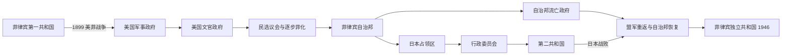

# 美国统治与日本占领

## 时间

1898—1946年。其中美国军事政府与美菲战争主要在1898—1902年，群岛政府时期为1901—1935年，菲律宾自治邦为1935—1946年；1942—1945年日本占领与自治邦流亡政府并行。

## 概括

1898年菲律宾革命者宣布独立，但西班牙在《巴黎条约》中把群岛主权转让给美国。美国拒绝承认菲律宾第一共和国，双方于1899年开战。美军以正规战、反游击、地方精英合作和民政建设建立殖民秩序，随后逐步扩大菲律宾人选举与行政参与，却把主权、国防、关税等关键权力保留在华盛顿。1935年自治邦开始十年独立过渡，1941年底日本入侵打断进程。日军扶植行政委员会和第二共和国，实际强制力仍在占领军；自治邦则在美国维持法统并参与盟军反攻。1945年恢复自治邦，1946年美国正式承认独立。

## 四种统治结构不能混写

| 阶段 | 名义首脑 | 实际最高权力 | 菲律宾人的参与 |
|---|---|---|---|
| 美国军事政府 | 美国军事总督 | 驻菲美军与美国总统、陆军部 | 第一共和国被视为叛乱；地方官可在投降后留任或重组 |
| 群岛文官政府 | 美国总督 | 总督、菲律宾委员会及美国国会 | 1907年起有民选议会；1916年后两院多由菲律宾人组成 |
| 菲律宾自治邦 | 民选自治邦总统 | 日常行政由总统负责；美国保留主权、国防与外交监督，高级专员代表美国 | 全国性总统、议会与地方选举，为独立训练行政体系 |
| 日本占领 | 日军军事长官；先为行政委员会、后为劳雷尔第二共和国 | 日军掌军事、外交和物资动员，宪政“独立”受严格限制 | 合作者处理部分民政；游击队、地下网络及流亡自治邦持续抵抗 |

完整任期及并行权力见[美国统治与日本占领行政首脑表](/%E4%BA%BA%E6%96%87%E7%A7%91%E5%AD%A6/%E5%8E%86%E5%8F%B2/%E4%B8%9C%E5%8D%97%E4%BA%9A/%E8%8F%B2%E5%BE%8B%E5%AE%BE/%E7%BE%8E%E5%9B%BD%E7%BB%9F%E6%B2%BB%E4%B8%8E%E6%97%A5%E5%8D%A0%E8%A1%8C%E6%94%BF%E9%A6%96%E8%84%91%E8%A1%A8.md)。

## 第一共和国、美菲战争与军事政府

1898年6月阿奎纳多宣布独立，革命政府控制马尼拉以外大片低地，并于1899年1月在马洛洛斯成立第一共和国。美国与西班牙安排8月13日的马尼拉战斗和投降，把菲律宾军队排除在首都之外；12月《巴黎条约》以两千万美元为转让条件。对美国而言，这是战争取得的海外属地；对菲律宾共和国而言，西班牙无权转让已脱离其控制的人民和领土。

1899年2月4日马尼拉外围交火升级为战争。菲律宾军队在正面战场失利后转入分散游击。美国以交通线、驻军、侦察和地方投降网络逐步控制低地，也采用集中迁居、破坏粮源、严厉审讯和报复。1901年阿奎纳多在帕拉南被俘并宣誓效忠美国；美国于1902年宣布战争结束，但萨马、比科尔等地的抵抗和“土匪化”镇压继续存在。

穆斯林南部不属于马洛洛斯政府有效控制区，美国先以1899年贝茨协议暂时承认苏禄苏丹权威，后废止协议并设摩洛省。布德达霍（1906）和布德巴格萨克（1913）等战斗造成严重伤亡，显示“战争1902年结束”的说法只适用于美国对多数基督教低地抵抗的官方界定。

## 文官政府、制度移植与殖民社会

### 政治制度

1901年塔夫脱出任文官总督，菲律宾委员会兼行政与立法职能；1902年《菲律宾组织法》建立基本权利框架和未来民选议会。1907年菲律宾议会开会，与委员会组成两院。1916年《琼斯法》以民选参议院取代委员会的立法地位，并首次正式表达美国最终承认独立的意图，但总督仍有否决、任命和向华盛顿负责的权力。

美国逐步实行“菲化”，让菲律宾人进入文官系统。地方和国会选举使国民党等组织成长，也让地主、律师和省级家族把地方庇护网络带入全国政治。殖民民主扩大了政治训练，却没有自动打破财富和土地的不平等。

### 教育、卫生与语言

1901年起公立学校系统扩张，英语成为重要教学和行政语言，“托马斯教师”只是早期美籍教师的一部分，菲律宾教师很快构成主体。学校提高识字和跨地区沟通，亦传播美国式公民与文化规范。卫生部门开展天花接种、供水、检疫和热带病防治；道路、港口与政府机关扩大国家能力。公共服务分布不均，城市、低地和较富省份通常受益更多。

### 土地、贸易与经济依赖

殖民政府购买部分修会地产再行分售，但价格、面积和融资条件使许多佃农无法受益。托伦斯地契和法院制度要求书面证明，可能让熟悉法律者取得优势。与美国的优惠贸易促进糖、椰子、麻和烟草出口，也把经济周期、配额和加工市场进一步绑定美国。矿业、公共工程和城市就业增长，地主—佃农矛盾则在中吕宋等地加深。

## 自治邦与独立准备

1933年美国国会通过《黑尔—霍斯—卡廷法》，菲律宾议会因基地、贸易与政治竞争而拒绝。1934年《泰丁斯—麦克杜菲法》获得接受，规定十年自治邦过渡。1935年宪法建立总统制，奎松与奥斯梅尼亚当选总统、副总统；美国总督改为不掌日常行政的高级专员。1937年妇女公投取得选举权。

自治邦发展国防、文官、语言和经济计划，却面临时间短、资源有限及对美贸易依赖。土地冲突和萨克达尔等运动显示独立民族主义内部存在社会分歧。1941年奎松、奥斯梅尼亚连任；同年菲律宾军队被编入美国远东陆军，独立准备转为战争动员。

## 日本入侵、占领政权与抵抗

1941年12月8日日本空袭并登陆菲律宾。美菲军队按计划退守巴丹与科雷希多，马尼拉宣布不设防后于1942年1月2日被占。巴丹4月9日投降，随后发生死亡行军；科雷希多5月6日失守。奎松政府撤往美国，继续作为获盟国承认的自治邦政府。

日军以军事行政统制粮食、交通、货币、媒体和警察。1942年菲律宾行政委员会由豪尔赫·巴尔加斯主持；1943年成立以何塞·P·劳雷尔为总统的第二共和国，并宣称“独立”。该政权有菲律宾官员和国民议会，却不能自主决定驻军、外交、征用与战争动员。通货膨胀、粮食征集、交通崩溃和暴力使民生恶化。

合作与抵抗不是简单二分。官员可能为维持供给、保护地方或谋求权力而留任，也有人暗中援助游击。各地游击队效忠对象、政治理念和与美军联系不同；中吕宋的虎克抗日军以农民组织为基础。日军和地方辅助力量以扫荡、拘捕、酷刑和屠杀回应，平民常被夹在多方征粮与情报竞争之间。

## 盟军重返、战争毁灭与独立交接

1944年10月盟军登陆莱特，莱特湾海战削弱日本海上增援。奥斯梅尼亚在奎松去世后继任自治邦总统，并随麦克阿瑟回到菲律宾。1945年2—3月马尼拉战役中，日军暴行、炮火和城市战共同造成约十万平民死亡，建筑与基础设施大面积毁坏。吕宋山区和其他岛屿战事持续到日本投降。

1945年自治邦政府恢复，但面临重建、饥荒、合作审判、游击队承认和战前土地矛盾。1946年罗哈斯当选；7月4日美国依据预定法案和《马尼拉条约》承认菲律宾独立。美国同时通过贸易、军事基地和安全安排继续保持深远影响。

## 重要事件

| 时间 | 事件 | 结果与长期影响 |
|---|---|---|
| 1898年6月12日 | 菲律宾宣布独立 | 革命政府主张主权，但未获美国承认 |
| 1898年8月13日 | 马尼拉向美军投降 | 美国控制首都，菲律宾军队被排除在受降之外 |
| 1898年12月10日 | 《巴黎条约》签署 | 西班牙把菲律宾转让美国，主权冲突制度化 |
| 1899年1月23日 | 第一共和国成立 | 亚洲早期宪政共和国之一，中央设在马洛洛斯 |
| 1899年2月4日 | 美菲战争爆发 | 独立战争转为反美国吞并战争 |
| 1901年3月 | 阿奎纳多被俘 | 第一共和国中央领导崩解，地方抵抗仍继续 |
| 1901—1902年 | 文官政府建立、军事与文官权力并行 | 殖民统治从战场占领转向常设行政 |
| 1906、1913年 | 布德达霍与布德巴格萨克战斗 | 美国对摩洛地区的强制整合及其高伤亡争议 |
| 1907年 | 菲律宾议会开会 | 全国性民选立法制度开始运作 |
| 1916年 | 《琼斯法》 | 扩大立法自治并承诺未来独立 |
| 1934年 | 《泰丁斯—麦克杜菲法》 | 确立十年自治邦—独立过渡 |
| 1935年 | 自治邦成立 | 菲律宾总统接掌日常行政 |
| 1941年12月 | 日本入侵 | 独立过渡被战争打断 |
| 1942年4—5月 | 巴丹、科雷希多失守 | 日军完成主要占领，死亡行军造成大批战俘死亡 |
| 1943年10月14日 | 第二共和国成立 | 日本以名义独立替代直接民政，但保留军事控制 |
| 1944年10月 | 盟军登陆莱特 | 解放战役开始，自治邦政府回归 |
| 1945年2—3月 | 马尼拉战役 | 首都毁灭，大量平民死亡 |
| 1946年7月4日 | 美国承认菲律宾独立 | 殖民主权终结，贸易和基地关系延续 |

## 美国统治的建立与终结原因

### 建立条件

- 美国海军控制马尼拉湾，拥有远超第一共和国的火力、补给和国际承认。
- 军事镇压与地方精英合作并用；投降者可进入新地方政府，降低持续占领成本。
- 学校、卫生、交通和选举让殖民国家获得部分治理合法性，同时培养可接管行政的菲律宾官僚。
- 美国把独立承诺分阶段制度化，使主流政治竞争逐步转入议会，而非完全依靠武装斗争。

### 结构性终结

美国国内反帝传统、殖民成本和菲律宾持续的独立政治使永久吞并缺乏稳定正当性。菲律宾政党和文官体系已能承担国家行政；1934年法律又把独立设为有日期的法定安排。日本入侵并没有创造独立承诺，却以战争证明殖民防务的脆弱，并使战后恢复旧式总督统治更不可行。

## 日本占领失败原因

- **结构因素**：占领军缺乏足够人员和运输，依靠征用与强制，无法稳定供应城市和乡村。
- **政治因素**：第二共和国的主权受限；日军暴力和经济崩溃削弱“大东亚解放”宣传。
- **内部压力**：各地游击队、地下情报与农民武装牵制占领军，地方控制持续碎片化。
- **外部压力**：美国工业与海空优势恢复，切断日本航运并发动反攻。
- **直接触发**：盟军登陆莱特、攻入吕宋，日本本土最终投降，军事占领随之崩溃。

## 演变关系

前接[西班牙殖民菲律宾](/%E4%BA%BA%E6%96%87%E7%A7%91%E5%AD%A6/%E5%8E%86%E5%8F%B2/%E4%B8%9C%E5%8D%97%E4%BA%9A/%E8%8F%B2%E5%BE%8B%E5%AE%BE/%E8%A5%BF%E7%8F%AD%E7%89%99%E6%AE%96%E6%B0%91%E8%8F%B2%E5%BE%8B%E5%AE%BE.md)，后续见[独立后的菲律宾共和国](/%E4%BA%BA%E6%96%87%E7%A7%91%E5%AD%A6/%E5%8E%86%E5%8F%B2/%E4%B8%9C%E5%8D%97%E4%BA%9A/%E8%8F%B2%E5%BE%8B%E5%AE%BE/%E7%8B%AC%E7%AB%8B%E5%90%8E%E7%9A%84%E8%8F%B2%E5%BE%8B%E5%AE%BE%E5%85%B1%E5%92%8C%E5%9B%BD.md)。

## 上级

- [菲律宾历史](/%E4%BA%BA%E6%96%87%E7%A7%91%E5%AD%A6/%E5%8E%86%E5%8F%B2/%E4%B8%9C%E5%8D%97%E4%BA%9A/%E8%8F%B2%E5%BE%8B%E5%AE%BE/README.md)
