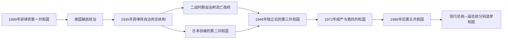

# 菲律宾国家元首与副总统表

## 说明

本表把第一共和国、美国主权下的自治邦、日占第二共和国和独立共和国放在同一时间轴中。1943—1945年劳雷尔政权与奎松—奥斯梅尼亚的流亡自治邦并存，不应排成无重叠的单线继承。总统序号沿用菲律宾通行的17任计法，殖民总督不纳入总统序列。

## 国家元首制度演变图

表中同时保留国际承认程度不同的革命政府、自治邦流亡政府和占领期政权，以呈现“谁具有法定职位”与“谁实际控制领土”可能分离的情形。副总统另表列出空缺、继任和职位中断。

## 总统与并行国家元首

| 顺序 | 总统 | 任期 | 政体／政治基础 | 继任关系与关键事项 |
|---|---|---|---|---|
| 1 | 埃米利奥·阿奎纳多（Emilio Aguinaldo） | 1899年1月23日—1901年3月23日 | 菲律宾第一共和国 | 革命政府转为宪政总统；被美军俘获后共和国中央政府瓦解 |
| 2 | 曼努埃尔·L·奎松（Manuel L. Quezon） | 1935年11月15日—1944年8月1日 | 菲律宾自治邦／国民党 | 民选首任自治邦总统；日占后领导流亡政府，任内去世 |
| 3 | 何塞·P·劳雷尔（José P. Laurel） | 1943年10月14日—1945年8月17日 | 日占第二共和国／KALIBAPI | 与流亡自治邦并行；名义总统但受日军支配，日本投降后解散政权 |
| 4 | 塞尔吉奥·奥斯梅尼亚（Sergio Osmeña） | 1944年8月1日—1946年5月28日 | 菲律宾自治邦／国民党 | 以副总统身份继任奎松；随盟军返回菲律宾 |
| 5 | 曼努埃尔·罗哈斯（Manuel Roxas） | 1946年5月28日—1948年4月15日 | 自治邦末任、独立共和国首任／自由党 | 民选；1946年7月4日从自治邦总统转为独立共和国总统，任内去世 |
| 6 | 埃尔皮迪奥·基里诺（Elpidio Quirino） | 1948年4月17日—1953年12月30日 | 第三共和国／自由党 | 罗哈斯逝世两日后以副总统身份宣誓继任，1949年当选完整任期 |
| 7 | 拉蒙·麦格赛赛（Ramon Magsaysay） | 1953年12月30日—1957年3月17日 | 第三共和国／国民党 | 民选；任内空难去世 |
| 8 | 卡洛斯·P·加西亚（Carlos P. Garcia） | 1957年3月18日—1961年12月30日 | 第三共和国／国民党 | 以副总统身份继任，1957年赢得选举 |
| 9 | 迪奥斯达多·马卡帕加尔（Diosdado Macapagal） | 1961年12月30日—1965年12月30日 | 第三共和国／自由党 | 民选；改革汇率与土地政策，确立6月12日为独立日 |
| 10 | 费迪南德·E·马科斯（Ferdinand E. Marcos） | 1965年12月30日—1986年2月25日 | 第三、第四共和国／国民党、KBL | 1965、1969年民选；1972年戒严后建立威权体制，1986年人民力量革命中离境 |
| 11 | 科拉松·C·阿基诺（Corazon C. Aquino） | 1986年2月25日—1992年6月30日 | 民主过渡与第五共和国／UNIDO | 争议性提前选举后由人民力量革命建立新政府，推动1987年宪法 |
| 12 | 菲德尔·V·拉莫斯（Fidel V. Ramos） | 1992年6月30日—1998年6月30日 | 第五共和国／Lakas-NUCD | 民选；联盟治理、经济开放与1996年摩洛民族解放阵线和平协议 |
| 13 | 约瑟夫·埃斯特拉达（Joseph Estrada） | 1998年6月30日—2001年1月20日 | 第五共和国／PMP、LAMMP | 民选；弹劾危机与第二次人民力量运动后离任 |
| 14 | 格洛丽亚·马卡帕加尔－阿罗约（Gloria Macapagal Arroyo） | 2001年1月20日—2010年6月30日 | 第五共和国／Lakas | 以副总统身份继任，2004年当选；任期伴随选举合法性争议与财政改革 |
| 15 | 贝尼格诺·S·阿基诺三世（Benigno S. Aquino III） | 2010年6月30日—2016年6月30日 | 第五共和国／自由党 | 民选；治理改革、经济增长与南海仲裁进程 |
| 16 | 罗德里戈·罗亚·杜特尔特（Rodrigo Roa Duterte） | 2016年6月30日—2022年6月30日 | 第五共和国／PDP–Laban | 民选；禁毒战争、马拉维战事、邦萨摩洛建制与疫情治理 |
| 17 | 费迪南德·罗穆亚尔德斯·马科斯二世（Ferdinand R. Marcos Jr.） | 2022年6月30日—至今（核验至2026年7月） | 第五共和国／PFP | 民选；截至2026年7月仍任总统 |

1948年4月15日罗哈斯逝世，基里诺于4月17日宣誓；这两天属于突发死亡后的继任交接，并非另有获承认的代理总统。1957年麦格赛赛逝世与加西亚宣誓之间也没有另列一位正式代理总统。

## 副总统、空缺与职位中断

| 顺序 | 副总统或状态 | 任期 | 继任与说明 |
|---|---|---|---|
| 1 | 塞尔吉奥·奥斯梅尼亚 | 1935年11月15日—1944年8月1日 | 民选；奎松逝世后继任总统 |
| — | 空缺 | 1944年8月1日—1946年5月28日 | 奥斯梅尼亚继任总统后未补选 |
| 2 | 埃尔皮迪奥·基里诺 | 1946年5月28日—1948年4月17日 | 与罗哈斯一同当选；后继任总统 |
| — | 空缺 | 1948年4月17日—1949年12月30日 | 基里诺继任总统后未即时补缺 |
| 3 | 费尔南多·洛佩斯（第一次） | 1949年12月30日—1953年12月30日 | 与基里诺分别竞选并当选 |
| 4 | 卡洛斯·P·加西亚 | 1953年12月30日—1957年3月18日 | 麦格赛赛逝世后继任总统 |
| — | 空缺 | 1957年3月18日—12月30日 | 加西亚继任总统后至新任就职 |
| 5 | 迪奥斯达多·马卡帕加尔 | 1957年12月30日—1961年12月30日 | 与总统候选人分别选举，后当选总统 |
| 6 | 埃马努埃尔·佩莱斯（Emmanuel Pelaez） | 1961年12月30日—1965年12月30日 | 马卡帕加尔任内副总统 |
| 7 | 费尔南多·洛佩斯（第二阶段） | 1965年12月30日—1972年9月23日 | 马科斯任内副总统；戒严后职位被终止 |
| — | 职位取消／空缺 | 1972年9月23日—1986年2月25日 | 1973年宪法不设副总统；1984年修宪恢复职位但未在1986年前形成公认在任者 |
| 8 | 萨尔瓦多·劳雷尔（Salvador Laurel） | 1986年2月25日—1992年6月30日 | 人民力量革命后与科拉松·阿基诺组成新政府 |
| 9 | 约瑟夫·埃斯特拉达 | 1992年6月30日—1998年6月30日 | 拉莫斯任内副总统，后当选总统 |
| 10 | 格洛丽亚·马卡帕加尔－阿罗约 | 1998年6月30日—2001年1月20日 | 埃斯特拉达离任后继任总统 |
| — | 空缺 | 2001年1月20日—2月7日 | 阿罗约继任总统后的短暂空缺 |
| 11 | 特奥菲斯托·金戈纳二世（Teofisto Guingona Jr.） | 2001年2月7日—2004年6月30日 | 由总统提名、国会确认补缺 |
| 12 | 诺利·德卡斯特罗（Noli de Castro） | 2004年6月30日—2010年6月30日 | 民选 |
| 13 | 杰约马尔·比奈（Jejomar Binay） | 2010年6月30日—2016年6月30日 | 民选 |
| 14 | 莱妮·罗布雷多（Leni Robredo） | 2016年6月30日—2022年6月30日 | 民选 |
| 15 | 萨拉·齐默尔曼·杜特尔特（Sara Z. Duterte） | 2022年6月30日—至今（核验至2026年7月） | 截至2026年7月仍任副总统；众议院已弹劾，参议院审判进行中，尚未因定罪而离职 |

1986年马科斯阵营曾宣告阿图罗·托伦蒂诺（Arturo Tolentino）为副总统；人民力量革命后该结果不获新政府及菲律宾现行官方序列承认，托伦蒂诺也未形成持续的实际副总统任期，因此列为争议主张而不编入正式顺序。

## 现行权力结构（核验至2026年7月）

- 总统与副总统分别由全国直选产生，任期均为六年；总统不得连任，副总统最多连续任两届。两人可能来自不同政治联盟。
- 总统兼国家元首、政府首脑和武装力量统帅；内阁由总统任命，并受宪法、国会预算与监督、司法审查等约束。
- 国会由参议院和众议院组成；司法系统以最高法院为首。
- 菲律宾是单一制共和国，但《地方政府法》向省、市、自治市和 barangay 下放广泛事务；邦萨摩洛穆斯林棉兰老自治区另有议会制自治政府。
- 截至2026年7月，总统为费迪南德·R·马科斯二世，副总统为萨拉·Z·杜特尔特。副总统遭弹劾不等于已经被罢免；只有参议院定罪等法定结果才会终止任职。

## 相关笔记

- 主笔记：[独立后的菲律宾共和国](/%E4%BA%BA%E6%96%87%E7%A7%91%E5%AD%A6/%E5%8E%86%E5%8F%B2/%E4%B8%9C%E5%8D%97%E4%BA%9A/%E8%8F%B2%E5%BE%8B%E5%AE%BE/%E7%8B%AC%E7%AB%8B%E5%90%8E%E7%9A%84%E8%8F%B2%E5%BE%8B%E5%AE%BE%E5%85%B1%E5%92%8C%E5%9B%BD.md)
- 前史：[美国统治与日本占领](/%E4%BA%BA%E6%96%87%E7%A7%91%E5%AD%A6/%E5%8E%86%E5%8F%B2/%E4%B8%9C%E5%8D%97%E4%BA%9A/%E8%8F%B2%E5%BE%8B%E5%AE%BE/%E7%BE%8E%E5%9B%BD%E7%BB%9F%E6%B2%BB%E4%B8%8E%E6%97%A5%E6%9C%AC%E5%8D%A0%E9%A2%86.md)
- 总览：[菲律宾历史](/%E4%BA%BA%E6%96%87%E7%A7%91%E5%AD%A6/%E5%8E%86%E5%8F%B2/%E4%B8%9C%E5%8D%97%E4%BA%9A/%E8%8F%B2%E5%BE%8B%E5%AE%BE/README.md)
