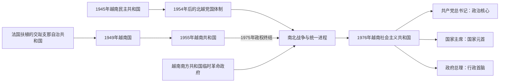

# 1945年以来国家领导人表

## 时间

1945年至今（现任核验截至2026年7月14日）

## 概括

1945年以后越南先后存在越南民主共和国，以及法国扶植的南圻自治共和国、越南临时中央政府、越南国；其后又有越南共和国、越南南方共和国临时革命政府和统一后的越南社会主义共和国。若干政权在同一时期并立或相互不承认，不能把双方领导人混排成一条继承线。

统一后的越南是共产党领导的党国体制：党总书记通常是政治体系的最高领导职位；国家主席承担国家元首、国防与外交礼仪等职责；政府总理主持行政；重大决策由党中央、政治局及国家机构共同执行。个人权力强弱随时期变化，职位表不能等同于全部实际权力。

历史过程见[独立战争、分裂与统一](/%E4%BA%BA%E6%96%87%E7%A7%91%E5%AD%A6/%E5%8E%86%E5%8F%B2/%E4%B8%9C%E5%8D%97%E4%BA%9A/%E8%B6%8A%E5%8D%97/%E7%8B%AC%E7%AB%8B%E6%88%98%E4%BA%89%E3%80%81%E5%88%86%E8%A3%82%E4%B8%8E%E7%BB%9F%E4%B8%80.md)；1945年前后的法国、日本和盟军行政首脑见[法属印度支那与占领期行政首脑表](/%E4%BA%BA%E6%96%87%E7%A7%91%E5%AD%A6/%E5%8E%86%E5%8F%B2/%E4%B8%9C%E5%8D%97%E4%BA%9A/%E8%B6%8A%E5%8D%97/%E6%B3%95%E5%B1%9E%E5%8D%B0%E5%BA%A6%E6%94%AF%E9%82%A3%E4%B8%8E%E5%8D%A0%E9%A2%86%E6%9C%9F%E8%A1%8C%E6%94%BF%E9%A6%96%E8%84%91%E8%A1%A8.md)。

## 国家分合与领导结构图

1945—1976年存在多个并行且国际承认不同的越南政权，不能把它们压成一条无分支的国家元首序列。统一后又需区分共产党最高领导、国家主席和总理三条职位线。

## 越南劳动党 / 越南共产党最高领导

| 顺序 | 最高领导人 | 职位与任期 | 关键说明 |
|---:|---|---|---|
| 1 | **长征（Trường Chinh）** | 总书记，1941-05—1956-10 | 领导革命与抗法时期党务；土地改革错误后辞职。 |
| 2 | **胡志明（Hồ Chí Minh）** | 党主席，1951-02—1969-09；兼总书记，1956-10—1960-09 | 兼国家主席；党主席高于日常书记体系，维持革命联盟与对外权威。 |
| 3 | **黎笋（Lê Duẩn）** | 第一书记 / 总书记，1960-09—1986-07 | 战争后期与统一初期的主要党内领导；1976年职位复称总书记。 |
| 4 | 长征 | 总书记，1986-07—1986-12 | 黎笋逝世后再次任职，推动改革路线进入六大。 |
| 5 | **阮文灵（Nguyễn Văn Linh）** | 总书记，1986-12—1991-06 | 革新开放初期领导人。 |
| 6 | 杜梅（Đỗ Mười） | 总书记，1991-06—1997-12 | 推进市场化并维持一党政治。 |
| 7 | 黎可漂（Lê Khả Phiêu） | 总书记，1997-12—2001-04 | 军队背景突出，任期后由党中央完成更替。 |
| 8 | 农德孟（Nông Đức Mạnh） | 总书记，2001-04—2011-01 | 加入世贸组织和高速增长时期。 |
| 9 | **阮富仲（Nguyễn Phú Trọng）** | 总书记，2011-01—2024-07 | 强化党的纪律、反腐与总书记中心地位；任内去世。 |
| 10 | **苏林（Tô Lâm）** | 总书记，2024-08—至今；2026-01连任 | 2026年4月起兼国家主席，形成党政最高职位合一。 |

总书记由党中央选举，政治局为日常最高决策核心。不能仅按国家主席或总理名单判断实际最高领导人；例如黎笋时期国家主席、总理各有法定职责，但战争与统一战略主要由党内集体在黎笋领导下决定。

## 越南民主共和国与统一国家的国家元首

| 顺序 | 国家元首 | 职位 | 任期 | 关键说明 |
|---:|---|---|---|---|
| 1 | **胡志明** | 临时政府主席；越南民主共和国主席 | 1945-09—1969-09 | 1946年宪制确立国家主席；1945—1955年并兼政府首脑。 |
| — | 黄叔抗（Huỳnh Thúc Kháng） | 代国家主席兼代政府主席 | 1946-05—1946-09 | 胡志明赴法国谈判期间代行。 |
| 2 | **孙德胜（Tôn Đức Thắng）** | 代主席；越南民主共和国主席；统一后国家主席 | 1969-09—1980-03 | 胡志明去世后先代行，1969年9月22日正式当选；1976年统一后继续任职，任内去世。 |
| — | 阮友寿（Nguyễn Hữu Thọ） | 代国家主席 | 1980-03—1981-07 | 原南方临时革命政府咨询委员会主席。 |
| 3 | 长征 | 国务委员会主席 | 1981-07—1987-06 | 1980年宪法下的集体国家元首机构负责人。 |
| 4 | 武志公（Võ Chí Công） | 国务委员会主席 | 1987-06—1992-09 | 革新初期国家元首。 |
| 5 | 黎德英（Lê Đức Anh） | 国家主席 | 1992-09—1997-09 | 1992年宪法恢复国家主席称号。 |
| 6 | 陈德良（Trần Đức Lương） | 国家主席 | 1997-09—2006-06 | 对外关系扩展期。 |
| 7 | 阮明哲（Nguyễn Minh Triết） | 国家主席 | 2006-06—2011-07 | 加入世贸组织时期。 |
| 8 | 张晋创（Trương Tấn Sang） | 国家主席 | 2011-07—2016-04 | 与总书记、总理共同构成高层分工。 |
| 9 | 陈大光（Trần Đại Quang） | 国家主席 | 2016-04—2018-09 | 任内去世。 |
| — | 邓氏玉盛（Đặng Thị Ngọc Thịnh） | 代国家主席 | 2018-09—2018-10 | 副主席依法代理。 |
| 10 | 阮富仲 | 国家主席 | 2018-10—2021-04 | 同时任党总书记。 |
| 11 | 阮春福（Nguyễn Xuân Phúc） | 国家主席 | 2021-04—2023-01 | 辞职后由副主席代理。 |
| — | 武氏映春（Võ Thị Ánh Xuân） | 代国家主席 | 2023-01—2023-03 | 第一次代理。 |
| 12 | 武文赏（Võ Văn Thưởng） | 国家主席 | 2023-03—2024-03 | 辞职。 |
| — | 武氏映春 | 代国家主席 | 2024-03—2024-05 | 第二次代理。 |
| 13 | 苏林 | 国家主席 | 2024-05—2024-10 | 2024年8月起兼总书记，10月将国家主席交梁强。 |
| 14 | 梁强（Lương Cường） | 国家主席 | 2024-10—2026-04 | 十四大后完成换届，卸任国家主席。 |
| 13（复任） | **苏林** | 国家主席 | 2026-04—至今 | 2026年4月7日再次当选，兼党总书记。 |

## 越南民主共和国与统一国家的政府首脑

| 顺序 | 政府首脑 | 职位 | 任期 | 关键说明 |
|---:|---|---|---|---|
| 1 | **胡志明** | 临时政府主席 / 政府主席兼总理 | 1945-08—1955-09 | 兼国家元首；1946年赴法期间由黄叔抗代行。 |
| — | 黄叔抗 | 代政府主席 | 1946-05—1946-09 | 代行期间维持联合政府。 |
| 2 | **范文同（Phạm Văn Đồng）** | 总理；后为部长会议主席 | 1955-09—1987-06 | 跨越北越、统一、计划经济和革新启动，职称于1981年改变。 |
| 3 | 范雄（Phạm Hùng） | 部长会议主席 | 1987-06—1988-03 | 任内去世。 |
| — | 武文杰（Võ Văn Kiệt） | 代部长会议主席 | 1988-03—1988-06 | 代理。 |
| 4 | 杜梅 | 部长会议主席 | 1988-06—1991-08 | 革新初期宏观调整。 |
| 5 | **武文杰** | 部长会议主席 / 总理 | 1991-08—1997-09 | 1992年恢复总理称号，推动基础设施、市场化与对外正常化。 |
| 6 | 潘文凯（Phan Văn Khải） | 总理 | 1997-09—2006-06 | 私营经济与国际整合扩大。 |
| 7 | 阮晋勇（Nguyễn Tấn Dũng） | 总理 | 2006-06—2016-04 | 高增长、国企扩张与金融风险并存。 |
| 8 | 阮春福 | 总理 | 2016-04—2021-04 | 出口制造与行政改革时期。 |
| 9 | 范明政（Phạm Minh Chính） | 总理 | 2021-04—2026-04 | 统筹疫情后恢复、基础设施与政府重组。 |
| 10 | **黎明兴（Lê Minh Hưng）** | 总理 | 2026-04—至今 | 第十六届国会于2026年4月7日选举；主持2026—2031年政府。 |

## 法国扶植的过渡政权（1946—1949年）

法国在重返印度支那后先于南圻建立自治政权，随后又推动覆盖中、北、南三圻的临时中央政府。这些机构与越南民主共和国并立，并受法国高级专员、远东远征军和殖民行政体系制约；南圻政权与临时中央政府在1948—1949年一度重叠，不能理解为一条完全替代的中央政府序列。

### 南圻自治共和国 / 南越临时政府

| 顺序 | 政府首脑 | 任期 | 权力结构与关键说明 |
|---:|---|---|---|
| 1 | 阮文清（Nguyễn Văn Thinh） | 1946-06—1946-11 | 法国支持成立的自治政府首脑；因自治范围、对法关系和统一问题陷入政治困境，任内自杀。 |
| 2 | 黎文划（Lê Văn Hoạch） | 1946-11—1947-09 | 延续南圻自治路线，政权依靠法国军事保护，社会基础有限。 |
| 3 | 阮文春（Nguyễn Văn Xuân） | 1947-10—1948-05 | 军人出身；随后转任越南临时中央政府首脑。 |
| 4 | 陈文友（Trần Văn Hữu） | 1948-05—1949-06 | 在临时中央政府另行运作时主持南圻政府；南圻并入越南国后该政权终止。 |

“政府主席”“总理”等中文译名会随法文公报和后来的名录而异，此处按实际政府首脑排列。1949年的终止日期可按南圻议会表决、法国批准或越南国制度生效等不同节点计算，故以月份表示。

### 越南临时中央政府

| 顺序 | 政府首脑 | 任期 | 权力结构与关键说明 |
|---:|---|---|---|
| 1 | **阮文春** | 1948-05—1949-06 | 在法国支持下组建，名义上谋求统一三圻；国防、外交和财政等主权仍受法国限制。1949年由保大领导的越南国接替，部分行政交接延续至7月。 |

## 越南国（1949—1955年）

### 国家元首

| 顺序 | 国长 | 任期 | 权力结构与备注 |
|---:|---|---|---|
| 1 | **保大（Bảo Đại）** | 1949-06—1955-10 | 法国联邦框架下的越南国国长；保留王朝象征但不是复辟皇帝。1955年4月后其实际影响被总理吴廷琰架空，10月公投后正式被废。 |

### 政府首脑

| 顺序 | 总理 | 任期 | 与国家元首关系及关键说明 |
|---:|---|---|---|
| 1 | 保大 | 1949-06—1950-01 | 国长兼总理。 |
| 2 | 阮潘龙（Nguyễn Phan Long） | 1950-01—1950-04 | 短期文官内阁。 |
| 3 | 陈文友（Trần Văn Hữu） | 1950-05—1952-06 | 兼外交事务，参与对外谈判。 |
| 4 | 阮文心（Nguyễn Văn Tâm） | 1952-06—1953-12 | 强硬反共，依赖法国军事体系。 |
| 5 | 阮福宝禄（Bửu Lộc） | 1954-01—1954-06 | 保大宗室；奠边府与日内瓦会议前夕执政。 |
| 6 | **吴廷琰** | 1954-06—1955-10 | 排除保大及派系对手，公投后转任共和国总统。 |

越南国与法国高级专员同时存在：前者是越南名义国家机构，后者代表法国联邦和远征军体系。两张表相互重叠是主权不完整的表现，不是重复记载。

## 越南共和国（1955—1975年）

### 国家元首

| 顺序 | 国家元首 | 职位与任期 | 实际权力与备注 |
|---:|---|---|---|
| 1 | **吴廷琰** | 总统，1955-10—1963-11 | 个人主义劳动党与吴廷瑈网络掌权；1963年政变中被杀。 |
| 2 | 杨文明（Dương Văn Minh） | 国长，1963-11—1964-08 | 1964年1月后名义留任，实权转入阮庆军政府。 |
| 3 | 阮庆（Nguyễn Khánh） | 国长，1964-08-16—08-27 | 短暂兼名义与实际最高权力。 |
| — | 临时领导委员会 | 1964-08-27—09-08 | 杨文明、阮庆、陈善谦三人集体。 |
| 2（复） | 杨文明 | 国长，1964-09—1964-10 | 再次短期任职。 |
| 4 | 潘克丑（Phan Khắc Sửu） | 国长，1964-10—1965-06 | 文官元首；军方仍能改组政府。 |
| 5 | **阮文绍（Nguyễn Văn Thiệu）** | 国长，1965-06—1967-09；总统，1967-09—1975-04 | 与阮高祺军政组合起家，1967年后以宪制总统长期执政。 |
| 6 | 陈文香（Trần Văn Hương） | 总统，1975-04-21—04-28 | 阮文绍辞职后接任七日。 |
| 2（再任） | **杨文明** | 总统，1975-04-28—04-30 | 试图谈判停火，4月30日宣布投降。 |

### 政府首脑

1955—1963年吴廷琰实行总统制，总统兼掌行政，不另设总理；1963年政变后总理职位恢复。

| 顺序 | 总理 / 行政首脑 | 任期 | 关键说明 |
|---:|---|---|---|
| 1 | 阮玉书（Nguyễn Ngọc Thơ） | 1963-11—1964-02 | 军事革命委员会下的文官总理，权力受军方限制。 |
| 2 | 阮庆 | 1964-02—1964-08 | 军政府强人；同时控制武装力量。 |
| — | 阮春莹（Nguyễn Xuân Oánh） | 1964-08—1964-09代总理 | 第一次代理。 |
| 2（复） | 阮庆 | 1964-09—1964-11 | 再任。 |
| 3 | 陈文香 | 1964-11—1965-01 | 文官内阁遭军方撤换。 |
| — | 阮春莹 | 1965-01—1965-02代总理 | 第二次代理。 |
| 4 | 潘辉括（Phan Huy Quát） | 1965-02—1965-06 | 文官政府因派系与军方压力瓦解。 |
| 5 | **阮高祺（Nguyễn Cao Kỳ）** | 中央行政委员会主席，1965-06—1967-09 | 实质总理，与阮文绍组成军人领导。 |
| 6 | 阮文禄（Nguyễn Văn Lộc） | 总理，1967-11—1968-05 | 第二共和国初期文官总理。 |
| 3（复） | 陈文香 | 总理，1968-05—1969-08 | 春节攻势后重组政府。 |
| 7 | 陈善谦（Trần Thiện Khiêm） | 总理，1969-08—1975-04 | 阮文绍长期总理，军人背景。 |
| 8 | 阮伯谨（Nguyễn Bá Cẩn） | 总理，1975-04-05—04-25 | 西贡防线崩溃时短暂执政。 |
| 9 | 武文牡（Vũ Văn Mẫu） | 总理，1975-04-28—04-30 | 杨文明最后内阁政府首脑。 |

### 1963—1967年实际军事权力

| 阶段 | 实际军事最高机构 / 人物 | 名义元首 | 说明 |
|---|---|---|---|
| 1963-11—1964-01 | 杨文明、军事革命委员会 | 杨文明 | 军事与国家元首合一。 |
| 1964-01—1964-08 | 阮庆、军事革命委员会 | 杨文明；后阮庆 | 阮庆政变后长期掌军，名义职位多次调整。 |
| 1964-08—1964-10 | 临时领导委员会 | 委员会；后杨文明 | 三将集体但内部竞争持续。 |
| 1964-12—1965-02 | 阮庆、武装力量委员会 | 潘克丑 | 文官内阁受军方制约。 |
| 1965-02—1965-06 | 阮文绍、武装力量委员会 | 潘克丑 | 阮文绍掌军方委员会。 |
| 1965-06—1967-09 | 阮文绍—阮高祺军人组合 | 阮文绍 | 绍任国家元首、祺任行政首脑，军方是政权基础。 |

## 越南南方共和国临时革命政府（1969—1976年）

| 角色 | 领导人 | 任期 | 权力与备注 |
|---|---|---|---|
| 国家元首性质 | **阮友寿** | 咨询委员会主席，1969-06—1976-07 | 对外代表南方革命政权；民族解放阵线领导人。 |
| 政府首脑 | **黄晋发（Huỳnh Tấn Phát）** | 临时革命政府主席，1969-06—1976-07 | 主持政府；1975年后管理南方直至正式统一。 |
| 外交负责人 | 阮氏萍（Nguyễn Thị Bình） | 外交部长，1969—1976年 | 巴黎谈判的重要代表。 |
| 实际党政军事结构 | 越南劳动党南方局、人民军与民族解放阵线 | 1969—1976年 | 临时政府有国家形式，战争战略与军事指挥仍嵌入北方党军体系。 |

## 2026年7月的现任结构

| 角色 | 现任 | 就任时间 | 说明 |
|---|---|---|---|
| 党总书记 | **苏林** | 2024-08；2026-01连任 | 党和政治局最高领导。 |
| 国家主席 | **苏林** | 2026-04再次当选 | 同时兼任总书记、中央军委书记及国防与安全委员会主席。 |
| 政府总理 | **黎明兴** | 2026-04 | 主持第十六届国会任期政府。 |
| 国会主席 | 陈青敏（Trần Thanh Mẫn） | 2024-05；2026年连任 | 主持立法机关。 |
| 书记处常务书记 | 陈锦秀（Trần Cẩm Tú） | 2024-10后 | 负责党务日常协调。 |

## 演变关系

1945年日本投降后，越南民主共和国在河内成立；法国则逐步扶植越南国作为替代合法性。1954年停战后，越南民主共和国控制北方，吴廷琰把越南国改造为越南共和国。南方民族解放阵线及临时革命政府与北方结盟，对抗西贡政权及美国军事介入。1975年越南共和国崩溃，1976年越南民主共和国与越南南方共和国临时革命政府完成国家合并，建立越南社会主义共和国。
