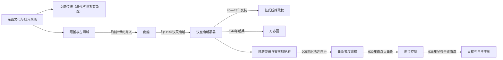

# 北属时期与早期国家

## 时间

约前1千纪—939年

## 概括

越南北部早期历史以红河三角洲为核心。东山文化所见的水稻农业、青铜铸造、河海交通和分层社会，为大型聚落与早期政治组织提供了物质基础；后世史籍把这一传统追溯为文郎国和雄王世系，但其极早年代与逐王名单属于政治记忆，不能直接当作可连续验证的王朝年表。

约前3—前2世纪，古螺城所代表的瓯雒已具有大规模城防、弩机生产与区域动员能力。瓯雒随后并入南越，前111年汉朝灭南越后，红河与中北部沿海被纳入交趾、九真、日南等郡。所谓“北属时期”并非近千年毫无中断的同一种统治：郡县、州、都护府和地方豪族权力多次重组，征氏姐妹、万春国等政权也曾短暂打破帝国控制。唐末中央权力衰弱后，曲氏、杨廷艺等掌握本地军政；938年吴权击败南汉，次年称王，才建立持续至近代的本土王朝主线。

## 年代与史料边界

- **文郎与雄王**：越南传统史学以十八支雄王统治文郎，但早至前3千纪的绝对年代不能由同时代文字证实。“十八”更可能表示十八个支系或时代，而非十八位可逐一核实的个人。
- **瓯雒与古螺**：大型城墙、壕沟、青铜箭镞和作坊证明红河平原在汉征服前已有复杂政治组织；安阳王的具体年代与事件仍需在考古、后出史书和中国记载之间谨慎比对。
- **南越的归属**：南越是以番禺为中心、统合岭南与红河流域的区域王国，不宜简单等同于现代中国或现代越南的民族国家。
- **“千年北属”**：前111—938年是便于概括的长时段框架，中间包含征氏、前李—万春、地方节度使自治等中断或半自治阶段。

## 统治结构与完整统治者表

### 文郎、瓯雒与南越

| 政权 | 统治者 / 世系 | 时间 | 继承关系 | 关键说明 |
|---|---|---|---|---|
| 文郎传统 | 雄王十八支 | 传统叙事起于极早年代，终点约在前3世纪 | 被叙述为父系王统 | 无法还原为十八位可靠个人；保留为国家起源记忆，不制作虚假的逐王精确表。 |
| 瓯雒 | **蜀泮／安阳王** | 约前3—前2世纪 | 兼并或联合瓯越、雒越传统 | 以古螺为中心；为唯一公认君主，具体起讫年有争议。 |
| 南越 | **赵佗／南越武王** | 前203—前137年 | 开国者 | 以番禺为都，扩张至红河流域；在汉帝国与地方王国之间维持自主。 |
| 南越 | 赵眜／文王 | 前137—前122年 | 赵佗之孙 | 墓葬反映岭南多元文化与王权资源。 |
| 南越 | 赵婴齐／明王 | 前122—前113年 | 前王之子 | 与汉朝联系加强，继承矛盾加深。 |
| 南越 | 赵兴／哀王 | 前113—前112年 | 前王幼子 | 太后与汉使推动内附，引发丞相吕嘉政变。 |
| 南越 | 赵建德／术阳王 | 前112—前111年 | 赵兴兄 | 吕嘉拥立；汉军攻破番禺，南越灭亡。 |

### 反抗政权、万春国与唐末自治首领

| 顺序 | 统治者 / 首领 | 掌权时间 | 身份与继承 | 关键事件 / 备注 |
|---:|---|---|---|---|
| 1 | **征侧** | 40—43年 | 起义领袖、自立为王 | 与妹妹征贰共同发动广泛反抗；马援军队恢复汉朝控制。 |
| — | 征贰 | 40—43年 | 征侧之妹、共同行动者 | 通常视为共同领袖，不另造单独王统。 |
| 2 | **李贲／李南帝** | 544—548年 | 万春国建立者 | 反梁建国，采用帝号；败退后去世。 |
| — | 李天宝 | 548—555年 | 李贲兄、并行抵抗领袖 | 在红河上游与今老挝北部一带维持一支抗梁力量，不等于统一统治全境。 |
| 3 | **赵光复／赵越王** | 548—571年 | 李贲部将 | 依托沼泽游击击退梁军；后来与李佛子争权。 |
| 4 | **李佛子／后李南帝** | 555—571年并立；571—602年居优势 | 李氏宗族 | 先承接李天宝一支，后消灭赵越王；602年向隋军投降。 |
| 5 | **曲承裕** | 905—907年 | 地方豪族、静海军节度使 | 借唐末崩解取得实际自治，并获名义任命。 |
| 6 | 曲颢 | 907—917年 | 前任之子 | 调整行政、税役和村社控制，扩大本地治理能力。 |
| 7 | 曲承美 | 917—930年 | 前任之子 | 结好后梁；930年被南汉俘获。 |
| 8 | **杨廷艺** | 931—937年 | 曲氏旧将 | 驱逐南汉驻军，自任节度使；被部将所杀。 |
| 9 | 皎公羡 | 937—938年 | 杨廷艺部将、篡权者 | 杀杨廷艺后向南汉求援；吴权讨杀之。 |
| 10 | **吴权** | 938年起掌权；939—944年称王 | 杨廷艺女婿 | 白藤江击败南汉，完整王统见[独立王朝君主世系表](/%E4%BA%BA%E6%96%87%E7%A7%91%E5%AD%A6/%E5%8E%86%E5%8F%B2/%E4%B8%9C%E5%8D%97%E4%BA%9A/%E8%B6%8A%E5%8D%97/%E7%8B%AC%E7%AB%8B%E7%8E%8B%E6%9C%9D%E5%90%9B%E4%B8%BB%E4%B8%96%E7%B3%BB%E8%A1%A8.md)。 |

梅叔鸾（约722年）与冯兴（8世纪末）都曾形成重要地方反抗，但其称号、控制范围和起讫年有争议，且没有形成可连续验证的稳定世系，因此列为事件领袖而不伪造王表。

## 分阶段过程

### 东山文化、文郎记忆与瓯雒国家

红河、马江和蓝江流域的稻作、青铜鼓及水陆交通连接了山地、三角洲和海岸。古螺三重城垣的工程规模显示统治者能够征发大量劳力，弩机和箭镞作坊则说明军事生产已经集中化。早期国家并非只由后来的京族祖先构成，越、瓯、雒及其他语言文化群体的互动更符合当时实际。

### 南越与汉朝郡县化

赵佗建立南越后，以既有地方首领和来自秦汉的军政人员共同治理岭南。汉朝灭南越并没有立刻把所有村社改造成同质郡县：太守、县令必须依赖雒将、豪族和地方习惯。随着移民、道路、盐铁和税役扩大，帝国行政更深入村社，也引发利益冲突。40年征氏起兵迅速获得多地响应，正反映地方权力仍很强；43年马援以远征军和后勤优势镇压后，汉朝进一步削弱世袭地方首领。

### 六朝、万春与隋唐统治

汉末以后，交州处在中国南方王朝争夺与海上贸易网络之间。士氏家族长期掌权，既维持地方秩序，也接受中原王朝名号。544年李贲建立万春，采用帝号、百官和本地年号；梁军反攻后，赵光复以游击战恢复政权。李佛子最终统一万春余部，却在602年面对隋朝大军时投降。唐朝设置交州总管府、安南都护府和静海军，行政中心仍在红河三角洲，但山区首领、地方豪族与外来官僚始终共同塑造实际统治。

### 唐末自治与白藤江决战

9世纪后期南诏进攻、唐朝财政军事危机和地方军镇化削弱中央。曲承裕不是一次战役“宣布独立”，而是先占据节度使职位，再以唐、后梁名号掩护本地自治。南汉于930年俘获曲承美，却难以稳定控制；杨廷艺次年驱逐驻军。937年皎公羡篡权求援，使南汉获得再度介入的直接机会。吴权先平篡位者，再在白藤江布桩、诱敌并利用潮汐摧毁舰队，把地方自治转化为可延续的王权。

## 重要事件

| 时间 | 事件 | 过程与意义 |
|---|---|---|
| 约前5—前1世纪 | 东山文化发展 | 青铜鼓、稻作、河海交通和聚落分层形成早期国家的物质背景。 |
| 约前3—前2世纪 | 古螺城扩建 | 大型城防与武器生产显示瓯雒具有跨聚落动员能力。 |
| 前2世纪 | 南越控制红河流域 | 岭南与交趾被纳入同一王国，但地方首领仍保有作用。 |
| 前111年 | 汉灭南越 | 设置郡县，红河地区进入中国帝国长期直接或间接统治框架。 |
| 40—43年 | 征氏姐妹起兵 | 多地响应后被马援镇压，成为反抗外来统治与女性政治领导的核心记忆。 |
| 248年 | 赵氏贞起兵 | 九真地区反抗孙吴，显示地方抵抗并未因汉末重组而消失。 |
| 544年 | 李贲建立万春 | 采用帝号与国号，把地方反抗转化为国家建构。 |
| 548—571年 | 赵光复与李氏并立 | 游击抗梁成功后又发生内部战争，暴露联盟型政权的继承弱点。 |
| 602年 | 隋军迫降李佛子 | 万春终结，北方王朝重新建立直接行政。 |
| 679年 | 唐设安南都护府 | “安南”成为长期区域名称，军事都护与州县并行。 |
| 722年前后 | 梅叔鸾起兵 | 联合多地力量反唐，规模很大但年代与盟军构成仍有争议。 |
| 8世纪末 | 冯兴起兵 | 一度控制宋平周边，后人尊称“布盖大王”。 |
| 866年 | 静海军建立 | 高骈收复安南后强化军镇，后来成为地方自主的制度外壳。 |
| 905—907年 | 曲氏取得节度权 | 以名义册封和地方改革实现事实自治。 |
| 930—931年 | 南汉占领与杨廷艺反攻 | 南汉短暂恢复控制，旋即被本地军队驱逐。 |
| 937—938年 | 皎公羡政变与白藤江之战 | 篡位求援触发南汉入侵；吴权击败舰队，终止南汉重建直接统治的企图。 |
| 939年 | 吴权称王 | 以古螺为都，开启独立王朝连续演变。 |

## 崛起、失守与自主形成的原因

- **早期国家形成条件**：红河稻作剩余、铜矿与铸造技术、水路运输和防洪协作，使跨村落征发成为可能；古螺的城防与作坊是比传说年代更可靠的国家化证据。
- **帝国统治能够延续的结构因素**：中国王朝拥有更大的兵员、财政和文字官僚网络；交趾精英通过教育、婚姻和任官进入帝国体系，郡县又能利用原有村社首领降低治理成本。
- **反复起义的内在因素**：税役、官吏侵夺、地方豪族利益与文化习惯冲突，叠加中央王朝更替时的权力真空，给征氏、李贲和唐末军镇自治创造机会。
- **万春失守原因**：政权依赖军事联盟且继承分裂，梁、隋能够集中远征资源；602年隋军压境是直接触发，李佛子投降结束该轮自主。
- **10世纪自主成功条件**：唐末分裂使北方政权无法持续投送大军；曲氏行政改革、地方军队和红河豪族网络已能独立运作。
- **直接决胜过程**：皎公羡求援引来南汉舰队，吴权在其进入内河后利用潮汐与木桩设伏。南汉的海上远征失败，不仅更换统治者，也切断了外部王朝恢复日常郡县统治的现实能力。

## 长期影响

北属时期带来汉字文书、儒家政治语言、佛教与道教传播、郡县制度和跨岭南贸易，但这些要素始终与村社自治、母系痕迹、本地神祇、越语及东南亚海陆网络结合。10世纪以后越南王朝既以帝号、科举和礼制建构“南国”，又在对外关系中接受册封与朝贡名义，这种内称帝、外称王的双层秩序由此形成。

## 演变关系

本页之后进入[独立王朝与南进](/%E4%BA%BA%E6%96%87%E7%A7%91%E5%AD%A6/%E5%8E%86%E5%8F%B2/%E4%B8%9C%E5%8D%97%E4%BA%9A/%E8%B6%8A%E5%8D%97/%E7%8B%AC%E7%AB%8B%E7%8E%8B%E6%9C%9D%E4%B8%8E%E5%8D%97%E8%BF%9B.md)。吴权的胜利建立持续自主的起点，但十二使君割据说明“军事独立”并不自动等于“中央国家完成”；丁部领先后完成统一，才把白藤江胜利转化为较稳定的帝制秩序。
