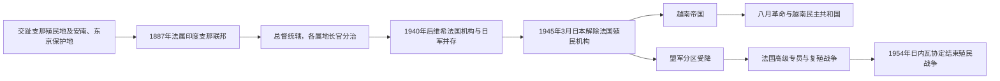

# 法属印度支那与占领期行政首脑表

## 时间

1887—1956年

## 概括

本表区分阮朝皇帝、法国殖民行政、日本军事占领、越南帝国、盟军受降占领和战后法国高级专员。1887年前法国对越南的征服由海军将领、南圻总督、北圻统使与中圻钦使分区推进，并不存在一个覆盖越南三圻的连续最高行政职位；1887年法属印度支那联邦建立后，印度支那总督才成为殖民体系的联邦首脑。

阮朝完整皇帝世系见[阮朝与法属印度支那](/%E4%BA%BA%E6%96%87%E7%A7%91%E5%AD%A6/%E5%8E%86%E5%8F%B2/%E4%B8%9C%E5%8D%97%E4%BA%9A/%E8%B6%8A%E5%8D%97/%E9%98%AE%E6%9C%9D%E4%B8%8E%E6%B3%95%E5%B1%9E%E5%8D%B0%E5%BA%A6%E6%94%AF%E9%82%A3.md)；1945年以后相互竞争的越南政权领导人见[1945年以来国家领导人表](/%E4%BA%BA%E6%96%87%E7%A7%91%E5%AD%A6/%E5%8E%86%E5%8F%B2/%E4%B8%9C%E5%8D%97%E4%BA%9A/%E8%B6%8A%E5%8D%97/1945%E5%B9%B4%E4%BB%A5%E6%9D%A5%E5%9B%BD%E5%AE%B6%E9%A2%86%E5%AF%BC%E4%BA%BA%E8%A1%A8.md)。

## 殖民、占领与过渡演变图

法属印度支那总督位于联邦层级，越南北、中、南三地又使用不同殖民法理与属地长官；1940—1946年间法方、日本军方、越南政权和盟军受降机构先后并行，必须分层辨认。

## 殖民权力层级

| 层级 / 地区 | 最高职位 | 法理地位 | 实际职权 |
|---|---|---|---|
| 法属印度支那联邦 | 印度支那总督 | 向法国殖民部负责 | 统筹军事、财政、关税、公共工程与各地殖民官僚，是联邦实际最高行政首脑。 |
| 南圻 | 南圻总督 | 法国殖民地 | 直接管理行政、土地、警察与殖民议会；阮朝皇帝对南圻无统治权。 |
| 中圻 | 中圻钦使 | 名义上的阮朝保护国 | 驻顺化监督皇帝和机密院，控制外交、财政和重要任免。 |
| 北圻 | 北圻统使 | 名义上的阮朝保护国 | 控制河内及北部行政，阮朝名义权威极弱。 |
| 阮朝宫廷 | 皇帝、机密院及尚书 | 中圻保护国的本地王室机构 | 保留礼仪、部分司法与地方行政；实权随时期与人物而变。 |
| 1940—1945年 | 法国总督与日本驻军并存 | 法国殖民机构受日本军事制约 | 日本掌战略与驻军，维希法国官僚继续日常统治，直至1945年3月政变。 |

## 法属印度支那总督

下表按实际履职时间排列，代理者也列入。标为“代行”的任期常与正式总督外出时间重叠，不能误读为一次政权更替。

| 顺序 | 行政首脑 | 任期 | 性质与关键说明 |
|---:|---|---|---|
| 1 | Jean Antoine Ernest Constans | 1887-11—1888-04 | 临时总督；法属印度支那联邦初建。 |
| 2 | Étienne Richaud | 1888-04—1889-05 | 初期为代理，后正式履职。 |
| 3 | Georges Jules Piquet | 1889-05—1891-04 | 推进联邦行政整合。 |
| — | François Marie Léon Bideau | 1891-04—1891-06 | 代理。 |
| 4 | Jean Marie Antoine de Lanessan | 1891-06—1894-12 | 调整军政关系，试图更多借助本地官僚。 |
| — | Léon Chavassieux | 1894-03—1894-10 | 在兰内桑离任期间代行。 |
| — | François Pierre Rodier | 1894-12—1895-03 | 代理。 |
| 5 | Paul Armand Rousseau | 1895-03—1896-12 | 强化财政与殖民行政。 |
| — | Paul Fourès | 1895-10—1896-03；1896-12—1897-02 | 两次代行。 |
| 6 | **Paul Doumer** | 1897-02—1902-03 | 建立集中财政、关税与大型铁路工程，殖民国家汲取能力显著增强。 |
| — | Paul Fourès | 1898-09—1899-01 | 代行杜美职务。 |
| — | Édouard Broni | 1901-02—1901-08；1902-03—1902-10 | 两次代行。 |
| 7 | Paul Beau | 1902-10—1908-02 | 推进教育及行政改革，同时维持殖民等级。 |
| — | Louis Bonhoure | 1908-02—1908-09 | 代理。 |
| 8 | Antony Klobukowski | 1908-09—1911-02 | 面对维新运动余波与税役反抗。 |
| — | Albert Picquié | 1910-01—1910-06 | 代行。 |
| — | Paul Louis Luce | 1911-02—1911-11 | 代理。 |
| 9 | **Albert Sarraut** | 1911-11—1913-11 | 第一次任期；主张“联合”话语，殖民政治权利仍极有限。 |
| — | Joost van Vollenhoven | 1913-11—1915-03 | 代理。 |
| 10 | Ernest Roume | 1915-03—1916-05 | 第一次世界大战期间征募兵员、劳工与物资。 |
| — | Eugène Charles | 1916-05—1917-01 | 代理。 |
| 11 | **Albert Sarraut** | 1917-01—1919-12 | 第二次任期；扩大基础设施与教育，同时加重战时动员。 |
| — | Maurice Monguillot | 1919-05—1920-02 | 在任总督外出期间代行。 |
| 12 | Maurice Long | 1920-02—1922-04 | 战后殖民调整。 |
| — | Joseph Le Gallen | 1920-11—1921-03 | 代行。 |
| — | François Baudouin | 1922-04—1923-08 | 代理。 |
| 13 | Martial Merlin | 1923-08—1925-04 | 任内遭反殖民者刺杀未遂。 |
| — | Maurice Monguillot | 1925-04—1925-11 | 代理。 |
| 14 | Alexandre Varenne | 1925-11—1928-08 | 提出有限改革，未改变殖民主权结构。 |
| — | Pierre Pasquier | 1926-10—1927-05 | 代行，后任正式总督。 |
| — | Maurice Monguillot | 1927-11—1928-08 | 代行。 |
| — | Eugène Robert | 1928-08—1928-12 | 代理。 |
| 15 | **Pierre Pasquier** | 1928-12—1934-01 | 任期跨越经济危机、安沛兵变与乂静苏维埃运动，镇压与有限改良并行。 |
| — | Eugène Robert | 1930-12—1931-06 | 代行。 |
| — | Maurice Graffeuil | 1934-01—1934-07 | 代理。 |
| — | Eugène Robert | 1934-07—1936-09 | 代理。 |
| — | Achille Silvestre | 1936-09—1937-01 | 代理。 |
| 16 | Joseph-Jules Brévié | 1937-01—1939-08 | 人民阵线后期至欧洲战争前夕。 |
| 17 | Georges Catroux | 1939-08—1940-06 | 代理总督；法国战败与日本压力下被撤换。 |
| 18 | **Jean Decoux** | 1940-06—1945-03 | 维希政府任命；在日军驻扎下保留法国日常行政，1945年3月被日军政变解除权力。 |

## 日本军事占领、越南帝国与盟军受降

| 政权 / 控制区 | 最高负责人 | 任期 | 角色与实际权力 |
|---|---|---|---|
| 日本驻印度支那军 | **土桥勇逸（Yuitsu Tsuchihashi）** | 1945-03—1945-08 | 日军第38军司令，3月政变后为事实上的印度支那军事最高负责人。 |
| 日本占领行政 | 塚本毅（Takeshi Tsukamoto） | 1945-03—1945-08 | 在土桥名下代行部分总督职能。 |
| 越南帝国 | 保大帝 | 1945-03—1945-08 | 宣布废除法国保护关系；国家元首，军事与对外空间受日本制约。 |
| 越南帝国内阁 | **陈仲金** | 1945-04—1945-08 | 内阁总长；接收部分行政、推动国语与名义统一，但缺少独立军队和稳固财政。 |
| 北纬16度以北盟军受降区 | 卢汉 | 1945-09—1946-05 | 中华民国军队负责人；任务为接受日军投降，实际影响北部政治与补给。 |
| 北纬16度以南盟军受降区 | Douglas Gracey | 1945-09—1946-03 | 英印军负责人；允许法国军队恢复行动，改变南部权力平衡。 |

1945年3月至8月，日军并未把全部日常行政直接改造成日本文官殖民政府，而是以军事统制支配保大—陈仲金政权。8月日本投降后，越盟发动革命；盟军随后按战区进入受降，形成北部中华民国军、南部英军—法军与越南民主共和国相互重叠的局面。

## 战后法国高级专员与总专员

| 顺序 | 法国代表 | 任期 | 职位与关键说明 |
|---:|---|---|---|
| — | Jean Cédile | 1945-09—1945-10 | 西贡地区临时高级专员。 |
| — | Philippe Leclerc de Hauteclocque | 1945-10 | 临时代行，兼远征军指挥。 |
| 1 | **Georges Thierry d'Argenlieu** | 1945-11—1947-03 | 印度支那高级专员；支持建立南圻自治安排，与越南民主共和国谈判破裂。 |
| 2 | Émile Bollaert | 1947-03—1948-10 | 推进以保大为核心的替代政权方案。 |
| 3 | Léon Pignon | 1948-10—1950-12 | 法国联邦框架下承认越南国，但法国仍掌关键军事与财政权。 |
| 4 | **Jean de Lattre de Tassigny** | 1950-12—1952-01 | 兼高级专员与远征军总司令，强化军事防线。 |
| 5 | Raoul Salan | 1952-01—1952-04 | 短期代理高级专员。 |
| 6 | Jean Letourneau | 1952-04—1953-07 | 先任高级专员，1953年4月改称总专员。 |
| 7 | Maurice Dejean | 1953-07—1954-06 | 奠边府战役与日内瓦会议前夕的法国最高文职代表。 |
| 8 | Paul Ély | 1954-06—1955-04 | 日内瓦停战及法国撤军过渡期。 |
| 9 | Henri Hoppenot | 1955-04—1956-07 | 法国在印度支那总专员的末任；职位随殖民联邦解体而撤销。 |

## 关键辨析

- **阮朝没有在1884年立即“灭亡”**：皇帝世系延续至1945年，但国家主权被分层剥夺。南圻是殖民地，中圻、北圻是保护国，三者不能用一个法律身份概括。
- **总督不等于越南国家元首**：总督管理整个法属印度支那，范围还包括柬埔寨、老挝及一度的广州湾；阮朝皇帝仅保留越南中圻名义王权。
- **日本进入不等于法国行政立即消失**：1940—1945年3月是日本军事优势与法国殖民官僚并存；3月政变才摧毁法国行政链。
- **1945—1946年存在多重主权主张**：越南民主共和国、越南帝国余波、盟军受降机构和法国重返同时存在，不能把某一张任职表误当作全国唯一实际控制。
- **1949年的越南国不是完全独立共和国**：保大为国长，法国联邦仍控制重要军事与财政；其领导表收录在[1945年以来国家领导人表](/%E4%BA%BA%E6%96%87%E7%A7%91%E5%AD%A6/%E5%8E%86%E5%8F%B2/%E4%B8%9C%E5%8D%97%E4%BA%9A/%E8%B6%8A%E5%8D%97/1945%E5%B9%B4%E4%BB%A5%E6%9D%A5%E5%9B%BD%E5%AE%B6%E9%A2%86%E5%AF%BC%E4%BA%BA%E8%A1%A8.md)。

## 演变关系

本表服务于[阮朝与法属印度支那](/%E4%BA%BA%E6%96%87%E7%A7%91%E5%AD%A6/%E5%8E%86%E5%8F%B2/%E4%B8%9C%E5%8D%97%E4%BA%9A/%E8%B6%8A%E5%8D%97/%E9%98%AE%E6%9C%9D%E4%B8%8E%E6%B3%95%E5%B1%9E%E5%8D%B0%E5%BA%A6%E6%94%AF%E9%82%A3.md)和[独立战争、分裂与统一](/%E4%BA%BA%E6%96%87%E7%A7%91%E5%AD%A6/%E5%8E%86%E5%8F%B2/%E4%B8%9C%E5%8D%97%E4%BA%9A/%E8%B6%8A%E5%8D%97/%E7%8B%AC%E7%AB%8B%E6%88%98%E4%BA%89%E3%80%81%E5%88%86%E8%A3%82%E4%B8%8E%E7%BB%9F%E4%B8%80.md)。殖民行政的终止不是1945年一次性完成：日本政变结束旧总督体系，八月革命建立共和国，法国重返又引发1946—1954年战争；日内瓦停战和法国机构逐步撤出才完成制度性终结。
