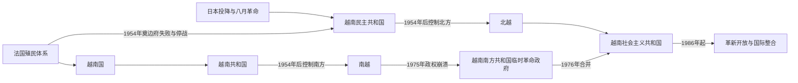

# 独立战争、分裂与统一

## 时间

1945年至今（现代部分核验截至2026年7月14日）

## 概括

1945年八月革命后，胡志明宣布越南民主共和国成立，但盟军受降、法国重返和各政治派别竞争使独立并未立即稳固。1946—1954年第一次印度支那战争以法国在奠边府失败和日内瓦停战结束。北纬17度附近只是临时军事分界线，不是原定永久国界；全国选举没有举行，北方越南民主共和国与南方越南共和国逐渐成为敌对国家。

南方革命力量、北越、南越、美国及其盟国的战争不断升级，并波及老挝和柬埔寨。1973年美军撤离后，双方继续交战；1975年南越政权崩溃，1976年越南民主共和国与越南南方共和国临时革命政府完成国家合并。统一后的计划经济、边境战争与国际孤立造成严重危机，1986年革新开放把经济逐步转向社会主义定向市场体制。至2026年，越南仍由共产党领导，同时已成为出口制造、区域外交与全球供应链的重要参与者。

## 建立背景

- 日本1945年3月政变摧毁法国殖民行政，却没有建立足以覆盖全国的稳定替代体系；8月投降又造成第二次权力真空。
- 越盟以反日、救荒、民族独立和基层组织积累政治优势，能在盟军大规模进入前夺取多数省城。
- 北部中华民国军、南部英印军进入受降，法国军队在南部恢复武装；行政首脑与重叠控制见[法属印度支那与占领期行政首脑表](/%E4%BA%BA%E6%96%87%E7%A7%91%E5%AD%A6/%E5%8E%86%E5%8F%B2/%E4%B8%9C%E5%8D%97%E4%BA%9A/%E8%B6%8A%E5%8D%97/%E6%B3%95%E5%B1%9E%E5%8D%B0%E5%BA%A6%E6%94%AF%E9%82%A3%E4%B8%8E%E5%8D%A0%E9%A2%86%E6%9C%9F%E8%A1%8C%E6%94%BF%E9%A6%96%E8%84%91%E8%A1%A8.md)。
- 法国试图在联邦框架内恢复战略、经济和殖民权益，同时先后扶植南圻自治政权、保大领导的越南国，以竞争“谁代表越南”。
- 1949年中华人民共和国成立后，越南民主共和国获得更稳定的边境援助；法国远征军则越来越依赖美国经费与装备，战争由殖民复归扩大为冷战前线。

## 主要政治阶段与权力结构

| 阶段 | 时间 | 国家元首 / 政府首脑 | 实际权力结构 |
|---|---|---|---|
| 越南民主共和国与抗法战争 | 1945—1954年 | 胡志明兼国家主席与早期政府首脑；1955年后范文同任总理 | 越盟、印度支那共产党 / 越南劳动党、政府与人民军共同动员；战争中党军组织权重上升。 |
| 法国联邦下的越南国 | 1949—1955年 | 保大任国长；总理多次更替 | 法国高级专员与远征军控制关键军事财政，越南国政府争取逐步移交权力。 |
| 北越 | 1954—1976年 | 胡志明、孙德胜任国家主席；范文同任总理 | 越南劳动党中央、政治局与军队决定战争和建设主线；黎笋1960年后为党内主要领导。 |
| 越南共和国 | 1955—1975年 | 吴廷琰、军政府、阮文绍等先后任元首；总理与行政委员会多次重组 | 总统、军方、政党派系、宗教和地方网络并存，美国援助与顾问深度影响国家能力。 |
| 南方临时革命政府 | 1969—1976年 | 阮友寿任咨询委员会主席；黄晋发任政府主席 | 具有独立外交与政府形式，战略、军队和后勤与北方党军体系紧密结合。 |
| 统一与计划经济 | 1976—1986年 | 国家主席 / 国务委员会主席与部长会议主席分工 | 越南共产党一党领导；中央计划、国有和集体经济为主。 |
| 革新开放与国际整合 | 1986年至今 | 总书记、国家主席、政府总理、国会主席分工 | 党领导不变，政治局集体决策；市场、私营与外资经济扩大，国家仍控制关键部门。 |

各时期完整的国家元首、政府首脑、代任者、南方军政结构及党总书记顺序见[1945年以来国家领导人表](/%E4%BA%BA%E6%96%87%E7%A7%91%E5%AD%A6/%E5%8E%86%E5%8F%B2/%E4%B8%9C%E5%8D%97%E4%BA%9A/%E8%B6%8A%E5%8D%97/1945%E5%B9%B4%E4%BB%A5%E6%9D%A5%E5%9B%BD%E5%AE%B6%E9%A2%86%E5%AF%BC%E4%BA%BA%E8%A1%A8.md)。

## 分阶段过程

### 1945—1946年：独立宣言、谈判与战争爆发

1945年9月2日胡志明宣布独立，新政府同时面对饥荒余波、财政枯竭、武装派别和盟军占领。越盟与越南国民党、越南革命同盟会等组成过渡联盟，并以协议促使北部中华民国军撤出。南部英军解除日军武装时重新武装部分法国人员，法越冲突很快爆发。

1946年3月越法初步协定承认越南民主共和国为法国联邦内的“自由国家”，法军得以替换北部中华民国军；双方对南圻归属、主权和军队问题解释相反。枫丹白露谈判失败，海防冲突与河内紧张升级。12月河内战斗标志全国战争全面开始，政府转入越北山区。

### 1946—1954年：第一次印度支那战争

战争前期法国控制主要城市、交通线和红河平原据点，越盟以农村根据地、游击战和政治动员保存力量。法国建立越南国，试图把战争“越南化”；越南民主共和国则以土地、税粮、民族统一和党组织扩大动员。

1950年边界战役打通中越边境后，越军获得更多武器和训练，转向较大规模正规战。法国在红河三角洲构筑防线，美国承担越来越多战争费用。1953年纳瓦计划试图以机动兵团夺回主动，法军把奠边府建成空运据点；越军以道路、人力运输、炮兵阵地和围攻切断补给，1954年5月迫其投降。日内瓦协议规定停火、部队集结和临时军事分界，并提出1956年协商全国选举，但越南国和美国没有签署最后宣言，南北互不信任使选举未举行。

### 1954—1963年：南北国家形成

北方进行土地改革、纠偏、合作化和工业建设。土地改革打击地主权力并扩大农村动员，也发生错划、过度暴力和社会创伤；1956年后公开纠偏。国家依赖苏联、中国援助，同时把南方革命视为统一任务。

南方吴廷琰在美国支持下排除平川派武装，削弱高台教、和好教军事力量，1955年公投废保大并成立共和国。土地、村社安全、天主教移民、反共清洗与政治集权重塑南方。1959—1960年北方支持武装斗争升级，南方民族解放阵线成立。战略村计划、宗教冲突和吴廷瑈家族政治削弱政府联盟，1963年军人政变推翻吴廷琰。

### 1963—1968年：军政府动荡与美国战争升级

1963—1965年南越多次政变，杨文明、阮庆、潘克丑、阮文绍—阮高祺等相继掌权，名义元首、总理和实际军方领袖常不一致。北越经老挝通道扩大人员与物资南运，南方革命力量攻击农村政权和军事目标。

1964年北部湾事件后，美国国会授权扩大军事行动；1965年“滚雷”轰炸和美军地面作战使战争国际化。美国火力能在战术上造成巨大损失，却难以永久控制人口与交通网络；北越则以防空、分散工业和持续补员维持战争。1968年春节攻势在军事上令北越与南方革命力量损失惨重，但其城市突击冲击了美国关于战争进展的叙述，成为美国国内政治和谈判策略的转折点。

### 1969—1975年：越南化、巴黎协定与南越崩溃

尼克松政府推行“战争越南化”，撤回美军并扩大对南越军的装备，同时轰炸老挝、柬埔寨交通线。1972年北越发动复活节攻势，南越军在美国空中支援下守住多数关键城市；同年底大规模轰炸与秘密谈判并行。1973年巴黎协定规定停火、释放战俘和美军撤出，却允许北越部队留在南方，政治安排未能执行。

停火后双方都争夺地盘。美国国内限制再次大规模出兵，援助下降；南越面临燃料、弹药、财政和军心压力。北越在1974—1975年判断美国不会重新介入，先攻福隆，再发动春季攻势。邦美蜀失守后，南越从高原和中部撤退失序，防线连锁崩溃。4月30日杨文明政府投降，战争结束。

### 1975—1986年：统一、重建与边境战争

1976年国会宣布成立越南社会主义共和国，西贡改名胡志明市。国家在南方推进国有化、农业集体化、人口迁移和对旧军政人员的改造学习；战争破坏、制度急转、贸易中断与管理失误造成物资短缺，大量人员经海路或陆路外迁。

红色高棉越境袭击不断升级，越南1978年底进入柬埔寨并推翻民主柬埔寨政权，此后驻军至1989年。中越关系因柬埔寨、华侨、苏越结盟和边界争端恶化，1979年中国发动边境战争，边境冲突延续多年。美国禁运、中国对抗和多数西方国家的外交压力加剧孤立，苏联援助难以抵消计划经济低效。

### 1986年至今：革新开放、正常化与制度延续

1986年越共六大启动革新开放，承认多种经济成分，放松价格与农业统购，扩大外资和出口生产。家庭承包提高农业产出，私营与外资制造业成长；高通胀、国企改革、土地权利和地区差距仍是长期问题。

越南1989年撤出柬埔寨，1991年与中国关系正常化，1995年加入东盟并与美国建交，2007年加入世界贸易组织。此后通过多边与大国平衡拓展贸易和安全合作，同时在南海主权、对华经贸依赖、供应链升级和气候风险之间保持“竹子外交”。

2011年后反腐与党纪整顿强化，高层人事更替加快。2024年阮富仲去世后苏林出任总书记；2026年1月十四大连任，4月又当选国家主席。黎明兴于2026年4月7日当选总理。党总书记兼国家主席强化最高层协调，但政府、国会、政治局和书记处仍各有制度职责。

## 重要事件

| 时间 | 事件 | 过程、结果与长期影响 |
|---|---|---|
| 1945年8—9月 | 八月革命与独立宣言 | 越盟夺取主要行政中心，越南民主共和国成立。 |
| 1946年3月 | 越法初步协定 | 以法国承认“自由国家”换取军队安排，核心主权争议未解。 |
| 1946年11—12月 | 海防冲突与河内开战 | 谈判破裂，第一次印度支那战争全面爆发。 |
| 1949年 | 越南国成立 | 法国扶植保大政府，与越南民主共和国竞争国家代表权。 |
| 1950年 | 边界战役 | 越盟打通中越边境，正规战和外援规模上升。 |
| 1954年5月 | 奠边府战役 | 法军据点群投降，法国缺乏继续大规模战争的政治条件。 |
| 1954年7月 | 日内瓦停战 | 北纬17度附近成为临时军事分界，人口和军队大规模迁移。 |
| 1955年 | 越南共和国成立 | 吴廷琰公投废保大，南方国家体制转为共和国。 |
| 1959—1960年 | 南方武装斗争升级、民族解放阵线成立 | 内战与北方介入进一步制度化。 |
| 1963年 | 佛教危机与军事政变 | 吴廷琰被推翻，南越进入两年频繁军政更替。 |
| 1964年 | 北部湾事件 | 美国获得扩大军事行动的国内授权。 |
| 1965年 | 美军地面部队大规模进入 | 战争升级为高度国际化的常规与反游击复合战争。 |
| 1968年 | 春节攻势 | 攻方损失重大，却改变美国公众与政治精英对胜利前景的判断。 |
| 1969年 | 南方临时革命政府成立 | 革命阵营获得独立政府和谈判代表形式。 |
| 1972年 | 复活节攻势与大规模轰炸 | 双方检验越南化能力，谈判压力上升。 |
| 1973年1月 | 巴黎和平协定 | 美军撤出，停火与政治条款未能稳定落实。 |
| 1975年3—4月 | 春季攻势与西贡陷落 | 南越防线连锁崩溃，4月30日政府投降。 |
| 1976年7月 | 越南社会主义共和国成立 | 南北国家机构合并，首都设河内。 |
| 1978—1979年 | 柬埔寨战争与中越战争 | 越南陷入长期边境安全和外交孤立。 |
| 1986年12月 | 越共六大 | 革新开放成为正式国家路线。 |
| 1989—1991年 | 撤出柬埔寨、对华正常化 | 地区孤立开始缓解。 |
| 1995年 | 加入东盟、越美建交 | 战后国际整合的重要转折。 |
| 2007年 | 加入世界贸易组织 | 出口制造与外资网络进一步扩大。 |
| 2011年后 | 党纪与反腐加强 | 总书记和中央纪律机构作用上升，高层人事更替更频繁。 |
| 2024年 | 阮富仲去世、苏林出任总书记 | 最高领导完成非党代会期间交接。 |
| 2026年1—4月 | 十四大与国家换届 | 苏林连任总书记并兼国家主席，黎明兴任总理。 |

## 战争胜负与政权转型原因

### 第一次印度支那战争

- **越盟的结构优势**：农村基层组织、政治动员、分散后勤和从游击到正规战的渐进转化，使其能承受早期城市与交通线失守。
- **法国的结构困境**：远征成本高、国内殖民战争支持有限，越南国的自主性又不足以完全替代法国军队。
- **外部压力**：1949年后中国、苏联援助提高越军正规作战能力；美国援助支撑法国，却也把战争进一步冷战化。
- **直接触发**：法国选择在奠边府建立依赖空运的孤立据点，越军成功运输重炮、构筑战壕并切断机场，1954年5月守军投降。

### 1954—1975年战争

- **北方与革命阵营的持续能力**：一党动员、北方人口与工业后方、胡志明小道、苏中援助及南方地下网络共同维持长期战争。
- **南越的国家能力与弱点**：南越拥有城市经济、军队和美国援助，也存在派系政变、农村治理不均、腐败与对外援依赖。不能把其二十年历史简化为毫无社会基础的“傀儡”。
- **美国战略困境**：压倒性火力可赢得多数大规模战斗，却难以同时解决南越政治合法性、跨境补给和美国国内承受成本。
- **外部转折**：美军撤离、国会限制重新介入和援助减少，使南越失去关键空中、财政与补给保障。
- **直接崩溃过程**：1975年邦美蜀失守后撤军指令和交通拥塞造成中部防线瓦解；北越据此把有限攻势扩大为全国进攻，西贡在数周内陷落。

### 统一后的危机与革新

- **结构因素**：战争破坏、南北制度强制整合、价格扭曲、集体化低效、国企亏损和人口安置共同造成短缺。
- **外部压力**：柬埔寨驻军、中越战争、美国禁运和外交孤立增加军费与贸易成本。
- **改革触发**：地方“破栏”实践、农业产量和通胀危机证明旧体制难以维持；1986年领导更替使渐进市场改革成为正式路线。
- **改革成效来源**：家庭经营、劳动力与教育基础、海外与外资网络、沿海港口和国际贸易协定共同推动增长，而非单一政策即可解释。

## 结果与长期影响

- 1945—1975年的战争实现了在河内领导下的国家统一，也造成大规模军民伤亡、轰炸污染、失踪者和长期离散社群。
- 南北政权都建立了真实的行政、社会和政治网络；统一后的记忆政治长期以“解放”和“战败 / 流亡”两种经验并存。
- 战争扩及老挝、柬埔寨，未爆弹、难民与红色高棉问题使越南史必须置于整个印度支那框架理解。
- 革新开放改善物资供给并推动减贫、城镇化和制造业，但土地征收、劳工权利、环境压力、人口老龄化和区域差距成为新挑战。
- 一党制度保持连续性，经济社会却发生深刻市场化；“社会主义定向市场经济”正是政治连续与经济转型并存的制度表述。
- 对外政策从阵营依附转向多边平衡，在东盟、中美竞争、对华关系和南海争议之间避免单一结盟。

## 演变关系

前接[阮朝与法属印度支那](/%E4%BA%BA%E6%96%87%E7%A7%91%E5%AD%A6/%E5%8E%86%E5%8F%B2/%E4%B8%9C%E5%8D%97%E4%BA%9A/%E8%B6%8A%E5%8D%97/%E9%98%AE%E6%9C%9D%E4%B8%8E%E6%B3%95%E5%B1%9E%E5%8D%B0%E5%BA%A6%E6%94%AF%E9%82%A3.md)。1945年的独立建立了国家主张，1954年停战并未完成政治统一；1975年战争胜负和1976年制度合并才建立今日国家。越南战争也连接[殖民、战争、独立与东盟](/%E4%BA%BA%E6%96%87%E7%A7%91%E5%AD%A6/%E5%8E%86%E5%8F%B2/%E4%B8%9C%E5%8D%97%E4%BA%9A/_%E9%80%9A%E5%8F%B2/%E6%AE%96%E6%B0%91%E3%80%81%E6%88%98%E4%BA%89%E3%80%81%E7%8B%AC%E7%AB%8B%E4%B8%8E%E4%B8%9C%E7%9B%9F.md)所述的地区冷战、难民、边境战争与东盟扩展。
