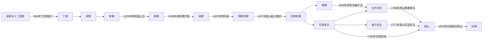

# 独立王朝与南进

## 时间

10—18世纪

## 概括

吴权胜利后，越南经历十二使君割据，丁部领重新统一。李、陈、后黎等王朝以升龙为中心建立官僚国家，同时与宋、元、明保持战争、朝贡和制度交流。人口与政治重心逐渐向南扩展，最终改变占城和湄公河三角洲的格局。

这一时期不是单线王朝更替：16世纪后黎皇帝、北方郑主、南方阮主和莫朝长期并立，18世纪西山三兄弟也分区称王。完整的君主、复位者、短期争议君主与实际统治者顺序见[独立王朝君主世系表](/%E4%BA%BA%E6%96%87%E7%A7%91%E5%AD%A6/%E5%8E%86%E5%8F%B2/%E4%B8%9C%E5%8D%97%E4%BA%9A/%E8%B6%8A%E5%8D%97/%E7%8B%AC%E7%AB%8B%E7%8E%8B%E6%9C%9D%E5%90%9B%E4%B8%BB%E4%B8%96%E7%B3%BB%E8%A1%A8.md)。

## 建立背景与崛起机制

- 唐末以来交趾地方军政首领取得自治，938年吴权在白藤江击败南汉舰队，建立不再由中国王朝直接任命的本地王权。
- 吴朝继承失败导致十二使君割据；丁部领依靠华闾险要地形、军事联盟和婚姻重新统一，建立皇帝名号与中央礼仪。
- 前黎、李、陈通过控制红河三角洲稻作、堤防、户籍和军役扩大国家能力；升龙成为政治、交通和文化中心。
- 科举、儒家官僚、汉字文书与本地村社、佛教寺院并存。制度借鉴中国王朝，但国家形成、王位政治和地方社会具有越南自身发展。
- 后黎复国后以土地、军籍、律法和官僚重建国家；黎圣宗时期中央集权、行政区划和南向扩张达到高峰。
- 16世纪王位危机使莫氏夺权；阮、郑集团以“扶黎”为名恢复后黎，却逐渐把皇帝变为礼仪君主，形成北郑南阮的实际分治。

## 王朝阶段与实际权力结构

| 阶段 | 名义君主 | 实际权力结构 | 特征 |
|---|---|---|---|
| 吴、丁、前黎 | 国王 / 皇帝 | 宗族、将领和地方使君 | 独立重建、统一割据、抵御宋军 |
| 李朝 | 李氏皇帝 | 宫廷、文武官、寺院与地方首领 | 定都升龙，官僚和佛教王权并行 |
| 陈朝 | 陈氏皇帝 | 在位皇帝、太上皇、宗室与将领 | 宗室共治，三次抵御蒙古—元军 |
| 胡朝、明属与复国战争 | 胡氏皇帝；明朝行政 | 改革集团、明军与蓝山起义军先后掌权 | 改革激进、外战失败，后黎复国 |
| 后黎前期 | 黎氏皇帝 | 中央六部、地方承宣与军户 | 15世纪制度化和南进高峰 |
| 南北朝 | 黎、莫两朝并立 | 莫朝控制升龙，阮—郑集团控制清化 | 双方都以正统和对明外交争夺合法性 |
| 郑阮分治 | 后黎皇帝名义统治 | 北方郑主掌军政，南方阮主独立经营 | 1627—1672年长期战争后形成事实边界 |
| 西山时期 | 阮岳、阮惠等分区称帝 | 三兄弟及将领分别控制中、北、南部 | 推翻郑阮、击败外军，统一未能稳定 |

## 重要事件

- 938年吴权在白藤江布置木桩、利用潮汐击败南汉舰队，结束长期北属格局。
- 968年丁部领平定十二使君，建大瞿越；980年黎桓在继承危机中掌权并击退宋军。
- 1010年李太祖迁都升龙，利用红河交通与平原农业建立更稳定中心。
- 1075—1077年李朝先攻宋境、后抵御宋军，战后边界秩序逐步稳定。
- 1225年陈守度主导李昭皇让位，陈朝建立；太上皇制度使王权交接与宗室训练结合。
- 1258、1285、1287—1288年陈朝抵御蒙古—元军，白藤江等战役迫使元军撤退。
- 1400年胡季犛代陈，推行货币、土地和行政改革；1407年明军征服胡朝并直接统治。
- 1418—1427年黎利领导蓝山起义，1428年建立后黎，恢复本地王朝。
- 1471年黎圣宗军队攻破占城毗阇耶，控制今广南以北大片地区，占婆政治中心南移。
- 1527年莫登庸废黎帝；1533年黎氏在清化复立，南北朝战争延续至1592年，莫氏支系在高平又存续至1677年。
- 1558年阮潢出镇顺化，逐渐建立南方阮主政权；1627—1672年郑阮七次主要战争未能消灭对方。
- 17世纪阮主越过原占婆地区，并通过移民、贸易和军事进入高棉势力下的湄公河三角洲。
- 1771年西山起义爆发；1777年旧阮主政权覆灭，1786年郑主被推翻。
- 1785年阮惠在沥涔—吹蔑击败暹罗军；1789年光中帝在玉回—栋多击败援助黎昭统的清军。
- 1792年阮惠早逝后西山内部失去协调，阮福映依靠嘉定、海贸和新式军队逐步反攻，1802年建立阮朝。

## 南进的阶段、机制与影响

| 阶段 | 主要过程 | 结果与影响 |
|---|---|---|
| 李、陈时期 | 通过战争、婚姻与屯田取得今广平、广治及顺化一带 | 越人定居区越过横山；边境仍长期混合 |
| 后黎高峰 | 1471年攻破毗阇耶，把占城北部设为行政区 | 占婆退向潘郎；人口、土地和港口被重新组织 |
| 阮主时期 | 设府县、军屯与移民村，兼并富安、庆和等地 | 占婆剩余政权逐步降为附属，1690年代以后自主性大减 |
| 湄公河三角洲 | 与高棉王室交涉、设商站和税关，吸引越人、华人移民 | 嘉定、边和、河仙等中心形成，高棉对下游控制收缩 |
| 长期社会结果 | 战争、迁徙、通婚、宗教与土地制度并行 | 形成多族群边疆，也造成占族、高棉族土地与政治空间被压缩 |

“南进”不是一项持续八百年的单一国家计划，而是多次战争、逃亡移民、土地开发、港口贸易和地方联盟的累积结果。占族与高棉社会没有因此消失，而是在新政权中以村落、宗教和跨境网络延续。

## 鼎盛与兴衰分析

李、陈国家的稳定来自红河稻作、堤防、村社军役与能够吸纳地方精英的宫廷。继承危机、宗室竞争和地方庄园扩大构成内在压力；陈末财政、灾荒和权臣上升为胡氏夺权创造条件，明朝以“复陈”为名出兵是外部压力，1407年胡军失败则是直接亡国过程。

后黎前期在黎圣宗时达到制度和军事高峰，依赖复国威望、军籍土地、官僚考核及对占城胜利。此后幼主频仍、外戚权臣、土地集中与地方武装削弱皇权；莫登庸掌军政并于1527年废帝是直接改朝节点。

郑阮分治能够长期维持，因为双方分别拥有红河与湄公河—沿海资源、堡垒防线和独立官僚。结构问题是黎帝名实分离、沉重军费、农民负担与继承派系。18世纪饥荒和地方起义形成内压，西山军快速机动作战是直接摧毁旧秩序的力量。西山鼎盛依靠阮惠军事才能与反旧权力动员，衰落则来自三兄弟分区、继承幼弱、持续战争和阮福映的南方财政及海上援助；阮惠1792年去世是关键触发。

## 演变关系

前接[北属时期与早期国家](/%E4%BA%BA%E6%96%87%E7%A7%91%E5%AD%A6/%E5%8E%86%E5%8F%B2/%E4%B8%9C%E5%8D%97%E4%BA%9A/%E8%B6%8A%E5%8D%97/%E5%8C%97%E5%B1%9E%E6%97%B6%E6%9C%9F%E4%B8%8E%E6%97%A9%E6%9C%9F%E5%9B%BD%E5%AE%B6.md)。西山消灭郑、阮旧政权与后黎名义王朝，但未建立稳定继承；阮福映于1802年完成统一，转入[阮朝与法属印度支那](/%E4%BA%BA%E6%96%87%E7%A7%91%E5%AD%A6/%E5%8E%86%E5%8F%B2/%E4%B8%9C%E5%8D%97%E4%BA%9A/%E8%B6%8A%E5%8D%97/%E9%98%AE%E6%9C%9D%E4%B8%8E%E6%B3%95%E5%B1%9E%E5%8D%B0%E5%BA%A6%E6%94%AF%E9%82%A3.md)。
