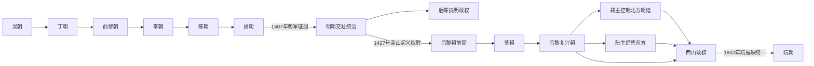

# 独立王朝君主世系表

## 时间

939—1802年

## 概括

本表收录越南独立王朝时期通常承认的皇帝、复位君主、短期篡位者，以及16—18世纪掌握实际军政权的郑主、阮主。并立政权分别列表，不把黎帝、莫帝、郑主与阮主误排成一条王统。详细历史过程见[独立王朝与南进](/%E4%BA%BA%E6%96%87%E7%A7%91%E5%AD%A6/%E5%8E%86%E5%8F%B2/%E4%B8%9C%E5%8D%97%E4%BA%9A/%E8%B6%8A%E5%8D%97/%E7%8B%AC%E7%AB%8B%E7%8E%8B%E6%9C%9D%E4%B8%8E%E5%8D%97%E8%BF%9B.md)。

## 王朝更迭与并立图

图中箭头表示政权承接、征服或击败关系，不等同于简单父子继承。莫朝与后黎复兴朝、郑主与阮主等阶段长期并立，完整统治者顺序和复位情况以下表为准。

## 吴朝、丁朝与前黎朝

| 顺序 | 政权 | 君主 | 在位 | 与前任关系 | 关键事件 / 备注 |
|---|---|---|---|---|---|
| 1 | 吴朝 | **吴权**（Ngô Quyền） | 939—944年 | 开国者 | 白藤江战胜南汉，定都古螺 |
| 2 | 吴朝 | 杨三哥（Dương Tam Kha） | 944—950年 | 吴权姻亲，夺位 | 自立“平王”，被吴昌文推翻 |
| 3 | 吴朝 | 吴昌文（Ngô Xương Văn） | 950—965年 | 吴权之子 | 950年复位王族；951年后与兄共治 |
| 4 | 吴朝 | 吴昌岌（Ngô Xương Ngập） | 951—954年共治 | 吴昌文之兄 | 与弟并称二王 |
| 5 | 丁朝 | **丁先皇／丁部领** | 968—979年 | 统一者 | 平定十二使君，建大瞿越，遇刺 |
| 6 | 丁朝 | 丁废帝 | 979—980年 | 前王幼子 | 六岁即位，黎桓摄政后受禅 |
| 7 | 前黎 | **黎大行／黎桓** | 980—1005年 | 外戚与统帅，受禅 | 击退宋军，进攻占城 |
| 8 | 前黎 | 黎中宗 | 1005年，约三日 | 前王之子 | 兄弟争位中被杀 |
| 9 | 前黎 | 黎龙铤 | 1005—1009年 | 前王之子 | 夺位后统治严酷；死后李公蕴即位 |

## 李朝

| 顺序 | 皇帝 | 在位 | 与前任关系 | 关键事件 / 备注 |
|---|---|---|---|---|
| 1 | **李太祖** | 1009—1028年 | 开国者 | 1010年迁都升龙 |
| 2 | 李太宗 | 1028—1054年 | 前王之子 | 平定王子争位，强化中央并征占城 |
| 3 | 李圣宗 | 1054—1072年 | 前王之子 | 改国号大越，发展文教 |
| 4 | **李仁宗** | 1072—1127年 | 前王之子 | 对宋战争、科举与国子监发展；无子 |
| 5 | 李神宗 | 1127—1138年 | 前王侄孙、养子 | 宗室旁支继位 |
| 6 | 李英宗 | 1138—1175年 | 前王之子 | 幼年即位，权臣与太后政治突出 |
| 7 | 李高宗 | 1175—1210年 | 前王之子 | 宫廷开支、灾荒和地方叛乱加剧 |
| 8 | 李惠宗 | 1210—1224年 | 前王之子 | 陈氏控制宫廷，被迫让位 |
| 9 | **李昭皇** | 1224—1225年 | 前王之女 | 越南少见女皇；让位丈夫陈煚，李朝终结 |

## 陈朝

| 顺序 | 皇帝 | 在位 | 与前任关系 | 关键事件 / 备注 |
|---|---|---|---|---|
| 1 | **陈太宗** | 1225—1258年 | 李昭皇之夫 | 陈守度主导建立王朝；抵御第一次蒙古入侵 |
| 2 | 陈圣宗 | 1258—1278年 | 前王之子 | 禅位后以太上皇参政 |
| 3 | **陈仁宗** | 1278—1293年 | 前王之子 | 领导1285、1287—1288年抗元战争 |
| 4 | 陈英宗 | 1293—1314年 | 前王之子 | 延续太上皇共治与对占城关系 |
| 5 | 陈明宗 | 1314—1329年 | 前王之子 | 宗室政治稳定，后以太上皇长期影响朝政 |
| 6 | 陈宪宗 | 1329—1341年 | 前王之子 | 年轻去世，无子 |
| 7 | 陈裕宗 | 1341—1369年 | 前王之弟 | 晚年奢侈与危机加深，无子 |
| 8 | 杨日礼 | 1369—1370年 | 养入陈氏，争议君主 | 试图恢复本姓，被陈氏宗室推翻 |
| 9 | 陈艺宗 | 1370—1372年 | 陈明宗之子 | 禅位后继续掌权，重用胡季犛 |
| 10 | 陈睿宗 | 1372—1377年 | 前王之弟 | 远征占城战死 |
| 11 | 陈废帝 | 1377—1388年 | 前王之子 | 被太上皇艺宗废杀 |
| 12 | 陈顺宗 | 1388—1398年 | 艺宗幼子 | 受岳父胡季犛控制，被迫禅位后遇害 |
| 13 | 陈少帝 | 1398—1400年 | 前王幼子 | 被外祖父胡季犛废黜 |

## 胡朝、后陈抗明政权

| 顺序 | 政权 | 皇帝 | 在位 | 与前任关系 | 关键事件 / 备注 |
|---|---|---|---|---|---|
| 1 | 胡朝 | **胡季犛** | 1400—1401年 | 外戚与权臣，代陈 | 改国号大虞，推行货币、土地和行政改革 |
| 2 | 胡朝 | 胡汉苍 | 1401—1407年 | 前王之子 | 胡季犛为太上皇；明军入侵后父子被俘 |
| 3 | 后陈 | 简定帝 | 1407—1409年 | 陈氏宗室 | 起兵反明，后与将领冲突被废 |
| 4 | 后陈 | 重光帝 | 1409—1413/1414年 | 陈氏宗室 | 继续抗明，失败被俘；并非恢复统一王朝 |

## 后黎朝前期

| 顺序 | 皇帝 | 在位 | 与前任关系 | 关键事件 / 备注 |
|---|---|---|---|---|
| 1 | **黎太祖／黎利** | 1428—1433年 | 开国者 | 蓝山起义驱逐明军 |
| 2 | 黎太宗 | 1433—1442年 | 前王之子 | 整顿官僚；猝死引发阮廌案 |
| 3 | 黎仁宗 | 1442—1459年 | 前王幼子 | 太后摄政；被兄长宜民政变杀害 |
| 4 | 黎宜民 | 1459—1460年 | 前王庶长子，篡位 | 八个月后被大臣推翻 |
| 5 | **黎圣宗** | 1460—1497年 | 黎太宗之子 | 官僚、律法与行政高峰；1471年大破占城 |
| 6 | 黎宪宗 | 1497—1504年 | 前王之子 | 延续圣宗制度 |
| 7 | 黎肃宗 | 1504年 | 前王之子 | 在位约半年 |
| 8 | 黎威穆帝 | 1505—1509年 | 前王之兄 | 宫廷清洗，遭政变 |
| 9 | 黎襄翼帝 | 1509—1516年 | 黎圣宗之孙 | 徭役与叛乱加剧，被杀 |
| — | 黎光治 | 1516年，约三日 | 王族短期拥立者 | 陈暠之乱中由郑惟岱拥立，旋即被杀；是否列正式帝序有争议。 |
| 10 | 黎昭宗 | 1516—1522年 | 黎圣宗曾孙 | 受军阀控制，逃离升龙后被莫登庸杀害。 |
| — | 黎榜 | 1518—1519年并立 | 黎氏宗室 | 郑绥在昭宗仍在位时另立，控制范围有限；通常不列正式帝序。 |
| — | 黎槱（Lê Do） | 1519年短期并立 | 黎榜之弟 | 郑绥继立，年号天宪，旋败；通常不列正式帝序。 |
| 11 | 黎恭皇 | 1522—1527年 | 前王之弟 | 莫登庸拥立后迫其禅位。 |

## 莫朝与高平延续政权

### 升龙莫朝

| 顺序 | 皇帝 | 在位 | 与前任关系 | 关键事件 / 备注 |
|---|---|---|---|---|
| 1 | **莫太祖／莫登庸** | 1527—1529年 | 权臣，代黎 | 建莫朝；后以太上皇掌权 |
| 2 | 莫太宗／莫登瀛 | 1529—1540年 | 前王之子 | 北部相对稳定；应对黎氏复国 |
| 3 | 莫宪宗／莫福海 | 1540—1546年 | 前王之子 | 南北朝战争扩大 |
| 4 | 莫宣宗／莫福源 | 1546—1561年 | 前王之子 | 幼年即位，权臣辅政 |
| 5 | 莫茂洽 | 1561/1562—1592年 | 前王之子 | 升龙被郑军攻陷后被俘处死 |
| 6 | 莫全 | 1592—1593年 | 前王之子 | 试图恢复主力，战败被杀 |

### 高平莫氏并立支系

| 顺序 | 统治者 | 在位 | 继承关系 | 备注 |
|---|---|---|---|---|
| 1 | 莫敬止 | 1592—1593年 | 莫氏宗室 | 与莫全同时争取残部，败亡 |
| 2 | 莫敬恭 | 1593—1625年 | 莫氏宗室 | 在明朝承认与边疆地形支持下据高平 |
| 3 | 莫敬宽 | 1623—1638年 | 莫氏旁支 | 与莫敬恭末年有短暂重叠，后向后黎称臣 |
| 4 | 莫敬宇 | 1638—1677年 | 前王之子 | 清初形势变化后失去外援，郑军攻灭高平政权 |

## 后黎复兴朝皇帝

后黎皇帝自16世纪末起多为礼仪正统，军政实权由郑主掌握；神宗两次在位应分别记录。

| 顺序 | 皇帝 | 在位 | 与前任关系 | 关键事件 / 备注 |
|---|---|---|---|---|
| 1 | 黎庄宗 | 1533—1548年 | 黎昭宗之子说有争议 | 阮淦拥立，在清化重建黎朝 |
| 2 | 黎中宗 | 1548—1556年 | 前王之子 | 无子，旁支继承 |
| 3 | 黎英宗 | 1556—1573年 | 黎氏旁支 | 与郑松冲突后被杀 |
| 4 | 黎世宗 | 1573—1599年 | 前王之子 | 1592年郑军收复升龙 |
| 5 | 黎敬宗 | 1600—1619年 | 前王之子 | 试图反郑失败，被迫自尽 |
| 6 | **黎神宗** | 1619—1643年 | 前王之子 | 第一次在位；禅位给儿子 |
| 7 | 黎真宗 | 1643—1649年 | 前王之子 | 无子早逝 |
| 8 | **黎神宗（复位）** | 1649—1662年 | 前帝复位 | 越南史上少见父皇复位 |
| 9 | 黎玄宗 | 1662—1671年 | 神宗之子 | 郑柞掌实权；部分旧表以1663年为改元后的纪年起点。 |
| 10 | 黎嘉宗 | 1672—1675年 | 神宗之子 | 在位短暂 |
| 11 | 黎熙宗 | 1675/1676—1705年 | 神宗之子 | 郑主控制下长期在位 |
| 12 | 黎裕宗 | 1705—1729年 | 前王之子 | 禅位后继承争议 |
| 13 | 昏德公／黎维祊 | 1729—1732年 | 前王之子 | 被郑杠废黜并杀害 |
| 14 | 黎纯宗 | 1732—1735年 | 黎熙宗之子 | 在位短暂 |
| 15 | 黎懿宗 | 1735—1740年 | 前王之弟 | 禅位给侄辈 |
| 16 | 黎显宗 | 1740—1786年 | 黎裕宗之子 | 郑主末期与西山进入北方 |
| 17 | **黎昭统** | 1786—1789年 | 前王之孙 | 被西山逐走，求清军援助；清军战败后流亡，后黎终结 |

## 郑主世系

| 顺序 | 郑主 | 掌权时间 | 继承关系 | 关键事件 / 备注 |
|---|---|---|---|---|
| 1 | **郑检** | 1545—1570年 | 阮淦女婿 | 控制黎氏复国军政 |
| 2 | 郑桧 | 1570年 | 前主长子 | 很快降莫 |
| 3 | **郑松** | 1570—1623年 | 前主次子 | 1592年收复升龙，确立郑主制度 |
| 4 | 郑梉 | 1623—1657年 | 前主之子 | 发动多次郑阮战争 |
| 5 | 郑柞 | 1657—1682年 | 前主之子 | 1672年后接受事实分治 |
| 6 | 郑根 | 1682—1709年 | 前主之子 | 整顿北方财政与官僚 |
| 7 | 郑棡 | 1709—1729年 | 前主曾孙 | 推行行政改革 |
| 8 | 郑杠 | 1729—1740年 | 前主之子 | 奢侈与任用宦官，引发反对，被废 |
| 9 | 郑楹 | 1740—1767年 | 前主之弟 | 镇压多起农民叛乱 |
| 10 | 郑森 | 1767—1782年 | 前主之子 | 1774年攻取富春，介入阮主危机 |
| 11 | 郑檊 | 1782年 | 前主幼子 | 在位约两个月，被军变推翻 |
| 12 | 郑楷 | 1782—1786年 | 郑森长子 | 西山军进入升龙后自尽 |
| 13 | 郑槰 | 1786—1787年 | 郑氏旁支 | 短暂恢复主府，遭阮惠迫退 |

## 阮主世系

| 顺序 | 阮主 | 掌权时间 | 继承关系 | 关键事件 / 备注 |
|---|---|---|---|---|
| 1 | **阮潢** | 1558—1613年 | 阮淦之子 | 出镇顺化，建立南方根据地 |
| 2 | 阮福源 | 1613—1635年 | 前主之子 | 拒绝向郑主纳税，完善广南政权 |
| 3 | 阮福澜 | 1635—1648年 | 前主之子 | 郑阮战争持续 |
| 4 | 阮福濒 | 1648—1687年 | 前主之子 | 巩固防线并向占婆、高棉边疆扩展 |
| 5 | 阮福溙／阮福臻 | 1687—1691年 | 前主之子 | 在位短暂 |
| 6 | **阮福淍／阮福周** | 1691—1725年 | 前主之子 | 兼并占婆剩余政治空间，经营南部 |
| 7 | 阮福澍／阮福注 | 1725—1738年 | 前主之子 | 扩展湄公河三角洲影响 |
| 8 | 阮福阔 | 1738—1765年 | 前主之子 | 1744年称王，宫廷与财政规模扩大 |
| 9 | 阮福淳 | 1765—1777年 | 前主侄 / 养嗣 | 权臣张福峦掌政；西山起义中被俘杀 |
| — | 阮福旸 | 1776—1777年并立 | 阮氏宗室 | 被西山控制的短期王位候选人，与阮福淳同时存在 |

## 西山统治者

西山三兄弟分区掌权，阮岳与阮惠一度同时称帝，不能排成普通父子继承表。

| 统治者 | 称号与控制区 | 在位 / 掌权 | 关系 | 关键事件 / 备注 |
|---|---|---|---|---|
| **阮岳** | 泰德帝，中部归仁 | 1778—1793年 | 西山长兄 | 最早称帝；后与阮惠分区，晚年势力收缩 |
| 阮侣 | 东定王，嘉定 | 1786—1787年 | 西山三弟 | 区域王而非皇帝，遭阮福映反攻后退出 |
| **阮惠** | 光中帝，富春及北部 | 1788—1792年 | 西山二弟 | 推翻郑主，击败暹罗与清军；突然去世 |
| 阮光缵 | 景盛帝 | 1792—1802年 | 阮惠之子 | 年幼即位，无法整合西山各支；被阮福映击败 |

## 演变关系

吴、丁、前黎、李、陈、胡与后黎前期大体为依次更替；16世纪以后则是黎—莫并立、黎帝—郑主双层统治及郑阮南北分治。西山同时消灭郑主、旧阮主与后黎，却又形成兄弟分区。1802年阮福映灭西山并建立阮朝，后续见[阮朝与法属印度支那](/%E4%BA%BA%E6%96%87%E7%A7%91%E5%AD%A6/%E5%8E%86%E5%8F%B2/%E4%B8%9C%E5%8D%97%E4%BA%9A/%E8%B6%8A%E5%8D%97/%E9%98%AE%E6%9C%9D%E4%B8%8E%E6%B3%95%E5%B1%9E%E5%8D%B0%E5%BA%A6%E6%94%AF%E9%82%A3.md)。
