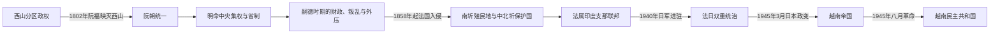

# 阮朝与法属印度支那

## 时间

1802—1945年

## 概括

阮福映依靠嘉定平原的粮税、海运网络、旧阮主支持者和逐步现代化的舰炮力量击败西山，1802年建立阮朝，以顺化为都并统一北、中、南。明命时期省制、六部与儒学官僚达到集中化高峰，同时对占婆故地、高原和柬埔寨的控制引发新的边疆冲突。

法国的征服不是1858年一战即告完成，而是从岘港、嘉定扩展到南圻，再通过北圻战争、条约与中法战争分层剥夺阮朝主权。南圻成为殖民地，中圻和北圻名义上仍由阮朝皇帝统治，实际军事、外交、财政和重要任免受殖民官僚控制。1940年后日军与法国行政并存，1945年3月日本政变终结旧殖民总督体系；八月革命和保大退位则终结阮朝。

## 建立背景与崛起机制

- **南方资源基础**：阮福映控制嘉定和湄公河三角洲后，能够以稻米、税收、华人港商与海上交通维持长期战争。
- **西山内部分裂**：阮岳、阮惠与阮侣分区，阮惠1792年去世后继承者年幼，归仁、富春将领协调恶化。
- **军事与技术吸收**：阮福映使用西式筑城、火炮和舰船，也依靠越南本地工匠与水军传统。法国传教士百多禄曾促成援助计划，但1787年条约未由法国国家完整执行；实际参战者多为个人军官和技术人员。
- **地区外交**：暹罗提供过庇护与援军，阮福映又必须避免成为暹罗附庸，并经营高棉、华南和南海贸易关系。
- **合法性重建**：阮福映宣称继承旧阮主，在统一后采用嘉隆年号、恢复科举礼制并接受清朝册封，以王朝连续性整合战争后的精英。

## 阮朝皇帝完整世系

| 顺序 | 皇帝 / 本名 | 王室 | 年号 | 在位 | 与前任关系 | 关键事件 / 备注 |
|---:|---|---|---|---|---|---|
| 1 | **阮福映（Nguyễn Phúc Ánh）** | 阮福氏 | 嘉隆 | 1802—1820年 | 开国者 | 灭西山、统一全国；定都顺化，重建道路、城防与官僚。 |
| 2 | **阮福胆（Nguyễn Phúc Đảm）** | 阮福氏 | 明命 | 1820—1841年 | 嘉隆第四子 | 废镇设省、强化六部和皇权；1832年取消占族顺城镇自治。 |
| 3 | 阮福绵宗（Nguyễn Phúc Miên Tông） | 阮福氏 | 绍治 | 1841—1847年 | 明命长子 | 延续中央集权；面对传教、海防和法国炮舰压力。 |
| 4 | **阮福洪任（Nguyễn Phúc Hồng Nhậm）** | 阮福氏 | 嗣德 | 1847—1883年 | 绍治次子 | 在位最长；无亲生子，法国征服与继承危机均在末期激化。 |
| 5 | 阮福膺禛（Nguyễn Phúc Ưng Chân） | 阮福氏 | 育德 | 1883年 | 嗣德养子 | 在位三日，被阮文祥、尊室说等权臣废黜，后死于囚禁。 |
| 6 | 阮福洪佚（Nguyễn Phúc Hồng Dật） | 阮福氏 | 协和 | 1883年 | 绍治之子、育德叔 | 在位约四个月；与法国及权臣冲突，被迫服毒。 |
| 7 | 阮福膺登（Nguyễn Phúc Ưng Đăng） | 阮福氏 | 建福 | 1883—1884年 | 嗣德养子 | 少年即位，不足一年去世。 |
| 8 | **阮福膺历（Nguyễn Phúc Ưng Lịch）** | 阮福氏 | 咸宜 | 1884—1885年在位；抗法号召至1888年 | 建福弟 | 1885年出京发布勤王诏；法国另立同庆，咸宜1888年被捕流放。 |
| 9 | 阮福膺祺（Nguyễn Phúc Ưng Kỷ） | 阮福氏 | 同庆 | 1885—1889年 | 咸宜兄 | 法国扶立；与咸宜抗法政权短期并存。 |
| 10 | **阮福宝嶙（Nguyễn Phúc Bửu Lân）** | 阮福氏 | 成泰 | 1889—1907年 | 育德子 | 表现出自主倾向，被法国以失常等理由废黜并流放。 |
| 11 | **阮福永珊（Nguyễn Phúc Vĩnh San）** | 阮福氏 | 维新 | 1907—1916年 | 成泰子 | 参与1916年反法计划，失败后与父亲同被流放。 |
| 12 | 阮福宝嶹（Nguyễn Phúc Bửu Đảo） | 阮福氏 | 启定 | 1916—1925年 | 同庆子 | 与殖民政府合作，皇权礼仪化。 |
| 13 | **阮福永瑞（Nguyễn Phúc Vĩnh Thụy）** | 阮福氏 | 保大 | 1926—1945年 | 启定独子 | 法式教育背景；1945年越南帝国名义元首，八月革命后退位。 |

1885年咸宜离开顺化后继续被抗法力量奉为皇帝，而法国在京城扶立同庆；这是一段名义王统与实际宫廷并存的时期。咸宜被捕并不发生在其法定“在位”终点，故表中分别标明。

## 分阶段发展

### 嘉隆统一与明命中央集权

嘉隆把北城、嘉定城等大区交给重臣管理，以适应新统一国家的交通和军事现实；明命随后逐步撤销这些半自治总镇，1831—1832年把全国改设为省，由中央任命总督、巡抚、布政和按察。六部、都察院、科举与律例强化，皇帝可通过朱批和密折直接控制官员。国家能力的提高也伴随重税、劳役和对地方宗教、族群自治的压缩。

明命在1832年取消占婆最后的顺城镇自治，并在柬埔寨设置镇西城、推行直接化改革。边疆政策扩大阮朝影响，却在占族、高棉人和越南南部官僚之间制造反抗。1833—1835年黎文𠐤起义占据嘉定，既有旧臣争权、宗教与族群不满，也得到暹罗介入。

### 嗣德时期与法国分段征服

1847年法国舰队已在岘港与阮军交火。1858年法西联军进攻岘港受补给、疾病和防御牵制，转攻嘉定后才获得可持续基地。1862年条约割让东部三省，1867年法国又接收西部三省，南圻成为直接殖民地。阮廷仍能统治中北部，并非此时即告灭亡。

1873年与1882年法国军官先后以通商纠纷为由占领河内，均引发清朝支持的黑旗军与越军抵抗。1883、1884年顺化条约确立法国保护权；中法战争和1885年天津条约使清朝放弃传统宗主主张。法国攻入顺化后，尊室说拥咸宜出京并发布勤王诏，法国则保留阮朝宫廷作为保护国合法性工具。

### 法属印度支那的分区统治

1887年法国把南圻、中圻、北圻和柬埔寨组成印度支那联邦，后加入老挝。联邦总督掌财政、关税、铁路和军事；南圻总督、中圻钦使、北圻统使管理三种不同法律地位。完整行政首脑链及代理任期见[法属印度支那与占领期行政首脑表](/%E4%BA%BA%E6%96%87%E7%A7%91%E5%AD%A6/%E5%8E%86%E5%8F%B2/%E4%B8%9C%E5%8D%97%E4%BA%9A/%E8%B6%8A%E5%8D%97/%E6%B3%95%E5%B1%9E%E5%8D%B0%E5%BA%A6%E6%94%AF%E9%82%A3%E4%B8%8E%E5%8D%A0%E9%A2%86%E6%9C%9F%E8%A1%8C%E6%94%BF%E9%A6%96%E8%84%91%E8%A1%A8.md)。

殖民经济修建铁路、港口、煤矿、橡胶园和灌溉系统，把稻米、矿产及劳工纳入世界市场。现代教育、出版、城市职业和跨境交通扩大，同时土地集中、人头税、盐酒鸦片专卖、强制劳役与种族等级造成新的不平等。反殖民政治因而从勤王士绅、维新派发展到越南国民党、共产主义组织、宗教政治力量和工农运动。

### 法日双重统治、饥荒与1945年权力崩解

1940年日本军队进入印度支那后，维希法国总督让出军事基地和战略通行权，却继续征税、警察和文官行政。1944—1945年北部饥荒由歉收、运输破坏、战时征粮、作物政策和行政失灵共同造成，死亡数字只能以大范围估计表述。

1945年3月9日日本发动政变，拘捕法国官员和军队，扶持保大宣布越南帝国。陈仲金内阁尝试接收三圻行政、推广国语和动员救灾，但缺乏独立军队、稳定财政与基层组织。8月日本投降造成权力真空；越盟利用长期组织网络、武装宣传队和地方夺权，迅速控制河内、顺化和多数省份。保大退位，阮朝结束。

## 重要事件

| 时间 | 事件 | 具体过程与影响 |
|---|---|---|
| 1802年 | 阮福映灭西山 | 攻取富春、升龙，建立阮朝并恢复全国王朝秩序。 |
| 1804年 | “越南”国号获清朝承认 | 清廷把阮朝所请“南越”调整为“越南”，形成对外国号。 |
| 1831—1832年 | 废镇设省 | 明命撤北城、嘉定城，建立省级官僚体系。 |
| 1832年 | 顺城镇终结 | 占婆最后自治政体被直接纳入阮朝行政，引发长期族群与宗教反抗。 |
| 1833—1835年 | 黎文𠐤起义 | 嘉定叛乱、天主教与族群力量、暹罗干预相互交织，阮朝艰难镇压。 |
| 1834—1841年 | 镇西城时期 | 阮朝在柬埔寨推行直接统治，因反抗和暹罗竞争最终撤出。 |
| 1847年 | 法舰炮击岘港 | 传教冲突与炮舰外交升级。 |
| 1858—1862年 | 岘港—嘉定战争 | 法西联军从岘港转攻南部；阮朝签约割地。 |
| 1862、1867年 | 南圻六省落入法国 | 法国先获东三省，再接管西三省，建立殖民地。 |
| 1873、1882年 | 两次河内危机 | Francis Garnier、Henri Rivière先后占城并战死，法国仍不断扩大北圻干预。 |
| 1883—1884年 | 顺化条约 | 阮朝接受法国保护，南圻、中圻、北圻主权被分层处理。 |
| 1884—1885年 | 中法战争 | 清军、黑旗军与法军在北圻交战；天津条约确认法国优势。 |
| 1885年 | 顺化失守与勤王诏 | 咸宜出京，士绅和地方武装以“勤王”名义持续抗法。 |
| 1887年 | 法属印度支那成立 | 三圻与柬埔寨纳入联邦，殖民财政和交通开始集中化。 |
| 1895—1913年 | 勤王余波与安世起义 | 潘廷逢失败后，黄花探等仍在北部山区长期抵抗。 |
| 1897—1902年 | 杜美总督改革 | 统一预算、专卖税和大型工程，增强殖民汲取与债务负担。 |
| 1905—1908年 | 东游、东京义塾与抗税 | 维新知识分子尝试海外求援、教育启蒙和社会改革，殖民当局镇压。 |
| 1916年 | 维新帝反法计划 | 计划泄露，维新帝被废并流放。 |
| 1917年 | 太原起义 | 守军与政治犯夺取省城，显示殖民军内部也有裂隙。 |
| 1927—1930年 | 国民党、共产党与群众运动 | 越南国民党成立后发动安沛兵变；印度支那共产党成立，乂静苏维埃运动遭镇压。 |
| 1936—1939年 | 印度支那民主阵线时期 | 法国人民阵线环境下劳工、出版和政治活动短暂扩大。 |
| 1940—1941年 | 日本进驻与越盟成立 | 法日双重统治形成；越盟把民族独立与基层组织结合。 |
| 1944—1945年 | 北部大饥荒 | 战争、征粮、运输中断与歉收共同造成大规模死亡。 |
| 1945年3月 | 日本政变 | 法国殖民行政链被解除武装，越南帝国成立。 |
| 1945年8月 | 八月革命与保大退位 | 越盟夺取主要城市，阮朝和日本扶植政权同时终结。 |

## 鼎盛、衰落与终结分析

### 阮朝早期的鼎盛条件

统一战争结束、南部稻米财政、全国交通恢复、科举官僚和清朝册封共同提供合法性。明命撤销大区总镇、建立省制，使命令能够直接到达地方；对柬埔寨、老挝和占婆故地的扩张则体现军政能力高峰。

### 阮朝衰落的结构因素

- 国家收入依赖农业税、劳役和传统专卖，难以长期负担海防、新式军备、河工及频繁地方战争。
- 省制加强中央控制，也压缩地方妥协空间；占族、高棉人、天主教社群和南部旧臣的不满多次汇合。
- 宫廷政治把异议容易解释为不忠，技术与制度改革缺少持续支持；但“闭关锁国”不足以单独解释失败，阮朝仍有对外贸易和武器采购。
- 嗣德无子造成1883年连续废立，权臣、皇室与法国各自操纵继承，削弱统一指挥。

### 外部压力与直接失权过程

法国拥有蒸汽舰、远程火炮、全球金融和殖民补给网络，并利用传教保护、通商纠纷及地方战争逐段推进。1858年入侵是开端，1862—1867年失去南圻构成财政与战略重创，1883—1885年条约、顺化失守和清朝退出才是保护国最终确立的直接过程。阮朝不是一次战役被“灭”，而是王权在殖民制度中被保留并掏空。

### 殖民统治能够维持的条件

殖民当局以三圻不同法律地位、阮朝礼仪合法性、本地官僚和武装分化反抗者，又通过税收、铁路与城市警察提高控制能力。反殖民力量在复辟、君主立宪、共和民族主义、共产主义和宗教政治之间目标不同，难以长期统一。世界大战改变了这一均衡：法国本土战败削弱威望，日本军事占领侵蚀法国主权，饥荒摧毁治理合法性。

### 1945年的直接终结机制

日本3月政变摧毁法国军警链，却没有建立稳固替代国家；越南帝国时间短、资源少。越盟此前已在山区、农村和城市建立组织，并把救荒、民族独立与武装动员结合。日本8月投降是直接触发，越盟抢在盟军大规模进入前夺取政府，保大退位使阮朝不再成为竞争王统。

## 长期影响

阮朝确定了今日越南大体南北疆域和顺化宫廷文化，明命省制也成为后来行政国家的重要先例。殖民时期则重塑三圻区域认同、土地关系、城市体系、教育语言与跨国经济；铁路、学校和印刷既服务殖民统治，也为民族政治提供网络。1945年以后围绕“谁代表全国”的争议，直接延伸为法国与越南民主共和国战争，以及越南国、越南共和国等竞争政权；其领导链见[1945年以来国家领导人表](/%E4%BA%BA%E6%96%87%E7%A7%91%E5%AD%A6/%E5%8E%86%E5%8F%B2/%E4%B8%9C%E5%8D%97%E4%BA%9A/%E8%B6%8A%E5%8D%97/1945%E5%B9%B4%E4%BB%A5%E6%9D%A5%E5%9B%BD%E5%AE%B6%E9%A2%86%E5%AF%BC%E4%BA%BA%E8%A1%A8.md)。

## 演变关系

前接[独立王朝与南进](/%E4%BA%BA%E6%96%87%E7%A7%91%E5%AD%A6/%E5%8E%86%E5%8F%B2/%E4%B8%9C%E5%8D%97%E4%BA%9A/%E8%B6%8A%E5%8D%97/%E7%8B%AC%E7%AB%8B%E7%8E%8B%E6%9C%9D%E4%B8%8E%E5%8D%97%E8%BF%9B.md)。阮朝统一继承西山结束后的全国政治空间；法国征服把王朝改造成保护国宫廷；日本政变、八月革命与保大退位转入[独立战争、分裂与统一](/%E4%BA%BA%E6%96%87%E7%A7%91%E5%AD%A6/%E5%8E%86%E5%8F%B2/%E4%B8%9C%E5%8D%97%E4%BA%9A/%E8%B6%8A%E5%8D%97/%E7%8B%AC%E7%AB%8B%E6%88%98%E4%BA%89%E3%80%81%E5%88%86%E8%A3%82%E4%B8%8E%E7%BB%9F%E4%B8%80.md)。
