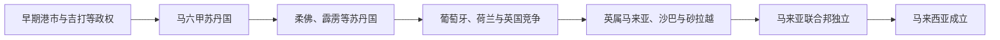

# 马来西亚历史

马来西亚历史跨越马来半岛与婆罗洲北部。马六甲海峡港市、马来苏丹国和伊斯兰网络塑造共同文化，葡萄牙、荷兰和英国的商业竞争再把各地纳入不同殖民体系。二战后，马来亚独立并于1963年与沙巴、砂拉越、新加坡组成马来西亚；新加坡两年后退出。

## 阶段导航

| 顺序 | 阶段 | 时间 | 核心变化 |
|---|---|---|---|
| 1 | [马来港市与苏丹国](/%E4%BA%BA%E6%96%87%E7%A7%91%E5%AD%A6/%E5%8E%86%E5%8F%B2/%E4%B8%9C%E5%8D%97%E4%BA%9A/%E9%A9%AC%E6%9D%A5%E8%A5%BF%E4%BA%9A/%E9%A9%AC%E6%9D%A5%E6%B8%AF%E5%B8%82%E4%B8%8E%E8%8B%8F%E4%B8%B9%E5%9B%BD.md) | 前1千纪—19世纪 | 海峡贸易、伊斯兰化与马来王权 |
| 2 | [英属马来亚与殖民社会](/%E4%BA%BA%E6%96%87%E7%A7%91%E5%AD%A6/%E5%8E%86%E5%8F%B2/%E4%B8%9C%E5%8D%97%E4%BA%9A/%E9%A9%AC%E6%9D%A5%E8%A5%BF%E4%BA%9A/%E8%8B%B1%E5%B1%9E%E9%A9%AC%E6%9D%A5%E4%BA%9A%E4%B8%8E%E6%AE%96%E6%B0%91%E7%A4%BE%E4%BC%9A.md) | 1786—1957年 | 海峡殖民地、锡胶经济与多族群社会 |
| 3 | [独立、联邦与现代马来西亚](/%E4%BA%BA%E6%96%87%E7%A7%91%E5%AD%A6/%E5%8E%86%E5%8F%B2/%E4%B8%9C%E5%8D%97%E4%BA%9A/%E9%A9%AC%E6%9D%A5%E8%A5%BF%E4%BA%9A/%E7%8B%AC%E7%AB%8B%E3%80%81%E8%81%94%E9%82%A6%E4%B8%8E%E7%8E%B0%E4%BB%A3%E9%A9%AC%E6%9D%A5%E8%A5%BF%E4%BA%9A.md) | 1957年至今 | 马来亚独立、联邦扩大与发展型国家 |

## 重要转折

| 时间 | 事件 | 意义 |
|---|---|---|
| 15世纪初 | 马六甲苏丹国建立 | 马来—伊斯兰港市秩序形成 |
| 1511年 | 葡萄牙占领马六甲 | 海峡贸易中心分散 |
| 1824年 | 英荷条约 | 马来世界被划入英、荷势力范围 |
| 1948—1960年 | 马来亚紧急状态 | 殖民政府与共产党游击队战争 |
| 1957年 | 马来亚联合邦独立 | 君主立宪联邦建立 |
| 1963年 | 马来西亚成立 | 马来亚、沙巴、砂拉越与新加坡组成新联邦 |
| 1965年 | 新加坡退出 | 联邦领土与政治结构定型 |

## 区域联系

- 上级：[海岛东南亚历史](/%E4%BA%BA%E6%96%87%E7%A7%91%E5%AD%A6/%E5%8E%86%E5%8F%B2/%E4%B8%9C%E5%8D%97%E4%BA%9A/%E6%B5%B7%E5%B2%9B%E4%B8%9C%E5%8D%97%E4%BA%9A/README.md)
- 邻近主线：[新加坡历史](/%E4%BA%BA%E6%96%87%E7%A7%91%E5%AD%A6/%E5%8E%86%E5%8F%B2/%E4%B8%9C%E5%8D%97%E4%BA%9A/%E6%96%B0%E5%8A%A0%E5%9D%A1/README.md)、[文莱历史](/%E4%BA%BA%E6%96%87%E7%A7%91%E5%AD%A6/%E5%8E%86%E5%8F%B2/%E4%B8%9C%E5%8D%97%E4%BA%9A/%E6%96%87%E8%8E%B1/README.md)、[印度尼西亚历史](/%E4%BA%BA%E6%96%87%E7%A7%91%E5%AD%A6/%E5%8E%86%E5%8F%B2/%E4%B8%9C%E5%8D%97%E4%BA%9A/%E5%8D%B0%E5%B0%BC/README.md)

## 直接上级

- [东南亚历史](/%E4%BA%BA%E6%96%87%E7%A7%91%E5%AD%A6/%E5%8E%86%E5%8F%B2/%E4%B8%9C%E5%8D%97%E4%BA%9A/README.md)
