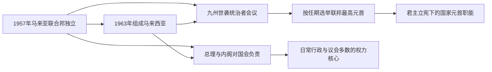

# 国家元首与政府首脑表

## 范围与制度说明

本表覆盖1957年马来亚联合邦独立以来的联邦国家元首和政府首脑，核验截止到2026年7月。马来西亚不是单一王朝的世袭君主国：森美兰、雪兰莪、玻璃市、登嘉楼、吉打、吉兰丹、彭亨、霹雳和柔佛九州的世袭统治者组成统治者会议，并依宪法程序选出通常任期五年的最高元首。最高元首在宪法上是国家元首；日常行政由获得下议院多数支持的总理与内阁负责。

表中的“届次”是最高元首任期，不等于不同人物的序号。吉打苏丹端姑阿都哈林曾任第五任和第十四任最高元首，因此17届只有16位不同人物。最高元首去世、退位或任期结束至继任者宣誓之间，由副最高元首依法代行职权；这些短暂代行期在备注中说明，不另编届次。

## 联邦权力结构图

最高元首不是按固定父子世系继承，而由九个有世袭统治者的州轮任选举；总理则由能够获得下议院多数支持者出任。两张表分别呈现联邦礼仪—宪制元首与实际政府领导。

## 历任最高元首

| 届次 | 姓名 | 所属王室 / 州 | 任期 | 与前任关系 | 重要事件 / 备注 |
| --- | --- | --- | --- | --- | --- |
| 1 | **端姑阿都拉曼**（Tuanku Abdul Rahman） | 森美兰严端 | 1957-08-31—1960-04-01 | 独立后首任，由统治者会议选出 | 见证马来亚独立；在任内去世。 |
| 2 | 苏丹希沙慕丁·阿南沙（Hisamuddin Alam Shah） | 雪兰莪苏丹 | 1960-04-14—1960-09-01 | 前任副元首，继而当选 | 4月2—13日先代行元首职权；在加冕前去世，任期不足五个月。 |
| 3 | 端姑赛布特拉（Tuanku Syed Putra） | 玻璃市拉惹 | 1960-09-21—1965-09-20 | 统治者会议选出 | 1963年马来西亚成立、1965年新加坡退出均发生于其任内。 |
| 4 | 苏丹依斯迈·纳西鲁丁沙（Ismail Nasiruddin Shah） | 登嘉楼苏丹 | 1965-09-21—1970-09-20 | 统治者会议选出 | 经历1969年“五月十三日事件”和全国行动委员会统治；1970年宣布国家原则。 |
| 5 | **苏丹阿都哈林·慕阿占沙**（Abdul Halim Mu'adzam Shah） | 吉打苏丹 | 1970-09-21—1975-09-20 | 统治者会议选出 | 首次任期；新经济政策开始实施。 |
| 6 | 苏丹雅耶·柏特拉（Yahya Petra） | 吉兰丹苏丹 | 1975-09-21—1979-03-29 | 统治者会议选出 | 在任内去世；副元首苏丹阿末沙代行至新任宣誓。 |
| 7 | 苏丹阿末沙（Ahmad Shah） | 彭亨苏丹 | 1979-04-26—1984-04-25 | 前任副元首，继而当选 | 经历马哈蒂尔政府上台和1983年第一次宪政危机。 |
| 8 | 苏丹马末·依斯干达（Iskandar） | 柔佛苏丹 | 1984-04-26—1989-04-25 | 统治者会议选出 | 在任期内联邦与王室围绕赦免、立法同意等权限持续磨合。 |
| 9 | 苏丹阿兹兰·慕希布丁沙（Azlan Shah） | 霹雳苏丹 | 1989-04-26—1994-04-25 | 统治者会议选出 | 曾任联邦首席大法官；1993年修宪限制统治者法律豁免。 |
| 10 | 端姑查化（Tuanku Ja'afar） | 森美兰严端 | 1994-04-26—1999-04-25 | 第一任元首之子，由统治者会议选出 | 经历亚洲金融危机与“烈火莫熄”运动开始。 |
| 11 | 苏丹沙拉胡丁·阿都阿兹沙（Salahuddin Abdul Aziz Shah） | 雪兰莪苏丹 | 1999-04-26—2001-11-21 | 第二任元首之子，由统治者会议选出 | 在任内去世；副元首端姑赛西拉祖丁代行至正式就任。 |
| 12 | 端姑赛西拉祖丁（Tuanku Syed Sirajuddin） | 玻璃市拉惹 | 2001-12-13—2006-12-12 | 第三任元首之子，由统治者会议选出 | 2003年完成马哈蒂尔至阿都拉·巴达威的总理交接。 |
| 13 | 苏丹米占·再纳·阿比丁（Mizan Zainal Abidin） | 登嘉楼苏丹 | 2006-12-13—2011-12-12 | 第四任元首同一王室后继，由统治者会议选出 | 经历2008年大选后国民阵线失去国会三分之二多数。 |
| 14 | **苏丹阿都哈林·慕阿占沙** | 吉打苏丹 | 2011-12-13—2016-12-12 | 再次当选；第五任元首本人 | 马来西亚首位两度出任最高元首者；任内发生2013年大选和1MDB争议扩大。 |
| 15 | 苏丹莫哈末五世（Muhammad V） | 吉兰丹苏丹 | 2016-12-13—2019-01-06 | 统治者会议选出 | 2018年首次联邦政党轮替；2019年主动退位，为独立后首例。副元首苏丹纳兹林沙代行。 |
| 16 | 苏丹阿都拉·利亚乌丁（Abdullah Ri'ayatuddin Al-Mustafa Billah Shah） | 彭亨苏丹 | 2019-01-31—2024-01-30 | 第七任元首之子，由统治者会议选出 | 2020、2021与2022年多次判断谁获下议院多数；新冠紧急状态和三次总理更替发生于任内。 |
| 17 | **苏丹依布拉欣**（Sultan Ibrahim） | 柔佛苏丹 | 2024-01-31—至今 | 第八任元首之子，由统治者会议选出 | 截至2026年7月在任；通常五年任期预计至2029年1月，但以宪法和统治者会议程序为准。 |

## 历任总理

| 顺序 | 姓名 | 任期 | 主要政党 / 执政基础 | 与前任关系 | 重要事件 / 备注 |
| --- | --- | --- | --- | --- | --- |
| 1 | **东姑阿都拉曼** | 1957-08-31—1970-09-22 | 巫统；联盟党 | 独立后首任 | 领导独立谈判、1963年建立马来西亚；经历印尼对抗、新加坡退出与1969年骚乱，后在压力下辞职。 |
| 2 | **敦阿都拉萨** | 1970-09-22—1976-01-14 | 巫统；联盟党转国民阵线 | 原副总理、全国行动委员会主任 | 推行新经济政策，扩大执政联盟并建立国民阵线；在任内病逝。 |
| 3 | 敦胡先翁 | 1976-01-15—1981-07-16 | 巫统；国民阵线 | 原副总理 | 强调反腐和族群团结；因健康原因辞职。 |
| 4 | **马哈蒂尔·穆罕默德** | 1981-07-16—2003-10-31 | 巫统；国民阵线 | 原副总理 | 首次任期；重工业、私有化和出口制造扩张，经历1987年巫统分裂、1988年司法危机、1997—1998年金融危机及安瓦尔被革职。 |
| 5 | 阿都拉·阿末·巴达威 | 2003-10-31—2009-04-03 | 巫统；国民阵线 | 原副总理 | 2004年大胜后改革动力减弱；2008年失去国会三分之二多数，随后交棒。 |
| 6 | 纳吉·阿都拉萨 | 2009-04-03—2018-05-10 | 巫统；国民阵线 | 原副总理、第二任总理之子 | 推行经济转型和消费税；1MDB案、生活成本与制度信任危机促成2018年败选。 |
| 7 | **马哈蒂尔·穆罕默德** | 2018-05-10—2020-03-01 | 土著团结党；希望联盟 | 反对联盟胜选后重返总理职位 | 第二次任期，实现首次联邦政党轮替；2020年2月辞职后短暂以过渡总理身份留任，联盟重组后离任。 |
| 8 | 慕尤丁·雅辛 | 2020-03-01—2021-08-21 | 土著团结党；国民联盟及盟友 | 在政党重新组合中获元首判断拥有多数 | 新冠疫情、行动管制和2021年紧急状态；失去多数支持后辞职，并任看守总理至继任者宣誓。 |
| 9 | 依斯迈沙比里·雅各布 | 2021-08-21—2022-11-24 | 巫统；国民阵线、国民联盟等支持 | 原副总理，跨联盟支持 | 推动疫后开放并与反对党签署转型与政治稳定谅解备忘录；第15届大选后离任。 |
| 10 | **安瓦尔·依布拉欣** | 2022-11-24—至今 | 公正党；希望联盟主导的联合政府 | 悬峙国会后由最高元首任命 | 组成希望联盟、国民阵线及东马政党参与的联合政府；兼任财政部长。截至2026年7月仍在任。 |

## 权力关系辨析

- 最高元首须在多数事务上依总理或内阁建议行事，但在任命可能获得下议院多数支持的总理、拒绝解散国会请求及召集统治者会议等事项上有有限裁量。
- 总理必须是最高元首判断可获得下议院多数信任的议员；当党派多数不清时，元首可通过接见议员、党领袖声明或信任表决判断支持。
- 九州统治者各自保留州元首和本州伊斯兰事务领袖地位；最高元首不是凌驾于各州王位之上的世袭“皇帝”。
- 槟城、马六甲、沙巴和砂拉越没有世袭统治者，由州元首担任礼仪性州首长；这四州不参加最高元首选举。
- 最高元首、总理与州统治者的任期不可相互替代：联邦政党轮替不会改变州王统，元首轮换也不等于政府更迭。

## 相关笔记

- 主线：[独立、联邦与现代马来西亚](/%E4%BA%BA%E6%96%87%E7%A7%91%E5%AD%A6/%E5%8E%86%E5%8F%B2/%E4%B8%9C%E5%8D%97%E4%BA%9A/%E9%A9%AC%E6%9D%A5%E8%A5%BF%E4%BA%9A/%E7%8B%AC%E7%AB%8B%E3%80%81%E8%81%94%E9%82%A6%E4%B8%8E%E7%8E%B0%E4%BB%A3%E9%A9%AC%E6%9D%A5%E8%A5%BF%E4%BA%9A.md)
- 王权背景：[马来港市与苏丹国](/%E4%BA%BA%E6%96%87%E7%A7%91%E5%AD%A6/%E5%8E%86%E5%8F%B2/%E4%B8%9C%E5%8D%97%E4%BA%9A/%E9%A9%AC%E6%9D%A5%E8%A5%BF%E4%BA%9A/%E9%A9%AC%E6%9D%A5%E6%B8%AF%E5%B8%82%E4%B8%8E%E8%8B%8F%E4%B8%B9%E5%9B%BD.md)
