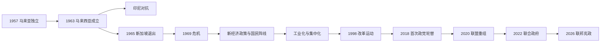

# 独立、联邦与现代马来西亚

## 时间

1957年至今；本文核验至2026年7月。

## 概括

1957年马来亚联合邦在保留九个马来王室、议会民主与联邦制的条件下独立。1963年马来亚、沙巴、砂拉越和新加坡组成马来西亚，文莱没有加入；新加坡于1965年退出。此后国家以统治者会议、轮任最高元首、民选下议院和内阁构成复合君主立宪制，又以族群协商、土著扶持、出口制造、石油收入和东马资源维持发展。

国民阵线及其前身从独立长期执政，2018年首次败选。2020—2022年，议员转党、联盟重组和疫情造成三次总理交接；2022年悬峙国会后，安瓦尔·依布拉欣组织联合政府。马来西亚的核心连续性来自联邦宪法、王室与官僚体系，主要张力则集中于族群与宗教政策、中央—东马权力分配、政治资金和联盟稳定。

## 建国背景

- 英国镇压马来亚共产党武装后，需要把反共安全、本地多数治理与殖民撤离结合；巫统、马华公会和印度国大党组成的联盟党成为主要谈判伙伴。
- 1955年联合邦立法选举中联盟党大胜，东姑阿都拉曼组阁；伦敦谈判确定独立时间、君主轮任、公民权和议会制度。
- 马来王室接受联邦宪政，以保留州王位、伊斯兰事务和马来特殊地位；华人、印度人社群则通过公民权、选举和经济参与进入国家框架。
- 英国与马来亚领导层后来推动把北婆罗洲地区和新加坡纳入更大联邦，以处理殖民撤离、安全和区域经济问题；当地社会对加入条件、自治范围和人口平衡意见不一。

## 分阶段发展

### 马来亚独立与紧急状态收尾（1957—1963）

1957年8月31日马来亚联合邦独立，东姑阿都拉曼任总理，端姑阿都拉曼任首任最高元首。联邦政府接收外交、防务和行政，但英国资本、英联邦军事合作与殖民官僚传统继续发挥作用。政府通过土地开发、教育扩张和基础设施建设整合乡村，同时继续针对马来亚共产党游击队的安全行动；1960年宣布紧急状态结束，但边境武装活动并未完全消失。

联盟党以“分族群政党、跨族群协商”的方式分配候选人和内阁职位。这一机制降低精英冲突，却把公共政策长期组织在族群类别之上，并使代表性很大程度依赖各社群政党领袖之间的谈判。

### 马来西亚成立、区域对抗与新加坡退出（1963—1969）

1963年9月16日，马来亚、沙巴、砂拉越和新加坡组成马来西亚。沙巴、砂拉越在移民、土地、宗教、语言和行政方面获得特别保障；联邦形成并非简单把三个地区并入原马来亚，各方对“1963年协议”义务的理解后来持续引发争论。

印度尼西亚苏加诺政府反对新联邦，1963—1966年实施“对抗”，以越境袭击、宣传和外交压力挑战马来西亚；英联邦军队协助防御。菲律宾同时依据苏禄苏丹国历史权利提出对沙巴的主张。联邦内部，人民行动党与联盟党在共同市场、税收、族群政治和“马来西亚人的马来西亚”口号上冲突；1965年国会通过新加坡分离。

1969年大选中联盟党受挫，吉隆坡爆发“五月十三日”族群暴力。国会暂停，全国行动委员会接管行政。此后国家原则、新经济政策和更强的行政协调成为重建政治秩序的核心。

### 新经济政策与国民阵线体制（1970—1981）

阿都拉萨接任总理，1971年启动新经济政策，目标是消除贫困并调整族群与经济职能的对应关系，尤其提高土著在教育、就业、企业股权和城市经济中的参与。政策推动乡村开发、国有企业和中产阶层形成，也把配额、执照和国家资源分配制度化。

执政联盟在1973—1974年扩展为国民阵线，吸收部分原反对党和东马地方政党。权力在选举、官僚、州政府和安全法之间运作，竞争仍存在，但执政党拥有显著制度优势。1974年马来西亚与中华人民共和国建交；1975年后越南战争结束和难民流动改变区域安全环境。

### 工业化、集中化与宪政冲突（1981—1998）

马哈蒂尔首次执政后推动“向东学习”、重工业、私有化、交通基础设施和出口制造。槟城、巴生谷与柔佛等地进入电子和全球供应链，城市化、中产阶层及外来劳工规模扩大。国家从初级商品依赖转向制造业，但大型项目、政府关联企业和政商网络也加深。

1983年和1993年，联邦政府通过修宪限制王室延迟批准法律和法律豁免，重新界定民选政府与统治者的边界。1987年巫统党争、茅草行动和媒体管制显示行政权集中；1988年最高法院危机削弱司法独立声誉。伊斯兰化政策与伊斯兰党竞争同步加强，民事法院与伊斯兰法院权限争议逐渐突出。

1997年亚洲金融危机造成货币、资本市场和企业债务震荡。政府采用资本管制、固定汇率和国家主导重组，避免接受完整国际货币基金组织方案。1998年副总理安瓦尔被革职、逮捕和定罪，引发“烈火莫熄”运动，使反腐、司法与民主改革成为全国政治主线。

### 改革压力、1MDB与首次政党轮替（1998—2018）

阿都拉·巴达威在2004年大选大胜，并提出廉洁和温和伊斯兰治理，但改革落实、物价与党内权力问题逐渐削弱支持。2008年反对党夺得五州并使国民阵线首次失去国会三分之二多数，互联网媒体和城市选民重塑竞选环境。

纳吉政府推出“一个马来西亚”、经济转型计划和现金援助，也实施消费税。净选盟集会、选区与选举公平争议持续；2013年国民阵线虽保住多数席位，却失去普选票多数。1MDB巨额债务、跨国资金流和司法追责争议侵蚀政府信誉。2018年，马哈蒂尔领导希望联盟与安瓦尔阵营合作，在第14届大选击败国民阵线，实现独立后首次联邦政权轮替。

### 联盟重组、疫情与连续换相（2018—2022）

希望联盟政府重启1MDB调查、废除消费税并检讨大型项目，但内部对接班安排、土著政策和马来政治支持存在分歧。2020年2月“喜来登政变”期间，议员与政党重新组合，马哈蒂尔辞职；最高元首接见议员后任命慕尤丁为总理，未举行即时大选。

新冠疫情期间实施行动管制、财政援助、疫苗接种和边境限制。2021年以疫情为由宣布全国紧急状态并暂停国会，加剧政府是否仍有多数的争议。慕尤丁失去支持后辞职，依斯迈沙比里组成跨联盟政府，并与反对党签署政治稳定及制度改革备忘录。2022年提前大选产生悬峙国会，没有单一联盟过半。

### 联合政府与2026年格局（2022年至今）

2022年11月，最高元首在确认各党支持后任命安瓦尔为第十任总理。希望联盟、国民阵线、砂拉越政党联盟、沙巴政党及其他力量组成联合政府。政府以“昌明大马”为政策框架，推进补贴重定向、财政纪律、反腐和产业升级；与此同时，巫统在联盟内的角色、反对党伊斯兰动员和生活成本仍影响稳定。

2024年柔佛苏丹依布拉欣就任第十七任最高元首。东马政党在悬峙或接近悬峙的国会结构中拥有更强议价能力，1963年协议、石油收益、基础设施和行政下放继续是联邦谈判重点。截至2026年7月，最高元首为苏丹依布拉欣，总理为安瓦尔·依布拉欣；现任与完整历任名单见[国家元首与政府首脑表](/%E4%BA%BA%E6%96%87%E7%A7%91%E5%AD%A6/%E5%8E%86%E5%8F%B2/%E4%B8%9C%E5%8D%97%E4%BA%9A/%E9%A9%AC%E6%9D%A5%E8%A5%BF%E4%BA%9A/%E5%9B%BD%E5%AE%B6%E5%85%83%E9%A6%96%E4%B8%8E%E6%94%BF%E5%BA%9C%E9%A6%96%E8%84%91%E8%A1%A8.md)。

## 统治结构

| 层级 | 构成 | 权力与限制 |
| --- | --- | --- |
| 统治者会议 | 九州世袭统治者；部分州务讨论也有四州州元首参加 | 选举最高元首和副元首；讨论王室、伊斯兰及特定宪法事项。 |
| 最高元首 | 从九州统治者中选出，通常任期五年 | 国家元首、武装部队最高统帅和无世袭统治者地区的伊斯兰领袖；多数事务依内阁建议，特定情形有有限裁量。 |
| 总理与内阁 | 总理须获得下议院多数支持，部长由元首依总理建议任命 | 掌握联邦日常行政、预算和政策，对国会承担政治责任。 |
| 国会 | 直选下议院与委任、州议会选出的上议院 | 制定联邦法律、审议预算和监督政府；政党纪律使内阁通常主导立法。 |
| 司法 | 联邦法院、上诉法院、高等法院及下级法院 | 审查法律与行政行为；1988年危机和此后改革是独立性讨论焦点。 |
| 州政府 | 州统治者 / 州元首、州务大臣 / 首席部长与州议会 | 管理土地、地方事务和州权限；沙巴、砂拉越另有移民等特殊权力。 |
| 伊斯兰司法与机构 | 州级伊斯兰法院及宗教机关 | 管理穆斯林身份、婚姻、继承等州权限事项；与联邦民事法律边界偶有冲突。 |

## 重要事件

| 时间 | 事件 | 过程与长期影响 |
| --- | --- | --- |
| 1957-08-31 | 马来亚独立 | 建立轮任君主立宪联邦，联盟党执政。 |
| 1960 | 紧急状态结束 | 大规模反游击阶段收束，但马共武装斗争延续至1989年。 |
| 1963-09-16 | 马来西亚成立 | 沙巴、砂拉越、新加坡与马来亚组成新联邦，东马特殊安排成为长期宪制议题。 |
| 1963—1966 | 印尼“对抗” | 越境军事与外交冲突强化国防和英联邦安全合作。 |
| 1965-08-09 | 新加坡退出 | 族群、财政和党际冲突导致联邦边界重新定型。 |
| 1969-05-13 | 族群暴力 | 国会暂停，促成国家原则、新经济政策和更强行政控制。 |
| 1971 | 新经济政策实施 | 扶贫与土著经济重组并行，深刻塑造教育、企业和公共部门。 |
| 1974 | 对华建交、国民阵线扩展 | 外交转向务实，国内执政联盟扩大。 |
| 1983、1993 | 两次主要宪政危机 | 修宪限制王室否决拖延和法律豁免，重划君主与政府权力。 |
| 1987—1988 | 巫统分裂、茅草行动与司法危机 | 执政党重组，行政集中与司法独立争议加深。 |
| 1997—1998 | 亚洲金融危机 | 资本管制和企业重组改变经济治理；安瓦尔被革职引发改革运动。 |
| 2008 | 第12届大选 | 国民阵线失去三分之二多数，竞争性政党体系成形。 |
| 2013 | 第13届大选 | 反对联盟赢得普选票多数，国民阵线依席位继续执政。 |
| 2015—2018 | 1MDB危机扩大 | 跨国调查、债务与政治资金问题促成制度信任危机。 |
| 2018-05 | 首次联邦政权轮替 | 希望联盟胜选，马哈蒂尔第二次任总理。 |
| 2020-02—03 | 联盟重组 | 政府在未大选情况下更换，元首判断议会多数的作用上升。 |
| 2020—2022 | 新冠疫情 | 行动管制、紧急状态与财政支出重塑公共治理。 |
| 2021 | 慕尤丁辞职、依斯迈沙比里就任 | 多数支持再次重组，政府与反对党签署稳定备忘录。 |
| 2022-11 | 悬峙国会与安瓦尔组阁 | 多联盟联合政府形成，东马政党和王室宪制角色更受关注。 |
| 2024-01 | 苏丹依布拉欣任最高元首 | 联邦君主轮任进入第十七届。 |

## 发展条件与结构性矛盾

### 持续发展的条件

- 马六甲海峡、港口和跨国制造供应链使马来西亚连接东亚、印度洋与全球市场。
- 锡、橡胶、棕榈油、石油天然气与制造业先后提供出口和财政基础，降低对单一产品的绝对依赖。
- 联邦官僚、基础设施、教育和公共企业具有较强政策执行能力。
- 统治者会议与州王室提供超越单届政府的制度连续性；选举与联盟谈判则允许精英更替。
- 多语、多宗教人口与东马地方社会形成广泛商业、技术和区域网络。

### 结构性矛盾

- 以族群分类的扶持政策缓解部分历史不平等，也可能固化身份政治、寻租和人才流动争议。
- 首都圈与外围、半岛与东马之间在收入、道路、电力、教育和医疗资源上仍不均衡。
- 选区差异、政党转籍、政治资金和政府机构独立性影响选举公平与公众信任。
- 联邦伊斯兰化和州宗教权限与多宗教公民权之间需要持续司法及政治协调。
- 联盟政治提高包容性，却可能造成政策交换、倒阁风险和长期改革难度。

本阶段仍在延续，不适用“灭亡原因”。2018年国民阵线败选是长期执政联盟失去中央政权，并不是联邦国家或君主制度灭亡；2020年的政府更换也属于议会多数重组，而不是王朝更替。

## 演变关系

- 前一节点：[英属马来亚与殖民社会](/%E4%BA%BA%E6%96%87%E7%A7%91%E5%AD%A6/%E5%8E%86%E5%8F%B2/%E4%B8%9C%E5%8D%97%E4%BA%9A/%E9%A9%AC%E6%9D%A5%E8%A5%BF%E4%BA%9A/%E8%8B%B1%E5%B1%9E%E9%A9%AC%E6%9D%A5%E4%BA%9A%E4%B8%8E%E6%AE%96%E6%B0%91%E7%A4%BE%E4%BC%9A.md)。
- 领导人专表：[国家元首与政府首脑表](/%E4%BA%BA%E6%96%87%E7%A7%91%E5%AD%A6/%E5%8E%86%E5%8F%B2/%E4%B8%9C%E5%8D%97%E4%BA%9A/%E9%A9%AC%E6%9D%A5%E8%A5%BF%E4%BA%9A/%E5%9B%BD%E5%AE%B6%E5%85%83%E9%A6%96%E4%B8%8E%E6%94%BF%E5%BA%9C%E9%A6%96%E8%84%91%E8%A1%A8.md)。
- 新加坡分离后的主线：[自治、独立与城市国家](/%E4%BA%BA%E6%96%87%E7%A7%91%E5%AD%A6/%E5%8E%86%E5%8F%B2/%E4%B8%9C%E5%8D%97%E4%BA%9A/%E6%96%B0%E5%8A%A0%E5%9D%A1/%E8%87%AA%E6%B2%BB%E3%80%81%E7%8B%AC%E7%AB%8B%E4%B8%8E%E5%9F%8E%E5%B8%82%E5%9B%BD%E5%AE%B6.md)。
