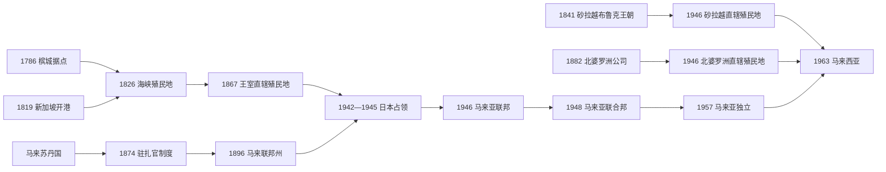

# 英属马来亚与殖民社会

## 时间

1786—1957年（马来半岛）；砂拉越与北婆罗洲的英国殖民统治延续至1963年。

## 概括

英国在今日马来西亚境内没有建立单一、同步的“马来亚殖民地”。槟城、新加坡和马六甲组成直辖的海峡殖民地；半岛九个苏丹国分别处于驻扎官、顾问或条约控制下；砂拉越由布鲁克家族统治至1946年，北婆罗洲则由特许公司经营，二者后来才成为英国直辖殖民地。英国借港口、条约、苏丹合法性和官僚财政构建复合统治，锡矿、橡胶与转口贸易又吸引大量华人、印度人和群岛移民，形成地域及职业分工显著的多族群社会。

1941—1945年日本占领摧毁“英国不可战胜”的形象，并造成镇压、饥荒、强制劳动和不同社群的战争记忆。战后英国试图用马来亚联邦集中权力，遭王室与马来民族主义抵制；1948年改设马来亚联合邦。同年开始的紧急状态、选举政治和宪制谈判共同塑造独立道路。1957年半岛独立后，砂拉越和北婆罗洲继续作为殖民地，至1963年分别以砂拉越、沙巴身份加入马来西亚。

## 扩张背景与控制机制

- 英国东印度公司希望取得不受荷兰控制的补给港，保护孟加拉—中国贸易并参与海峡转口；槟榔屿位于季风航线和马来半岛西岸。
- 半岛苏丹国的王位争议、地方首领竞争、锡矿战争和华人会党冲突，为英国以“恢复秩序”和保护贸易为名介入提供机会。
- 苏丹与英国签订条约后通常仍掌伊斯兰教、马来习俗和王室礼仪；英国驻扎官或顾问控制财政、司法、警务、土地和对外事务，形成“以王室合法性包裹殖民行政”的间接统治。
- 港口、铁路和道路优先连接矿区、种植园与出口码头。土地法、劳工迁移和税收制度把地方经济纳入英镑、航运和伦敦商品市场。
- 砂拉越与北婆罗洲面积大、人口分散，殖民者依靠地方首领、河流据点、公司特许权和小规模警备力量，而非复制半岛完整官僚体制。

## 分阶段过程

### 槟城、新加坡与海峡殖民地（1786—1874）

1786年，吉打苏丹允许英国东印度公司代表弗朗西斯·莱特占据槟榔屿。莱特对英国军事保护能力作出超出公司授权的承诺，吉打后来试图收回岛屿失败；1791年和1800年协议以补偿金与威省割让进一步固定英国地位。

1819年，斯坦福·莱佛士利用柔佛—廖内继承争议，承认胡先沙为苏丹，并与其及天猛公签约建立新加坡港。1824年英荷条约以势力范围交换和划界，英国取得马六甲，荷兰取得明古连，马来世界被殖民边界分为半岛与群岛两部分。

1826年槟城、马六甲和新加坡组成海峡殖民地，先由东印度公司和印度政府管辖；1867年改为英国王室直辖殖民地。新加坡逐渐成为行政和商业中心，华人商人、欧洲公司、印度劳工和马来海运人口共同构成港口社会。

### 驻扎官制度与半岛殖民整合（1874—1914）

19世纪中叶锡矿需求促使霹雳和雪兰莪矿区扩大，王位争议、地方战争和华人会党冲突威胁贸易。1874年《邦咯条约》承认拉惹阿都拉为霹雳苏丹，要求其接受英国驻扎官；驻扎官意见除伊斯兰和马来习俗外必须采纳。首任驻扎官J. W. W. 伯奇的税收与行政改革触犯地方权力，1875年遇刺，英国随后军事镇压并流放相关首领。

驻扎官制度扩展到雪兰莪、森美兰和彭亨。1896年四州组成马来联邦州，由驻吉隆坡的总驻扎官协调，铁路、海关、警务和财政趋于集中。苏丹仍是州统治者，但预算和高级行政实际受殖民官员控制。

吉打、吉兰丹、登嘉楼和玻璃市在1909年英暹条约后由暹罗势力范围转入英国势力范围，与柔佛一起称马来属邦。英国以“顾问”而非“驻扎官”名义介入，形式上保留更多州行政空间；1914年柔佛接受总顾问后，整个半岛的对外与关键财政事务均受到英国控制。

### 砂拉越布鲁克王朝与北婆罗洲公司（1841—1941）

1841年，文莱苏丹承认詹姆斯·布鲁克为砂拉越拉惹，以酬谢其协助镇压地方叛乱。布鲁克家族三代扩大沿海和河谷领土，依马来贵族、达雅首领和欧洲官员治理，并以反海盗、税收及资源开发巩固政权。1888年砂拉越成为英国保护国，王朝保留内政。

英国北婆罗洲公司1881年获皇家特许状，次年开始正式行政，以山打根为早期中心，经营烟草、木材、铁路和土地特许。公司设总督、居民和地方首领体系；同在1888年成为英国保护国。砂拉越、北婆罗洲与文莱仍是三个不同政治实体，不能合称为一个“英属婆罗洲政府”。

### 锡胶经济与多族群社会

19世纪锡矿发展依赖华人资本、矿工网络与会馆组织；英国政府后来用公司资本、采矿技术和行政管制取代部分会党自治。20世纪初汽车工业提高橡胶需求，欧洲种植园扩张，泰米尔劳工在契约、袋鼠制度和劳工招募网络下大量进入。

殖民经济造成明显空间和职业分层：许多马来人留在稻作、渔业与州行政，华人集中于矿业、商业和城市，印度人较多在种植园、铁路和公共工程。实际流动比这一简化分类更复杂，但殖民统计、学校、居住和政治代表制度不断强化族群边界。铁路、港口和公共卫生改善生产条件，却优先服务出口走廊，乡村土地、债务和教育差距长期存在。

### 日本入侵与占领（1941—1945）

1941年12月日军在哥打巴鲁和泰国南部登陆，以空中优势、机动步兵和缴获交通工具沿半岛南下。英联邦军队准备不足、指挥分散，1942年2月15日新加坡投降。砂拉越和北婆罗洲也在1941年底至1942年初被占领，殖民官员及盟军部队撤退或被俘。

日本军政当局把新加坡改称昭南，马来亚由军事政府管理，1943年把吉打、吉兰丹、登嘉楼和玻璃市交给盟国泰国。华人因抗日战争背景遭特别严厉的肃清、征款和报复；印度独立运动者获得组织印度国民军的空间；部分马来行政人员被留用。所有社群均面对通货膨胀、粮食短缺、强制劳动和暴力，只是程度与经历不同。

马来亚人民抗日军以马共干部为核心，在森林开展游击战并与英军136部队合作。北婆罗洲发生1943年亚庇起义，砂拉越及婆罗洲内陆也有地方抵抗和盟军联络。战争结束后，抗日武装短暂接管部分地区，报复和治安真空加剧族群紧张。

### 战后重建、马来亚联邦与联合邦（1945—1957）

1945年英国军事管制局恢复统治。英国提出马来亚联邦方案，把各州置于中央总督之下、削弱苏丹政治权力并放宽公民权。马来民族主义者认为王室与马来政治地位受损，1946年组织巫统发动抵制；苏丹撤回支持后，马来亚联邦于1948年被马来亚联合邦取代。新体制恢复州和王室地位，收紧公民资格，同时为渐进自治保留联邦机构。

左翼工会、马来民族主义团体与跨族群联盟提出更民主的替代宪制，1947年组织总罢市，但没有获得英国接受。1948年种植园管理人员遇袭后，殖民政府宣布紧急状态，取缔马共并扩大拘留、宵禁和军事行动。马共领导的马来亚民族解放军主要依赖森林边缘华人村落补给。

1950年起“布里格斯计划”把约五十万农村居民迁入受管制的“新村”，切断游击队粮食、情报和人员来源；身份证、食物管制、警务和军事清剿同步推进。陈祯禄、东姑阿都拉曼等领导的联盟党以公民权协商、王室保障和反共立场获得英国信任。1955年联邦选举中联盟党赢得52席中的51席，东姑组阁；同年华玲谈判因马共拒绝无条件投降而失败。

1956年伦敦会议确定独立原则，制宪委员会拟定联邦、议会、基本权利、王室和特殊地位框架。1957年8月31日马来亚联合邦独立。紧急状态仍延续至1960年，殖民统治的结束和反游击战争的结束并不同步。

### 婆罗洲殖民地走向马来西亚（1946—1963）

布鲁克家族1946年把砂拉越让给英国，反让渡运动认为此举违反1941年自治承诺；1949年总督邓肯·斯图尔特遇刺后，殖民政府镇压激进组织。北婆罗洲公司因战争破坏和财政困难也在1946年交出治理权，北婆罗洲成为直辖殖民地。

两地通过地方议会、行政本地化和政党形成逐步进入自治。1962年科博尔德委员会调查加入马来西亚意见，随后政府间委员会谈判宗教、移民、土地、公务员和财政保障。1963年英国殖民统治结束，北婆罗洲改称沙巴，与砂拉越共同加入新联邦。

## 殖民与占领权力结构

| 时段 / 地区 | 名义最高权威 | 行政首脑 | 实际权力结构 |
| --- | --- | --- | --- |
| 槟城早期（1786—1826） | 英国东印度公司 | 监督、总督等公司官员；弗朗西斯·莱特为首任监督 | 公司董事会、孟加拉政府与本地官员分层控制贸易、土地和治安。 |
| 海峡殖民地（1826—1867） | 东印度公司，后印度政府 | 海峡殖民地总督；罗伯特·富勒顿为首任 | 总督驻槟城后移新加坡，受加尔各答监督；商人团体持续要求脱离印度管辖。 |
| 海峡殖民地（1867—1942） | 英国君主与殖民部 | 王室殖民地总督；哈里·奥德为首任，申顿·托马斯为战前末任 | 总督兼任马来诸州高级专员，连接直辖港口与间接统治州。 |
| 马来联邦州（1896—1942） | 各州苏丹 | 各州驻扎官、总驻扎官 / 联邦首席秘书 | 苏丹保留宗教与习俗名义权，殖民官僚掌财政、警务、铁路和立法准备。弗兰克·斯威特纳姆为首任总驻扎官。 |
| 马来属邦（1909/1914—1942） | 各州苏丹 | 英国顾问 / 总顾问 | 州机关形式独立较多，但对外、财政和重要任命受英国影响。 |
| 砂拉越（1841—1946） | 布鲁克家族拉惹；1888年后受英国保护 | **詹姆斯·布鲁克、查尔斯·布鲁克、查尔斯·维纳·布鲁克**三代拉惹 | 家族君主、欧洲官员、马来贵族与原住民首领共同治理；日占期实际统治中断。 |
| 北婆罗洲（1882—1946） | 英国北婆罗洲公司；1888年后受英国保护 | 公司总督；威廉·胡德·特里彻为首任 | 特许公司董事会、总督、居民和地方首领分层管理，利润与秩序并重。 |
| 日本占领（1942—1945） | 日本天皇与大本营 | 日军军事行政长官，各区域由陆军系统管辖 | 军政机关、宪兵与被留用的本地官员掌权；砂拉越、北婆罗洲和文莱由婆罗洲军政体系管理。 |
| 英国军事管制（1945—1946） | 盟军东南亚司令部 | 军事管制局首长 | 军队负责受降、治安、粮食、战犯和行政恢复。 |
| 马来亚联邦（1946—1948） | 英国君主 | 总督爱德华·根特 | 中央殖民政府直接集中行政，苏丹政治权力大幅缩减，因抵制而失败。 |
| 马来亚联合邦（1948—1957） | 英国君主与各州苏丹 | 高级专员；根特、亨利·葛尼、杰拉德·邓普勒、唐纳德·麦吉利夫雷等先后主政 | 高级专员、州政府、军警与逐步扩大的民选机构共治；紧急状态下安全机关权力很大。 |
| 砂拉越直辖殖民地（1946—1963） | 英国君主 | 总督；阿登-克拉克为首任，亚历山大·沃德尔为末任 | 总督与殖民官僚掌行政，地方议会和本地部长制度逐步扩大。 |
| 北婆罗洲直辖殖民地（1946—1963） | 英国君主 | 总督；公司统治结束后由殖民部任命 | 战后重建、地方议会与本地政党逐步发展，最终经马来西亚谈判结束殖民统治。 |

殖民行政职位在不同地域并不连续：不能把海峡殖民地总督、马来诸州高级专员、砂拉越拉惹和北婆罗洲总督合并成同一张“马来亚总督世系”。上表按制度分别列出行政首脑和实际权力，关键人物用于标示转折，而非虚构一个覆盖全部领土的单线国家元首职位。

## 重要事件

| 时间 | 事件 | 过程与影响 |
| --- | --- | --- |
| 1786 | 英国占据槟城 | 建立半岛首个长期英国据点，保护承诺争议埋下吉打冲突。 |
| 1819 | 新加坡开港 | 英国利用柔佛继承争议取得港口，新加坡迅速成为区域转口中心。 |
| 1824 | 英荷条约 | 马来世界被分入英、荷势力范围，后来的马来西亚—印度尼西亚边界基础形成。 |
| 1826、1867 | 海峡殖民地成立与改制 | 三港先归印度体系，后成为殖民部直辖殖民地。 |
| 1874 | 邦咯条约 | 驻扎官制度开始系统扩展，间接统治成形。 |
| 1875—1876 | 伯奇遇刺与霹雳战争 | 英国军事镇压反抗，强化殖民行政和税收。 |
| 1896 | 马来联邦州成立 | 四州财政、交通和官僚体系统一程度提高。 |
| 1909、1914 | 英暹条约与柔佛接受顾问 | 英国控制覆盖半岛全部苏丹国。 |
| 1881—1888 | 北婆罗洲公司与保护国建立 | 公司殖民及英国对婆罗洲北部的外部控制制度化。 |
| 1941—1942 | 日军攻占马来亚及婆罗洲 | 英军迅速失败，殖民威望崩塌。 |
| 1942—1945 | 日本军政 | 镇压、短缺、强制劳动和抵抗重塑族群与民族政治。 |
| 1946 | 马来亚联邦、砂拉越让渡与北婆罗洲直辖化 | 英国尝试重组殖民体系，引发不同形式反殖民动员。 |
| 1946 | 巫统成立 | 王室与马来民族主义反对马来亚联邦的主要组织形成。 |
| 1948 | 马来亚联合邦与紧急状态 | 宪制妥协和反共战争同时开始。 |
| 1950 | 布里格斯计划 | 新村、粮食管制和人口重组切断游击队补给，也深刻改变华人乡村生活。 |
| 1955 | 首次联邦大选与华玲谈判 | 联盟党取得自治授权，和平结束武装斗争的谈判失败。 |
| 1956—1957 | 伦敦谈判、制宪与独立 | 本地内阁、王室和英国商定权力移交，半岛殖民统治终结。 |
| 1962—1963 | 婆罗洲意见调查与联邦谈判 | 砂拉越、北婆罗洲以特殊保障加入马来西亚，殖民统治结束。 |

## 殖民统治衰落与结束原因

### 结构因素

- 教育、城市、工会、报刊和跨族群政治组织形成后，本地社会不再接受无期限殖民官僚统治。
- 殖民经济创造基础设施和出口财富，也造成土地、劳工、族群和地区不平等，使政治代表问题不断扩大。
- 英国可以在独立后通过贸易、投资、英联邦和防务合作维持利益，直接统治的边际收益下降。

### 外部压力

- 日本在数月内击败英军，打破欧洲统治的威望；战时武装、行政经验和苦难促进民族政治。
- 二战后反殖民规范、亚洲独立浪潮和冷战竞争提高继续殖民的外交与军事成本。
- 紧急状态耗费财政与兵力；英国更倾向把权力交给具有群众基础、反共且愿意保护商业秩序的联盟党政府。

### 直接转型过程

- 马来亚联邦失败迫使英国恢复王室和州结构，以1948年联合邦作为谈判框架。
- 1955年选举证明本地联盟能组织多数政府；伦敦谈判和制宪委员会把权力移交落实为法律。
- 1957年独立结束半岛殖民统治，但英军、资本和紧急状态没有立刻退出。
- 砂拉越与北婆罗洲因政治组织、行政条件和区域方案不同，直到1963年才在特殊保障下结束殖民地身份。

## 演变关系

- 前一节点：[马来港市与苏丹国](/%E4%BA%BA%E6%96%87%E7%A7%91%E5%AD%A6/%E5%8E%86%E5%8F%B2/%E4%B8%9C%E5%8D%97%E4%BA%9A/%E9%A9%AC%E6%9D%A5%E8%A5%BF%E4%BA%9A/%E9%A9%AC%E6%9D%A5%E6%B8%AF%E5%B8%82%E4%B8%8E%E8%8B%8F%E4%B8%B9%E5%9B%BD.md)。
- 后一节点：[独立、联邦与现代马来西亚](/%E4%BA%BA%E6%96%87%E7%A7%91%E5%AD%A6/%E5%8E%86%E5%8F%B2/%E4%B8%9C%E5%8D%97%E4%BA%9A/%E9%A9%AC%E6%9D%A5%E8%A5%BF%E4%BA%9A/%E7%8B%AC%E7%AB%8B%E3%80%81%E8%81%94%E9%82%A6%E4%B8%8E%E7%8E%B0%E4%BB%A3%E9%A9%AC%E6%9D%A5%E8%A5%BF%E4%BA%9A.md)。
- 新加坡殖民细节：[殖民港口与日本占领](/%E4%BA%BA%E6%96%87%E7%A7%91%E5%AD%A6/%E5%8E%86%E5%8F%B2/%E4%B8%9C%E5%8D%97%E4%BA%9A/%E6%96%B0%E5%8A%A0%E5%9D%A1/%E6%AE%96%E6%B0%91%E6%B8%AF%E5%8F%A3%E4%B8%8E%E6%97%A5%E6%9C%AC%E5%8D%A0%E9%A2%86.md)。
