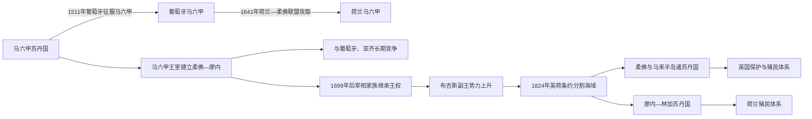

# 马来港市与苏丹国

## 时间

前1千纪—19世纪

## 概括

马来半岛位于季风航线和马六甲海峡要冲，早期吉打、狼牙修等港市连接印度洋、南海和内陆物产。15世纪马六甲借助港务制度、外交保护和马来语商贸网络兴起，伊斯兰教与马来王权由此广泛传播。1511年后，其政治传统由柔佛、霹雳、彭亨等苏丹国继承。

马六甲—柔佛是一条可追踪的核心王统，但半岛从未只有一个王朝。吉打、霹雳、彭亨、雪兰莪、吉兰丹、登嘉楼和森美兰各有独立世系；柔佛—廖内内部又长期由苏丹、宰相、天猛公和武吉斯副王分享权力。

## 港市王权与苏丹国演变图

马来港市政权的延续既靠王室血统，也靠海人、商帮、布吉斯军事集团和欧洲公司之间的联盟。马六甲被征服后，柔佛—廖内继承其政治声望，但19世纪的殖民划界把原有跨海王权拆分为不同属地。

## 建立背景与崛起机制

- 马六甲海峡是印度洋与南海间最短航路，吉打等港口以锡、金、森林物产、补给和转口贸易发展。
- 约1400年，来自巨港—淡马锡政治网络的拜里米苏拉在马六甲建立新中心。其具体出身、建城年份及是否本人皈依伊斯兰均有争议。
- 马六甲设置多名沙班达尔管理不同商人群体，提供仓储、法律、领航与治安，以低交易成本吸引古吉拉特、泰米尔、阿拉伯、华人和群岛商人。
- 与明朝的朝贡和使节往来提高国际地位，并帮助制衡阿瑜陀耶压力；与巴赛等穆斯林王室联姻则加强伊斯兰商业合法性。
- 苏丹依赖宰相、海军统帅、天猛公、港务官、海人集团和属地首领。王权强弱取决于能否平衡这些精英，而非仅由血缘继承决定。

## 马六甲统治者世系

早期马来编年、明朝记录和葡萄牙记述对前三位统治者的姓名、人数和皈依时间不能完全对应。下表把拜里米苏拉与米格特·伊斯干达沙分别列出，并明确这不是无争议结论。

| 顺序 | 统治者 | 在位时间 | 继承关系 | 关键事件 / 备注 |
|---|---|---|---|---|
| 1 | **拜里米苏拉**（Parameswara） | 约1400—1414年 | 开国者 | 从淡马锡转至马六甲；1411年亲赴明朝；是否皈依并改称伊斯干达沙存在争议 |
| 2 | 米格特·伊斯干达沙（Megat Iskandar Shah） | 1414—1424年 | 通常视为前王之子 | 中国记录中独立出现；部分传统把他与拜里米苏拉视为同一人 |
| 3 | 穆罕默德沙（Muhammad Shah） | 1424—1444年 | 前王之子 | 伊斯兰宫廷礼仪逐步巩固；早期材料也称斯里·摩诃罗阇 |
| 4 | 阿布·沙希德沙（Abu Syahid Shah） | 1444—1446年 | 前王幼子 | 宫廷派系斗争中遇害 |
| 5 | **穆扎法沙**（Muzaffar Shah） | 1446—1459年 | 前王异母兄 | 在宰相敦霹雳支持下即位；抵御暹罗进攻，伊斯兰国家制度更加明确 |
| 6 | **曼苏尔沙**（Mansur Shah） | 1459—1477年 | 前王之子 | 马六甲贸易、外交与属地网络高峰 |
| 7 | 阿拉乌丁·里亚亚特沙（Alauddin Riayat Shah） | 1477—1488年 | 前王之子 | 维护港口治安并延续扩张；死因记载不一 |
| 8 | **马末沙**（Mahmud Shah） | 1488—1511年在马六甲；流亡王权延续至1528年 | 前王之子 | 1511年葡萄牙攻占都城；先后在民丹等地组织反攻 |
| — | 艾哈迈德沙（Ahmad Shah） | 约1511—1513年共治 / 受命统军 | 马末沙之子 | 失城后被父亲立为王或共治者，后遭处死；是否计正式苏丹有分歧 |

## 柔佛—廖内统治者世系

1699年马六甲直系绝嗣，宰相家族继位；1718—1722年小王拉惹自称马末二世遗腹子，造成并立。1819年后又出现英、荷分别支持的两位苏丹，因此须区分名义称号和实际控制。

| 顺序 | 苏丹 / 并立者 | 在位时间 | 王室与继承 | 关键事件 / 备注 |
|---|---|---|---|---|
| 1 | **阿拉乌丁·里亚亚特沙二世** | 1528—1564年 | 马末沙之子，马六甲王室 | 建立柔佛王国；与亚齐、葡属马六甲形成三角战争 |
| 2 | 穆扎法沙二世 | 1564—1570年 | 前王之子 | 幼年即位，宫廷迁移频繁 |
| 3 | 阿卜杜勒·贾利勒一世 | 1570—1571年 | 前王外甥 / 王族 | 童年即位，早逝 |
| 4 | 阿里·贾拉·阿卜杜勒·贾利勒二世 | 1571—1597年 | 王族姻亲与摄政者继位 | 重建柔佛，持续对葡战争 |
| 5 | 阿拉乌丁·里亚亚特沙三世 | 1597—1615年 | 前王之子 | 在亚齐与葡萄牙压力间周旋，被亚齐俘获后死亡 |
| 6 | 阿卜杜拉·马亚特沙 | 1615—1623年 | 前王之弟 | 受亚齐干预，宫廷流亡 |
| 7 | 阿卜杜勒·贾利勒沙三世 | 1623—1677年 | 前王侄 | 1641年与荷兰联合攻取马六甲；柔佛贸易复兴 |
| 8 | 易卜拉欣沙 | 1677—1685年 | 前王之侄 / 养嗣 | 与占碑冲突后重建中心 |
| 9 | **马末沙二世** | 1685—1699年 | 前王之子，马六甲直系末王 | 无子遇刺，造成王统断裂 |
| 10 | 阿卜杜勒·贾利勒沙四世 | 1699—1720年 | 宰相，本达哈拉王室开端 | 由贵族拥立；遭小王拉惹挑战并被杀 |
| — | 小王拉惹／阿卜杜勒·贾利勒·拉赫马特沙 | 1718—1722年并立 | 自称马末二世遗腹子，身份有争议 | 得米南加保和海人支持夺位，后被武吉斯—本达哈拉联盟逐出 |
| 11 | **苏莱曼·巴德鲁·阿拉姆沙** | 1722—1760年 | 贾利勒四世之子 | 借武吉斯军力复位；廖内副王由武吉斯世袭，苏丹实权受限 |
| 12 | 阿卜杜勒·贾利勒·穆阿扎姆沙 | 1760—1761年 | 前王之子 | 在位短暂 |
| 13 | 艾哈迈德·里亚亚特沙 | 1761—1770年 | 前王之子 | 年幼即位，武吉斯副王影响显著 |
| 14 | **马末沙三世** | 1770—1811年 | 前王之弟 | 荷兰与武吉斯冲突、宫廷迁至林加；死后无明确嫡嗣 |
| 15 | 阿卜杜勒·拉赫曼·穆阿扎姆沙 | 1811—1819年为柔佛—廖内苏丹；其后为廖内—林加苏丹至1832年 | 前王之子，荷兰及武吉斯支持 | 因不在临终现场、母系身份等遭兄长派质疑 |
| — | **胡先沙**（Hussein Shah） | 1819—1835年，英国支持的柔佛 / 新加坡名义苏丹 | 马末三世长子 | 1819年承认英国取得新加坡；实际地方权力有限 |
| — | 阿里·伊斯干达沙 | 1835—1855年名义继承 | 胡先沙之子 | 仅有礼仪地位，1855年把大部政治权力让给天猛公家族 |

## 柔佛—廖内的实际权力分工

| 角色 | 主要基础 | 作用 |
|---|---|---|
| 苏丹 | 王统、伊斯兰礼仪与册封 | 提供合法性，但不总掌握军队和税收 |
| 本达哈拉（宰相） | 彭亨与马来贵族网络 | 摄政、继承和地方行政；1699年后成为王室 |
| 廖内副王 | 武吉斯军事与贸易集团 | 1722年后世袭，控制舰队、港口和外交的重要部分 |
| 天猛公 | 柔佛本土、新加坡和海人网络 | 19世纪在英国支持与甘蜜、胡椒经济下成为实际统治者 |
| 海人（Orang Laut） | 海峡航道、岛屿与舰队 | 为马六甲及柔佛王室提供领航、军事和港口控制 |
| 欧洲公司 | 炮舰、堡垒、贸易合同 | 葡、荷、英依次以结盟和条约把商业优势转成政治控制 |

## 其他并立苏丹国

| 政权 | 起源与王统关系 | 说明 |
|---|---|---|
| 吉打 | 早期港市传统很深，后形成独立苏丹世系 | 并非马六甲分封；早期皈依和首王年代有多种传统 |
| 霹雳 | 1528年前后由马末沙之子穆扎法建立 | 继承马六甲王室血统，靠霹雳河锡矿和地方首领维持 |
| 彭亨 | 15世纪受马六甲王族统治，后与柔佛王室多次合流 | 王统和本达哈拉家族对柔佛政治影响深 |
| 雪兰莪 | 18世纪武吉斯首领建立苏丹国 | 与廖内武吉斯副王网络相关，并非马六甲直系王位 |
| 森美兰 | 米南加保移民地区形成多个酋邦，1773年后拥立最高统治者 | 采用母系习俗与酋长选举，不能套用普通长子继承表 |
| 登嘉楼 | 18世纪初形成独立苏丹国 | 早期获柔佛—廖内政治支持，后在暹罗与英国间周旋 |
| 吉兰丹 | 多个东北马来政权整合而成 | 与北大年、暹罗及登嘉楼关系复杂，王统不是马六甲旁支的简单延长 |

这些政权是并行国家，不是马六甲—柔佛王表中的“漏代”。若把所有统治者强排为一个马来王朝，会掩盖半岛多中心政治和不同继承制度。

## 重要事件

- 前1千纪至公元早期，吉打等港市以铁、锡、森林物产和转口贸易连接印度洋与半岛内陆。
- 约1400年拜里米苏拉在马六甲建立宫廷；1411年亲赴明朝，获得外交承认。
- 1440—1450年代穆扎法沙与敦霹雳抵御暹罗进攻，马六甲扩大对半岛和苏门答腊港口的影响。
- 曼苏尔沙时期港务制度、马来语商业网络和伊斯兰宫廷文化达到高峰。
- 1511年阿尔布克尔克率葡军攻占马六甲；马末沙撤至民丹，多次组织反攻。
- 1528年阿拉乌丁二世建立柔佛；马末沙另一子在霹雳建立王统，马六甲政治传统分支延续。
- 16—17世纪柔佛、亚齐和葡属马六甲围绕海峡形成三角战争，首都多次迁移。
- 1641年荷兰联合柔佛攻占葡属马六甲，但荷兰更重视巴达维亚，柔佛港口一度复兴。
- 1699年马末二世遇刺且无嗣，本达哈拉家族继位；海人和部分地方精英对新王室效忠动摇。
- 1718—1722年小王拉惹争位，武吉斯力量介入并帮助苏莱曼复位，廖内副王制度形成。
- 18世纪武吉斯、米南加保移民与暹罗势力参与半岛竞争，锡矿和胡椒成为主要财政来源。
- 1784年荷兰击败廖内武吉斯集团，柔佛—廖内宫廷迁移，欧洲公司控制加强。
- 1819年英国扶立胡先沙并建立新加坡据点；荷兰承认阿卜杜勒·拉赫曼，旧王国出现两个名义苏丹。
- 1824年英荷条约以海峡划分势力范围，柔佛—新加坡与廖内—林加的政治分裂被殖民边界固定。

## 鼎盛、衰落与政权转型

马六甲鼎盛依赖航道位置、港务法、商人保护、明朝外交、海人舰队和敦霹雳等大臣维持的精英平衡。结构弱点是财政高度依赖单一港口，王位幼主与宫廷派系可削弱军政；外部的葡萄牙舰炮、印度洋堡垒网络和本地盟友提供军事压力。1511年围城、内部防御失调与葡军控制河口是直接失城过程，但马六甲王室和贸易网络并未同时消失。

柔佛通过岛屿、河口和海人机动性多次复兴，1641年后达到新的贸易高峰。1699年绝嗣破坏王统合法性，武吉斯副王、本达哈拉和天猛公分享实权；荷兰、英国利用继承争端缔结排他条约。1819年的双重册立和1824年英荷划界，最终把旧海上王国拆成不同殖民势力范围。

## 演变关系

早期港市与马六甲海峡贸易承接[早期王国与室利佛逝](/%E4%BA%BA%E6%96%87%E7%A7%91%E5%AD%A6/%E5%8E%86%E5%8F%B2/%E4%B8%9C%E5%8D%97%E4%BA%9A/%E5%8D%B0%E5%B0%BC/%E6%97%A9%E6%9C%9F%E7%8E%8B%E5%9B%BD%E4%B8%8E%E5%AE%A4%E5%88%A9%E4%BD%9B%E9%80%9D.md)的海上网络，也与[伊斯兰化与港口苏丹国](/%E4%BA%BA%E6%96%87%E7%A7%91%E5%AD%A6/%E5%8E%86%E5%8F%B2/%E4%B8%9C%E5%8D%97%E4%BA%9A/%E6%B5%B7%E5%B2%9B%E4%B8%9C%E5%8D%97%E4%BA%9A/%E4%BC%8A%E6%96%AF%E5%85%B0%E5%8C%96%E4%B8%8E%E6%B8%AF%E5%8F%A3%E8%8B%8F%E4%B8%B9%E5%9B%BD.md)相连。19世纪各苏丹国与英国缔约、锡矿资本和海峡殖民地扩张，进入[英属马来亚与殖民社会](/%E4%BA%BA%E6%96%87%E7%A7%91%E5%AD%A6/%E5%8E%86%E5%8F%B2/%E4%B8%9C%E5%8D%97%E4%BA%9A/%E9%A9%AC%E6%9D%A5%E8%A5%BF%E4%BA%9A/%E8%8B%B1%E5%B1%9E%E9%A9%AC%E6%9D%A5%E4%BA%9A%E4%B8%8E%E6%AE%96%E6%B0%91%E7%A4%BE%E4%BC%9A.md)。
