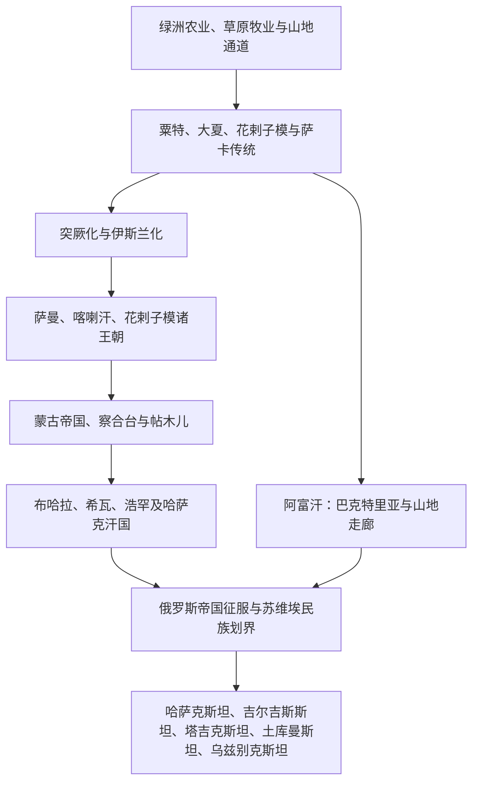

# 中亚历史

## 范围与概括

中亚是欧亚大陆腹地的绿洲、草原、山地与沙漠交错地带。阿姆河、锡尔河、天山、帕米尔、里海东岸和哈萨克草原把中国西域、伊朗高原、俄罗斯、南亚和西亚连接起来。这里的历史并非“东西方之间的空白地带”：粟特商人、河中城市、突厥诸汗国、萨曼与花剌子模、蒙古和帖木儿、三大汗国、俄罗斯帝国与苏联，都以不同方式重组了区域社会。

## 阅读框架

| 主线 | 核心问题 |
|---|---|
| 绿洲与草原 | 城市农业、游牧、山地牧业如何相互依赖，而非彼此隔绝？ |
| 丝绸之路 | 粟特商人、城镇、商队、宗教和技术如何跨越欧亚传播？ |
| 突厥化与伊斯兰化 | 语言、政治精英和宗教如何在不同地区以不同速度发生变化？ |
| 蒙古与帖木儿 | 征服、人口流动和城市重建如何改变河中与草原秩序？ |
| 俄罗斯与苏联 | 殖民征服、棉花经济、民族划界和计划经济如何塑造现代边界？ |
| 现代国家 | 五国独立与阿富汗战争如何重新定义国家、族群和区域合作？ |

## 文明与历史空间入口

| 历史空间 | 类型 | 入口 | 主线提示 |
|---|---|---|---|
| 河中地区 | 绿洲文明与历史地理区 | [河中地区](/%E4%BA%BA%E6%96%87%E7%A7%91%E5%AD%A6/%E5%8E%86%E5%8F%B2/%E4%B8%AD%E4%BA%9A/%E6%B2%B3%E4%B8%AD%E5%9C%B0%E5%8C%BA/README.md) | 阿姆河—锡尔河之间的粟特、撒马尔罕、布哈拉、费尔干纳与花剌子模。 |
| 草原汗国 | 跨欧亚草原政治共同史 | [草原汗国](/%E4%BA%BA%E6%96%87%E7%A7%91%E5%AD%A6/%E5%8E%86%E5%8F%B2/%E4%B8%AD%E4%BA%9A/%E8%8D%89%E5%8E%9F%E6%B1%97%E5%9B%BD/README.md) | 萨卡、突厥、蒙古、乌兹别克与哈萨克草原政治传统；不能视为单一现代民族直系谱系。 |

## 区域共同史与跨境专题

[中亚通史](/%E4%BA%BA%E6%96%87%E7%A7%91%E5%AD%A6/%E5%8E%86%E5%8F%B2/%E4%B8%AD%E4%BA%9A/_%E9%80%9A%E5%8F%B2/README.md)集中维护绿洲—草原关系、丝绸之路、突厥化、伊斯兰化、蒙古与帖木儿、俄罗斯征服及苏维埃民族划界等跨越现代国界的共同过程。

## 现代国家与政治实体入口

| 国家 | 入口 | 历史主线 |
|---|---|---|
| 哈萨克斯坦 | [哈萨克斯坦历史](/%E4%BA%BA%E6%96%87%E7%A7%91%E5%AD%A6/%E5%8E%86%E5%8F%B2/%E4%B8%AD%E4%BA%9A/%E5%93%88%E8%90%A8%E5%85%8B%E6%96%AF%E5%9D%A6/README.md) | 草原、哈萨克汗国、俄国征服、苏维埃化与独立共和国 |
| 吉尔吉斯斯坦 | [吉尔吉斯斯坦历史](/%E4%BA%BA%E6%96%87%E7%A7%91%E5%AD%A6/%E5%8E%86%E5%8F%B2/%E4%B8%AD%E4%BA%9A/%E5%90%89%E5%B0%94%E5%90%89%E6%96%AF%E6%96%AF%E5%9D%A6/README.md) | 天山牧民、突厥传统、浩罕与俄国、苏维埃及政治转型 |
| 塔吉克斯坦 | [塔吉克斯坦历史](/%E4%BA%BA%E6%96%87%E7%A7%91%E5%AD%A6/%E5%8E%86%E5%8F%B2/%E4%B8%AD%E4%BA%9A/%E5%A1%94%E5%90%89%E5%85%8B%E6%96%AF%E5%9D%A6/README.md) | 粟特—波斯语传统、河中诸王朝、苏维埃划界与内战 |
| 土库曼斯坦 | [土库曼斯坦历史](/%E4%BA%BA%E6%96%87%E7%A7%91%E5%AD%A6/%E5%8E%86%E5%8F%B2/%E4%B8%AD%E4%BA%9A/%E5%9C%9F%E5%BA%93%E6%9B%BC%E6%96%AF%E5%9D%A6/README.md) | 梅尔夫、帕提亚、土库曼部落、俄国征服与天然气国家 |
| 乌兹别克斯坦 | [乌兹别克斯坦历史](/%E4%BA%BA%E6%96%87%E7%A7%91%E5%AD%A6/%E5%8E%86%E5%8F%B2/%E4%B8%AD%E4%BA%9A/%E4%B9%8C%E5%85%B9%E5%88%AB%E5%85%8B%E6%96%AF%E5%9D%A6/README.md) | 河中绿洲、帖木儿、布哈拉—希瓦—浩罕与现代共和国 |
| 阿富汗 | [阿富汗历史](/%E4%BA%BA%E6%96%87%E7%A7%91%E5%AD%A6/%E5%8E%86%E5%8F%B2/%E4%B8%AD%E4%BA%9A/%E9%98%BF%E5%AF%8C%E6%B1%97/README.md) | 位于中亚、伊朗和南亚交会处，保留在本目录统一维护 |

## 边界说明

- 现代中亚五国采用常用国际统计范围；阿富汗因其巴克特里亚、加兹尼、杜兰尼及苏联战争主线，保留为中亚关联国家。
- 蒙古已在本库的东亚框架下处理；中国新疆及西域历史归入中国史。它们在丝绸之路和草原专题中互链，而不重复建库。
- “河中地区”是历史地理概念，核心是阿姆河与锡尔河之间的绿洲，并不等同于今日单一国家。

## 上级与相邻区域

- [历史总览](/%E4%BA%BA%E6%96%87%E7%A7%91%E5%AD%A6/%E5%8E%86%E5%8F%B2/README.md)
- [东亚历史](/%E4%BA%BA%E6%96%87%E7%A7%91%E5%AD%A6/%E5%8E%86%E5%8F%B2/%E4%B8%9C%E4%BA%9A/README.md)
- [北亚历史](/%E4%BA%BA%E6%96%87%E7%A7%91%E5%AD%A6/%E5%8E%86%E5%8F%B2/%E5%8C%97%E4%BA%9A/README.md)
- [西亚历史](/%E4%BA%BA%E6%96%87%E7%A7%91%E5%AD%A6/%E5%8E%86%E5%8F%B2/%E8%A5%BF%E4%BA%9A/README.md)
- [南亚历史](/%E4%BA%BA%E6%96%87%E7%A7%91%E5%AD%A6/%E5%8E%86%E5%8F%B2/%E5%8D%97%E4%BA%9A/README.md)
