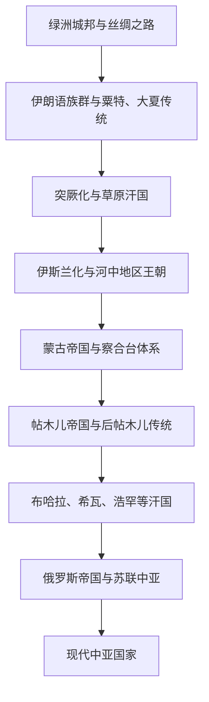

# 中亚历史

## 概括

中亚是欧亚大陆内部的枢纽区域，连接中国西域、伊朗高原、印度次大陆、草原世界和俄罗斯方向。它的历史主线不能只按现代国家划分：河中绿洲城邦、丝绸之路贸易、印欧与伊朗语族群、突厥化、伊斯兰化、蒙古帝国、帖木儿传统、汗国和俄罗斯扩张共同塑造了中亚格局。

## 演变图

## 区域入口

| 区域 / 主题 | 入口 | 主线提示 |
|---|---|---|
| 中亚通史 | [中亚通史](/%E4%BA%BA%E6%96%87%E7%A7%91%E5%AD%A6/%E5%8E%86%E5%8F%B2/%E4%B8%AD%E4%BA%9A/_%E9%80%9A%E5%8F%B2/README.md) | 跨现代国家的绿洲、草原、伊斯兰化、蒙古与俄罗斯扩张主线。 |
| 河中地区 | [河中地区](/%E4%BA%BA%E6%96%87%E7%A7%91%E5%AD%A6/%E5%8E%86%E5%8F%B2/%E4%B8%AD%E4%BA%9A/%E6%B2%B3%E4%B8%AD%E5%9C%B0%E5%8C%BA/README.md) | 阿姆河、锡尔河之间的粟特、撒马尔罕、布哈拉和帖木儿传统。 |
| 草原汗国 | [草原汗国](/%E4%BA%BA%E6%96%87%E7%A7%91%E5%AD%A6/%E5%8E%86%E5%8F%B2/%E4%B8%AD%E4%BA%9A/%E8%8D%89%E5%8E%9F%E6%B1%97%E5%9B%BD/README.md) | 突厥、蒙古、钦察、哈萨克等草原政治传统。 |
| 阿富汗 | [阿富汗](/%E4%BA%BA%E6%96%87%E7%A7%91%E5%AD%A6/%E5%8E%86%E5%8F%B2/%E4%B8%AD%E4%BA%9A/%E9%98%BF%E5%AF%8C%E6%B1%97/README.md) | 连接伊朗、印度和中亚的山地走廊与近现代国家。 |

## 相关区域

- 中国西域和北方族群可与中国民族史、突厥语族与北方草原对读。
- 伊朗高原方向参见[伊朗](/%E4%BA%BA%E6%96%87%E7%A7%91%E5%AD%A6/%E5%8E%86%E5%8F%B2/%E8%A5%BF%E4%BA%9A%E4%B8%8E%E5%8C%97%E9%9D%9E/%E4%BC%8A%E6%9C%97/README.md)。
- 印度西北方向参见[南亚](/%E4%BA%BA%E6%96%87%E7%A7%91%E5%AD%A6/%E5%8E%86%E5%8F%B2/%E5%8D%97%E4%BA%9A/README.md)。
- 草原汗国方向参见[草原汗国](/%E4%BA%BA%E6%96%87%E7%A7%91%E5%AD%A6/%E5%8E%86%E5%8F%B2/%E4%B8%AD%E4%BA%9A/%E8%8D%89%E5%8E%9F%E6%B1%97%E5%9B%BD/README.md)；俄罗斯方向归入欧洲东斯拉夫目录，参见[俄罗斯](/%E4%BA%BA%E6%96%87%E7%A7%91%E5%AD%A6/%E5%8E%86%E5%8F%B2/%E6%AC%A7%E6%B4%B2/%E6%96%AF%E6%8B%89%E5%A4%AB/%E4%B8%9C%E6%96%AF%E6%8B%89%E5%A4%AB/%E4%BF%84%E7%BD%97%E6%96%AF.md)。
