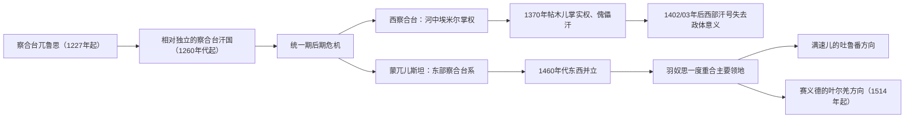

# 察合台汗国与蒙兀儿斯坦统治者表

## 时间

1227—1514年（西察合台的名义汗延续至1402/03年；1514年后进入叶尔羌与吐鲁番等继承政权）

## 使用说明

本表覆盖三条必须区分的序列：

1. **统一期察合台兀鲁思 / 汗国**：从成吉思汗把中亚兀鲁思分给察合台，到14世纪40年代东西政治结构分裂。
2. **西察合台**：以河中为中心，1346年后实际权力多在哈剌兀纳、巴鲁剌思等部族埃米尔手中；可汗经常只是成吉思汗法统的名义载体。1370年帖木儿掌权后，所立汗为纯粹礼仪君主。
3. **蒙兀儿斯坦**：以伊犁、七河、天山与东部绿洲为核心的东察合台体系。其内部也会并立，朵豁剌惕等埃米尔能废立可汗。1514年赛义德汗在喀什噶尔—叶尔羌建立新国家，满速儿汗则保有吐鲁番方向；此后不再把两个继承政权伪装成仍然统一的“蒙兀儿斯坦”。

在位年常因伊斯兰历换算、共治、名义册立与实际控制范围不同而相差一至数年。本表用“约”“争议”标出差异；复位、摄政、并立和非察合台系傀儡均单列，不以“后期诸汗”合并。

## 统一期察合台兀鲁思与汗国

| 顺序 | 统治者 | 在位 / 掌权时间 | 王室与继承关系 | 身份、实际权力与关键事件 |
|---:|---|---|---|---|
| 1 | **察合台（Chagatai）** | 1227—1242年前后 | 成吉思汗次子、兀鲁思受封者 | 领有从河中至伊犁、喀什一带的牧地与属民；财政官最初仍向蒙古大汗负责。卒年有1241、1242及1244/45等说。 |
| 2 | 哈剌旭烈（Qara Hülegü） | 约1242—1246（第一次） | 察合台长子木阿秃干之子 | 祖父指定继承；贵由即位后将其废黜。 |
| 3 | 也速蒙哥（Yesü Möngke） | 1246—1251/52 | 察合台之子、前任叔父 | 由贵由任命；蒙哥大汗清洗窝阔台—察合台反对集团时被废并处死。 |
| 2（复位） | 哈剌旭烈 | 1251/52 | 蒙哥恢复其地位 | 在返回封地途中去世，未能稳定亲政。 |
| — | **斡儿干纳哈敦（Orghana Khatun）** | 1252—1260摄政 | 哈剌旭烈之妻 | 代表幼子管理兀鲁思，与蒙古大汗宫廷及穆斯林城市官僚周旋；她是实际统治者，不能从序列删去。 |
| 4 | 木八剌沙（Mubarak Shah） | 约1252—1260为幼主 / 名义继承者；1266短暂亲政 | 哈剌旭烈与斡儿干纳之子 | 是否在摄政期已正式称汗存在分歧；通常视为第一位公开成为穆斯林的察合台系汗。 |
| 5 | 阿鲁忽（Alghu） | 1260—1265/66 | 察合台之孙、拜答儿之子 | 阿里不哥起初任命，后转而自主并控制河中财政；由此开始可较明确地称“察合台汗国”。 |
| 4（复位） | 木八剌沙 | 1266 | 阿鲁忽去世后由斡儿干纳支持 | 统治仅数月，被八剌夺位；后来在阿富汗方向活动。 |
| 6 | 八剌（Baraq） | 1266—1271 | 察合台曾孙 | 与窝阔台系海都竞争又合作；1269年前后塔剌思会盟划分利益，进攻呼罗珊失败后势衰。 |
| 7 | 涅古伯（Negübei） | 约1271—1272 | 察合台宗室 | 海都支持的可汗；试图摆脱控制后被击败身亡。 |
| 8 | 不花帖木儿（Buqa Temür） | 约1272—1282 | 察合台宗室 | 依赖海都，中央权威有限；具体终年有1282至1287等说，本表按都哇掌权约1282年起计。 |
| 9 | **都哇（Duwa）** | 约1282—1307 | 八剌之子 | 长期与海都结盟对抗元朝；海都死后转向和解，1304年前后参与蒙古诸汗国间承认格局，扩大察合台系实力。 |
| 10 | 宽阇（Könchek） | 1307—1308 | 都哇之子 | 在位很短，死后诸兄弟与宗室争位。 |
| 11 | 塔里忽（Taliqu） | 1308—1309 | 察合台宗室，出自不里一支 | 以武力夺位并为穆斯林；遭都哇诸子和贵族反对而被杀。 |
| 12 | 怯别（Kebek） | 1309（第一次） | 都哇之子 | 平定塔里忽后主持忽里勒台，主动把汗位交给兄长也先不花。 |
| 13 | 也先不花一世（Esen Buqa I） | 1309/10—1318 | 都哇之子 | 与元朝及伊利汗国交战；对东西两线作战使财政和部族承压。 |
| 12（复位） | **怯别** | 1318—1326 | 也先不花之弟 | 更重视河中城市财政，在那黑沙不附近建宫城，推行货币与行政整顿；其名进入“怯别钱”等称呼。 |
| 14 | 燕只吉台（Eljigidey） | 1326—1329/30 | 都哇之子 | 延续河中取向，对外与伊利汗国和元朝互动；在位年代有一年左右误差。 |
| 15 | 都哇帖木儿（Duwa Temür） | 1329—1330 | 都哇之子 | 短期继位，王室频繁更换削弱协调能力。 |
| 16 | **塔儿麻失里（Tarmashirin）** | 约1331—1334（另有1327年起说） | 都哇之子 | 改宗伊斯兰、常驻河中并向印度方向用兵；东部游牧贵族以忽视传统巡行和草原利益为由将其推翻。 |
| 17 | 不赞（Buzan） | 1334—1335 | 都哇家族后裔，具体父系记载不一 | 由反塔儿麻失里集团拥立；尝试恢复草原贵族优势，旋即被推翻。 |
| 18 | 敞失（Changshi） | 1335—1338 | 都哇之子 | 统治仍依赖部族联盟；其死后王位斗争加剧。 |
| 19 | 也孙帖木儿（Yesun Temür） | 约1338—1342 | 都哇系宗室 | 与阿里苏丹的关系可能是先后、并立或夺位，编年材料不一致。 |
| — | 阿里苏丹（Ali Sultan） | 约1339/42 | 常被视为窝阔台系或非正统夺位者 | 在河中强推自身权威；不是公认的连续察合台男系继承者，故以争议项列入。 |
| 20 | 穆罕默德一世·伊本·普剌（Muhammad I ibn Pulad） | 1342—1343 | 察合台宗室，谱系细节不明 | 短期可汗，实际控制范围有限。 |
| 21 | 合赞汗（Qazan Khan） | 1343—1346/47 | 都哇之孙、牙撒兀儿之子 | 试图恢复可汗中央权力，与哈剌兀纳埃米尔合扎罕战争，战败被杀；其死是统一政治结构瓦解的直接转折。 |

## 西察合台、河中埃米尔与帖木儿傀儡汗

| 顺序 | 统治者 | 在位 / 控制时间 | 王室或支持者 | 身份、并立与关键说明 |
|---:|---|---|---|---|
| 1 | 丹尼什曼德只（Danishmendji） | 1346/47—1348 | 窝阔台系；合扎罕拥立 | 非察合台男系，作为成吉思汗后裔提供法统；实权在合扎罕。 |
| 2 | 巴颜忽里（Bayan Quli） | 1348—1358 | 察合台系；合扎罕拥立 | 名义可汗，合扎罕掌军政；后被合扎罕之子阿卜杜拉杀死。 |
| 3 | 沙帖木儿（Shah Temur） | 1358 | 察合台系；阿卜杜拉拥立 | 任期极短；合扎罕死后埃米尔联盟迅速分裂。 |
| — | **秃忽鲁帖木儿（Tughlugh Timur）** | 1360、1361年两次入河中；至1363年主张统合 | 蒙兀儿斯坦汗 | 东部可汗趁西部无主入侵，任命地方埃米尔并留下儿子亦里牙思火者；这是武力重合，不是西部自然继承。 |
| — | 亦里牙思火者（Ilyas Khoja） | 1361—1365年在西部任总管或争夺者 | 秃忽鲁帖木儿之子 | 父死后返回东部称汗；1365年泥沼之战击败帖木儿—忽辛联军，却未能取得撒马尔罕。 |
| 4 | 阿迪勒苏丹（Adil Sultan） | 1363短期；另有1366—1370说 | 西部部族联盟拥立 | 名义可汗。与合不勒沙的先后关系在不同编年表中相反，无法压成无争议单线。 |
| 5 | 合不勒沙（Khabul Shah） | 约1364—1370；另有1364—1366说 | 埃米尔忽辛拥立 | 主要服务于忽辛的成吉思汗法统；1370年帖木儿击败忽辛后将其处死。 |
| 6 | **速尤尔哈特迷失（Suyurghatmish）** | 1370—1388 | 窝阔台系；帖木儿拥立 | 纯名义汗，诏令和钱币提供形式合法性；实际最高权力属于埃米尔帖木儿。 |
| 7 | 马哈茂德汗（Sultan Mahmud） | 1388—1402/03 | 前任之子；帖木儿拥立 | 继续作为礼仪可汗；死后西部不再有稳定、普遍承认的汗位序列。帖木儿诸王偶尔仍使用成吉思汗宗室作仪式人物，但不构成独立西察合台政体。 |

西察合台的“灭亡”不是一场外敌攻破首都：合赞汗之死后，可汗失去独立军队和财政，部族埃米尔以傀儡汗相互竞争；秃忽鲁帖木儿的入侵进一步打乱联盟；1370年帖木儿消灭忽辛是直接权力转移。1402/03年马哈茂德汗去世，只是名义汗制最后消失，实际政权早已是帖木儿帝国。

## 蒙兀儿斯坦主线与并立支系

| 顺序 | 统治者 / 实际掌权者 | 在位或控制时间 | 继承关系与范围 | 状态、并立和关键事件 |
|---:|---|---|---|---|
| 1 | **秃忽鲁帖木儿（Tughlugh Timur）** | 约1347/48—1363 | 察合台后裔；朵豁剌惕埃米尔扶立 | 重建东部汗权并改宗伊斯兰；两次进入河中，短暂主张统合整个察合台兀鲁思。 |
| 2 | 亦里牙思火者（Ilyas Khoja） | 1363—约1368 | 前任之子 | 继续争夺河中；西征受挫后返回东部，后被朵豁剌惕势力推翻或杀害。 |
| — | **哈马儿丁·朵豁剌惕（Qamar al-Din Dughlat）** | 约1368—1389/92实际掌权 | 非成吉思汗系部族首领、夺权者 | 不能取得公认汗号，却控制大部蒙兀儿斯坦；反复抵抗帖木儿远征。其与黑的儿火者的控制时间重叠。 |
| 3 | **黑的儿火者（Khizr Khoja）** | 约1389—1399/1403 | 秃忽鲁帖木儿之子 | 幼时被藏匿，成年后恢复察合台系汗位；与帖木儿议和联姻，逐步结束哈马儿丁的夺权期。终年有1399与1403等说。 |
| 4 | 沙姆斯·贾汉（Shams-i Jahan） | 约1399/1403—1408 | 黑的儿火者之子 | 承继汗位，实际控制仍依赖部族埃米尔。 |
| 5 | 穆罕默德汗（Muhammad Khan） | 1408—1415 | 前任之弟 | 推动伊斯兰制度并与帖木儿诸王周旋。 |
| 6 | 纳黑失·贾汉（Naqsh-i Jahan） | 1415—1418 | 穆罕默德汗之侄或同族晚辈 | 在位短，地方部族和王室支系竞争持续。 |
| 7 | **歪思汗（Uwais Khan）** | 1418—1421（第一次） | 黑的儿火者一支 | 与瓦剌长期战争；具体初年和复位节点有一至数年差异。 |
| 8 | 失儿·穆罕默德（Sher Muhammad） | 1421—1425 | 王室同支挑战者 | 获部分部族支持夺位，与歪思长期并争。 |
| 7（复位） | **歪思汗** | 1425—1428/29（第二次） | 击败竞争者复位 | 多次对瓦剌作战，最终战死；其后两子分裂支持集团。 |
| — | 赛都克汗（Satuq Khan） | 1429—1434争议统治 | 帖木儿王朝扶植的成吉思汗宗室 | 乌鲁伯格用其挑战东部汗权，主要控制喀什噶尔、阿克苏一带，未能替代也先不花二世统治全境。 |
| 9 | **也先不花二世（Esen Buqa II）** | 1429—1462 | 歪思汗之子 | 朵豁剌惕等东部集团支持；面对帖木儿压力，并接纳克烈、贾尼别克率领的“乌兹别克—哈萨克”迁入七河。 |
| 10a | **羽奴思汗（Yunus Khan）** | 1462—1469/72控制西部 | 歪思汗之子、也先不花之兄 | 由帖木儿势力支持回归，主要控制西部与塔什干方向。 |
| 10b | 笃思忒·穆罕默德（Dost Muhammad） | 1462—1468/69控制东部 | 也先不花二世之子 | 以阿克苏等地为中心，与叔父羽奴思并立。 |
| — | 怯别速檀斡黑兰（Kebek Sultan Oghlan） | 1469短期 | 笃思忒·穆罕默德之子 | 东部部分贵族拥立，旋被推翻；控制范围很小但属不可省略的短期继承者。 |
| 10（重合主要领地） | **羽奴思汗** | 约1469/72—1487 | 兼并侄辈领地 | 逐步取得塔什干和多数蒙兀儿集团承认；“统一”仍是部族联盟意义，不等于所有东部绿洲稳定直辖。 |
| 11a | 马哈木汗（Sultan Mahmud Khan） | 1487—1508，西部 / 塔什干 | 羽奴思长子 | 与帖木儿诸王、昔班尼汗和哈萨克竞争；失去塔什干后投奔昔班尼并被杀。 |
| 11b | 艾哈迈德·阿剌黑（Ahmad Alaq） | 1487—1503，东部 | 羽奴思次子 | 控制阿克苏、东部天山一带，与兄长并立；多次对瓦剌及周边用兵，败于昔班尼后不久去世。 |
| 12 | **满速儿汗（Mansur Khan）** | 1503—1543，1508后为东部主要汗 | 艾哈迈德之子 | 以吐鲁番方向为中心；与弟弟赛义德争位。1514年后其政权属于吐鲁番方向的东察合台继承国。 |
| — | **赛义德汗（Sultan Said Khan）** | 1514—1533，叶尔羌继承国 | 艾哈迈德之子、满速儿之弟 | 1514年击败朵豁剌惕米尔咱阿布·伯克尔，占领喀什噶尔、叶尔羌；由此建立新的叶尔羌汗国，不再列作统一蒙兀儿斯坦汗。 |

## 统治结构与法统

| 层次 | 角色 | 实际作用 |
|---|---|---|
| 可汗 | 必须原则上具成吉思汗男系血统 | 提供最高法统、册封与钱币名义；强势时可掌军政，弱势时仅为傀儡 |
| 哈敦与王室女性 | 摄政、联姻和财产网络 | 斡儿干纳直接治理兀鲁思；王室婚姻也是帖木儿取得“驸马”身份的重要来源 |
| 部族埃米尔 | 哈剌兀纳、巴鲁剌思、朵豁剌惕等首领 | 掌握军队、牧地与地方任命，能废立可汗 |
| 城市官僚与税务官 | 波斯语、突厥语及其他文书人员 | 管理户口、铸币、税收、灌溉和商贸；汗廷离不开定居社会财政 |
| 宗教精英 | 乌里玛、苏菲、圣裔 | 为改宗后的统治者提供伊斯兰法统，也能动员城市社会 |
| 帖木儿式实际君主 | 非成吉思汗男系埃米尔 | 以傀儡汗、联姻与军事胜利结合合法性，证明“汗名义”与“实际主权”可以分离 |

## 兴衰与分裂原因

- **统一期的基础**：察合台家族拥有成吉思汗法统、伊犁牧地和河中税源；蒙古帝国的驿传、分封与跨区军队把草原和绿洲连接起来。
- **外部竞争**：大汗内战、海都—忽必烈冲突、伊利汗国边界战争持续改变汗位，许多可汗依赖外部宗王扶立。
- **内部结构矛盾**：季节巡行和草原贵族需要，与河中城市税收、固定宫廷和伊斯兰法制之间存在张力；但这不是“游牧对定居”两块社会的绝对对立。
- **继承制度**：宗室所有成年男性都可能提出权利，忽里勒台和军事实力比固定长子继承更重要，导致短期在位、复位和并立。
- **直接分裂过程**：塔儿麻失里被推翻后王位更替加速；合赞汗试图集权失败并于1346/47年被杀，西部埃米尔随即以傀儡汗掌权；东部朵豁剌惕扶立秃忽鲁帖木儿，形成蒙兀儿斯坦。
- **西部终结**：忽辛与帖木儿争夺河中，1370年帖木儿胜出并改立礼仪汗；马哈茂德死后汗号失去制度功能。
- **东部转型**：部族权力、瓦剌压力、哈萨克形成、帖木儿与昔班尼扩张不断压缩领地；1503—1514年兄弟分治最终产生吐鲁番和叶尔羌两个继承方向。

## 年代与争议说明

- 察合台卒年、木八剌沙在斡儿干纳摄政期是否已正式称汗、不花帖木儿终年等均有异说。
- 也孙帖木儿与阿里苏丹可能并立；阿里苏丹的准确谱系和正统性有争议。
- 阿迪勒苏丹与合不勒沙的先后次序在不同统治表中相反，本表保留两组年代而不伪造确定序列。
- 哈马儿丁不是成吉思汗后裔，严格说是实际统治者而非公认可汗；仍须列入才能解释1368年后的权力真空。
- 黑的儿火者恢复汗位与哈马儿丁失势是渐进过程，所以两者时间重叠。
- 1462—1470年代的“东西蒙兀儿斯坦”是王室和部族支持集团的并立，不是边界固定的两个现代领土国家。
- 1514年是本表的政体分界，不是察合台家族绝嗣；其后裔继续统治叶尔羌、吐鲁番等地。

## 相关笔记

- 历史过程：[蒙古、察合台与帖木儿](/%E4%BA%BA%E6%96%87%E7%A7%91%E5%AD%A6/%E5%8E%86%E5%8F%B2/%E4%B8%AD%E4%BA%9A/_%E9%80%9A%E5%8F%B2/%E8%92%99%E5%8F%A4%E3%80%81%E5%AF%9F%E5%90%88%E5%8F%B0%E4%B8%8E%E5%B8%96%E6%9C%A8%E5%84%BF.md)
- 后继帝国世系：[帖木儿王朝统治者表](/%E4%BA%BA%E6%96%87%E7%A7%91%E5%AD%A6/%E5%8E%86%E5%8F%B2/%E4%B8%AD%E4%BA%9A/%E6%B2%B3%E4%B8%AD%E5%9C%B0%E5%8C%BA/%E5%B8%96%E6%9C%A8%E5%84%BF%E7%8E%8B%E6%9C%9D%E7%BB%9F%E6%B2%BB%E8%80%85%E8%A1%A8.md)
- 蒙古共同史：[蒙古帝国与诸汗国](/%E4%BA%BA%E6%96%87%E7%A7%91%E5%AD%A6/%E5%8E%86%E5%8F%B2/%E4%B8%9C%E4%BA%9A/%E8%92%99%E5%8F%A4/%E8%92%99%E5%8F%A4%E5%B8%9D%E5%9B%BD%E4%B8%8E%E8%AF%B8%E6%B1%97%E5%9B%BD.md)
- 区域总览：[中亚通史](/%E4%BA%BA%E6%96%87%E7%A7%91%E5%AD%A6/%E5%8E%86%E5%8F%B2/%E4%B8%AD%E4%BA%9A/_%E9%80%9A%E5%8F%B2/README.md)
