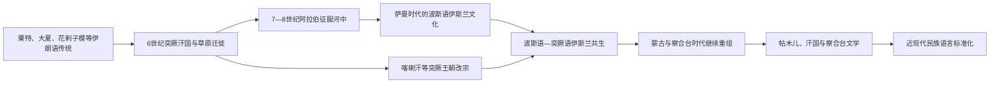

# 中亚突厥化、伊斯兰化与语言文化

## 时间

6世纪—近现代

## 概括

中亚的突厥化与伊斯兰化相互关联，却不是同一过程。突厥化主要表现为草原政治联盟扩张、军队与牧民迁徙、王朝统治、通婚及长期语言转移；伊斯兰化则包括国家征服、改宗、清真寺与经学院建设、法律和赋税变化、商人往来、苏菲传教与地方圣地重释。一个突厥语群体不必先成为穆斯林，伊朗语居民成为穆斯林后也不必改说突厥语。

结果不是旧文化被一次替换，而是形成多层语言秩序：阿拉伯语主要用于宗教经典和部分学术，波斯语长期用于城市文学、行政与宫廷，突厥语逐渐覆盖草原和大量绿洲人口，并发展出喀喇汗语、花剌子模突厥语、察合台语等书写传统。塔吉克语、雅格诺比语和帕米尔诸语言说明伊朗语传统并未消失；现代哈萨克、吉尔吉斯、乌兹别克、土库曼、维吾尔等身份又经过近世政治与苏维埃分类才定型。

## 两种长期过程的机制

| 维度 | 突厥化 | 伊斯兰化 | 两者的交点 |
|---|---|---|---|
| 政治 | 突厥汗国、喀喇汗、塞尔柱及后续汗国使突厥语军事精英掌权 | 哈里发、萨曼及穆斯林王朝建立伊斯兰法统 | 改宗后的突厥王朝以伊斯兰称号、铸币和学者网络巩固统治 |
| 人口 | 草原牧民迁徙、驻军、部落重组、通婚与城市化 | 商人、学者、军人和宗教人士迁移 | 新移民在绿洲定居后同时接受地方波斯语文化和伊斯兰制度 |
| 语言 | 军事与日常交往扩大突厥语，数百年后出现语言转移 | 阿拉伯语、波斯语提供宗教与书写词汇 | 突厥书面语采用阿拉伯字母并吸收大量波斯语、阿拉伯语词汇 |
| 社会组织 | 部落、军队、封地与季节牧场维系政治共同体 | 清真寺、经学院、瓦克夫、法官和苏菲道团连接城乡 | 圣裔、谢赫和汗王联姻形成跨部族权威 |
| 地方文化 | 旧地名、农耕制度与伊朗语人口继续存在 | 前伊斯兰圣地、节庆和祖先传统常被重新解释 | “穆斯林化”往往通过本地化完成，不等于习俗完全一致 |

## 分阶段过程

### 突厥汗国与早期语言扩散

6世纪，突厥汗国控制从蒙古高原到里海附近的大范围草原。西突厥、突骑施和葛逻禄等联盟进入七河、天山和河中边缘，突厥语成为军政与牧业交往的重要语言。粟特书吏、商人和城市统治者仍维持伊朗语书写与商业网络，突厥可汗也借用粟特人才处理外交。早期突厥化首先改变草原权力和精英语言，并未使撒马尔罕、布哈拉等城市立即改说突厥语。

突厥联盟不是单一民族国家。“突厥”“葛逻禄”“乌古斯”等名称可能指政治联盟、地理集团或语言共同体，成员会随战争与归附重组。后来民族不能把某一汗国整齐分割为各自唯一祖先。

### 阿拉伯征服与缓慢伊斯兰化

7世纪后半叶，阿拉伯军队从梅尔夫越过阿姆河；705—715年屈底波持续进攻布哈拉、撒马尔罕、花剌子模和费尔干纳方向。驻军、条约、贡赋与地方王公合作比一次性占领更常见。720—730年代粟特与突骑施反抗说明统治尚不稳固，部分居民外迁或反复改换阵营。

政治服从先于普遍改宗。新穆斯林的税收地位、阿拉伯驻军与地方贵族权利长期争议；佛教、祆教、摩尼教、景教和地方祭祀继续存在。751年怛罗斯之战削弱唐朝直接军事介入，却没有使草原或塔里木盆地当年整体改宗。真正深入家庭、村社和日常法律的伊斯兰化持续数百年。

### 萨曼王朝与波斯语伊斯兰文化

9—10世纪萨曼王朝整合河中与呼罗珊部分地区，布哈拉成为宫廷、学术和贸易中心。王朝以逊尼派法统、波斯语行政文学和阿拉伯语宗教学术共同治理；新波斯语在阿拉伯字母书写中复兴，形成后来“波斯化伊斯兰”文化的重要中心。

边疆堡垒、商人和学者把伊斯兰进一步带向锡尔河与草原。893年伊斯玛仪·萨曼尼攻取塔拉兹，是军事、贸易和传教并行的例子；但草原改宗并非只靠征服，统治者选择、婚姻、市场和圣徒网络同样关键。萨曼晚期财政、继承与军人集团矛盾加深，突厥军事精英已深度进入国家结构。

### 喀喇汗改宗与突厥语伊斯兰书写

10世纪中叶，喀喇汗王族逐步改宗；传统叙事把萨图克·博格拉汗视为关键人物，而“某年二十万帐同时改宗”等数字具有宗教史叙事色彩，不宜当作精确人口统计。999年喀喇汗夺取布哈拉，象征穆斯林突厥王朝取代萨曼政治主导，却没有终止波斯语城市文化。

11世纪的《福乐智慧》和《突厥语大词典》显示突厥语能够承载王权伦理、文学和语言学知识。喀喇汗宫廷、城市官僚与宗教学者共同形成突厥—波斯语双重文化；在绿洲，家庭和市镇可能双语；在草原，口传传统与伊斯兰仪式结合更为突出。

### 乌古斯、花剌子模与苏菲网络

乌古斯迁徙和塞尔柱扩张把突厥军事政治带入呼罗珊、伊朗与西亚，反过来又强化波斯语宫廷模式。花剌子模在11—13世纪形成突厥王朝、伊朗语与突厥语居民、波斯文书和多向贸易交织的社会。

12世纪以后，艾哈迈德·亚萨维传统及其他苏菲网络以突厥语诗歌、师徒传承、圣墓和地方仪式连接城市与草原。苏菲并非唯一传教者，也不能简单与“民间伊斯兰”画等号；法学家、商人、统治者和家庭教育都参与了伊斯兰化。草原社会对教法的实践方式与密集城市不同，但这种差异不意味着其信仰只是“表面”。

### 蒙古、察合台与帖木儿时期

13世纪蒙古统治最初保留多宗教环境。察合台兀鲁思内部，依赖城市税收、接受伊斯兰的统治者与重视草原习惯、季节迁徙的贵族发生矛盾。塔儿麻失里在14世纪改宗并加强河中取向，旋遭推翻；这既涉及宗教，也涉及政治中心南移、军队利益和继承竞争，不能解释为“穆斯林对蒙古传统”的单线冲突。

东部蒙兀儿斯坦的蒙古集团后来逐步突厥化、伊斯兰化，同时仍以成吉思汗血统和“莫卧儿”身份区别于周边人群。帖木儿虽非成吉思汗男系后裔，却在伊斯兰法统、察合台政治传统与波斯宫廷文化之间建立统治。15世纪察合台语文学成熟，阿里希尔·纳瓦伊等人证明突厥语与波斯语不是简单替代关系，而是竞争、借鉴和双语创作并存。

### 近世身份与现代标准化

16—19世纪，乌兹别克、哈萨克、吉尔吉斯、土库曼等名称在汗国、部落联盟、迁徙与邻国称呼中逐渐稳定，但边界仍流动。绿洲居民常按城市、宗教、职业或生活方式认同自己，并不总以现代民族名称为第一身份。

俄国与苏维埃统治把语言、人口调查、学校、文字改革和领土建制结合起来。突厥语和塔吉克语经历标准化，书写系统又从阿拉伯字母改为拉丁、再改西里尔字母；独立后部分国家重新采用拉丁字母。现代民族语言由历史方言连续体整理而成，既有真实语言基础，也受国家政策塑造。

## 重要事件

| 时间 | 事件 | 过程与意义 |
|---|---|---|
| 552年后 | 突厥汗国兴起 | 草原军政联盟扩张，突厥语影响进入七河和河中边缘。 |
| 560年代 | 突厥—萨珊击败嚈哒 | 西突厥与粟特合作重组草原—绿洲权力和贸易。 |
| 705—715年 | 屈底波征服河中主要城市 | 建立较稳定的阿拉伯驻军与贡赋关系，但社会改宗远未完成。 |
| 720—730年代 | 粟特、突骑施反抗 | 显示地方王公、草原力量和哈里发统治仍在竞争。 |
| 751年 | 怛罗斯之战 | 唐朝军事影响收缩的一环；并非中亚整体伊斯兰化的瞬间。 |
| 819年以后 | 萨曼政权形成 | 波斯语伊斯兰文化、逊尼法学和城市经济在河中繁盛。 |
| 893年 | 萨曼军攻取塔拉兹 | 边疆军事推进、贸易与传教共同加深草原接触。 |
| 10世纪中叶 | 喀喇汗王族改宗 | 突厥王权与伊斯兰法统结合，具体时间和“集体改宗”规模有争议。 |
| 999年 | 喀喇汗进入布哈拉 | 萨曼统治结束，穆斯林突厥王朝成为河中政治主导。 |
| 11世纪 | 突厥语经典成书 | 《福乐智慧》《突厥语大词典》标志伊斯兰突厥书写文化成熟。 |
| 12世纪 | 亚萨维传统扩展 | 苏菲师承、诗歌和圣地把城市宗教网络与草原社群连接起来。 |
| 14世纪前期 | 塔儿麻失里改宗并被推翻 | 暴露察合台汗国内草原贵族、城市取向和宗教政治的复合矛盾。 |
| 15世纪 | 察合台语文学繁荣 | 突厥语成为跨区域文学语言，与波斯语共同构成精英文化。 |
| 1920—1940年代 | 苏维埃语言与文字改革 | 民族语言被标准化，阿拉伯、拉丁、西里尔字母数次转换。 |

## 语言与宗教格局

| 传统 | 主要区域或功能 | 延续与变化 |
|---|---|---|
| 粟特语 | 泽拉夫尚河谷及跨欧亚商人网络 | 中世纪后大多被波斯语、突厥语取代；雅格诺比语常被视为相关东伊朗语延续 |
| 大夏语及帕米尔诸语言 | 阿姆河上游、巴达赫尚和帕米尔 | 大夏语消失，瓦罕、舒格南等帕米尔语言延续；部分社群信奉伊斯玛仪派 |
| 花剌子模语 | 阿姆河下游 | 中世纪后逐渐被突厥语取代，但地名、词汇和地方文化延续 |
| 波斯语 / 塔吉克语 | 河中城市、呼罗珊、行政与文学 | 长期跨王朝通用；现代在塔吉克斯坦标准化，撒马尔罕、布哈拉等地仍有社群 |
| 葛逻禄型突厥语 | 河中绿洲、费尔干纳及更东地区 | 发展为察合台文学传统，并与现代乌兹别克语、维吾尔语关系密切 |
| 钦察型突厥语 | 哈萨克草原、天山及北部 | 与现代哈萨克语、吉尔吉斯语等形成相关历史连续性，但不能简单等同早期部族 |
| 乌古斯型突厥语 | 里海东岸、土库曼草原及向西迁徙群体 | 与现代土库曼语等相关，部落方言差异长期显著 |
| 阿拉伯语 | 经文、法学、神学与部分科学 | 主要是高层宗教学术语，不曾成为多数中亚人的日常母语 |
| 逊尼派哈乃斐学派 | 大多数绿洲和草原穆斯林社群 | 法学传统与地方习俗、苏菲网络共存 |
| 什叶派与伊斯玛仪派 | 呼罗珊联系区、部分城市及帕米尔 | 分布不连续，受王朝政策、山地网络与跨境联系影响 |

## 地区差异

- **河中绿洲**：较早形成密集清真寺、经学院和波斯语文书传统；突厥语普及是长期城市双语和政治迁徙的结果。
- **哈萨克草原**：伊斯兰传播依赖商镇、鞑靼与中亚学者、苏菲和汗王支持；宗教制度密度低于布哈拉，不等于没有稳定穆斯林身份。
- **天山与七河**：突厥、蒙古、粟特后裔和绿洲居民反复重组；吉尔吉斯等群体的伊斯兰化在近世仍继续深化。
- **花剌子模与里海东岸**：乌古斯—土库曼部落、花剌子模城市和希瓦国家相互影响，语言转移与部落结构并存。
- **塔吉克山地与帕米尔**：伊朗语连续性最强，逊尼与伊斯玛仪传统并存；山地隔离并未切断与巴达赫尚、喀什和河中的联系。
- **阿富汗北部**：波斯语、乌兹别克语、土库曼语及多种山地语言交错，政治边界不能代表清晰语言分界。

## 推动、阻碍与长期结果

- **推动突厥化的结构因素**：草原人口迁徙、骑兵军事优势、王朝封地与城市定居，使突厥语进入军队、市场和家庭。
- **推动伊斯兰化的结构因素**：国家法统、城市机构、跨区域贸易、教育、婚姻与苏菲网络共同作用；宗教转换通常能提供新的法律和社会联系。
- **延缓变化的因素**：山地、沙漠距离、既有寺院与贵族利益、地方语言韧性和政权反复，使各地速度不同。
- **王朝更替的直接作用**：阿拉伯征服、喀喇汗进入河中和蒙古—帖木儿重组改变精英与制度，但没有一次完成全社会文化替换。
- **长期结果**：中亚形成以伊斯兰为主要宗教、突厥语占多数而伊朗语传统持续的重要文化区；波斯语、突厥语和阿拉伯语的功能分层影响至今。

## 争议与易混点

- “突厥化”不是证明现代某民族自古完整存在，也不是所有伊朗语居民被外来人口替换。
- “伊斯兰化”不能只按统治者改宗年份判断；法制、仪式、家庭实践和地方圣地的变化可能相差数百年。
- 萨图克·博格拉汗改宗及大规模集体改宗的传统数字来自后出叙事，应写约数并与钱币、城市制度和其他史料互证。
- 怛罗斯之战有政治象征意义，但唐朝衰退、安史之乱、地方联盟和长期传教同样重要。
- “察合台语”是后世用来概括的一种文学传统，不等于察合台汗国居民只说一种统一语言。
- 苏维埃并非凭空创造所有民族和语言，也不是被动记录既有边界；它把流动的方言、身份和区域归入领土化标准。

## 演变关系

本页承接[绿洲、粟特与丝绸之路](/%E4%BA%BA%E6%96%87%E7%A7%91%E5%AD%A6/%E5%8E%86%E5%8F%B2/%E4%B8%AD%E4%BA%9A/_%E9%80%9A%E5%8F%B2/%E7%BB%BF%E6%B4%B2%E3%80%81%E7%B2%9F%E7%89%B9%E4%B8%8E%E4%B8%9D%E7%BB%B8%E4%B9%8B%E8%B7%AF.md)所述的物质与商业网络。蒙古征服、察合台汗国及帖木儿政治如何利用这些语言宗教传统，见[蒙古、察合台与帖木儿](/%E4%BA%BA%E6%96%87%E7%A7%91%E5%AD%A6/%E5%8E%86%E5%8F%B2/%E4%B8%AD%E4%BA%9A/_%E9%80%9A%E5%8F%B2/%E8%92%99%E5%8F%A4%E3%80%81%E5%AF%9F%E5%90%88%E5%8F%B0%E4%B8%8E%E5%B8%96%E6%9C%A8%E5%84%BF.md)。

- 早期与中世纪规范世系：[喀喇汗、喀喇契丹与花剌子模世系表](/%E4%BA%BA%E6%96%87%E7%A7%91%E5%AD%A6/%E5%8E%86%E5%8F%B2/%E4%B8%AD%E4%BA%9A/%E6%B2%B3%E4%B8%AD%E5%9C%B0%E5%8C%BA/%E5%96%80%E5%96%87%E6%B1%97%E3%80%81%E5%96%80%E5%96%87%E5%A5%91%E4%B8%B9%E4%B8%8E%E8%8A%B1%E5%89%8C%E5%AD%90%E6%A8%A1%E4%B8%96%E7%B3%BB%E8%A1%A8.md)
- 区域入口：[中亚通史](/%E4%BA%BA%E6%96%87%E7%A7%91%E5%AD%A6/%E5%8E%86%E5%8F%B2/%E4%B8%AD%E4%BA%9A/_%E9%80%9A%E5%8F%B2/README.md)
