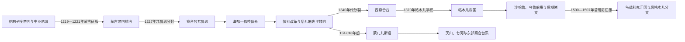

# 中亚蒙古、察合台与帖木儿

## 时间

1218—1512年

## 概括

蒙古征服是中亚历史的剧烈断裂，也是随后数百年政治结构的起点。1219—1221年，成吉思汗军队摧毁花剌子模帝国在河中与阿姆河下游的防线，多座城市遭围攻、屠杀、人口迁移和渠系破坏；征服以后，蒙古统治者又依靠城市税收、商人合伙、驿站和被迁徙的工匠维持帝国。破坏与跨洲流动同时存在，不能只用“蒙古和平”或“彻底毁灭”概括各地不同经历。

察合台兀鲁思横跨河中绿洲、七河草原、天山与东部绿洲。其统治始终需要在成吉思汗法统、部族军队、季节牧地、穆斯林城市财政和蒙古大汗政治之间协调。14世纪中央汗权崩溃后，西部河中由部族埃米尔控制，东部形成蒙兀儿斯坦。帖木儿利用西察合台的权力真空，以成吉思汗系傀儡汗、王室联姻和军事胜利建立帝国；他的大规模征服再次造成破坏，也把撒马尔罕建成王朝中心。沙哈鲁、乌鲁伯格和侯赛因·拜卡拉时代的学术艺术繁荣，建立在区域财政、强制迁徙人才与跨地宫廷竞争之上。

## 建立背景

12世纪末至13世纪初，花剌子模沙阿依靠河中、呼罗珊和伊朗税源迅速扩张，却没有充分整合新征服地区。王室、钦察军人集团、地方官僚和城市精英之间互不信任，边疆又直接接触正在西进的蒙古帝国。1218年，蒙古商队在讹答剌被总督亦纳勒术逮捕和杀害；花剌子模沙阿拒绝成吉思汗要求交出责任人的使团处理，给蒙古全面进攻提供直接借口。战争并非仅由“商队事件”造成，蒙古扩张能力与花剌子模过度伸展才是结构背景。

## 统治结构

| 层次 | 蒙古—察合台时期 | 帖木儿时期 | 连续与变化 |
|---|---|---|---|
| 最高法统 | 成吉思汗家族可汗与蒙古大汗 | 帖木儿为埃米尔，拥立成吉思汗系名义汗并以“驸马”联姻 | 成吉思汗血统仍是政治合法性资源，但实际主权可由非成吉思汗系掌握 |
| 军事 | 千户、宗王分封、部族军队和怯薛 | 巴鲁剌思等军团、王子封地与征服军 | 军队依附具体宗王或埃米尔，继承时容易分裂 |
| 财政 | 大汗官员、达鲁花赤、城市税、商人斡脱 | 波斯语文官、地方税、贡赋和战利品 | 绿洲收入是草原军队和宫廷的必要基础 |
| 地方治理 | 保留部分本地王公、宗教机构和灌溉管理者 | 任命王子、埃米尔和文官，城市受宫廷直接赞助 | 地方精英并未被全部替换，而是在新军事框架中重组 |
| 交通 | 驿站、牌符、护送与跨帝国商人网络 | 撒马尔罕、赫拉特连接伊朗、印度和草原 | 安全取决于政权控制，帝国统一并不保证所有商旅免受勒索 |
| 宗教 | 初期多宗教并存，后部分可汗改宗伊斯兰 | 逊尼伊斯兰法统、苏菲和学者赞助突出 | 改宗是渐进政治过程，东部和西部速度不同 |

## 分阶段过程

### 讹答剌事件与蒙古征服

1219年，蒙古军分多路越过锡尔河。成吉思汗主力经讹答剌方向深入河中，术赤等进攻锡尔河下游城市，另一支牵制费尔干纳和山地。讹答剌长期守城后陷落；1220年布哈拉、撒马尔罕相继被攻破。花剌子模沙阿穆罕默德二世避免决战、分兵守城，既无法集中野战力量，也未能把各城防御组织成统一战线。

蒙古军利用投降部队、工匠和俘虏承担攻城、运输与危险任务。城市命运并不一致：主动投降者仍可能遭征发和掠夺，顽抗者通常受更重惩罚。1221年花剌子模首都玉龙杰赤因水网与巷战久攻不下，陷落后破坏极重；巴尔赫、梅尔夫等呼罗珊城市也遭毁灭性打击。工匠、书记、学者和年轻人口被强制分配到蒙古各地，灌溉维护中断造成比一次抢掠更长的后果。

### 分封、帝国官僚与察合台兀鲁思

1227年前后，察合台所得兀鲁思从河中延至伊犁、喀什与天山东部，但不是边界清楚的现代国家。牧地、军队与属民归宗王，撒马尔罕、布哈拉等城市的财政一度仍由蒙古大汗任命的牙剌瓦赤、麻速忽等官员管理。宗王与中央财政权重叠，经常造成重复征发。

1251年蒙哥大汗清洗支持窝阔台系的察合台宗室，斡儿干纳哈敦随后摄政。1259年蒙哥死后，忽必烈与阿里不哥内战使阿鲁忽取得中亚财政和军政权，察合台汗国才真正趋于独立。阿鲁忽先支持阿里不哥，后转而控制其税粮；这种倒戈说明可汗地位取决于本地军队和城市收入，而不只取决于大汗任命。

### 海都、都哇与跨汗国战争

1260年代至1300年代初，窝阔台后裔海都成为中亚草原联盟核心。八剌先与其争战，1269年前后的塔剌思会盟又划分河中利益；八剌进攻伊利汗国呼罗珊失败，进一步依赖海都。此后三十余年，察合台可汗常受海都控制。

都哇长期与海都合作，对元朝边境和伊利汗国用兵；海都死后，都哇转向与元朝和解，并帮助削弱海都之子察八儿。到1309年前后，窝阔台系中亚霸权瓦解，察合台家族取得更多牧地与自主权。这一阶段的“兴盛”建立在军事联盟和跨境劫掠上，对城市经济的收益并不均等。

### 怯别改革、伊斯兰化与内部分裂

怯别复位后更重视河中城市，在那黑沙不附近建设宫廷，整顿行政与钱币。固定宫廷、规范税收有利于绿洲财政，却使部分游牧贵族担心可汗离开传统牧地。塔儿麻失里公开改宗伊斯兰、常驻西南并向印度用兵，把这一矛盾推向高潮；1334年他被东部宗王和贵族推翻。

其后可汗频繁更换。合赞汗试图重新压制部族埃米尔，与哈剌兀纳首领合扎罕战争，于1346/47年败亡。西部埃米尔改立丹尼什曼德只、巴颜忽里等傀儡；东部朵豁剌惕集团在1347/48年拥立秃忽鲁帖木儿，蒙兀儿斯坦形成。分裂同时涉及牧场与城市利益、伊斯兰化、继承制度和部族军权，不能简化为“游牧派战胜定居派”。

完整汗位、摄政、傀儡与并立关系见[察合台汗国与蒙兀儿斯坦统治者表](/%E4%BA%BA%E6%96%87%E7%A7%91%E5%AD%A6/%E5%8E%86%E5%8F%B2/%E4%B8%AD%E4%BA%9A/_%E9%80%9A%E5%8F%B2/%E5%AF%9F%E5%90%88%E5%8F%B0%E6%B1%97%E5%9B%BD%E4%B8%8E%E8%92%99%E5%85%80%E5%84%BF%E6%96%AF%E5%9D%A6%E7%BB%9F%E6%B2%BB%E8%80%85%E8%A1%A8.md)。

### 西察合台危机与帖木儿崛起

合扎罕1358年遇刺后，河中没有能压服诸部的埃米尔。秃忽鲁帖木儿于1360、1361年两度入侵，扶植或清洗地方首领，并任命巴鲁剌思部的帖木儿管理渴石。帖木儿随后转与合扎罕之孙忽辛结盟，共同反抗东部军队。

1365年泥沼之战中，亦里牙思火者击败帖木儿—忽辛联军，却无法攻下由“萨尔巴达尔”城市民兵保卫的撒马尔罕。外敌退去后，帖木儿与忽辛又争夺河中主导权。1370年帖木儿攻取巴尔赫、消灭忽辛，拥立窝阔台系速尤尔哈特迷失为名义汗，并迎娶察合台王室女性取得“驸马”称号。西察合台并非被某个外来王朝一夜吞并，而是实权早已从可汗转向埃米尔，帖木儿只是最终胜出者。

### 帖木儿征服与撒马尔罕中心

帖木儿以河中军队为核心，征服花剌子模、伊朗、呼罗珊、高加索、金帐汗国部分地区、德里和安纳托利亚。他通过战利品、贡赋与强制迁徙工匠建设撒马尔罕。征服能够维持军队忠诚和宫廷消费，却依赖连续扩张；花剌子模、伊朗、印度等地遭反复破坏，所谓文化繁荣与帝国暴力不可分割。

帖木儿多次远征蒙兀儿斯坦，但难以永久控制天山牧地；东察合台汗仍是独立力量。1402年安卡拉之战击败奥斯曼苏丹巴耶济德一世后，帖木儿准备进攻明朝，1405年在讹答剌去世。帝国没有固定长子继承制，诸子孙立刻争夺。

### 沙哈鲁整合与王朝文化

沙哈鲁以赫拉特为常驻中心，1409年压服控制撒马尔罕的哈利勒·苏丹，把河中交给儿子乌鲁伯格。沙哈鲁时期利用波斯文官、王子封地与突厥—蒙古军队恢复税收和交通；赫拉特、撒马尔罕分别成为艺术、史学、数学和天文学中心。

乌鲁伯格在撒马尔罕主持天文台和历表编纂，但1447年继承最高权后缺乏军政联盟，1449年被儿子阿卜杜勒·拉蒂夫击败并杀害。此后诸王子争夺加剧。阿布·赛义德一度重合河中与赫拉特，1469年西征白羊王朝失败被处死；侯赛因·拜卡拉在赫拉特建立长期宫廷，河中则由阿布·赛义德诸子分据。文化中心繁荣不等于帝国政治统一。

完整帖木儿、撒马尔罕、赫拉特和费尔干纳支系见[帖木儿王朝统治者表](/%E4%BA%BA%E6%96%87%E7%A7%91%E5%AD%A6/%E5%8E%86%E5%8F%B2/%E4%B8%AD%E4%BA%9A/%E6%B2%B3%E4%B8%AD%E5%9C%B0%E5%8C%BA/%E5%B8%96%E6%9C%A8%E5%84%BF%E7%8E%8B%E6%9C%9D%E7%BB%9F%E6%B2%BB%E8%80%85%E8%A1%A8.md)。

### 昔班尼征服与后继方向

15世纪末，河中帖木儿诸王争夺撒马尔罕和费尔干纳，地方军队、贵族与城市反复倒向不同王子。昔班尼汗整合钦察草原的乌兹别克力量，1500年夺取布哈拉和撒马尔罕；巴布尔虽在1500—1501年短暂复城，最终因粮援不足和萨尔普尔战败退出。

1506年侯赛因·拜卡拉死后，赫拉特由两个儿子共治，缺少协调；1507年昔班尼汗占领赫拉特。巴布尔转向喀布尔，1511年借萨法维援助再取撒马尔罕，却因宗教与政治依附引发反弹；1512年吉日杜万之战失败，帖木儿家族在河中的最后复辟结束。其政治文化经巴布尔进入莫卧儿印度，河中则转入昔班尼—布哈拉汗国时代。

## 重要事件

| 时间 | 事件 | 过程与意义 |
|---|---|---|
| 1218年 | 讹答剌商队事件 | 地方总督杀害蒙古商队，花剌子模沙阿拒绝交人，成为全面战争直接触发。 |
| 1219—1220年 | 蒙古军进入河中 | 多路军切断城市联系，讹答剌、布哈拉、撒马尔罕相继陷落。 |
| 1221年 | 玉龙杰赤与呼罗珊战争 | 巷战、屠杀、强制迁徙及渠系破坏造成长期人口与农业损失。 |
| 1227年前后 | 察合台兀鲁思确立 | 宗王牧地、军队与大汗城市财政并存，形成重叠主权。 |
| 1251—1252年 | 蒙哥清洗与斡儿干纳摄政 | 王室重组，女性摄政维持察合台家族统治。 |
| 1260—1266年 | 阿鲁忽取得自主 | 大汗内战使中亚行政转入察合台汗控制，汗国趋于独立。 |
| 1269年前后 | 塔剌思会盟 | 海都、八剌等划分利益，实际承认中亚宗王各自控制范围。 |
| 1304—1309年 | 都哇转向和解并削弱窝阔台系 | 海都体系瓦解，察合台汗国进入相对自主期。 |
| 1318—1326年 | 怯别复位与改革 | 固定宫廷、钱币和城市行政加强，但草原贵族不满累积。 |
| 1334年 | 塔儿麻失里被推翻 | 伊斯兰化、宫廷南移和部族利益冲突集中爆发。 |
| 1346/47年 | 合赞汗败亡 | 西部独立汗权崩溃，埃米尔开始系统拥立傀儡。 |
| 1347/48年 | 秃忽鲁帖木儿在东部被拥立 | 蒙兀儿斯坦形成，察合台世界出现稳定东西分化。 |
| 1365年 | 泥沼之战与撒马尔罕民兵守城 | 东部军获野战胜利却无法占城，帖木儿—忽辛联盟随后内裂。 |
| 1370年 | 帖木儿消灭忽辛 | 西察合台实权转入帖木儿手中，傀儡汗只保留法统作用。 |
| 1405—1409年 | 帖木儿死后继承战争 | 哈利勒、皮儿·穆罕默德、沙哈鲁等并争，沙哈鲁最终整合主要领地。 |
| 1447—1449年 | 沙哈鲁死与乌鲁伯格败亡 | 王子封地和军政派系再次分裂帝国。 |
| 1500—1501年 | 昔班尼夺取河中 | 帖木儿诸支内斗使乌兹别克军进入布哈拉、撒马尔罕。 |
| 1507年 | 赫拉特陷落 | 后期文化中心失守，帖木儿朝在呼罗珊的主线终结。 |
| 1511—1512年 | 巴布尔最后复辟与失败 | 河中转入昔班尼统治，巴布尔的帝国方向转向印度。 |

## 地区差异

| 地区 | 征服影响 | 13—15世纪政治与恢复 |
|---|---|---|
| 撒马尔罕—布哈拉 | 城市被攻破、人口征发；恢复速度和空间格局不同 | 是察合台财政核心，帖木儿重建撒马尔罕；布哈拉规模恢复较慢 |
| 花剌子模 | 玉龙杰赤破坏极重，河道与渠系变化扩大冲击 | 在金帐、察合台与地方王朝间反复易手，又遭帖木儿多次进攻 |
| 巴尔赫—吐火罗斯坦 | 多座城市毁坏，巴尔赫长期衰退 | 是西察合台、帖木儿与呼罗珊争夺的南部枢纽 |
| 七河—伊犁 | 城市破坏相对不一，牧地成为宗王中心 | 保留较强游牧政治，后来成为蒙兀儿斯坦核心 |
| 费尔干纳—塔什干 | 山口和谷地使地方势力有较高韧性 | 在帖木儿、蒙兀儿斯坦与乌兹别克之间转换，是巴布尔起点 |
| 赫拉特—呼罗珊 | 蒙古战争破坏严重，但农业城市可恢复 | 沙哈鲁和侯赛因·拜卡拉时期成为后帖木儿文化中心 |
| 阿富汗北部与喀布尔 | 察合台、伊利汗、卡尔特等势力交错 | 帖木儿后裔巴布尔以喀布尔为基地转向南亚 |

## 崛起、鼎盛、衰落与终结原因

### 察合台汗国

- **崛起机制**：成吉思汗分封提供王室法统与军队；忽必烈—阿里不哥内战使阿鲁忽接管城市财政；都哇在海都体系崩溃后扩大自主。
- **鼎盛条件**：伊犁牧地、河中税收和阿富汗北部通道相结合，跨汗国战争可带来战利品与政治影响。
- **结构性衰落**：王位候选众多、军队依附宗王、东西生态差异、城市财政与季节牧地需求冲突。
- **外部压力**：海都、元朝、伊利汗国和印度边疆战争持续消耗资源。
- **直接分裂**：塔儿麻失里被废后继承危机加速；合赞汗被合扎罕击杀，西部埃米尔掌权，东部另立秃忽鲁帖木儿。

### 帖木儿帝国

- **崛起机制**：西察合台权力真空、巴鲁剌思军队、与忽辛联盟及对手分化；傀儡汗和王室婚姻弥补非成吉思汗男系的法统缺口。
- **鼎盛条件**：高机动军队、连续征服所得贡赋与工匠、撒马尔罕宫廷集中资源、跨区域文官治理。
- **结构性衰落**：帝国由王子封地和个人军队拼合，没有固定继承规则；征服收益不能自动转化为稳定地方制度。
- **外部压力**：白羊王朝、萨法维、昔班尼乌兹别克、蒙兀儿斯坦等从不同方向竞争。
- **直接终结过程**：昔班尼利用河中王子内战，于1500年夺撒马尔罕，1507年取赫拉特；1512年巴布尔复辟失败，河中主线终结。

## 长期影响与争议

- 蒙古征服造成真实的大规模死亡、迁徙和城市破坏；后来的驿传与贸易恢复不能抵消其代价。
- “蒙古和平”只适用于特定时期和受保护路线，边疆战争、部族冲突和重复税收始终存在。
- 察合台汗国并非从1227年起就是完全独立国家；早期宗王、蒙古大汗财政官与窝阔台系权力重叠。
- 伊斯兰化不是察合台分裂的唯一原因，政治中心、牧地、继承和部族军权同样重要。
- 帖木儿不是蒙古帝国的直接复国君主，也不是察合台汗；他是使用成吉思汗法统的实际埃米尔。
- 帖木儿文化繁荣有明确制度与经济基础，也依赖战争掠夺和工匠强制迁徙，不宜只写建筑成就。
- 蒙兀儿斯坦、帖木儿和昔班尼政治都跨越现代国界，不能分别归为某一个现代民族国家的专属前史。

## 演变关系

前一阶段的语言、宗教与城市网络见[突厥化、伊斯兰化与语言文化](/%E4%BA%BA%E6%96%87%E7%A7%91%E5%AD%A6/%E5%8E%86%E5%8F%B2/%E4%B8%AD%E4%BA%9A/_%E9%80%9A%E5%8F%B2/%E7%AA%81%E5%8E%A5%E5%8C%96%E3%80%81%E4%BC%8A%E6%96%AF%E5%85%B0%E5%8C%96%E4%B8%8E%E8%AF%AD%E8%A8%80%E6%96%87%E5%8C%96.md)。16世纪以后河中汗国世系见[布哈拉、希瓦与浩罕统治者表](/%E4%BA%BA%E6%96%87%E7%A7%91%E5%AD%A6/%E5%8E%86%E5%8F%B2/%E4%B8%AD%E4%BA%9A/%E6%B2%B3%E4%B8%AD%E5%9C%B0%E5%8C%BA/%E5%B8%83%E5%93%88%E6%8B%89%E3%80%81%E5%B8%8C%E7%93%A6%E4%B8%8E%E6%B5%A9%E7%BD%95%E7%BB%9F%E6%B2%BB%E8%80%85%E8%A1%A8.md)；俄国征服与现代边界形成见[俄罗斯征服、苏维埃民族划界与独立](/%E4%BA%BA%E6%96%87%E7%A7%91%E5%AD%A6/%E5%8E%86%E5%8F%B2/%E4%B8%AD%E4%BA%9A/_%E9%80%9A%E5%8F%B2/%E4%BF%84%E7%BD%97%E6%96%AF%E5%BE%81%E6%9C%8D%E3%80%81%E8%8B%8F%E7%BB%B4%E5%9F%83%E6%B0%91%E6%97%8F%E5%88%92%E7%95%8C%E4%B8%8E%E7%8B%AC%E7%AB%8B.md)。

- 察合台完整序列：[察合台汗国与蒙兀儿斯坦统治者表](/%E4%BA%BA%E6%96%87%E7%A7%91%E5%AD%A6/%E5%8E%86%E5%8F%B2/%E4%B8%AD%E4%BA%9A/_%E9%80%9A%E5%8F%B2/%E5%AF%9F%E5%90%88%E5%8F%B0%E6%B1%97%E5%9B%BD%E4%B8%8E%E8%92%99%E5%85%80%E5%84%BF%E6%96%AF%E5%9D%A6%E7%BB%9F%E6%B2%BB%E8%80%85%E8%A1%A8.md)
- 帖木儿完整序列：[帖木儿王朝统治者表](/%E4%BA%BA%E6%96%87%E7%A7%91%E5%AD%A6/%E5%8E%86%E5%8F%B2/%E4%B8%AD%E4%BA%9A/%E6%B2%B3%E4%B8%AD%E5%9C%B0%E5%8C%BA/%E5%B8%96%E6%9C%A8%E5%84%BF%E7%8E%8B%E6%9C%9D%E7%BB%9F%E6%B2%BB%E8%80%85%E8%A1%A8.md)
- 河中地区：[河中地区](/%E4%BA%BA%E6%96%87%E7%A7%91%E5%AD%A6/%E5%8E%86%E5%8F%B2/%E4%B8%AD%E4%BA%9A/%E6%B2%B3%E4%B8%AD%E5%9C%B0%E5%8C%BA/README.md)
- 总览：[中亚通史](/%E4%BA%BA%E6%96%87%E7%A7%91%E5%AD%A6/%E5%8E%86%E5%8F%B2/%E4%B8%AD%E4%BA%9A/_%E9%80%9A%E5%8F%B2/README.md)
