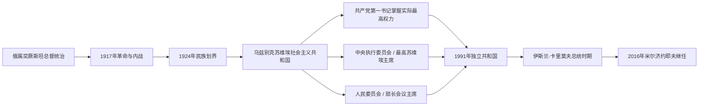

# 乌兹别克斯坦俄属、苏维埃与共和国领导人表

## 范围与口径

本表从1867年突厥斯坦总督区成立列到2026年7月，严格区分五种角色：

1. **殖民行政首脑**是沙皇任命的突厥斯坦总督兼军区司令，只直接治理帝国州县；布哈拉、希瓦保护国内仍由埃米尔、可汗主持内政。
2. **苏维埃实际最高领导**通常是乌兹别克共产党中央第一书记，重要任免仍受苏共中央决定。
3. **苏维埃法定国家元首**先为中央执行委员会主席，后为最高苏维埃主席团主席；其礼仪和法律地位不能与实际最高权力混同。
4. **苏维埃政府首脑**是人民委员会／部长会议主席，负责行政与计划执行。
5. **独立共和国**分别列总统和总理；临时代理、复任和职位改制单列或在备注说明。

人名采用常见中文音译。俄文、乌兹别克文转写存在差异，不代表不同人物。

## 领导体制演变图

俄属时期、苏维埃时期与独立后不能套用同一种“国家元首”概念。苏维埃时期的法定机关与实际党权分列；独立后总统成为权力核心，总理负责政府行政。

## 俄属突厥斯坦总督

总督兼任突厥斯坦军区司令，掌握军政、外交边务和重大财政。1868年后的布哈拉、1873年后的希瓦是保护国，完整王廷世系见[布哈拉、希瓦与浩罕统治者表](/%E4%BA%BA%E6%96%87%E7%A7%91%E5%AD%A6/%E5%8E%86%E5%8F%B2/%E4%B8%AD%E4%BA%9A/%E6%B2%B3%E4%B8%AD%E5%9C%B0%E5%8C%BA/%E5%B8%83%E5%93%88%E6%8B%89%E3%80%81%E5%B8%8C%E7%93%A6%E4%B8%8E%E6%B5%A9%E7%BD%95%E7%BB%9F%E6%B2%BB%E8%80%85%E8%A1%A8.md)。

| 顺序 | 总督 | 任期 | 身份与重要事项 |
|---:|---|---|---|
| 1 | **康斯坦丁·冯·考夫曼** | 1867—1882年 | 首任；建立军政体制，1868年击败布哈拉，1873年迫使希瓦成为保护国。 |
| 2 | 米哈伊尔·切尔尼亚耶夫 | 1882—1884年 | 1865年攻取塔什干的将领；任总督时与中央政策冲突。 |
| 3 | 尼古拉·罗森巴赫 | 1884—1889年 | 强化行政、移民和交通建设。 |
| 4 | 亚历山大·弗列夫斯基 | 1889—1898年 | 殖民经济和棉花种植扩大；1898年安集延起义发生于其末期。 |
| 5 | 谢尔盖·杜霍夫斯科伊 | 1898—1901年 | 起义后收紧军政控制并处理宗教、司法政策。 |
| 6 | 尼古拉·伊万诺夫 | 1901—1904年 | 延续军事—官僚治理。 |
| 7 | 尼古拉·捷维亚舍夫 | 1904—1905年，代理 | 日俄战争与帝国内部危机时期主持总督事务。 |
| 8 | 德扬／德米特里·苏博蒂奇 | 1906年，代理 | 短期主持；此前任外里海州长。 |
| 9 | 叶夫根尼·马齐耶夫斯基 | 1906年，代理 | 过渡任职，具体起止月在名录中略有差异。 |
| 10 | 尼古拉·格罗杰科夫 | 1906—1908年 | 革命后恢复秩序；殖民行政弊端受到调查。 |
| 11 | 帕维尔·米先科 | 1908—1909年 | 帕连参议员调查开始，军政官署腐败问题集中暴露。 |
| 12 | 亚历山大·萨姆索诺夫 | 1909—1914年 | 铁路、移民和棉花经济继续扩张；后调往欧洲战场。 |
| 13 | 费奥多尔·马尔特松 | 1914—1916年 | 第一次世界大战时期主持，物资征集和社会压力增加。 |
| 14 | 米哈伊尔·叶罗费耶夫 | 1916年，代理 | 劳役征调危机中的短暂过渡。 |
| 15 | **阿列克谢·库罗帕特金** | 1916—1917年 | 镇压1916年起义；二月革命后被解除。 |

## 乌兹别克共产党中央第一书记

这是1925—1991年共和国的**实际最高政治职位**。短期代理也保留，不以“过渡领导”合并。

| 顺序 | 第一书记 | 任期 | 与前任关系及重要事项 |
|---:|---|---|---|
| 1 | 弗拉基米尔·伊万诺夫 | 1925-02-12—1927-09-21 | 建党和共和国机构初建时期；后在大清洗中遇害。 |
| 2 | 库普里扬·基尔基日 | 1927-09-21—1929-04 | 接任中央派遣领导，推动经济与党务集中。 |
| 3 | 尼古拉·吉卡洛 | 1929-04—1929-06 | 极短任；不能与后任合并。 |
| 4 | 伊萨克·泽连斯基 | 1929-06—1929-12 | 中亚党务干部；集体化转折期短任。 |
| 5 | **阿克马尔·伊克拉莫夫** | 1929-12—1937-09-21 | 本地核心领导；推动工业、教育与集体化，后在清洗中被处决。 |
| 6 | 彼得·雅科夫列夫 | 1937-09-21—1937-09-27 | 六日过渡任期。 |
| 7 | **乌斯曼·尤苏波夫** | 1937-09-27—1950-04-07 | 清洗、二战动员和战后恢复时期的长期领导。 |
| 8 | 阿明·尼亚佐夫 | 1950-04-07—1955-12-22 | 棉花扩张和斯大林后权力调整。 |
| 9 | 努里丁·穆希特季诺夫 | 1955-12-22—1957-12-28 | 后进入苏共中央主席团，体现共和国干部上升。 |
| 10 | 索比尔·卡莫洛夫 | 1957-12-28—1959-03-15 | 赫鲁晓夫改革初期，因棉花与干部政策被撤换。 |
| 11 | **沙拉夫·拉希多夫** | 1959-03-15—1983-10-31 | 长期掌权；工业、城市和灌溉扩大，地方网络、棉花虚报及生态代价累积。 |
| 12 | 伊诺姆容·乌斯蒙霍贾耶夫 | 1983-10-31—1988-01-12 | “棉花案”调查和大规模干部更换时期。 |
| 13 | 拉菲克·尼绍诺夫 | 1988-01-12—1989-06-23 | 改革与民族社会紧张上升，费尔干纳冲突前后。 |
| 14 | **伊斯兰·卡里莫夫** | 1989-06-23—1991-08-31 | 1990年兼任共和国总统；独立后权力基础连续。 |

## 苏维埃法定国家元首

| 顺序 | 国家元首 | 任期 | 法定职位与说明 |
|---:|---|---|---|
| 1 | **约尔达什·阿洪巴巴耶夫** | 1925-02-17—1943-02-28 | 1925—1938年任中央执行委员会主席；1938年起任最高苏维埃主席团主席，职位改名但本人连续在任。 |
| 代理 | 帕莎·马赫穆多娃 | 1943-02-28—1943-03-22 | 主席团副主席代理，填补前任去世后的间隙。 |
| 2 | 阿卜杜瓦利·穆米诺夫 | 1943-03-22—1947-03-17 | 最高苏维埃主席团主席。 |
| 3 | 阿明·尼亚佐夫 | 1947-03-17—1950-08-21 | 后转任第一书记，显示法定与实际职位可互换。 |
| 4 | 沙拉夫·拉希多夫 | 1950-08-21—1959-03-24 | 后转任第一书记。 |
| 5 | 约德戈尔·纳斯里丁诺娃 | 1959-03-24—1970-09-25 | 后任苏联最高苏维埃民族院主席。 |
| 6 | 纳扎尔·马查诺夫 | 1970-09-25—1978-12-20 | 最高苏维埃主席团主席。 |
| 7 | 伊诺姆容·乌斯蒙霍贾耶夫 | 1978-12-22—1983-12-20 | 后转任第一书记。 |
| 8 | 阿基尔·萨利莫夫 | 1983-12-20—1986-12-09 | 最高苏维埃主席团主席。 |
| 9 | 拉菲克·尼绍诺夫 | 1986-12-09—1988-04-09 | 后转任第一书记。 |
| 10 | 普拉特·哈比布拉耶夫 | 1988-04-09—1989-03-06 | 物理学家出身，任主席团主席。 |
| 11 | 米尔扎奥利姆·易卜拉欣莫夫 | 1989-03-06—1990-03-24 | 末任主席团主席；总统职位设立后结束。 |
| 12 | 伊斯兰·卡里莫夫 | 1990-03-24—1991-08-31 | 乌兹别克苏维埃社会主义共和国总统；同时仍为第一书记至独立。 |

## 苏维埃政府首脑

1946年以前称人民委员会主席，之后称部长会议主席。任期跨越改名者只列一次，复任者分开列。

| 顺序 | 政府首脑 | 任期 | 重要事项 |
|---:|---|---|---|
| 1 | **费祖拉·霍贾耶夫** | 1925-02-17—1937-06/07 | 首任人民委员会主席；原布哈拉改革派领导，在大清洗中被捕处决。 |
| 2 | 阿卜杜拉·卡里莫夫 | 1937-07-26—1937-10-02 | 清洗高峰中的短期接任。 |
| 3 | 苏丹·塞吉兹巴耶夫 | 1937-10-02—1938-07-23 | 短任人民委员会主席，后亦遭清洗。 |
| 4 | 阿卜杜贾巴尔·阿卜杜拉赫曼诺夫 | 1938-07-23—1950-08-21 | 二战与战后恢复；1946年职位改称部长会议主席。 |
| 5 | 阿卜杜拉扎克·马夫利亚诺夫 | 1950-08-21—1951-05-18 | 战后行政过渡。 |
| 6 | 努里丁·穆希特季诺夫 | 1951-05-18—1953-04-07 | 第一次任政府首脑。 |
| 7 | 乌斯曼·尤苏波夫 | 1953-04-07—1954-12-18 | 从第一书记转任政府首脑。 |
| 8 | 努里丁·穆希特季诺夫 | 1954-12-18—1955-12-22 | 第二次任政府首脑，后转任第一书记。 |
| 9 | 索比尔·卡莫洛夫 | 1955-12-22—1957-12-30 | 后转任第一书记。 |
| 10 | 曼苏尔·米尔扎-艾哈迈多夫 | 1957-12-30—1959-03-16 | 赫鲁晓夫经济改组时期。 |
| 11 | 阿里夫·阿利莫夫 | 1959-03-16—1961-09-27 | 工业、农业计划执行。 |
| 12 | 拉赫曼库尔·库尔巴诺夫 | 1961-09-27—1971-02-25 | 长期主持共和国政府。 |
| 13 | 纳尔马洪马迪·胡代别尔季耶夫 | 1971-02-25—1984-12-03 | 棉花、水利和工业扩张高峰。 |
| 14 | 盖拉特·卡德罗夫 | 1984-12-03—1989-10-21 | 棉花案与改革时期政府首脑。 |
| 15 | 米拉哈特·米尔卡西莫夫 | 1989-10-21—1990-03-24 | 总统制建立前的末期部长会议主席。 |
| 16 | 舒克鲁洛·米尔赛多夫 | 1990-03-24—1990-11-01 | 总统制初期主持政府，后转任副总统；政府安排进入过渡。 |

## 独立共和国总统

| 顺序 | 总统 | 任期 | 产生与权力交接 |
|---:|---|---|---|
| 1 | **伊斯兰·卡里莫夫** | 1991-08-31—2016-09-02 | 1990年已任共和国总统；独立后经1991年选举、1995年公投和后续选举延续任期，任内去世。 |
| 代理 | 尼格马季拉·尤尔达舍夫 | 2016-09-02—2016-09-08 | 参议院主席依法短暂代行职权，随后由议会安排总理代行。 |
| 代理 | 沙夫卡特·米尔济约耶夫 | 2016-09-08—2016-12-14 | 由总理转为代总统，赢得2016年选举后正式就任。 |
| 2 | **沙夫卡特·米尔济约耶夫** | 2016-12-14—至今 | 2021年连任；2023年新宪法后举行提前选举再度当选。截至2026年7月在任。 |

## 独立共和国政府首脑

| 顺序 | 总理 | 任期 | 与总统关系及重要事项 |
|---:|---|---|---|
| 1 | 阿卜杜哈希姆·穆塔洛夫 | 1992-01-08—1995-12-21 | 独立后首任正式总理，主持经济转轨初期行政。 |
| 2 | 乌特基尔·苏丹诺夫 | 1995-12-21—2003-12-12 | 卡里莫夫时期长期政府首脑，国家主导渐进改革。 |
| 3 | **沙夫卡特·米尔济约耶夫** | 2003-12-12—2016-12-14 | 三次获议会确认；2016年转任总统。 |
| 4 | **阿卜杜拉·阿里波夫** | 2016-12-14—至今 | 主持改革时期内阁，2019—2020年和2024年议会周期后续任；截至2026年7月在任。 |

## 连续性核对

- 1868—1920年的布哈拉、1873—1920年的希瓦虽失去外交主权，王廷并未立即消失；殖民总督表不能替代其统治者表。
- 第一书记、主席团主席和部长会议主席是三条并行序列，不能把同一年三名任职者误写成“三位国家领袖”。
- 阿洪巴巴耶夫1925—1943年连续在任，但1938年宪制改革改变了职位名称。
- 米尔济约耶夫2016年先代行总统，12月14日才以当选总统身份就职；两段在表中分开。
- 现代现任信息核验截止到2026年7月。

## 返回

- [俄罗斯、苏维埃与独立共和国](/%E4%BA%BA%E6%96%87%E7%A7%91%E5%AD%A6/%E5%8E%86%E5%8F%B2/%E4%B8%AD%E4%BA%9A/%E4%B9%8C%E5%85%B9%E5%88%AB%E5%85%8B%E6%96%AF%E5%9D%A6/%E4%BF%84%E7%BD%97%E6%96%AF%E3%80%81%E8%8B%8F%E7%BB%B4%E5%9F%83%E4%B8%8E%E7%8B%AC%E7%AB%8B%E5%85%B1%E5%92%8C%E5%9B%BD.md)
- [乌兹别克斯坦历史](/%E4%BA%BA%E6%96%87%E7%A7%91%E5%AD%A6/%E5%8E%86%E5%8F%B2/%E4%B8%AD%E4%BA%9A/%E4%B9%8C%E5%85%B9%E5%88%AB%E5%85%8B%E6%96%AF%E5%9D%A6/README.md)
