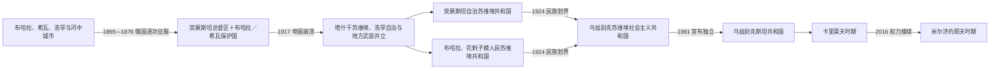

# 乌兹别克斯坦的俄罗斯、苏维埃与独立共和国

## 时间

1865年至今

## 概括

俄罗斯征服不是一次完成：1865年塔什干被占，1867年突厥斯坦总督区成立，1868年布哈拉成为保护国，1873年希瓦成为保护国，1876年浩罕被吞并。直接统治区由军事总督和俄国官员管理，保护国则保留埃米尔、可汗和本地官僚。这种双轨结构持续到1917—1920年的革命战争。

1924年民族划界把原突厥斯坦自治共和国、布哈拉和花剌子模苏维埃共和国的部分领土组合为乌兹别克加盟共和国，并设置塔吉克自治共和国；1929年塔吉克升为加盟共和国，1936年卡拉卡尔帕克并入乌兹别克。苏维埃制度建设了教育、卫生、工业和现代官僚体系，也带来集体化、清洗、宗教压制、棉花单一化及咸海灾难。1991年独立后国家保持强总统制；2016年以来市场、行政和区域外交较前开放，但改革仍由总统体系主导。

## 征服、殖民与革命过程

### 俄国逐次征服

俄国沿哈萨克草原堡垒线和锡尔河推进，以炮兵、步枪、稳定补给和各汗国分裂取得优势。切尔尼亚耶夫1865年未经充分授权攻取塔什干，既成事实随后被帝国确认。考夫曼任总督后于1868年击败布哈拉，取得撒马尔罕和泽拉夫尚上游；1873年多路远征迫使希瓦签约；1875年浩罕反宫廷起义与反俄动员交织，俄军平乱后于1876年吞并汗国。

殖民行政保留伊斯兰法庭、地方长老和部分土地制度，以较少俄国官员实行间接治理；同时建立铁路、新城、棉花加工和俄人移民区。棉花因俄国纺织需求扩大，粮食自给下降。1916年帝国在大战中征调中亚男性从事后方劳役，引发广泛起义；在今日乌兹别克斯坦地区，费尔干纳等地也出现抵抗和镇压。

### 1917—1924年革命与战争

1917年二月革命后，塔什干苏维埃、临时政府机构和穆斯林政治团体争夺权力。11月在浩罕成立的“突厥斯坦自治”主张在联邦俄国内自治，1918年初被塔什干布尔什维克武力摧毁。随后各地反苏武装被统称“巴斯玛奇”，其成员包括地方首领、宗教人士、部族武装、旧军人和受征粮影响的农民，目标并不一致。1920年布哈拉、希瓦王廷被推翻，建立人民苏维埃共和国；红军通过军事行动、招抚、土地政策和控制城市交通，至1920年代后期压制主要抵抗。

### 民族划界与苏维埃建制

1924年划界以语言民族、经济联系、灌溉系统、城市归属和党内政治为多重标准，并非简单按一张民族地图切割。撒马尔罕先为首都，1930年迁塔什干。1929年塔吉克自治共和国升格并脱离，1936年卡拉卡尔帕克自治共和国从俄罗斯联邦转入乌兹别克。标准乌兹别克语、学校、出版社、干部配额和共和国机构强化了现代民族国家框架。

1930年代集体化、定居化和反宗教运动破坏传统社会，大清洗处决或清除霍贾耶夫、伊克拉莫夫等早期干部。二战期间人口、工厂和文化机构东迁，乌兹别克斯坦成为后方工业与安置中心。战后棉花指标、灌溉工程和人口增长扩大共和国经济规模；阿姆河、锡尔河过量引水又使咸海自1960年代迅速萎缩。拉希多夫时期地方干部网络与莫斯科棉花指标互相依赖，1980年代“棉花案”调查揭露虚报、腐败，也夹杂中央—地方权力斗争。

## 独立共和国的分阶段发展

| 阶段 | 时间 | 权力结构与主要特征 |
|---|---|---|
| 卡里莫夫建国与集中 | 1991—2001年 | 总统掌握安全、干部和经济转型；渐进私有化，压制武装伊斯兰主义与政治反对力量。 |
| 安全优先与国家主导 | 2001—2016年 | 国家控制战略产业与外汇，强调主权平衡；2005年安集延事件成为国内治理和对外关系转折。 |
| 米尔济约耶夫改革初期 | 2016—2021年 | 汇率开放、改善邻国关系、行政服务改革、释放部分在押者并吸引投资。 |
| “新乌兹别克斯坦”制度调整 | 2022年至今 | 宪法重订、产业与城市建设继续；卡拉卡尔帕克争议、水资源和改革边界受到检验。 |

截至2026年7月，沙夫卡特·米尔济约耶夫任总统，阿卜杜拉·阿里波夫任总理。总统是国家元首和政治中心，总理主持内阁日常工作但由总统—议会任命体系产生。完整任期与苏维埃三套职位区分见[俄属、苏维埃与共和国领导人表](/%E4%BA%BA%E6%96%87%E7%A7%91%E5%AD%A6/%E5%8E%86%E5%8F%B2/%E4%B8%AD%E4%BA%9A/%E4%B9%8C%E5%85%B9%E5%88%AB%E5%85%8B%E6%96%AF%E5%9D%A6/%E4%BF%84%E5%B1%9E%E3%80%81%E8%8B%8F%E7%BB%B4%E5%9F%83%E4%B8%8E%E5%85%B1%E5%92%8C%E5%9B%BD%E9%A2%86%E5%AF%BC%E4%BA%BA%E8%A1%A8.md)。

## 统治与国家结构

| 时期 | 法定首脑 | 实际权力中心 | 地方治理 |
|---|---|---|---|
| 突厥斯坦总督区 | 沙皇任命的总督兼军区司令 | 军事总督、殖民官署和军队 | 州—县官员与本地法官、长老并用 |
| 布哈拉、希瓦保护国 | 埃米尔／可汗 | 王廷保留内政，俄国控制外交、军事和重大贸易 | 传统官僚、部族首领与俄国政治代理人并存 |
| 乌兹别克苏维埃共和国 | 最高苏维埃主席团为法定元首，部长会议为政府 | 共产党第一书记及莫斯科党政系统 | 州、区党委与执行委员会 |
| 独立共和国 | 总统为国家元首，总理领导政府 | 总统府、安全机构和执政联盟 | 州长由中央任命体系主导，马哈拉承担基层协商与服务 |

## 重要事件

1. 1865年俄军攻占塔什干。
2. 1867年突厥斯坦总督区成立，塔什干成为殖民行政中心。
3. 1868年布哈拉战败并成为俄国保护国，撒马尔罕被并入总督区。
4. 1873年希瓦战败成为保护国。
5. 1876年浩罕汗国被废，费尔干纳州成立。
6. 1888年外里海铁路到达撒马尔罕，殖民贸易与军队调动加快。
7. 1898年安集延起义被镇压，暴露宗教、土地和殖民矛盾。
8. 1916年劳役征调引发中亚起义。
9. 1917年浩罕自治成立，1918年初被武力摧毁。
10. 1918—1920年代，巴斯玛奇战争席卷费尔干纳、布哈拉等地。
11. 1920年布哈拉和希瓦王廷被推翻。
12. 1924年乌兹别克苏维埃社会主义共和国成立。
13. 1929年塔吉克自治共和国升格并脱离乌兹别克。
14. 1930年首都由撒马尔罕迁至塔什干。
15. 1936年卡拉卡尔帕克自治共和国并入。
16. 1937—1938年大清洗重创共和国早期政治与知识精英。
17. 1941—1945年，工厂、难民和文化机构迁入，工业与城市人口增长。
18. 1950—1980年代，棉花灌溉和卡拉库姆—中亚水利网络扩张，咸海生态危机加深。
19. 1966年塔什干地震后大规模重建。
20. 1983年拉希多夫去世，随后棉花案与大规模干部更换展开。
21. 1989年费尔干纳冲突显示人口、土地与族群治理压力。
22. 1990年3月设立总统职位，卡里莫夫当选。
23. 1991年8月31日宣布独立，12月公投确认。
24. 1999年塔什干爆炸及其后安全政策收紧。
25. 2005年安集延事件造成严重伤亡并引发国际争议。
26. 2016年卡里莫夫去世，米尔济约耶夫完成权力接续。
27. 2017年汇率改革和中亚关系改善启动。
28. 2022年卡拉卡尔帕克宪法草案争议引发努库斯抗议，相关条款随后撤回。
29. 2023年新宪法公投延长总统任期并调整社会、行政条款；米尔济约耶夫在提前选举中连任。
30. 2024—2026年，经济开放、区域互联与水资源协调继续推进。

## 崛起、稳定与转型因素

### 俄国得以征服的条件

- 各汗国长期竞争、内部废立和地方派系削弱联合防御。
- 俄国以堡垒、铁路前身交通、炮兵和国家财政支持持续远征。
- 先签贸易和保护条约、再逐步控制外交或直接吞并，降低一次性占领成本。
- 殖民政权利用本地法官与长老，避免以少量官员全面替换基层社会。

### 苏维埃体系的稳定与代价

- 党组织、计划财政、教育和安全机构深入地方，形成统一干部链。
- 工业、识字、医疗和女性公共参与显著扩大，为共和国制度积累人才。
- 棉花指标让地方精英获得资源，也使经济、水利和政治考核过度依赖单一作物。
- 莫斯科任免、镇压和人口迁移限制共和国自主性；生态成本长期外部化。

### 独立后的连续与变化

卡里莫夫由苏维埃第一书记转任总统，党政、安全和地区干部网络得以连续，避免国家机构崩解，却压缩政治竞争并延缓部分市场改革。2016年的领导更替由既有宪制和精英协商完成，米尔济约耶夫通过经济开放、邻国和解和公共服务改革重建治理合法性。改革依然面对国有部门、就业、水资源、腐败和中央—地方问责等结构问题，因此不能用单一“开放”或“威权延续”概括。

## 演变关系

- 上级：[乌兹别克斯坦历史](/%E4%BA%BA%E6%96%87%E7%A7%91%E5%AD%A6/%E5%8E%86%E5%8F%B2/%E4%B8%AD%E4%BA%9A/%E4%B9%8C%E5%85%B9%E5%88%AB%E5%85%8B%E6%96%AF%E5%9D%A6/README.md)
- 前一阶段：[帖木儿、乌兹别克汗国与三大汗国](/%E4%BA%BA%E6%96%87%E7%A7%91%E5%AD%A6/%E5%8E%86%E5%8F%B2/%E4%B8%AD%E4%BA%9A/%E4%B9%8C%E5%85%B9%E5%88%AB%E5%85%8B%E6%96%AF%E5%9D%A6/%E5%B8%96%E6%9C%A8%E5%84%BF%E3%80%81%E4%B9%8C%E5%85%B9%E5%88%AB%E5%85%8B%E6%B1%97%E5%9B%BD%E4%B8%8E%E4%B8%89%E5%A4%A7%E6%B1%97%E5%9B%BD.md)
- 王廷世系：[布哈拉、希瓦与浩罕统治者表](/%E4%BA%BA%E6%96%87%E7%A7%91%E5%AD%A6/%E5%8E%86%E5%8F%B2/%E4%B8%AD%E4%BA%9A/%E6%B2%B3%E4%B8%AD%E5%9C%B0%E5%8C%BA/%E5%B8%83%E5%93%88%E6%8B%89%E3%80%81%E5%B8%8C%E7%93%A6%E4%B8%8E%E6%B5%A9%E7%BD%95%E7%BB%9F%E6%B2%BB%E8%80%85%E8%A1%A8.md)
- 区域背景：[中亚历史](/%E4%BA%BA%E6%96%87%E7%A7%91%E5%AD%A6/%E5%8E%86%E5%8F%B2/%E4%B8%AD%E4%BA%9A/README.md)
