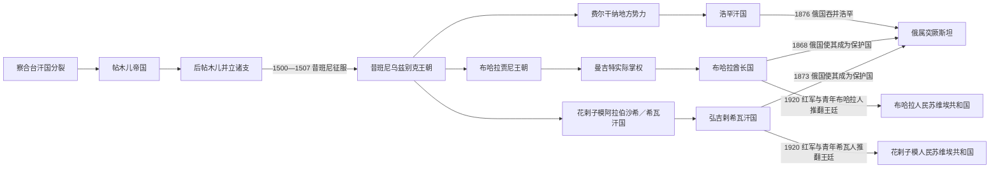

# 乌兹别克斯坦的帖木儿、乌兹别克汗国与三大汗国

## 时间

1370—1920年（1865年以后与俄国征服阶段重叠）

## 概括

帖木儿以察合台汗国破碎后的河中为基地，借成吉思汗系傀儡汗、婚姻称号和个人军事联盟建立帝国。其征服横跨西亚、南亚和草原，但核心财政、工匠与礼仪集中在撒马尔罕。15世纪后王子分封和继承战争使帝国分裂；穆罕默德·昔班尼率钦察草原乌兹别克集团南下，1500—1501年夺取布哈拉、撒马尔罕。此后布哈拉、希瓦、浩罕逐渐成为近世三大政权，彼此并立而非一个连续“乌兹别克王朝”。

“乌兹别克”先是金帐汗国东部政治共同体的名称，进入河中后才与定居突厥语人口、波斯语城市居民和多种部族长期融合；现代民族身份又经俄国分类和苏维埃民族政策制度化，不能把16世纪军政集团与今日国民完全等同。

## 建立背景与崛起机制

### 帖木儿帝国

- 察合台汗国分裂后，河中缺少稳定最高权力，巴鲁剌等军政集团各据绿洲。
- 帖木儿通过结盟、婚姻和拥立成吉思汗系可汗取得法统，自称“埃米尔”而非汗。
- 撒马尔罕的灌溉税、商路和被迁入的工匠支撑宫廷；连续远征又以战利品维持军队。
- 沙哈鲁把主要宫廷移向赫拉特，乌鲁伯格治理撒马尔罕，帝国呈多中心王子分封。

### 昔班尼与布哈拉政权

- 阿布海儿汗去世后草原联盟分裂，昔班尼在帖木儿诸王内战中反复积累部众。
- 1500—1501年夺取布哈拉、撒马尔罕，1507年攻占赫拉特，后帖木儿河中核心终结。
- 昔班尼1510年在梅尔夫败于萨法维并战死，但宗族分封与乌兹别克部族并未瓦解。
- 16世纪后半阿卜杜拉二世以布哈拉整合河中；1599年前后王统转入贾尼／阿斯特拉罕家族。
- 18世纪曼吉特阿塔利克控制实权，1785年沙·穆拉德正式废除成吉思汗系名义可汗并称埃米尔。

### 希瓦与浩罕

- 花剌子模地方势力1511年拥立阿拉伯沙希伊勒巴尔斯，形成独立于布哈拉昔班尼支的可汗国。
- 阿姆河河道变化、土库曼—乌兹别克部族均势和对伊朗、草原贸易决定希瓦权力强弱。
- 18世纪弘吉剌伊纳克先控制傀儡汗，1804年伊勒图泽尔直接称汗。
- 1709年前后明格部沙鲁赫·比在费尔干纳建立浩罕政治中心；灌溉、市场和塔什干商路支持其扩张。
- 阿里木汗正式称汗，乌马尔和穆罕默德·阿里时期领土与文化达到高峰，但钦察、城市和王族派系长期争权。

## 分阶段过程

| 阶段 | 时间 | 过程与结果 |
|---|---|---|
| 帖木儿统一与扩张 | 1370—1405年 | 统一河中，远征伊朗、印度、金帐汗国和安纳托利亚；帝国依赖个人军功联盟。 |
| 后帖木儿多中心 | 1405—1507/1512年 | 沙哈鲁暂时稳定，随后撒马尔罕、赫拉特、费尔干纳诸支争位；巴布尔短暂复位后转入印度。 |
| 昔班尼宗族国家 | 1500—1599年 | 乌兹别克王族分封河中诸城，阿卜杜拉二世后期强化布哈拉中心。 |
| 贾尼王朝 | 1599—18世纪中叶 | 延续成吉思汗法统，实际权力在王族、部落、宗教家族和地方首领间分散。 |
| 曼吉特布哈拉酋长国 | 1756/1785—1920年 | 先以阿塔利克掌权，后称埃米尔；1868年后为俄国保护国。 |
| 希瓦汗国 | 1511—1920年 | 阿拉伯沙希、受立可汗和弘吉剌先后统治；1873年后为俄国保护国。 |
| 浩罕汗国 | 1709—1876年 | 费尔干纳—塔什干区域国家；内战与俄国进攻叠加，最终被直接吞并。 |

## 王朝世系与地域分工

这些政权跨越今日乌兹别克斯坦、塔吉克斯坦、土库曼斯坦、阿富汗和哈萨克斯坦，完整世系集中维护在河中地区：

- [帖木儿王朝统治者表](/%E4%BA%BA%E6%96%87%E7%A7%91%E5%AD%A6/%E5%8E%86%E5%8F%B2/%E4%B8%AD%E4%BA%9A/%E6%B2%B3%E4%B8%AD%E5%9C%B0%E5%8C%BA/%E5%B8%96%E6%9C%A8%E5%84%BF%E7%8E%8B%E6%9C%9D%E7%BB%9F%E6%B2%BB%E8%80%85%E8%A1%A8.md)逐项列出撒马尔罕、赫拉特、费尔干纳并立支系、复位者与巴布尔河中任期。
- [布哈拉、希瓦与浩罕统治者表](/%E4%BA%BA%E6%96%87%E7%A7%91%E5%AD%A6/%E5%8E%86%E5%8F%B2/%E4%B8%AD%E4%BA%9A/%E6%B2%B3%E4%B8%AD%E5%9C%B0%E5%8C%BA/%E5%B8%83%E5%93%88%E6%8B%89%E3%80%81%E5%B8%8C%E7%93%A6%E4%B8%8E%E6%B5%A9%E7%BD%95%E7%BB%9F%E6%B2%BB%E8%80%85%E8%A1%A8.md)列出昔班尼、贾尼、曼吉特、希瓦各支、傀儡可汗、弘吉剌和浩罕明格全部公认统治者。
- 本页负责解释这些王朝在今日乌兹别克斯坦空间的城市、社会和制度影响，不复制长表，以免不同国家页产生互相矛盾的版本。

## 统治结构

| 权力层 | 帖木儿时期 | 三汗国时期 |
|---|---|---|
| 最高法统 | 成吉思汗系名义汗；帖木儿家族埃米尔掌实权 | 昔班尼、贾尼等成吉思汗系可汗；曼吉特后改以埃米尔和伊斯兰法统 |
| 王族与部落 | 王子分封与军功埃米尔 | 乌兹别克部族首领、伊纳克、阿塔利克、明巴希等 |
| 文官与宗教 | 波斯语书记、财政官、法官和苏菲网络 | 宰相、法官、乌理玛、宗教地产与霍加家族 |
| 城市与乡村 | 灌溉税、商税、工匠征调 | 土地税、关税、市场、灌溉共同体和地方总督 |
| 军队 | 突厥—蒙古骑兵、家臣和征服地兵员 | 部族骑兵、宫廷卫队，19世纪部分建立火器常备军 |
| 地方实际权力 | 王子和军政贵族可形成独立宫廷 | 沙赫里萨布兹等地方贝伊、钦察集团和土库曼首领可挑战中央 |

## 重要事件

1. 1370年，帖木儿在巴尔赫会议后控制河中，拥立速檀马哈茂德汗。
2. 1380—1390年代，帖木儿击败金帐汗脱脱迷失，重塑草原商路与河中安全。
3. 1398年，帖木儿远征德里；战利品和工匠被带回撒马尔罕。
4. 1402年，安卡拉战役击败奥斯曼苏丹巴耶济德一世。
5. 1405年帖木儿死后诸王争位，沙哈鲁至1409年前后取得优势。
6. 1409—1449年，乌鲁伯格治理撒马尔罕并支持天文研究，政治上最终败于宗族战争。
7. 1469年以后，侯赛因·拜卡拉与赫拉特文化繁荣并存，河中则由不同帖木儿支系争夺。
8. 1500—1501年，昔班尼占领布哈拉、撒马尔罕。
9. 1507年昔班尼占赫拉特；1510年又在梅尔夫被萨法维军击杀。
10. 1533—1540年，乌拜杜拉汗以布哈拉为主要首都，布哈拉中心地位上升。
11. 1583—1598年，阿卜杜拉二世整合河中并扩张，死后继承危机终结昔班尼主支。
12. 1599年前后，贾尼家族接掌布哈拉王统。
13. 1709年前后，沙鲁赫·比在浩罕建立明格政权。
14. 1740年纳迪尔沙占领布哈拉、希瓦，旧有王权威望受创。
15. 1750年代，曼吉特家族在布哈拉取得实际最高权力。
16. 1785年沙·穆拉德称埃米尔，结束布哈拉傀儡汗制度。
17. 1804年伊勒图泽尔在希瓦称汗，弘吉剌实际统治转为公开王朝。
18. 1822—1842年，浩罕穆罕默德·阿里汗时期扩张，后被布哈拉埃米尔纳斯鲁拉处死。
19. 1842年布哈拉占领浩罕约十周即被地方反抗驱逐，显示外来占领缺乏财政和社会基础。
20. 1865年俄军攻占塔什干，浩罕失去最重要北方城市。
21. 1868年布哈拉败于俄军并成为保护国，撒马尔罕等地被直接并入俄属突厥斯坦。
22. 1873年希瓦战败签订条约，失去独立外交并割地赔款。
23. 1875—1876年浩罕起义、废立和俄军干预交织，汗国被直接吞并。
24. 1920年红军与地方改革派分别推翻布哈拉埃米尔和希瓦可汗，近世王廷终结。

## 崛起、鼎盛与衰亡原因

### 崛起与稳定条件

- 帖木儿和昔班尼都利用前一帝国的王位分裂，以机动骑兵和个人联盟夺取城市财政。
- 撒马尔罕、布哈拉、希瓦和浩罕各有独立灌溉与市场腹地，足以支持多个区域国家。
- 宗教学者、苏菲家族和成吉思汗法统为外来军事集团提供城市合法性。
- 对伊朗、俄罗斯、印度和草原的贸易，使棉织品、牲畜、奴隶、金属和关税成为重要收入。

### 结构性衰落

- 王族共同拥有统治权和部族分封造成反复内战，幼主、复位与傀儡汗频繁。
- 火器、常备军和财政改革不均衡，中央很难持续压服地方贝伊与部族首领。
- 18—19世纪远洋贸易改变欧亚陆路比重，汗国仍有区域商业，却难以匹敌俄国的工业、后勤和炮兵。
- 布哈拉、希瓦、浩罕彼此竞争，不能建立稳定共同防线；俄国则以堡垒线、外交、贸易和逐次战争推进。

### 直接终结过程

浩罕因1865年失去塔什干、宫廷税负与1875年起义陷入危机，俄国借平乱于1876年吞并全境。布哈拉1868年战败、希瓦1873年战败后保留王廷和内部行政，却失去独立外交，不能把保护国误写为当年灭亡。1917年帝国崩溃后，青年布哈拉人、青年希瓦人、地方武装和布尔什维克各有目标；1920年红军攻城才直接结束两王廷。其后人民苏维埃共和国只是过渡，1924年民族划界再将其领土分入多个加盟共和国。

## 演变关系

- 上级：[乌兹别克斯坦历史](/%E4%BA%BA%E6%96%87%E7%A7%91%E5%AD%A6/%E5%8E%86%E5%8F%B2/%E4%B8%AD%E4%BA%9A/%E4%B9%8C%E5%85%B9%E5%88%AB%E5%85%8B%E6%96%AF%E5%9D%A6/README.md)
- 前一阶段：[粟特、花剌子模与河中绿洲](/%E4%BA%BA%E6%96%87%E7%A7%91%E5%AD%A6/%E5%8E%86%E5%8F%B2/%E4%B8%AD%E4%BA%9A/%E4%B9%8C%E5%85%B9%E5%88%AB%E5%85%8B%E6%96%AF%E5%9D%A6/%E7%B2%9F%E7%89%B9%E3%80%81%E8%8A%B1%E5%89%8C%E5%AD%90%E6%A8%A1%E4%B8%8E%E6%B2%B3%E4%B8%AD%E7%BB%BF%E6%B4%B2.md)
- 后一阶段：[俄罗斯、苏维埃与独立共和国](/%E4%BA%BA%E6%96%87%E7%A7%91%E5%AD%A6/%E5%8E%86%E5%8F%B2/%E4%B8%AD%E4%BA%9A/%E4%B9%8C%E5%85%B9%E5%88%AB%E5%85%8B%E6%96%AF%E5%9D%A6/%E4%BF%84%E7%BD%97%E6%96%AF%E3%80%81%E8%8B%8F%E7%BB%B4%E5%9F%83%E4%B8%8E%E7%8B%AC%E7%AB%8B%E5%85%B1%E5%92%8C%E5%9B%BD.md)
- 区域详史：[帖木儿、汗国与近世城市](/%E4%BA%BA%E6%96%87%E7%A7%91%E5%AD%A6/%E5%8E%86%E5%8F%B2/%E4%B8%AD%E4%BA%9A/%E6%B2%B3%E4%B8%AD%E5%9C%B0%E5%8C%BA/%E5%B8%96%E6%9C%A8%E5%84%BF%E3%80%81%E6%B1%97%E5%9B%BD%E4%B8%8E%E8%BF%91%E4%B8%96%E5%9F%8E%E5%B8%82.md)
