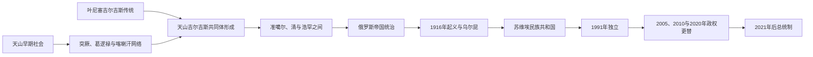

# 吉尔吉斯斯坦历史

吉尔吉斯斯坦历史由天山山地牧业、楚河与费尔干纳绿洲、跨境商路以及多层政治归属共同塑造。叶尼塞吉尔吉斯、天山吉尔吉斯与现代吉尔吉斯民族之间存在名称、语言和文化联系，但迁徙、联盟重组与苏维埃民族建构使这段历史不能被压缩成单一国家的直线延续。

## 历史主线

今吉尔吉斯斯坦既是草原—山地牧业区，也是连接七河、塔里木、费尔干纳和河中的交通节点。古代萨卡、乌孙等群体并不等同于现代民族；6世纪以后突厥汗国、突骑施、葛逻禄和喀喇汗王朝推动突厥语与伊斯兰城市网络进入天山。840年叶尼塞吉尔吉斯击败回鹘汗国，是吉尔吉斯政治记忆的重要节点；现代天山吉尔吉斯共同体则在蒙古以后、尤其14—18世纪的迁徙与联盟重组中逐步形成。

18—19世纪，北部部族首领在清、哈萨克、准噶尔余部、浩罕与俄罗斯之间周旋，南部和楚河谷受到浩罕堡垒、税收与官员体系更直接的影响。俄罗斯于19世纪中后期征服天山和费尔干纳；土地殖民、税役与1916年征兵令共同触发大起义及“乌尔昆”逃亡。苏维埃政权随后以民族划界、定居化、集体化、教育与工业化重塑社会，并在1936年建立吉尔吉斯加盟共和国。

1991年独立后，吉尔吉斯斯坦经历市场转型、宪制反复与三次大规模政权更替。2010—2021年的议会制实验扩大了议会和联合政府作用，2021年宪法又恢复以总统为行政权核心的体制。费尔干纳边境、水土资源、劳工迁移、金矿与水电、地区精英竞争仍持续影响国家政治；2025年吉尔吉斯斯坦与塔吉克斯坦签署国界条约，为长期边境冲突建立新的制度框架。

## 阶段导航

| 顺序 | 阶段 | 时间 | 简要概括 |
|---|---|---|---|
| 1 | [天山社会、突厥与吉尔吉斯传统](/%E4%BA%BA%E6%96%87%E7%A7%91%E5%AD%A6/%E5%8E%86%E5%8F%B2/%E4%B8%AD%E4%BA%9A/%E5%90%89%E5%B0%94%E5%90%89%E6%96%AF%E6%96%AF%E5%9D%A6/%E5%A4%A9%E5%B1%B1%E7%A4%BE%E4%BC%9A%E3%80%81%E7%AA%81%E5%8E%A5%E4%B8%8E%E5%90%89%E5%B0%94%E5%90%89%E6%96%AF%E4%BC%A0%E7%BB%9F.md) | 古代—18世纪 | 从早期草原—绿洲社会到突厥、叶尼塞吉尔吉斯、蒙古与蒙兀儿斯坦，说明现代吉尔吉斯共同体的多源形成。 |
| 2 | [浩罕、俄罗斯与苏维埃吉尔吉斯斯坦](/%E4%BA%BA%E6%96%87%E7%A7%91%E5%AD%A6/%E5%8E%86%E5%8F%B2/%E4%B8%AD%E4%BA%9A/%E5%90%89%E5%B0%94%E5%90%89%E6%96%AF%E6%96%AF%E5%9D%A6/%E6%B5%A9%E7%BD%95%E3%80%81%E4%BF%84%E7%BD%97%E6%96%AF%E4%B8%8E%E8%8B%8F%E7%BB%B4%E5%9F%83%E5%90%89%E5%B0%94%E5%90%89%E6%96%AF%E6%96%AF%E5%9D%A6.md) | 18世纪—1991年 | 浩罕堡垒和地方汗权、俄罗斯征服、1916年乌尔昆、民族划界与苏维埃改造。 |
| 3 | [独立、革命与现代吉尔吉斯斯坦](/%E4%BA%BA%E6%96%87%E7%A7%91%E5%AD%A6/%E5%8E%86%E5%8F%B2/%E4%B8%AD%E4%BA%9A/%E5%90%89%E5%B0%94%E5%90%89%E6%96%AF%E6%96%AF%E5%9D%A6/%E7%8B%AC%E7%AB%8B%E3%80%81%E9%9D%A9%E5%91%BD%E4%B8%8E%E7%8E%B0%E4%BB%A3%E5%90%89%E5%B0%94%E5%90%89%E6%96%AF%E6%96%AF%E5%9D%A6.md) | 1991年—2026年7月 | 市场转型、2005/2010/2020年政权更替、议会制实验与总统制再集中。 |

## 重要转折与时间节点

| 时间 | 转折 | 意义 |
|---|---|---|
| 552年以后 | 突厥诸汗国控制天山 | 突厥语政治与跨区域商路网络扩展 |
| 840年 | 叶尼塞吉尔吉斯击败回鹘汗国 | 吉尔吉斯历史记忆中的帝国高点，但不等于现代疆域国家 |
| 13—16世纪 | 蒙古征服、察合台—蒙兀儿斯坦重组 | 天山部族、绿洲与山地政治关系重新编排 |
| 1755—1758年 | 清朝击败准噶尔 | 天山权力格局改变，吉尔吉斯首领进入新的朝贡与边境关系 |
| 1842年前后 | 奥尔蒙被部分北部部族推举为汗 | 短期整合尝试，未形成覆盖全体吉尔吉斯的统一国家 |
| 1860—1876年 | 俄军夺取楚河堡垒并吞并浩罕 | 今吉尔吉斯斯坦大部先后纳入俄罗斯帝国 |
| 1916年 | 起义与乌尔昆 | 殖民土地、税役和征兵压力引发大规模死亡与外逃 |
| 1924—1936年 | 自治州、自治共和国、加盟共和国递次建立 | 现代领土和民族行政制度化 |
| 1991年8月31日 | 宣布独立 | 苏维埃共和国边界转为主权国家边界 |
| 2005、2010、2020年 | 三次群众动员与权力更替 | 暴露选举合法性、腐败和总统权力约束问题 |
| 2021年 | 新宪法施行 | 行政权重新集中于总统 |
| 2025年3月13日 | 与塔吉克斯坦签署国界条约 | 长期未定边界和冲突治理出现重大转折 |

## 统治者与权力结构专表

- [吉尔吉斯斯坦国家元首与政府首脑表](/%E4%BA%BA%E6%96%87%E7%A7%91%E5%AD%A6/%E5%8E%86%E5%8F%B2/%E4%B8%AD%E4%BA%9A/%E5%90%89%E5%B0%94%E5%90%89%E6%96%AF%E6%96%AF%E5%9D%A6/%E5%9B%BD%E5%AE%B6%E5%85%83%E9%A6%96%E4%B8%8E%E6%94%BF%E5%BA%9C%E9%A6%96%E8%84%91%E8%A1%A8.md)：完整列出独立前后总统、代理元首、总理与内阁主席，并区分危机中的争议任期及各宪制阶段实际权力。
- [布哈拉、希瓦与浩罕统治者表](/%E4%BA%BA%E6%96%87%E7%A7%91%E5%AD%A6/%E5%8E%86%E5%8F%B2/%E4%B8%AD%E4%BA%9A/%E6%B2%B3%E4%B8%AD%E5%9C%B0%E5%8C%BA/%E5%B8%83%E5%93%88%E6%8B%89%E3%80%81%E5%B8%8C%E7%93%A6%E4%B8%8E%E6%B5%A9%E7%BD%95%E7%BB%9F%E6%B2%BB%E8%80%85%E8%A1%A8.md)：浩罕明格王朝的完整可汗、复位与摄政序列。
- [草原汗国](/%E4%BA%BA%E6%96%87%E7%A7%91%E5%AD%A6/%E5%8E%86%E5%8F%B2/%E4%B8%AD%E4%BA%9A/%E8%8D%89%E5%8E%9F%E6%B1%97%E5%9B%BD/README.md)：突厥、蒙古、哈萨克等跨国草原政治的共同背景与相关世系入口。

## 区域关系

- [中亚历史](/%E4%BA%BA%E6%96%87%E7%A7%91%E5%AD%A6/%E5%8E%86%E5%8F%B2/%E4%B8%AD%E4%BA%9A/README.md)
- [中亚通史](/%E4%BA%BA%E6%96%87%E7%A7%91%E5%AD%A6/%E5%8E%86%E5%8F%B2/%E4%B8%AD%E4%BA%9A/_%E9%80%9A%E5%8F%B2/README.md)
- [河中地区](/%E4%BA%BA%E6%96%87%E7%A7%91%E5%AD%A6/%E5%8E%86%E5%8F%B2/%E4%B8%AD%E4%BA%9A/%E6%B2%B3%E4%B8%AD%E5%9C%B0%E5%8C%BA/README.md)
