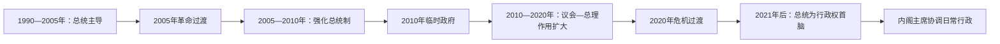

# 吉尔吉斯斯坦国家元首与政府首脑表

## 范围与口径

本表从1990年总统职位设立起列出国家元首，并从1991年现代总理职位设立起列出全部政府首脑。复任、代理、临时政府和争议任期均分项记录；“代理”不另计正式编号。2021年5月后，总理改称“内阁主席”。截至2026年7月，现任总统为萨德尔·扎帕罗夫，现任内阁主席兼总统办公厅主任为阿德尔别克·卡瑟马利耶夫。

## 国家元首

| 顺序 | 姓名 | 职位／性质 | 任期 | 取得与离任 | 关键说明 |
|---|---|---|---|---|---|
| 1 | **阿斯卡尔·阿卡耶夫**（Askar Akayev） | 总统 | 1990-10-27—2005-03-24 | 最高苏维埃选出，后多次当选；郁金香革命中出逃 | 1991年独立前后连续任职；正式辞职文件于2005年4月签署，但3月24日已失去实际权力。 |
| — | 伊申拜·卡德尔别科夫（Ishenbai Kadyrbekov） | 代理总统 | 2005-03-24—03-25 | 作为立法机关负责人短暂代理 | 仅约一日，随后由巴基耶夫掌权。 |
| — | **库尔曼别克·巴基耶夫**（Kurmanbek Bakiyev） | 代理总统 | 2005-03-25—08-14 | 革命后兼任政府首脑 | 在危机中控制行政。 |
| 2 | 库尔曼别克·巴基耶夫 | 总统 | 2005-08-14—2010-04-07（实际）；至04-15正式辞职 | 2005、2009年当选；2010年起义中出逃 | 权力向总统及家族网络集中。 |
| — | **罗萨·奥通巴耶娃**（Roza Otunbayeva） | 临时政府主席／临时国家元首 | 2010-04-07—07-03 | 反对派组成临时政府 | 在暴力和制度真空中主持过渡。 |
| 3 | 罗萨·奥通巴耶娃 | 过渡时期总统 | 2010-07-03—2011-12-01 | 新宪法下被确认有限过渡任期 | 不参加下一次总统选举。 |
| 4 | **阿尔马兹别克·阿坦巴耶夫**（Almazbek Atambayev） | 总统 | 2011-12-01—2017-11-24 | 2011年当选，任满 | 独立后首次按期把总统职位交给民选继任者。 |
| 5 | 索隆拜·热恩别科夫（Sooronbay Jeenbekov） | 总统 | 2017-11-24—2020-10-15 | 2017年当选；选举危机中辞职 | 2020年抗议使政府和议会权威崩解。 |
| — | 卡纳特别克·伊萨耶夫（Kanatbek Isaev） | 宪法继任主张者 | 2020-10-15—10-16 | 议长身份形成短暂继任主张 | 未建立稳定行政控制，部分国家元首年表不将其列入正式序列。 |
| — | **萨德尔·扎帕罗夫**（Sadyr Japarov） | 代理总统 | 2020-10-16—11-14 | 先任总理，继而代理总统 | 为参选辞去代理职务。 |
| — | 塔兰特·马梅托夫（Talant Mamytov） | 代理总统 | 2020-11-14—2021-01-28 | 议长代理 | 主持选举过渡。 |
| 6 | **萨德尔·扎帕罗夫** | 总统 | 2021-01-28—至今 | 2021年当选 | 2021年宪法下兼为行政权最高负责人；截至2026年7月在任。 |

### 2005年一日过渡的争议记载

部分政治年表把时任总理尼古拉·塔纳耶夫和议长奥穆尔别克·捷克巴耶夫在2005年3月25日的宪法继任或权力主张分别列为不足一日的国家元首。两人没有形成稳定、普遍承认的总统任期，因此本表将其保留为危机说明，不与正式或实际代理元首混排。

## 政府首脑：1991—2010年

| 顺序 | 姓名 | 职位性质 | 任期 | 说明 |
|---|---|---|---|---|
| 1 | 纳西尔丁·伊萨诺夫（Nasirdin Isanov） | 总理 | 1991-01-21—11-29 | 首任现代总理，任内因车祸去世 |
| 2 | 安德烈·约尔丹（Andrei Iordan） | 代理总理 | 1991-11-29—1992-02-10 | 危机过渡 |
| 3 | 图尔孙别克·钦吉舍夫（Tursunbek Chyngyshev） | 总理 | 1992-02-10—1993-12-13 | 市场转型初期 |
| 4 | 阿尔曼别特·马图布赖莫夫（Almanbet Matubraimov） | 代理总理 | 1993-12-13—12-14 | 一日过渡 |
| 5 | 阿帕斯·朱马古洛夫（Apas Jumagulov） | 总理 | 1993-12-14—1998-03-14 | 长期技术官僚政府 |
| 6 | 库巴内奇别克·朱马利耶夫（Kubanychbek Jumaliyev） | 总理 | 1998-03-14—12-23 | 经济危机期 |
| 7 | 鲍里斯·西拉耶夫（Boris Silayev） | 代理总理 | 1998-12-23—12-25 | 短期代理 |
| 8 | 朱马别克·伊布赖莫夫（Jumabek Ibraimov） | 总理 | 1998-12-25—1999-04-04 | 任内病逝 |
| — | 鲍里斯·西拉耶夫 | 代理总理 | 1999-04-04—04-12 | 第二次代理 |
| 9 | 阿曼格尔德·穆拉利耶夫（Amangeldy Muraliyev） | 总理 | 1999-04-12—2000-12-21 | 经济恢复期 |
| 10 | 库尔曼别克·巴基耶夫 | 总理 | 2000-12-21—2002-05-22 | 阿克瑟事件后政府辞职 |
| 11 | 尼古拉·塔纳耶夫（Nikolai Tanayev） | 总理 | 2002-05-22—2005-03-25 | 郁金香革命中政府垮台 |
| — | 库尔曼别克·巴基耶夫 | 代理总理 | 2005-03-25—03-28 | 革命过渡 |
| 12 | 库尔曼别克·巴基耶夫 | 总理 | 2005-03-28—06-20 | 兼代理总统 |
| 13 | 梅杰特别克·克里姆库洛夫（Medetbek Kerimkulov） | 代理总理 | 2005-06-20—07-10 | 选举过渡 |
| — | 库尔曼别克·巴基耶夫 | 代理总理 | 2005-07-10—08-15 | 第二段过渡 |
| — | 费利克斯·库洛夫（Felix Kulov） | 代理总理 | 2005-08-15—09-01 | 等待议会确认 |
| 14 | 费利克斯·库洛夫 | 总理 | 2005-09-01—2007-01-29 | “串联”安排的一部分 |
| 15 | 阿齐姆·伊萨别科夫（Azim Isabekov） | 总理 | 2007-01-29—03-29 | 短期政府 |
| 16 | 阿尔马兹别克·阿坦巴耶夫 | 总理 | 2007-03-29—11-28 | 第一次任总理 |
| 17 | 伊斯肯德尔别克·艾达拉利耶夫（Iskenderbek Aidaraliyev） | 代理总理 | 2007-11-28—12-24 | 议会选举过渡 |
| 18 | 伊戈尔·丘季诺夫（Igor Chudinov） | 总理 | 2007-12-24—2009-10-21 | 巴基耶夫时期 |
| 19 | 达尼亚尔·乌谢诺夫（Daniar Usenov） | 总理 | 2009-10-21—2010-04-07 | 2010年起义中政府垮台 |

2010年4月7日至12月17日不设常规总理，临时政府由罗萨·奥通巴耶娃领导；这是制度中断，不应以某名总理补齐。

## 政府首脑：2010—2021年议会制实验

| 顺序 | 姓名 | 职位性质 | 任期 | 说明 |
|---|---|---|---|---|
| 20 | 阿尔马兹别克·阿坦巴耶夫 | 总理 | 2010-12-17—2011-09-23 | 联合政府首脑 |
| — | 奥穆尔别克·巴巴诺夫（Ömürbek Babanov） | 代理总理 | 2011-09-23—11-14 | 阿坦巴耶夫参选期间代理 |
| — | 阿尔马兹别克·阿坦巴耶夫 | 总理 | 2011-11-14—12-01 | 复任至就任总统 |
| — | 奥穆尔别克·巴巴诺夫 | 代理总理 | 2011-12-01—12-24 | 等待组阁 |
| 21 | 奥穆尔别克·巴巴诺夫 | 总理 | 2011-12-24—2012-09-01 | 联合政府解体后辞职 |
| 22 | 阿阿雷·卡拉舍夫（Aaly Karashev） | 代理总理 | 2012-09-01—09-06 | 短期代理 |
| 23 | 焦马尔特·萨特巴尔季耶夫（Zhantoro Satybaldiyev） | 总理 | 2012-09-06—2014-03-25 | 库姆托尔争议与联盟变化 |
| — | 朱马尔特·奥托尔巴耶夫（Djoomart Otorbaev） | 代理总理 | 2014-03-25—04-03 | 议会确认前代理 |
| 24 | 朱马尔特·奥托尔巴耶夫 | 总理 | 2014-04-03—2015-05-01 | 技术官僚政府 |
| 25 | 铁米尔·萨里耶夫（Temir Sariyev） | 总理 | 2015-05-01—2016-04-13 | 在采购争议后辞职 |
| 26 | 索隆拜·热恩别科夫 | 总理 | 2016-04-13—2017-08-22 | 为参选总统辞职 |
| 27 | 穆罕默德卡雷·阿贝尔加济耶夫（Mukhammetkalyi Abylgaziev） | 代理总理 | 2017-08-22—08-26 | 选举过渡 |
| 28 | 萨帕尔·伊萨科夫（Sapar Isakov） | 总理 | 2017-08-26—2018-04-19 | 不信任案后去职 |
| 29 | 穆罕默德卡雷·阿贝尔加济耶夫 | 总理 | 2018-04-20—2020-06-15 | 因通信频谱争议辞职 |
| 30 | 库巴特别克·博罗诺夫（Kubatbek Boronov） | 总理 | 2020-06-17—10-06 | 2020年选举抗议中辞职 |
| — | 阿尔马兹别克·巴特尔别科夫（Almazbek Batyrbekov） | 争议代理总理 | 2020-10-09—10-14 | 在议会分裂时被部分方面视为代理，与扎帕罗夫任期重叠 |
| — | 萨德尔·扎帕罗夫 | 实际／代理总理 | 2020-10-06—10-10 | 在抗议中获部分议员支持，确认程序存在争议 |
| 31 | 萨德尔·扎帕罗夫 | 总理 | 2020-10-10—11-14 | 后转任代理总统并参选 |
| 32 | 阿尔乔姆·诺维科夫（Artem Novikov） | 代理总理 | 2020-11-14—2021-02-03 | 选举过渡 |
| 33 | 乌卢克别克·马里波夫（Ulukbek Maripov） | 总理 | 2021-02-03—05-05 | 最后一位使用“总理”称号者 |

## 内阁主席：2021年至今

| 顺序 | 姓名 | 任期 | 与总统关系 | 关键说明 |
|---|---|---|---|---|
| 1 | 乌卢克别克·马里波夫 | 2021-05-05—10-12 | 由总统领导的行政体系内主持内阁 | 职称由总理转为内阁主席 |
| 2 | 阿克尔别克·扎帕罗夫（Akylbek Japarov） | 2021-10-12—2024-12-16 | 同时领导总统办公厅 | 推进财政、税务和大型国有项目；与总统萨德尔·扎帕罗夫并非同一人 |
| 3 | **阿德尔别克·卡瑟马利耶夫**（Adylbek Kasymaliev） | 2024-12-18—至今 | 内阁主席兼总统办公厅主任 | 官方履历以12月18日为就任日；12月16—18日为任命交接。截止2026年7月在任。 |

## 实际权力结构

| 时期 | 宪制设计 | 实际权力重心 | 政府首脑角色 |
|---|---|---|---|
| 1991—2005年 | 总统共和国，议会与政府并存 | 总统、总统办公厅及地区行政任命体系 | 负责经济和日常行政，政治自主性有限 |
| 2005—2010年 | 宪法多次修改 | 巴基耶夫总统、家族与安全机构权力上升 | 总理频繁更替，主要执行总统政策 |
| 2010年过渡 | 临时政府集体安排 | 奥通巴耶娃和临时政府成员，南部地方控制一度破碎 | 常规总理职位空缺 |
| 2010—2020年 | 议会制色彩较强的半总统体制 | 议会党团、联合政府、总统与总理相互制衡 | 总理需维持议会联盟，内阁更替频繁 |
| 2020年危机 | 法定继任与街头动员冲突 | 扎帕罗夫阵营快速取得政府、议会多数和代理总统权 | 争议表决与并行代理主张并存 |
| 2021年至今 | 总统为国家元首、最高官员和行政权首脑 | 总统及总统办公厅 | 内阁主席管理内阁并兼总统办公厅主任，受总统任免和领导 |

## 相关笔记

- [独立、革命与现代吉尔吉斯斯坦](/%E4%BA%BA%E6%96%87%E7%A7%91%E5%AD%A6/%E5%8E%86%E5%8F%B2/%E4%B8%AD%E4%BA%9A/%E5%90%89%E5%B0%94%E5%90%89%E6%96%AF%E6%96%AF%E5%9D%A6/%E7%8B%AC%E7%AB%8B%E3%80%81%E9%9D%A9%E5%91%BD%E4%B8%8E%E7%8E%B0%E4%BB%A3%E5%90%89%E5%B0%94%E5%90%89%E6%96%AF%E6%96%AF%E5%9D%A6.md)
- [吉尔吉斯斯坦历史](/%E4%BA%BA%E6%96%87%E7%A7%91%E5%AD%A6/%E5%8E%86%E5%8F%B2/%E4%B8%AD%E4%BA%9A/%E5%90%89%E5%B0%94%E5%90%89%E6%96%AF%E6%96%AF%E5%9D%A6/README.md)
