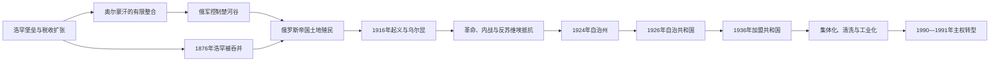

# 吉尔吉斯斯坦的浩罕、俄罗斯与苏维埃吉尔吉斯斯坦

## 时间

18世纪—1991年

## 概括

18世纪后半至19世纪，浩罕汗国从费尔干纳向天山山口、南部河谷和楚河推进，以堡垒、哈基姆、税收和地方首领合作维持影响；北部吉尔吉斯部族仍在清、哈萨克、浩罕与俄罗斯之间周旋。奥尔蒙汗曾尝试整合部分北部部族，但继承与部族冲突限制了统一。俄罗斯于1860年代控制楚河谷，1876年吞并浩罕，把今吉尔吉斯斯坦大部纳入突厥斯坦总督区。

帝国移民和土地政策压缩牧地，第一次世界大战征调又触发1916年起义与“乌尔昆”。苏维埃政权在内战与反抗中建立，通过1924—1936年的民族划界创设现代共和国框架；集体化、强制定居、政治清洗、普及教育和工业化则深刻改变人口与权力结构。1990年奥什暴力、经济停滞和联盟中央崩解，构成独立前夕的直接危机。

## 建立背景与浩罕统治

费尔干纳人口、灌溉农业和城市税源支持浩罕汗国向东扩张。19世纪初，汗国在奥什、贾拉拉巴德、纳伦通道和楚河谷设置堡垒，1825年前后修筑皮什佩克与托克马克等据点。堡垒驻军征收牲畜、贸易和土地税，地方哈基姆又依赖吉尔吉斯首领提供牧道情报、兵员与税收中介。因此“浩罕统治”在南部定居区较直接，在偏远高山和北部部族中则常表现为不稳定的贡纳、结盟或军事惩罚。

浩罕扩张引发地方反抗，也为一些首领提供贸易和政治资源。1842年前后，萨雷巴吉什等部分北部部族推举奥尔蒙·尼亚兹别克之子为汗。他试图通过部族会议、习惯法和军事动员约束内斗，并在1847年与肯萨雷·卡瑟莫夫率领的哈萨克军队冲突中获胜；但其权威从未覆盖所有吉尔吉斯支系。奥尔蒙在与布古部族冲突中死亡后，儿子乌梅塔雷的继承主张缺乏普遍承认，北部政治再次分散。

## 地方汗权与统治者

| 顺序 | 统治者／主张者 | 时间 | 继承与统治范围 | 关键事件与说明 |
|---|---|---|---|---|
| 1 | **奥尔蒙汗**（Ormon Niyazbek uulu） | 约1842—1854 | 由部分北部部族推举；非浩罕明格王室 | 尝试整合萨雷巴吉什及盟友，设仲裁规则与军令；1847年击败肯萨雷军；与布古冲突中死亡。去世年份在部分资料中作1853或1854。 |
| 2 | 乌梅塔雷（Ümötaly Ormon uulu） | 1854—1867 | 奥尔蒙之子和继承主张者 | 继续反对俄国推进，但没有取得全体北部部族承认；1867年前后停止抵抗并接受帝国秩序。 |

浩罕汗国的完整明格王朝、复位者与摄政序列见[布哈拉、希瓦与浩罕统治者表](/%E4%BA%BA%E6%96%87%E7%A7%91%E5%AD%A6/%E5%8E%86%E5%8F%B2/%E4%B8%AD%E4%BA%9A/%E6%B2%B3%E4%B8%AD%E5%9C%B0%E5%8C%BA/%E5%B8%83%E5%93%88%E6%8B%89%E3%80%81%E5%B8%8C%E7%93%A6%E4%B8%8E%E6%B5%A9%E7%BD%95%E7%BB%9F%E6%B2%BB%E8%80%85%E8%A1%A8.md)。奥尔蒙汗体系与浩罕可汗是并列、竞争且局部重叠的权力，不能合并为一条王统。

## 俄罗斯征服与殖民统治

1850年代起，部分伊塞克湖首领为摆脱浩罕或部族对手而寻求俄国保护。俄军以七河堡垒线为基地南进，1860年在乌尊阿加什击败浩罕军，并先后攻击托克马克和皮什佩克；1862年皮什佩克堡垒被最终摧毁，后在其附近形成俄国行政城镇。1860年代中期，楚河谷和伊塞克湖地区纳入七河州；1876年俄国利用浩罕内乱和起义直接废除汗国，南部进入费尔干纳州。

帝国行政以突厥斯坦总督、军事州长、县和乡为层级，同时让地方首领担任乡长、法官或征税中介。移民局把河谷和水源附近土地划给俄、乌克兰农民，游牧家庭的冬牧地和迁徙通道被压缩。货币贸易、城镇市场、道路和学校有所发展，但收益、土地权和政治代表并不平等；殖民官员对“游牧过剩土地”的定义尤其忽视季节牧业所需的完整生态空间。

## 1916年起义与乌尔昆

1916年6月25日，沙皇政府下令征调中亚非俄罗斯男性从事后方劳役。征调名册中的舞弊只是直接导火索，更深层原因包括土地被占、税负、战争物价、行政歧视和首领权威受损。7—8月，七河与天山多地袭击征兵机构、移民村和交通设施；俄军、哥萨克及武装移民实施镇压。

大量吉尔吉斯家庭携牲畜翻越天山逃往中国新疆，途中遭军队追击、饥饿、严寒和山路事故，形成集体记忆中的“乌尔昆”。死亡人数因档案范围和统计口径差异很大，不宜写成单一精确数字。1917年革命后部分难民返回，但土地、牲畜和家庭网络的损失延续多年。

## 革命、内战与苏维埃建制

1917年二月与十月革命瓦解帝国行政。1918年突厥斯坦自治苏维埃共和国建立，但城市苏维埃、旧地方首领、穆斯林改革派和各类武装之间长期冲突。费尔干纳反苏武装被统称为“巴斯玛奇”，其成员既有反殖民和宗教诉求，也有地方军阀、部族利益与自卫动机；苏维埃通过红军行动、赦免、土地政策和吸纳地方干部，到1920年代末逐步压制主要抵抗。

1924年民族划界建立卡拉吉尔吉斯自治州，以区别当时俄语中称“吉尔吉斯”的哈萨克人；1925年去掉“卡拉”并定名吉尔吉斯自治州，1926年升为俄罗斯联邦内的吉尔吉斯自治共和国，1936年成为苏联加盟共和国。边界把山地牧区、楚河谷和费尔干纳多民族地区纳入同一行政单位，却留下飞地、水渠和道路跨界等长期问题。

## 苏维埃改造的具体过程

- **集体化与定居化**：1920年代末至1930年代，牲畜和土地被纳入集体农庄、国营农场，牧民被要求固定登记和交售。过快征购、干部强制和牲畜锐减造成贫困、逃亡与饥饿。
- **政治清洗**：早期民族干部曾推动本地语言、行政和边界建设，1930年代又有大批干部、知识分子和宗教人士以“民族主义”或“反革命”罪名被捕、处决；1937—1938年达到高峰。
- **战争动员**：第二次世界大战期间，大批居民参军，工业设备和人口从苏联西部疏散至共和国。损失沉重，同时促进了弗龙军事工业与城市化。
- **教育与社会流动**：普及识字、学校、医疗和女性公共参与显著改变社会；吉尔吉斯语经历阿拉伯字母、拉丁字母到1940年西里尔字母的政策转换。
- **农业与工业专业化**：共和国生产畜产品、棉花、烟草、水电和矿产，并依赖联盟内能源、机械和消费品交换。这种一体化提高基础设施水平，也使1991年后的经济断裂更剧烈。
- **地区网络**：党国职位、大学和国营企业形成新精英，但北部—南部、城市—乡村和不同族群的资源分配并未消失。

## 苏维埃时期实际最高政治领导

正式国家元首由最高苏维埃主席团主席等担任，政府由人民委员会／部长会议管理；在一党体制下，决定干部任命和政策方向的实际最高职位是共产党第一书记。

| 顺序 | 第一书记 | 任期 | 关键说明 |
|---|---|---|---|
| 1 | 马克西姆·阿莫索夫 | 1937—1938 | 共和国党组织建立初期领导人，后在大清洗中被处决 |
| 2 | 阿列克谢·瓦戈夫 | 1938—1945 | 大清洗后重建党务并领导战时动员 |
| 3 | 尼古拉·博戈柳博夫 | 1945—1950 | 战后恢复初期 |
| 4 | **伊斯哈克·拉扎科夫** | 1950—1961 | 推动教育、工业和本地干部培养，后因政策与派系问题被撤换 |
| 5 | **图尔达昆·乌苏巴利耶夫** | 1961—1985 | 长期稳定执政，城市建设和党国官僚体系扩张 |
| 6 | 阿布萨马特·马萨利耶夫 | 1985—1991年4月 | 改革年代领导人，1990年奥什危机削弱党组织权威 |
| 7 | 朱姆加尔别克·阿曼巴耶夫 | 1991年4月—8月 | 共产党解体前最后一任第一书记 |

## 重要事件

| 时间 | 事件 | 结果 |
|---|---|---|
| 1820—1830年代 | 浩罕修筑皮什佩克、托克马克等堡垒 | 堡垒、驻军和税收体系进入楚河及山口 |
| 1842年前后 | 奥尔蒙被推举为汗 | 部分北部部族出现短期整合 |
| 1847年 | 奥尔蒙联盟击败肯萨雷军 | 北部联盟威望上升，但未消除内部竞争 |
| 1860—1862年 | 俄军夺取并摧毁楚河谷浩罕堡垒 | 北部战略通道转入俄罗斯控制 |
| 1876年 | 俄国废除浩罕汗国 | 南部纳入费尔干纳州 |
| 19世纪末—20世纪初 | 俄、乌移民增加 | 河谷土地和牧道压力加深 |
| 1916年 | 反征调起义与乌尔昆 | 大规模镇压、死亡和逃往新疆 |
| 1918—1920年代 | 红军与反苏武装冲突 | 苏维埃控制逐渐延伸至山地和费尔干纳 |
| 1924年 | 卡拉吉尔吉斯自治州建立 | 现代民族行政单位形成 |
| 1926年 | 升为自治共和国 | 共和国机构和本地干部体系扩大 |
| 1936年 | 吉尔吉斯加盟共和国成立 | 获得联盟共和国地位和退出联盟的形式权利 |
| 1930年代 | 集体化、定居化与大清洗 | 牧业和精英结构被强制重塑 |
| 1941—1945年 | 战争动员与工业疏散 | 人口损失、工业和城市化同时扩大 |
| 1989年 | 吉尔吉斯语确立为共和国国语 | 民族文化复兴进入国家制度 |
| 1990年6月 | 奥什和乌兹根发生族群暴力 | 土地、住房、政治动员和治安失灵集中爆发 |
| 1990年10月 | 阿斯卡尔·阿卡耶夫当选总统 | 党第一书记不再垄断最高权力 |
| 1991年8月31日 | 宣布独立 | 苏维埃阶段终结 |

## 统治结构

| 阶段 | 名义最高权威 | 实际权力结构 |
|---|---|---|
| 浩罕影响期 | 浩罕可汗 | 明巴希、地方哈基姆、堡垒驻军与吉尔吉斯首领分层合作；偏远牧区控制较弱 |
| 奥尔蒙汗时期 | 被推举的汗 | 依靠部分北部部族会议、亲族和军事声望，不具固定官僚与普遍征税能力 |
| 俄罗斯帝国 | 沙皇、突厥斯坦总督 | 军事州长和县官控制外交、军队与土地；乡长、比伊和移民机构处理基层事务 |
| 1917—1920年代 | 苏维埃与革命委员会 | 红军、党组织、地方革命委员会及武装对手并存，权力随战局变化 |
| 苏维埃共和国 | 最高苏维埃和部长会议 | 共产党第一书记及中央委员会掌干部、计划与安全系统，莫斯科保留最终约束 |

## 兴衰与转型原因

### 浩罕扩张条件

费尔干纳灌溉农业提供稳定税源，堡垒控制山口和市场，汗廷又能利用地方首领之间的竞争。其局限是驻军距离远、税负高、宫廷废立频繁，且无法完全替代宗族首领对牧地和兵员的控制。

### 俄罗斯取代浩罕的原因

- **结构因素**：浩罕王室、钦察军事集团、城市精英与地方首领反复冲突。
- **外部压力**：俄军拥有连续堡垒线、炮兵、财政和补给优势，并从七河与锡尔河两面推进。
- **直接触发**：1875年大起义、王位更替和胡达雅尔出逃，使俄国在1876年由保护关系转向直接兼并。

### 苏维埃体制的稳固与危机

苏维埃政权通过武力、土地重分配、民族共和国建制、教育和干部晋升建立合法性；计划经济又提供就业、福利与基础设施。其长期脆弱性来自政治垄断、强制集体化记忆、依赖联盟分工、地方资源竞争以及民族边界与实际居住格局不完全重合。1980年代经济停滞和开放政策削弱党国控制，1990年暴力与1991年莫斯科政变失败成为体制终结的直接触发。

## 演变关系

- 前一阶段：[天山社会、突厥与吉尔吉斯传统](/%E4%BA%BA%E6%96%87%E7%A7%91%E5%AD%A6/%E5%8E%86%E5%8F%B2/%E4%B8%AD%E4%BA%9A/%E5%90%89%E5%B0%94%E5%90%89%E6%96%AF%E6%96%AF%E5%9D%A6/%E5%A4%A9%E5%B1%B1%E7%A4%BE%E4%BC%9A%E3%80%81%E7%AA%81%E5%8E%A5%E4%B8%8E%E5%90%89%E5%B0%94%E5%90%89%E6%96%AF%E4%BC%A0%E7%BB%9F.md)
- 后一阶段：[独立、革命与现代吉尔吉斯斯坦](/%E4%BA%BA%E6%96%87%E7%A7%91%E5%AD%A6/%E5%8E%86%E5%8F%B2/%E4%B8%AD%E4%BA%9A/%E5%90%89%E5%B0%94%E5%90%89%E6%96%AF%E6%96%AF%E5%9D%A6/%E7%8B%AC%E7%AB%8B%E3%80%81%E9%9D%A9%E5%91%BD%E4%B8%8E%E7%8E%B0%E4%BB%A3%E5%90%89%E5%B0%94%E5%90%89%E6%96%AF%E6%96%AF%E5%9D%A6.md)
- 上级：[吉尔吉斯斯坦历史](/%E4%BA%BA%E6%96%87%E7%A7%91%E5%AD%A6/%E5%8E%86%E5%8F%B2/%E4%B8%AD%E4%BA%9A/%E5%90%89%E5%B0%94%E5%90%89%E6%96%AF%E6%96%AF%E5%9D%A6/README.md)
- 浩罕完整世系：[布哈拉、希瓦与浩罕统治者表](/%E4%BA%BA%E6%96%87%E7%A7%91%E5%AD%A6/%E5%8E%86%E5%8F%B2/%E4%B8%AD%E4%BA%9A/%E6%B2%B3%E4%B8%AD%E5%9C%B0%E5%8C%BA/%E5%B8%83%E5%93%88%E6%8B%89%E3%80%81%E5%B8%8C%E7%93%A6%E4%B8%8E%E6%B5%A9%E7%BD%95%E7%BB%9F%E6%B2%BB%E8%80%85%E8%A1%A8.md)
