# 吉尔吉斯斯坦的独立、革命与现代发展

## 时间

1991年—2026年7月

## 概括

吉尔吉斯斯坦在1991年继承苏维埃共和国的边界、机构和高度一体化经济。阿卡耶夫初期推动市场化、多党制和较开放的媒体环境，但经济衰退、私有化不平等、总统权力扩张及地区精英竞争削弱制度信任。2005、2010和2020年，争议选举与腐败问题分别触发大规模动员和领导层更替。

2010年宪法把更多权力交给议会和联合政府，形成中亚少见的议会制实验；频繁组阁和总统—总理竞争同时限制其稳定。2021年新宪法又把行政权集中到总统，并把总理改为内阁主席。国家仍需处理劳工迁移、金矿与水电、山区交通、费尔干纳土地水源及边界问题；2025年与塔吉克斯坦签署国界条约，是终止长期边境冲突的重要制度转折。

```mermaid
flowchart LR
    A["1991年独立"] --> B["阿卡耶夫时期市场转型"]
    B --> C["2002年阿克瑟事件"]
    C --> D["2005年郁金香革命"]
    D --> E["巴基耶夫权力集中"]
    E --> F["2010年四月起义"]
    F --> G["南部暴力与临时政府"]
    G --> H["2010—2020年议会制实验"]
    H --> I["2020年选举危机"]
    I --> J["扎帕罗夫上台"]
    J --> K["2021年总统制宪法"]
    K --> L["2025年吉塔国界条约"]
    L --> M["截至2026年7月的总统制共和国"]
```

## 建立背景

独立并非从零开始。吉尔吉斯斯坦拥有共和国政府、最高苏维埃、科学院、学校和工业，却严重依赖苏联统一市场、财政转移和能源供应。1991年后，企业订单和社会保障迅速收缩；山区农业、城市工厂和新兴私营经济受冲击程度不同。北部首都—楚河网络与南部奥什—贾拉拉巴德网络在职位、投资和政治联盟上竞争，费尔干纳多民族聚居区又承受土地、住房和跨境交通压力。

## 分阶段发展

### 阿卡耶夫时期：开放、转型与权力集中（1991—2005）

阿斯卡尔·阿卡耶夫以科学家和改革派形象进入独立时代。1993年宪法和本国货币索姆建立国家制度，私有化、价格放开和国际援助推动市场化；1998年加入世界贸易组织，显示对开放经济的选择。与此同时，工业衰退、贫困与外迁扩大，私有化和矿业合同引发利益分配争议。

总统通过公投、宪法修订、地方长官任命和对反对派的限制逐步扩大权力。2002年阿克瑟警方开枪造成抗议者死亡，成为国家暴力与问责危机的标志。2005年议会选举中的候选人排除、舞弊指控和家族参政，引发南部抗议向比什凯克扩展；3月24日政府垮台，阿卡耶夫出逃。

### 巴基耶夫时期与第二次革命（2005—2010）

库尔曼别克·巴基耶夫通过与费利克斯·库洛夫的权力安排稳定过渡，并在2005年当选总统。改革承诺很快让位于总统权力、家族和安全机构集中；能源价格、国有资产、选举规则及总统亲属掌权引起不满。2009年连任的竞争环境和结果受到广泛质疑。

2010年4月，水电费上涨、腐败和反对派被压制触发塔拉斯及比什凯克抗议。安全部队开火后政权崩溃，巴基耶夫逃往南部并最终离境。临时政府接管首都，但军警和地方行政在南部失灵；6月奥什与贾拉拉巴德发生吉尔吉斯—乌兹别克族群暴力，造成大量死亡、住房毁坏与跨境流离失所。冲突既有长期土地和政治代表问题，也受政权真空、谣言、武装组织及地方精英动员影响，不能归结为单一“族群仇恨”。

### 议会制实验（2010—2020）

2010年宪法限制总统任期并扩大议会选举、党团组阁和总理权力。罗萨·奥通巴耶娃主持过渡，2011年把总统职位交给阿尔马兹别克·阿坦巴耶夫；2017年索隆拜·热恩别科夫通过选举接任，是独立后首次按期民选总统交接。

议会制增加政党竞争和联盟谈判，却也出现政党个人化、短命内阁、商业利益进入议会和总统通过安全、司法机构施加影响的问题。库姆托尔金矿的税收、环境和所有权争议贯穿多届政府；劳工汇款、俄罗斯市场和中国基础设施融资成为经济支柱。阿坦巴耶夫与继任者热恩别科夫决裂后，2019年抓捕前总统的行动进一步暴露司法与政治报复争议。

### 2020年危机与总统制再集中

2020年10月议会选举因买票和行政资源指控引发抗议，选举结果被取消，总统热恩别科夫辞职。此前在押的萨德尔·扎帕罗夫获释后，迅速获得总理和代理总统职位；议会表决、法定人数和代理继任在数日内多次变化，反映国家权力在街头动员与精英重组中重新分配。

2021年1月总统选举和政体公投确认扎帕罗夫优势，4月宪法公投建立更强总统制。总统成为行政权首脑，任命内阁主席和地方负责人，并扩大对政府结构的主导；人民库鲁尔泰成为咨询性制度。政府接管库姆托尔经营并于2022年达成所有权重组，强化资源主权叙事，同时国家在媒体、非政府组织和反对派活动方面的管制趋严。

## 边境、经济与社会

- **边境冲突**：苏维埃时期的道路、水渠、牧地和飞地安排在独立后变为国界问题。2021年4月和2022年9月吉尔吉斯斯坦—塔吉克斯坦边境发生严重武装冲突，平民区受损并有大规模撤离。2025年3月13日两国总统签署国界条约，边境口岸恢复开放；条约建立法律边界，但地方水利、通行和社区重建仍需持续执行。
- **劳工与汇款**：大量公民赴俄罗斯及其他国家就业，汇款支撑家庭消费，也使经济对外部劳务政策、汇率和战争冲击敏感。
- **资源经济**：黄金、水电、畜牧和农业是重要收入来源。库姆托尔的国家控制提高政府对矿业收益的掌握，但环境责任、价格波动和治理透明度仍是风险。
- **地区与语言**：吉尔吉斯语国家地位加强，俄语继续承担跨族群、城市和对外劳务功能。南北并非固定政治阵营，却会在选举、官职与资源分配中被动员。
- **对外平衡**：国家同时参加俄罗斯主导的安全与经济机制，也依赖中国贸易和融资，并与突厥国家及西方机构合作；对外政策受地缘位置和经济依赖共同约束。

## 国家元首与政府首脑

完整任期、代理与争议序列见[吉尔吉斯斯坦国家元首与政府首脑表](/%E4%BA%BA%E6%96%87%E7%A7%91%E5%AD%A6/%E5%8E%86%E5%8F%B2/%E4%B8%AD%E4%BA%9A/%E5%90%89%E5%B0%94%E5%90%89%E6%96%AF%E6%96%AF%E5%9D%A6/%E5%9B%BD%E5%AE%B6%E5%85%83%E9%A6%96%E4%B8%8E%E6%94%BF%E5%BA%9C%E9%A6%96%E8%84%91%E8%A1%A8.md)。

截至2026年7月，萨德尔·扎帕罗夫任总统；2021年宪法规定总统是国家元首、最高官员和行政权首脑。阿德尔别克·卡瑟马利耶夫自2024年12月18日起任内阁主席兼总统办公厅主任，负责主持内阁日常工作，但行政权的政治中心在总统。

## 重要事件

| 时间 | 事件 | 过程与影响 |
|---|---|---|
| 1991-08-31 | 宣布独立 | 苏维埃共和国机构转为主权国家机构 |
| 1993年 | 通过宪法、发行索姆 | 确立总统共和国和独立货币体系 |
| 1998年 | 加入世界贸易组织 | 选择较开放的贸易制度，但国内产业承压 |
| 2002年3月 | 阿克瑟事件 | 警方射杀抗议者，推动全国问责运动 |
| 2005年3月 | 郁金香革命 | 争议议会选举触发阿卡耶夫政权垮台 |
| 2010年4月 | 四月起义 | 巴基耶夫政府因价格、腐败与镇压危机倒台 |
| 2010年6月 | 奥什、贾拉拉巴德暴力 | 国家控制破碎、族群和地方矛盾造成重大人道灾难 |
| 2010年6月 | 新宪法公投 | 扩大议会与总理作用，限制总统连任 |
| 2011年12月 | 奥通巴耶娃向阿坦巴耶夫交权 | 首次按期民选总统交接 |
| 2017年11月 | 热恩别科夫就任 | 第二次选举交接，后与前总统阵营决裂 |
| 2020年10月 | 议会选举抗议 | 结果被取消，总统辞职，扎帕罗夫崛起 |
| 2021年1—4月 | 总统选举与宪法公投 | 强总统制恢复，总理改称内阁主席 |
| 2021、2022年 | 与塔吉克斯坦发生边境武装冲突 | 水利、道路和未定边界争端升级为重武器交火 |
| 2022年 | 库姆托尔所有权重组 | 国家取得矿山控制，资源治理格局改变 |
| 2025-03-13 | 吉塔国界条约签署 | 完成边界法律协议并重开口岸 |
| 2026年7月 | 现行领导与体制核验 | 扎帕罗夫总统、卡瑟马利耶夫内阁主席在任 |

## 崛起、危机与政权更替原因

### 早期改革获得支持的条件

苏维埃末期的专业官僚、较弱的单一地方集团垄断以及社会对开放的期待，使阿卡耶夫能够推行多党和市场改革。国际援助、教育基础和小型私营经济也提供了适应能力。

### 三次政权更替的共同结构因素

- 总统借宪法、公投、地方任命和安全机构不断积累权力，而正式制衡能力不足。
- 私有化、矿业、海关与公共采购形成高额寻租空间，反腐承诺与实际分配落差扩大。
- 政党组织薄弱，地区、家族、商业和个人网络常替代稳定的政策联盟。
- 青年失业、劳工外迁、物价与公共服务问题，使选举舞弊或涨价成为广泛不满的聚合点。

### 外部压力

苏联市场崩溃、俄罗斯经济周期、全球金价、中国债务与贸易、边境冲突都会迅速传导至国内。外部因素放大危机，但2005、2010和2020年的直接触发仍分别是争议议会选举、价格与镇压、以及选举舞弊指控。

### 2021年后总统制稳固的条件与风险

扎帕罗夫阵营在2020年制度真空中整合街头支持、议会多数和行政资源；资源国有化与反腐叙事提升了初期合法性。总统制减少联合政府频繁垮台，却也让议会、司法、媒体和地方行政更依赖总统中心。长期稳定取决于经济成果、边境协议执行、制度化继任和对异议的合法容纳，而不能只靠个人支持。

## 演变关系

- 前一阶段：[浩罕、俄罗斯与苏维埃吉尔吉斯斯坦](/%E4%BA%BA%E6%96%87%E7%A7%91%E5%AD%A6/%E5%8E%86%E5%8F%B2/%E4%B8%AD%E4%BA%9A/%E5%90%89%E5%B0%94%E5%90%89%E6%96%AF%E6%96%AF%E5%9D%A6/%E6%B5%A9%E7%BD%95%E3%80%81%E4%BF%84%E7%BD%97%E6%96%AF%E4%B8%8E%E8%8B%8F%E7%BB%B4%E5%9F%83%E5%90%89%E5%B0%94%E5%90%89%E6%96%AF%E6%96%AF%E5%9D%A6.md)
- 上级：[吉尔吉斯斯坦历史](/%E4%BA%BA%E6%96%87%E7%A7%91%E5%AD%A6/%E5%8E%86%E5%8F%B2/%E4%B8%AD%E4%BA%9A/%E5%90%89%E5%B0%94%E5%90%89%E6%96%AF%E6%96%AF%E5%9D%A6/README.md)
- 领导人专表：[国家元首与政府首脑表](/%E4%BA%BA%E6%96%87%E7%A7%91%E5%AD%A6/%E5%8E%86%E5%8F%B2/%E4%B8%AD%E4%BA%9A/%E5%90%89%E5%B0%94%E5%90%89%E6%96%AF%E6%96%AF%E5%9D%A6/%E5%9B%BD%E5%AE%B6%E5%85%83%E9%A6%96%E4%B8%8E%E6%94%BF%E5%BA%9C%E9%A6%96%E8%84%91%E8%A1%A8.md)
- 邻国对照：[独立、内战与现代塔吉克斯坦](/%E4%BA%BA%E6%96%87%E7%A7%91%E5%AD%A6/%E5%8E%86%E5%8F%B2/%E4%B8%AD%E4%BA%9A/%E5%A1%94%E5%90%89%E5%85%8B%E6%96%AF%E5%9D%A6/%E7%8B%AC%E7%AB%8B%E3%80%81%E5%86%85%E6%88%98%E4%B8%8E%E7%8E%B0%E4%BB%A3%E5%A1%94%E5%90%89%E5%85%8B%E6%96%AF%E5%9D%A6.md)
