# 哈萨克汗世系表

## 范围与口径

哈萨克汗国不是固定首都、严格长子继承的中央集权王朝。汗原则上须出自成吉思汗长子术赤的后裔“托列”贵族，并由苏丹、部落首领和比（法官 / 长老）拥立；一个时期可能有总汗、区域汗和相互竞争的可汗。16世纪王权危机和17—18世纪三玉兹形成后，单一“历代国王表”会掩盖并立事实。

下表先列史料中被视为全哈萨克或主要汗国首领的连续序列，再分列18—19世纪小玉兹、中玉兹、内帐汗国等可确认的区域汗。早期纪年主要来自波斯语、察合台语和后出的编年，常相差数年；以“约”“可能并立”标识，不用现代精确交接日期制造虚假确定性。

## 汗权演变图

```mermaid
flowchart LR
    KJ["克烈与贾尼别克建立哈萨克汗国"] --> Q["哈斯木汗扩张并整合诸部"]
    Q --> F["16世纪中叶汗位分裂"]
    F --> H["哈克纳扎尔汗重建整合"]
    H --> E["叶斯木汗与杨吉尔汗"]
    E --> T["头克汗时期的三玉兹协调"]
    T --> Z["18世纪三玉兹汗权并立"]
    Z --> A["阿布赉汗短暂强化跨玉兹权威"]
    A --> R["俄国逐步废除汗制"]
    R --> K["克涅萨热汗复兴运动"]
    K --> End["1847年统一汗权最后尝试失败"]
```

汗位并非始终由全体哈萨克人共同承认。17世纪末以后，大玉兹、中玉兹和小玉兹常有各自的汗；下表先列具有较广泛权威的主要汗，再分列各玉兹与复兴汗权的序列。

## 主要 / 总汗序列

| 顺序 | 汗 | 在位时间 | 与前任关系 | 关键事件 / 备注 |
| --- | --- | --- | --- | --- |
| 1 | **克烈汗**（Kerei） | 约1456/1465—1473年 | 开国者；兀鲁思汗后裔 | 与贾尼别克率部脱离阿布海尔汗，迁入蒙兀儿斯坦西部。建国年份有1456、1465/1466等说。 |
| 2 | **贾尼别克汗**（Janibek） | 约1473—1480年；可能早期共治 | 与克烈同为开国者，白帐汗国巴拉克汗之子 | 与克烈共同建立政治联盟；是否严格在克烈之后单独即位有争议。 |
| 3 | 布伦杜克汗（Burunduk） | 约1480—1511年 | 克烈之子 | 名义为汗，贾尼别克之子哈斯木逐渐掌握更大军政威望；最后退往河中地区。 |
| 4 | **哈斯木汗**（Qasim） | 约1511—1518/1521年 | 贾尼别克之子 | 扩张至草原和锡尔河城镇，形成“哈斯木汗的光明之路”法律传统；死亡年份有异说。 |
| 5 | 马马什汗（Mamash / Muhammad） | 约1518/1521—1523年 | 哈斯木之子 | 内争中死亡，统一权威迅速下降。 |
| 6 | 塔希尔汗（Tahir） | 约1523—1533年 | 贾尼别克孙、阿迪克苏丹之子 | 与诺盖、蒙兀儿斯坦及地方首领冲突，部众流失。 |
| 并立 | 艾哈迈德汗（Ahmed） | 约1533—1535年 | 托列王族，具体关系记载不一 | 在西部或部分部落获拥立，与布依达什等并存。 |
| 7 | 布依达什汗（Buidash） | 约1533—1538年 | 塔希尔之弟或近亲 | 主要控制七河和东南部；不是无争议的全国唯一汗。 |
| 并立 | 托格姆汗（Toghym） | 约1535—1537年 | 托列王族 | 控制部分草原部众，在战争中死亡；纪年与地位有争议。 |
| 8 | **哈克纳扎尔汗**（Haqnazar） | 约1538—1580年 | 哈斯木之子 | 重建汗国，吸收部分诺盖部众，在河中和西伯利亚汗国之间周旋；遭巴巴苏丹势力杀害。 |
| 9 | 希盖汗（Shygai） | 1580—1582年 | 贾尼别克后裔，哈克纳扎尔近亲 | 年长即位，与布哈拉阿卜杜拉二世结盟对抗巴巴苏丹。 |
| 10 | **塔武凯勒汗**（Tauekel） | 1582—1598年 | 希盖之子 | 争夺塔什干、撒马尔罕与布哈拉，在远征中受伤身亡。 |
| 11 | **叶斯木汗**（Esim） | 1598—1628年 | 塔武凯勒之弟 | 巩固突厥斯坦与塔什干，击败自立的图尔孙汗；形成“叶斯木汗旧法”传统。 |
| 可能过渡 | 贾尼别克二世 | 1628—约1643年的说法 | 叶斯木之子或近亲，谱系表述不一 | 部分哈萨克史学列为独立汗，其他序列直接把江格尔在位上推至1628年；证据不足，故不另编确定顺序。 |
| 12 | **萨尔卡姆·江格尔汗**（Jangir） | 约1628/1643—1652年 | 叶斯木之子 | 1643年奥尔布拉克之战抵抗准噶尔；1652年战死。 |
| 13 | 巴特尔汗（Batyr / Bahadur） | 约1652—1680年 | 托列王族，确切继承关系不详 | 史料稀少，可能只获部分集团承认；也有资料把这一时期视为王权空缺和地方苏丹并立。 |
| 14 | **头克汗**（Tauke） | 约1680—1715/1718年 | 江格尔之子 | 依三大比和部落会议协调三玉兹，“七项法典”传统与其相关；死年有1715、1718两说。 |
| 15 | 海普汗（Qaiyp） | 约1715—1718年 | 托列王族，与头克关系记载不一 | 面对准噶尔压力，权威未覆盖全部玉兹。 |
| 16 | 博拉特汗（Bolat） | 约1718—1729年 | 头克之子 | “大灾难年代”准噶尔入侵期间名义居总汗地位，各玉兹实际分别行动。 |
| 17 | 阿布勒曼别特汗（Abulmambet） | 约1729/1734—1771年 | 博拉特之子 | 主要为中玉兹和突厥斯坦汗；阿布勒海尔、阿布赉等同时掌实权，不能视作全境唯一君主。 |
| 18 | **阿布赉汗**（Ablai / Abilmansur） | 1771—1781年 | 江格尔后裔，非前汗之子 | 早已是中玉兹军事领袖，1771年获拥立为大汗；在清、俄之间保持多重外交，死后统一权威再度瓦解。 |
| 复兴 | **克涅萨雷汗**（Kenesary Qasymuly） | 1841—1847年 | 阿布赉之孙、哈斯木苏丹之子 | 反俄起义中被推为三玉兹之汗，试图恢复中央税役；1847年在吉尔吉斯地区战败身亡，是最后一位广泛主张全哈萨克汗权者。 |

## 小玉兹汗

| 顺序 | 汗 | 在位时间 | 继承与备注 |
| --- | --- | --- | --- |
| 1 | **阿布勒海尔汗**（Abulkhair） | 约1718—1748年 | 小玉兹主要汗；1731年接受俄国女皇“保护”，意在借外援对付准噶尔和竞争者，关系后来转为殖民控制；被巴拉克苏丹杀害。 |
| 2 | 努拉里汗（Nuraly） | 1748—1786年 | 阿布勒海尔之子，获俄国承认；在普加乔夫战争与西里木·达托夫起义中失去支持，被俄方召离。 |
| 过渡 | 汗议会 / 苏丹并治 | 1786—1791年 | 俄国试图取消或限制汗位，各部落承认不一。 |
| 3 | 叶拉里汗（Yeralı） | 1791—1794年 | 阿布勒海尔之子、努拉里之弟；在俄国支持下即位。 |
| 4 | 叶斯木汗（Esim） | 1795—1797年 | 努拉里之子；在西里木起义中被杀。 |
| 5 | 艾舒阿克汗（Aishuaq） | 1797—1805年 | 阿布勒海尔之子；年长即位，俄国边疆委员会影响增强。 |
| 6 | 江托列汗（Jantore） | 1805—1809年 | 艾舒阿克之子；获俄国支持，遭竞争派系杀害。 |
| 过渡 | 汗位争夺与边疆委员会 | 1809—1812年 | 卡拉泰等苏丹争位，俄国未立即确认统一继承者。 |
| 7 | 舍尔加济汗（Shergazy） | 1812—1824年 | 艾舒阿克之子；最后一位俄国承认的小玉兹汗；1824年《奥伦堡吉尔吉斯人章程》废除汗位。 |

## 中玉兹汗

| 顺序 / 性质 | 汗 | 在位时间 | 继承与备注 |
| --- | --- | --- | --- |
| 1 | 萨梅克汗（Sameke） | 约1719—1734年 | 头克之子，主要控制中玉兹部分部众；与博拉特、阿布勒海尔并立。 |
| 2 | 阿布勒曼别特汗 | 约1734—1771年 | 同时列入主要汗序列；政治中心在突厥斯坦，阿布赉的军事权逐渐上升。 |
| 3 | **阿布赉汗** | 1771—1781年 | 获三玉兹代表拥立，但控制基础主要在中玉兹。 |
| 4 | 瓦利汗（Wali） | 1781—1819年 | 阿布赉长子，获俄国和清朝承认；实际权威受地方苏丹、俄国堡垒与部落自治限制。 |
| 并立 | 布凯汗（Bukei） | 1815—1817年 | 俄国为削弱瓦利而承认的中玉兹另一汗，不是内帐的布凯汗。 |
| 末期主张 | 古拜杜拉苏丹（Gubaidulla） | 1819—1822/1824年 | 瓦利之子，被部分集团推为汗，俄国拒绝承认；1822年《西西伯利亚吉尔吉斯人章程》废除中玉兹汗制。 |

## 布凯 / 内帐汗国

内帐是小玉兹部分部众1801年获准迁入伏尔加河—乌拉尔河之间后形成的特殊政体，处在俄罗斯帝国境内，不能与整个小玉兹汗位混为一谈。

| 顺序 / 性质 | 统治者 | 任期 | 备注 |
| --- | --- | --- | --- |
| 1 | **布凯汗**（Bokei） | 1801—1812年为苏丹领袖；1812—1815年为汗 | 努拉里之子，建立内帐。 |
| 摄政 | 希盖苏丹（Shigai） | 1815—1823年 | 布凯之弟，为幼年江格尔摄政。 |
| 2 | **江格尔汗**（Jangir） | 1823—1845年 | 布凯之子，推进定居、学校和行政集中；土地与赋税矛盾引发1836—1838年伊萨泰—马罕别特起义。 |
| — | 临时委员会 | 1845年以后 | 江格尔无获承认的继任汗；帝国以临时委员会直接管理，汗国终结。 |

## 大玉兹与地区权威

大玉兹位于七河、天山和塔什干周边，长期受准噶尔、浩罕、清朝和俄罗斯多重影响。可确认的重要汗包括18世纪初的卓勒巴尔斯汗（Jolbarys，约1730—1740年），但各部落、比和苏丹并未形成一条所有资料一致的连续汗表。阿布赉在1771年后主张三玉兹总汗权；19世纪初部分阿布赉后裔获清、浩罕或俄国不同承认，称号和实际控制不一。为避免虚构连续王朝，本表不把地方苏丹、清朝册封与俄国“高级苏丹”一概改称大玉兹汗。

## 世系与制度辨析

- “三玉兹”形成时间存在争议，不能把现代三分结构完整投射到15世纪建国时。
- 汗位只限术赤系托列贵族，但拥立、军功和部落协商比长子继承更重要；父子继承不是常态。
- 1731年阿布勒海尔接受俄国保护并不等于整个哈萨克草原在同一天被吞并。俄国经过堡垒、册封、行政改革、移民和军事镇压，至19世纪才逐步取消各汗位。
- 阿布勒曼别特、阿布勒海尔、阿布赉等人的任期重叠，是不同玉兹和不同层级权力并存，不是表格错误。
- 克涅萨雷被起义者拥立为汗，俄罗斯帝国不承认其主权；其1847年死亡标志恢复全哈萨克汗权的最后一次重大尝试失败。

## 相关笔记

- [哈萨克汗国、俄罗斯扩张与苏维埃化](/%E4%BA%BA%E6%96%87%E7%A7%91%E5%AD%A6/%E5%8E%86%E5%8F%B2/%E4%B8%AD%E4%BA%9A/%E5%93%88%E8%90%A8%E5%85%8B%E6%96%AF%E5%9D%A6/%E5%93%88%E8%90%A8%E5%85%8B%E6%B1%97%E5%9B%BD%E3%80%81%E4%BF%84%E7%BD%97%E6%96%AF%E6%89%A9%E5%BC%A0%E4%B8%8E%E8%8B%8F%E7%BB%B4%E5%9F%83%E5%8C%96.md)
- [金帐汗国、乌兹别克与哈萨克汗国](/%E4%BA%BA%E6%96%87%E7%A7%91%E5%AD%A6/%E5%8E%86%E5%8F%B2/%E4%B8%AD%E4%BA%9A/%E8%8D%89%E5%8E%9F%E6%B1%97%E5%9B%BD/%E9%87%91%E5%B8%90%E6%B1%97%E5%9B%BD%E3%80%81%E4%B9%8C%E5%85%B9%E5%88%AB%E5%85%8B%E4%B8%8E%E5%93%88%E8%90%A8%E5%85%8B%E6%B1%97%E5%9B%BD.md)
