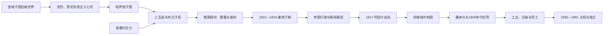

# 哈萨克斯坦的哈萨克汗国、俄罗斯扩张与苏维埃化

## 时间

约15世纪中叶—1991年。

## 概括

哈萨克汗国形成于金帐汗国和阿布海尔“乌兹别克汗国”瓦解的草原政治中。克烈、贾尼别克率部迁往七河，吸收不满阿布海尔的部众；哈斯木汗时期疆域、人口和“哈萨克”政治名称扩大。汗国依成吉思汗后裔汗位、部落协商、季节牧场和锡尔河城镇维系，不是固定首都的官僚国家。16世纪继承危机与18世纪准噶尔战争使三玉兹及多个汗位长期并立。

1731年小玉兹阿布勒海尔接受俄国保护，是寻求外援和争夺汗位的策略，不代表整个草原瞬间被吞并。俄罗斯帝国随后以要塞、册封、行政章程、移民和镇压逐步取消汗位。革命后阿拉什知识分子争取民族自治，最终被布尔什维克吸收。苏维埃国家划定现代共和国边界，推动识字、工业和城市化，也以没收、强制定居和集体化造成1930年代大饥荒；核试验、劳改营、人口迁徙和处女地运动继续重塑社会，直至1991年独立。

## 哈萨克汗国的建立与崛起

### 金帐汗国后继世界

14—15世纪，东钦察草原分属白帐、诺盖、蒙兀儿斯坦和阿布海尔汗国等相互重叠的术赤系政权。政治身份以汗的部众、谱系和迁徙联盟为基础，现代“乌兹别克”“哈萨克”民族边界尚未固定。

约1450—1460年代，克烈和贾尼别克因与阿布海尔冲突，率部迁到蒙兀儿斯坦也先不花汗控制的楚河—塔拉斯地区。也先不花希望他们作为西部缓冲，给予牧地。1468年阿布海尔死后，大批部众转向两位苏丹，汗国逐渐进入东钦察草原。

### 哈斯木汗的扩张

布伦杜克在位时，贾尼别克之子哈斯木凭军事和部落支持掌实权，1511年前后成为汗。汗国向锡尔河城镇、七河和西部草原扩展，与莫斯科、诺盖、昔班尼王朝和蒙兀儿斯坦发生外交。后世把“哈斯木汗的光明之路”视为习惯法整理，具体条文主要由口述传统保存，不能等同现代成文法典。

扩张依赖冬夏牧场互补、商路税收、战俘与部落归附；控制范围会随汗的军功和联盟变化，地图上的最大疆界不等于每处都有常设行政。

## 16—17世纪危机、恢复与制度

哈斯木死后，马马什、塔希尔、布依达什、艾哈迈德和托格姆等先后或并立称汗，部众流向诺盖、蒙兀儿斯坦和河中。哈克纳扎尔在1538年后重建联盟，吸收诺盖分裂部众，并重新争夺锡尔河城市。希盖、塔武凯勒和叶斯木继续介入布哈拉及塔什干政治；1598年塔武凯勒远征布哈拉受伤身亡，叶斯木承接汗位。

17世纪卫拉特—准噶尔力量增长。1643年萨尔卡姆·江格尔在奥尔布拉克以地形、火器和援军抵抗准噶尔，战役规模和细节在后世叙事中可能被放大，但确实象征草原防御。头克汗依三大比和部落会议协调三玉兹，“七项法典”传统结合旧习惯法、伊斯兰规范与汗令。汗权是协商中心，不直接取代部落首领、比和巴特尔的地方权威。

## 准噶尔战争、三玉兹与俄清之间（18世纪）

头克死后总汗权衰弱，海普、博拉特、阿布勒曼别特与各玉兹汗并存。1723年前后准噶尔大举进攻造成“大灾难年代”，大量人口向河中、咸海和俄罗斯边境迁移。布兰特、阿尼拉凯等反攻恢复部分牧地，但战役年份、统一指挥和决定性程度在史料中不一。

小玉兹汗阿布勒海尔因准噶尔、巴什基尔、卡尔梅克压力及汗位竞争，于1731年向俄国宣誓。俄国把宣誓解释为臣属，哈萨克首领往往理解为互惠保护；双方含义不同。奥伦堡线、鄂木斯克—塞米巴拉金斯克等要塞限制迁徙并扩大贸易和政治干预。

清朝1755—1758年消灭准噶尔汗国，势力进入伊犁和塔尔巴哈台。阿布赉同时接受清朝册封、与俄国交往并在草原获拥立，以多重外交恢复牧场和贸易。其1781年死后，总汗权再次分裂，俄国逐步把册封和边疆委员会变为取消自治的工具。

完整总汗、并立汗、小玉兹、中玉兹和内帐序列见[哈萨克汗世系表](/%E4%BA%BA%E6%96%87%E7%A7%91%E5%AD%A6/%E5%8E%86%E5%8F%B2/%E4%B8%AD%E4%BA%9A/%E5%93%88%E8%90%A8%E5%85%8B%E6%96%AF%E5%9D%A6/%E5%93%88%E8%90%A8%E5%85%8B%E6%B1%97%E4%B8%96%E7%B3%BB%E8%A1%A8.md)。

## 俄罗斯帝国的逐步吞并

### 取消汗制与行政重组

1822年《西西伯利亚吉尔吉斯人章程》取消中玉兹汗位，把草原划为区、乡和村，由“高级苏丹”等纳入帝国官僚；1824年奥伦堡章程取消小玉兹汗位。内帐汗国在江格尔1845年死后由临时委员会接管。

1837—1847年阿布赉之孙克涅萨雷领导跨玉兹起义，反对要塞、税役、浩罕据点和汗位废除。他1841年获拥立为汗，试图统一征税和军队；与部分哈萨克苏丹、浩罕及吉尔吉斯玛纳普发生冲突，1847年战败身亡。失败源于俄国军力、草原精英分裂、双线战争和强制统一政策，不是单一战役决定。

1867—1868年临时条例及1886、1891年法规把草原分入突厥斯坦、奥伦堡和草原总督区。殖民政府宣称土地为国家所有，俄、乌农民移民和哥萨克军团获得耕地与水源，季节迁徙通道收缩。苏丹旧特权部分转为官职，普通牧民承担货币税、土地租用和市场风险。

### 反抗与社会变化

西里木·达托夫起义（1783—1797）、伊萨泰—马罕别特起义（1836—1838）和克涅萨雷战争分别反映汗权、土地、税收与帝国干预。19世纪末学校、俄哈双语知识分子、报刊和伊斯兰改革兴起；阿拜·库南拜等人讨论教育、法律和草原社会更新。

1916年沙皇政府征调中亚穆斯林从事后方劳役，引发大规模反抗。镇压、报复和逃亡造成严重人口损失，尤其七河地区许多人越境中国。事件把土地殖民、战争负担和民族政治联系起来。

帝国时期没有覆盖今日哈萨克斯坦的单一“哈萨克斯坦总督”：北部和西部、七河与南部绿洲分属不同总督区。殖民行政首脑不能伪造为一条全国连续统治者表。

## 革命、阿拉什与苏维埃建制（1917—1936）

1917年革命后，阿里汗·布克伊哈诺夫、艾哈迈德·拜图尔瑟诺夫等成立阿拉什党和阿拉什自治政府，主张民主联邦、土地保护、教育和地方民兵。内战中阿拉什领导层先与反布尔什维克力量合作，后与苏维埃谈判；红军胜利后自治机构被取消，部分知识分子进入新政权，1930年代再遭清洗。

1920年建立吉尔吉斯自治苏维埃社会主义共和国，因俄语当时常用“吉尔吉斯”称呼哈萨克人而得名，首府奥伦堡。1925年改称哈萨克自治共和国，奥伦堡划回俄罗斯，首府迁克孜勒奥尔达，1929年再迁阿拉木图。中亚民族划界把锡尔河和七河的哈萨克人口地区纳入共和国，现代边界逐步形成。1936年升格为哈萨克加盟共和国。

## 集体化、饥荒与斯大林时期

1928年国家没收富裕牧主牲畜并驱逐“拜”，随后强制游牧民定居、集体化和超额征收牲畜。共和国领导菲利普·戈洛晓金把政策称为草原“小十月”。牲畜数量崩溃，1930—1933年出现大饥荒和疫病，超过百万人死亡，另有大量人逃往中国、蒙古、乌兹别克、俄罗斯等地；具体死亡数字因统计口径和人口迁移而有争议，但哈萨克人口遭受灾难性损失无疑。

饥荒不是单纯自然灾害。强制征收、定居、地方干部暴力、粮食与牲畜出口、迁徙受阻和中央迟缓救济共同造成。传统牧业社会和人口结构被永久改变，哈萨克人在本共和国一度成为人口少数。

卡拉干达劳改营和“祖国叛徒妻子营”等古拉格系统为采矿、农业和建设提供强制劳动。1937年朝鲜人、1941年伏尔加德意志人以及后来车臣、印古什等被迁入，形成高度多民族社会。知识分子、干部和宗教人士在大清洗中大量被捕或处决。

## 战争、工业化与晚期苏联（1941—1991）

二战期间工厂和人口向东转移，哈萨克斯坦提供粮食、金属、煤和大量士兵。战后卡拉干达、铁米尔套、巴尔喀什等工业城市扩张。1949年塞米巴拉金斯克试验场进行首次苏联原子弹试验，至1989年长期核试验造成土地、健康和环境损害。

1954年起处女地运动在北部开垦大面积草原，引入大量俄罗斯、乌克兰等移民，短期提高粮食产量，也带来土壤侵蚀、单一农业和人口比例变化。拜科努尔航天发射场、铀矿、军工和能源体系使共和国具有联盟战略地位。咸海因灌溉扩张萎缩，风沙和盐尘影响南部生态与健康。

## 苏维埃实际最高领导

加盟共和国名义上有最高苏维埃主席团和部长会议，实际政治最高职位通常是哈萨克共产党第一书记。

| 第一书记 | 任期 | 关键事件 / 备注 |
| --- | --- | --- |
| 列翁·米尔佐扬 | 1933—1938年 | 饥荒末期与工业化，后在大清洗中被处决。 |
| 尼古拉·斯克沃尔佐夫 | 1938—1945年 | 大清洗后重组、二战动员。 |
| 根纳季·博尔科夫 | 1945—1946年 | 战后恢复，任期短。 |
| 朱马拜·沙亚赫梅托夫 | 1946—1954年 | 首位哈萨克族第一书记，经历战后重建和意识形态运动。 |
| 潘捷列伊蒙·波诺马连科 | 1954—1955年 | 处女地运动初期。 |
| 列昂尼德·勃列日涅夫 | 1955—1956年 | 处女地与工业项目，后任苏联最高领导。 |
| 伊万·雅科夫列夫 | 1956—1957年 | 处女地行政扩张。 |
| 尼古拉·别利亚耶夫 | 1957—1960年 | 农业和干部政策矛盾。 |
| **丁穆罕默德·库纳耶夫** | 1960—1962年 | 首次任期，后短暂转任政府首脑。 |
| 伊斯梅尔·尤苏波夫 | 1962—1964年 | 赫鲁晓夫时期边界、农业和干部调整。 |
| **丁穆罕默德·库纳耶夫** | 1964—1986年 | 长期工业、城市和本地干部网络发展，也形成个人依附与腐败问题。 |
| 根纳季·科尔宾 | 1986—1989年 | 莫斯科任命的外来干部，引发1986年十二月事件。 |
| **努尔苏丹·纳扎尔巴耶夫** | 1989—1991年 | 共和国主权、联盟谈判和独立过渡。 |

1986年12月，戈尔巴乔夫解除库纳耶夫并任命此前未在共和国任职的科尔宾，阿拉木图学生和市民抗议遭镇压。“十二月事件”兼有干部任命、民族尊严、青年不满和改革期政治表达，独立后被视为主权运动先声。1989年反核“内华达—塞米巴拉金斯克”运动兴起。1990年共和国宣布主权，1991年关闭核试验场并在苏联解体中走向独立。

## 重要事件

| 时间 | 事件 | 过程与影响 |
| --- | --- | --- |
| 约1456/1465年 | 克烈、贾尼别克迁入七河 | 哈萨克汗国形成起点，具体建国年份有争议。 |
| 1511年前后 | 哈斯木掌权 | 汗国人口、疆域与外交影响达到早期高峰。 |
| 1538—1580年 | 哈克纳扎尔复兴 | 重组分裂部众并恢复草原联盟。 |
| 1643年 | 奥尔布拉克之战 | 江格尔抵抗准噶尔，成为草原防御象征。 |
| 1680—1715/18年 | 头克汗时期 | 三玉兹协调和法律传统成熟。 |
| 1723年前后 | “大灾难年代” | 准噶尔入侵造成人口迁徙和政治危机。 |
| 1731年 | 阿布勒海尔接受俄国保护 | 互惠联盟逐步被帝国解释为主权臣属。 |
| 1755—1758年 | 清灭准噶尔 | 哈萨克草原进入俄清双重外交环境。 |
| 1822、1824年 | 俄国废除中、小玉兹汗制 | 帝国行政替代区域王权。 |
| 1837—1847年 | 克涅萨雷起义 | 最后一次恢复全哈萨克汗权的重大尝试失败。 |
| 1867—1891年 | 帝国行政法规 | 草原分区、土地国有和移民殖民制度化。 |
| 1916年 | 中亚起义 | 征工令触发反抗、镇压和大规模逃亡。 |
| 1917年 | 阿拉什自治 | 现代民族自治与法治方案形成。 |
| 1920、1925、1936年 | 苏维埃共和国建制变化 | 自治共和国改名、划界并升格加盟共和国。 |
| 1930—1933年 | 哈萨克饥荒 | 强制定居和集体化造成灾难性死亡与外逃。 |
| 1937—1944年 | 清洗与强制迁徙 | 知识精英受创，多民族人口结构重塑。 |
| 1949—1989年 | 塞米巴拉金斯克核试验 | 战略军工带来长期健康和环境代价。 |
| 1954年起 | 处女地运动 | 农业、人口和生态结构再度改变。 |
| 1986年 | 十二月事件 | 反对外来干部任命的抗议成为独立记忆。 |
| 1990—1991年 | 主权宣言、试验场关闭与独立 | 苏维埃阶段结束，现代共和国成立。 |

## 崛起、衰落与转型原因

### 汗国崛起

- 阿布海尔汗国继承危机和部众对战争、分配的不满为新联盟提供人口。
- 七河牧场、锡尔河城镇和草原商路使哈萨克汗可连接游牧经济与绿洲贸易。
- 术赤系血统提供汗位合法性，部落拥立和军功则决定实际追随。

### 汗国分裂与主权丧失

- 汗位非固定长子继承，强汗死亡后容易出现多个苏丹和地区汗并立。
- 三玉兹和部落自治提高生存弹性，却不利于维持常设统一军政。
- 准噶尔战争造成牧地、人口和精英损失，促使各汗分别寻求俄、清援助。
- 俄罗斯以要塞、贸易、册封、章程和移民逐步推进，避免一次全面征服的成本。
- 1822—1824年废汗制、19世纪行政和土地法规是直接制度终结；克涅萨雷失败使恢复总汗权的最后重大军事方案破产。

### 苏维埃化的动力与代价

- 布尔什维克以民族共和国、教育和本地干部争取支持，又以党、秘密警察和计划经济取消自主政治。
- 工业、铁路、医疗和识字扩大国家能力，军工与资源把共和国深嵌苏联。
- 强制定居、集体化和征收摧毁牧业调节机制，是饥荒直接原因；外来移民、强制迁徙和城市化改变人口结构。
- 1980年代经济停滞、生态灾难、干部任命和联盟政治危机削弱苏维埃合法性，最终在1991年联盟解体中转入独立共和国。

## 演变关系

- 前一阶段：[早期草原、萨卡与突厥汗国](/%E4%BA%BA%E6%96%87%E7%A7%91%E5%AD%A6/%E5%8E%86%E5%8F%B2/%E4%B8%AD%E4%BA%9A/%E5%93%88%E8%90%A8%E5%85%8B%E6%96%AF%E5%9D%A6/%E6%97%A9%E6%9C%9F%E8%8D%89%E5%8E%9F%E3%80%81%E8%90%A8%E5%8D%A1%E4%B8%8E%E7%AA%81%E5%8E%A5%E6%B1%97%E5%9B%BD.md)。
- 后一阶段：[独立共和国与现代哈萨克斯坦](/%E4%BA%BA%E6%96%87%E7%A7%91%E5%AD%A6/%E5%8E%86%E5%8F%B2/%E4%B8%AD%E4%BA%9A/%E5%93%88%E8%90%A8%E5%85%8B%E6%96%AF%E5%9D%A6/%E7%8B%AC%E7%AB%8B%E5%85%B1%E5%92%8C%E5%9B%BD%E4%B8%8E%E7%8E%B0%E4%BB%A3%E5%93%88%E8%90%A8%E5%85%8B%E6%96%AF%E5%9D%A6.md)。
- 世系专表：[哈萨克汗世系表](/%E4%BA%BA%E6%96%87%E7%A7%91%E5%AD%A6/%E5%8E%86%E5%8F%B2/%E4%B8%AD%E4%BA%9A/%E5%93%88%E8%90%A8%E5%85%8B%E6%96%AF%E5%9D%A6/%E5%93%88%E8%90%A8%E5%85%8B%E6%B1%97%E4%B8%96%E7%B3%BB%E8%A1%A8.md)。
