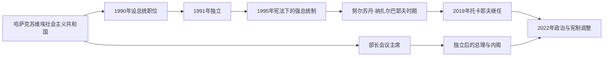

# 总统与总理表

## 范围

本表覆盖1991年独立以来的国家元首和政府首脑，并把纳扎尔巴耶夫在独立前担任哈萨克苏维埃社会主义共和国总统的连续任期一并注明。哈萨克斯坦是总统权力强势的单一制共和国：总统决定国家战略、任命或主导任命高级官员，总理负责政府日常行政并向总统和议会承担责任。2026年新宪法再次调整议会、任命与任期规则，不能把不同时期的职位权限视为完全相同。

## 国家领导结构演变图

总统掌握国家战略、人事与安全领域的核心权力，总理领导政府日常行政；两张表应结合阅读，不能把政府首脑的更替等同于最高权力的完整转移。

## 历任总统

| 顺序 | 姓名 | 任期 | 产生与继任 | 重要事件 / 备注 |
| --- | --- | --- | --- | --- |
| 1 | **努尔苏丹·纳扎尔巴耶夫** | 1990-04-24—2019-03-20；1991-12-16起为独立国家总统 | 1990年由最高苏维埃选出，1991年直选；此后经选举、公投及宪法调整长期连任 | 领导独立、弃核、市场转型、首都迁移和资源国家建设；权力高度集中。2019年辞职后仍以安全会议终身主席和“民族领袖”等身份保留影响，相关特权在2022年后被削减。 |
| 2 | **卡瑟姆-若马尔特·托卡耶夫** | 2019-03-20—至今 | 原参议院议长依法继任；2019、2022年当选 | 2022年“一月事件”后削弱纳扎尔巴耶夫家族和旧精英影响，推动2022与2026年宪制改革。截至2026年7月在任。 |

2019年3月20日纳扎尔巴耶夫辞职后，托卡耶夫依宪法以参议院议长身份继任，并非先设独立“代总统”届次。2022年改革规定总统单次七年任期；2026年新宪法生效后，宪法法院裁定托卡耶夫现任期限不计入新规则下的次数，未来参选问题因此出现新的制度空间，但本表不预判尚未发生的选举。

## 历任总理

| 顺序 | 姓名 | 任期 | 与前任关系 / 执政基础 | 重要事件 / 备注 |
| --- | --- | --- | --- | --- |
| 1 | **谢尔盖·捷列先科** | 1991-10-16—1994-10-12 | 苏维埃末期部长会议主席职务转为独立国家总理 | 组织独立初期行政、价格放开和私有化；高通胀与经济收缩严重。 |
| 2 | 阿克然·卡热格尔金 | 1994-10-12—1997-10-10 | 纳扎尔巴耶夫任命 | 推进市场改革与外资能源项目；后与总统关系破裂并流亡。 |
| 3 | 努尔兰·巴尔金巴耶夫 | 1997-10-10—1999-10-01 | 原石油天然气部门负责人 | 处理亚洲与俄罗斯金融危机、首都迁移初期和能源政策。 |
| 代理 | 卡瑟姆-若马尔特·托卡耶夫 | 1999-10-01—1999-10-12 | 第一副总理代行 | 正式任命前短暂代理。 |
| 4 | **卡瑟姆-若马尔特·托卡耶夫** | 1999-10-12—2002-01-28 | 纳扎尔巴耶夫任命 | 经济在高油价与改革后恢复；后转任外交及议会职位。 |
| 5 | 伊曼加利·塔斯马加姆别托夫 | 2002-01-28—2003-06-11 | 原副总理及地区首长 | 处理土地、地方治理和精英平衡；辞职后继续任高级职务。 |
| 6 | 达尼亚尔·艾哈迈托夫 | 2003-06-13—2007-01-10 | 原巴甫洛达尔州长、副总理 | 资源繁荣、产业多元化计划与国家企业扩张。 |
| 7（第一次） | **卡里姆·马西莫夫** | 2007-01-10—2012-09-24 | 总统亲信与技术官僚 | 应对2008年全球金融危机，国家救助银行和建筑业。 |
| 8 | 谢里克·艾哈迈托夫 | 2012-09-24—2014-04-02 | 原第一副总理 | 推进工业化和区域经济；后因腐败案获刑。 |
| 7（第二次） | 卡里姆·马西莫夫 | 2014-04-02—2016-09-08 | 再次获任 | 应对油价下跌、坚戈浮动和社会抗议；后任国家安全委员会主席，2022年危机中被捕并定罪。 |
| 9 | 巴克特然·萨金塔耶夫 | 2016-09-08—2019-02-21 | 原第一副总理 | 数字化、私有化与社会支出争议；政府被纳扎尔巴耶夫解散。 |
| 10 | 阿斯卡尔·马明 | 2019-02-21—2022-01-05 | 原第一副总理；先代理后正式任命 | 经历总统交接、新冠疫情和经济刺激；2022年“一月事件”期间政府总辞。 |
| 代理 | 阿里汗·斯迈洛夫 | 2022-01-05—2022-01-11 | 第一副总理代行 | 危机期间临时主持政府。 |
| 11 | 阿里汗·斯迈洛夫 | 2022-01-11—2024-02-05 | 托卡耶夫提名、议会同意 | 处理抗议后改革、通胀、俄乌战争外溢与物流调整；政府总辞。 |
| 代理 | 罗曼·斯克利亚尔 | 2024-02-05—2024-02-06 | 第一副总理代行 | 继任者获任前代理一天。 |
| 12 | **奥尔扎斯·别克捷诺夫** | 2024-02-06—至今 | 原总统办公厅主任，托卡耶夫提名 | 推进经济执行、基础设施和产业政策；截至2026年7月仍在任。 |

## 权力结构变化

| 时期 | 总统—总理关系 | 说明 |
| --- | --- | --- |
| 1991—1995 | 独立初期制度竞争 | 最高苏维埃、总统和政府权限仍在重组，1993、1995年宪法逐步确立强总统制。 |
| 1995—2019 | 纳扎尔巴耶夫个人化总统制 | 总理由总统任命并可随时撤换，议会与执政党主要支持总统议程。 |
| 2019—2022 | 双重影响过渡 | 托卡耶夫任总统，纳扎尔巴耶夫继续掌安全会议和执政党等影响，直至“一月事件”后旧权力中心被拆解。 |
| 2022—2026 | “新哈萨克斯坦”改革 | 一次七年任期、政党与议会调整、宪法法院恢复；总统权力仍居核心。 |
| 2026年至今 | 新宪法体制 | 两院议会改为单院“库鲁尔泰”，恢复副总统并调整任命、人民委员会等制度；改革同时扩大总统对关键职位的影响。 |

## 相关笔记

- [独立共和国与现代哈萨克斯坦](/%E4%BA%BA%E6%96%87%E7%A7%91%E5%AD%A6/%E5%8E%86%E5%8F%B2/%E4%B8%AD%E4%BA%9A/%E5%93%88%E8%90%A8%E5%85%8B%E6%96%AF%E5%9D%A6/%E7%8B%AC%E7%AB%8B%E5%85%B1%E5%92%8C%E5%9B%BD%E4%B8%8E%E7%8E%B0%E4%BB%A3%E5%93%88%E8%90%A8%E5%85%8B%E6%96%AF%E5%9D%A6.md)
- [哈萨克汗国、俄罗斯扩张与苏维埃化](/%E4%BA%BA%E6%96%87%E7%A7%91%E5%AD%A6/%E5%8E%86%E5%8F%B2/%E4%B8%AD%E4%BA%9A/%E5%93%88%E8%90%A8%E5%85%8B%E6%96%AF%E5%9D%A6/%E5%93%88%E8%90%A8%E5%85%8B%E6%B1%97%E5%9B%BD%E3%80%81%E4%BF%84%E7%BD%97%E6%96%AF%E6%89%A9%E5%BC%A0%E4%B8%8E%E8%8B%8F%E7%BB%B4%E5%9F%83%E5%8C%96.md)
