# 哈萨克斯坦的独立共和国与现代发展

## 时间

1991年至今；本文核验至2026年7月。

## 概括

哈萨克斯坦于1991年12月成为最后一批宣布脱离苏联的加盟共和国之一，继承世界级油气、铀和金属资源，也继承核试验污染、计划经济、俄语城市网络和高度集中的党国干部体系。努尔苏丹·纳扎尔巴耶夫以强总统制、外国能源投资、多向外交和精英分配维持长期稳定；经济增长和国家建设显著，却伴随权力个人化、地区差距、腐败与政治竞争受限。

2019年纳扎尔巴耶夫辞职后，托卡耶夫先在旧体制支持下继任。2022年“一月事件”从液化石油气涨价抗议发展为全国危机，集体安全条约组织短期出兵，托卡耶夫随后削弱纳扎尔巴耶夫家族和安全系统旧核心，并以“新哈萨克斯坦”名义修宪。2026年新宪法再次把两院议会改为单院制、恢复副总统并调整总统任命权；改革扩大部分制度参与渠道，同时没有消除总统对政治体系的主导。

## 独立背景

- 苏联末期，1986年“十二月事件”显示本地社会对莫斯科任命干部和民族代表问题的不满；镇压成为独立后历史记忆的重要节点。
- 哈萨克加盟共和国经济高度依赖联盟内供应链、军工、采矿和农业，独立意味着同时建立货币、外交、军队、税收与边境制度。
- 领土内保留大量俄语人口，北部与俄罗斯经济、交通联系深；国家必须在哈萨克语复兴和多民族公民认同之间保持平衡。
- 苏联留下塞米巴拉金斯克核试验场、拜科努尔航天基地和战略核武器，安全、环境与对外承认成为建国初期的核心谈判。

## 分阶段发展

### 建国、弃核与市场震荡（1991—1999）

1991年8月29日，哈萨克共和国在独立前关闭塞米巴拉金斯克核试验场；12月16日宣布独立。国家继承大量洲际导弹与核弹头，但发射、维护和指挥体系仍与苏联共同遗产相连。哈萨克斯坦通过里斯本议定书、加入《不扩散核武器条约》和与俄罗斯、美国合作，到1995年前后把核弹头移交俄罗斯，换取安全保证、技术及经济援助。此举提高国际信誉，却没有消除试验污染和受害者健康问题。

苏联统一经济崩溃造成产出下降、失业和通胀。1993年发行坚戈，凭证私有化和企业出售迅速推进，形成新商业精英，也使财富与资产所有权高度集中。1993年首部宪法仍保留一定议会制衡；1995年新宪法确立强总统制，同年议会重建为两院制。

外国资本进入田吉兹、卡拉恰甘纳克等油气项目，里海管线成为外交重点。1997年政府把首都从阿拉木图迁至阿克莫拉，次年改名阿斯塔纳，以北部地理、行政规划和国家象征重组政治空间。

### 资源增长与个人化稳定（2000—2008）

油价上涨、出口管道、铀和金属推动高速增长。2000年成立国家基金，把部分石油收入用于储蓄和财政稳定；银行、建筑和城市消费扩张。政府推动“哈萨克斯坦2030”战略和基础设施建设，形成专业官僚与国家企业并行的资源发展模式。

纳扎尔巴耶夫通过祖国之光党、总统任命、地方长官和国家企业整合精英。选举持续举行，但反对党准入、媒体、集会和权力交接受到严格限制。总统家族、亲信集团和区域网络分享资源，经济绩效成为政权合法性的重要来源。

外交采取“多向平衡”：与俄罗斯维持安全、航天和欧亚经济联系，与中国建设能源管道和边境贸易，又吸引欧美能源公司并参与国际核不扩散倡议。平衡并非等距离，而是避免单一外部力量支配。

### 金融危机、社会抗议与经济调整（2008—2018）

2008年全球金融危机使过度依赖外债和房地产的银行体系承压，政府通过国家控股基金救助、并购和财政刺激稳定金融。危机显示石油繁荣没有自动形成多元私人经济。

2011年西部扎瑙津长期石油工人罢工在独立日遭警察开枪，造成多人死亡。事件暴露资源地区工资、工会权利和地方治理问题。此后政府一方面增加社会与基础设施支出，另一方面加强集会和组织控制。

2014年油价下跌、俄罗斯经济危机和乌克兰冲突冲击贸易与货币。2015年坚戈转为自由浮动并大幅贬值，居民购买力下降。哈萨克斯坦加入欧亚经济联盟，同时继续推进面向中国“一带一路”、跨里海运输和欧洲市场的项目。2017年阿斯塔纳世博会展示现代化形象，却也引发建设成本讨论。

### 纳扎尔巴耶夫辞职与双重权力（2019—2021）

2019年3月纳扎尔巴耶夫辞去总统职位，参议院议长托卡耶夫依法继任并在6月选举中获胜。首都改名努尔苏丹。纳扎尔巴耶夫仍任安全会议终身主席、执政党主席并保有“民族领袖”特权，其家族和亲信掌握多项公共及商业职位，形成新总统与“首任总统”影响并存的过渡。

托卡耶夫提出“倾听型国家”、放宽部分政党和集会规则，但抗议者仍面临拘留，议会竞争有限。新冠疫情造成公共卫生、收入和数字服务压力，国家基金与财政救助再次成为稳定工具。

### 2022年“一月事件”与精英重组

2022年1月，西部取消液化石油气价格上限引发抗议，要求很快扩展到生活成本、腐败和政治改革。阿拉木图出现政府建筑被攻占、武器流失、暴力与抢掠，安全部门一度失去控制。托卡耶夫宣布紧急状态，请求集体安全条约组织部署短期“维和”部队，并下令强力恢复秩序；官方后来确认二百多人死亡，大量人员被拘留，执法虐待与死亡责任引发调查要求。

托卡耶夫解除纳扎尔巴耶夫的安全会议主席职务，国家安全委员会主席卡里姆·马西莫夫被捕并以叛国罪定罪，纳扎尔巴耶夫亲属相继失去公共职位或资产。危机不仅是自发抗议，也包含安全机关失灵和精英内部斗争；把全部暴力归因于单一“外国阴谋”或单一民运都无法解释复杂过程。

2022年6月修宪公投取消“民族领袖”特殊宪法地位、限制总统近亲任高级公职、恢复宪法法院并调整议会及地方制度。9月进一步提出总统单次七年任期；11月托卡耶夫提前当选。首都同年恢复阿斯塔纳名称。

### 政治调整、多向外交与2026年新宪法（2023年至今）

2023年议会选举恢复部分单席选区并允许更多政党参选，执政的阿玛纳特党仍占优势。政府追回部分被认为非法转移的资产，推动能源、交通、数字化和地方预算改革；反对派组织、媒体自由和真正权力竞争仍受限制。

俄罗斯全面入侵乌克兰后，哈萨克斯坦拒绝承认俄方吞并地区，同时避免与俄罗斯公开决裂。俄哈边境、里海石油管线、欧亚经济联盟和俄语社会联系仍重要；中国成为关键贸易、投资和过境伙伴，欧盟是主要能源市场。跨里海“中间走廊”因避开俄罗斯而获更多投入，但港口、铁路和海运容量仍有限。

2026年3月，公投通过新宪法；7月起相关制度生效。改革把原参议院和马日利斯改为单院“库鲁尔泰”，恢复副总统职位，设置由总统任命成员为主并可提出立法、公投倡议的人民委员会，并调整总统任命高级官员的程序。宪法法院随后裁定托卡耶夫可在新制度下再次参选，使原有任期限制的实际效果出现争议。

截至2026年7月，总统为卡瑟姆-若马尔特·托卡耶夫，总理为奥尔扎斯·别克捷诺夫。完整任期见[总统与总理表](/%E4%BA%BA%E6%96%87%E7%A7%91%E5%AD%A6/%E5%8E%86%E5%8F%B2/%E4%B8%AD%E4%BA%9A/%E5%93%88%E8%90%A8%E5%85%8B%E6%96%AF%E5%9D%A6/%E6%80%BB%E7%BB%9F%E4%B8%8E%E6%80%BB%E7%90%86%E8%A1%A8.md)。

## 统治结构

| 层级 | 机构 | 实际作用 |
| --- | --- | --- |
| 总统 | 国家元首、战略和人事权力核心 | 任命或提名政府及关键机关负责人，掌外交、国防和紧急权；2026年新宪法下仍是体系中心。 |
| 总理与政府 | 总理、各部和中央行政机关 | 执行经济、社会、预算和产业政策，政治空间受总统议程约束。 |
| 库鲁尔泰 | 2026年取代两院制议会的单院机关 | 立法、预算和同意部分任命；执政党优势与总统提名权影响独立性。 |
| 宪法法院与普通法院 | 宪法审查、司法体系 | 2022年后恢复宪法法院；司法独立和政治案件仍是争议焦点。 |
| 地方行政 | 州、市、区长官及地方议会 | 部分基层职位扩大选举，但州级财政和人事仍受中央较强控制。 |
| 国家企业与主权基金 | 萨姆鲁克-卡泽纳、国家基金及能源企业 | 管理战略资产、石油储蓄和大型投资，也是精英任命及经济政策工具。 |

## 重要事件

| 时间 | 事件 | 过程与影响 |
| --- | --- | --- |
| 1991-08-29 | 关闭塞米巴拉金斯克试验场 | 终止主要核试验，环境与健康修复延续至今。 |
| 1991-12-16 | 宣布独立 | 哈萨克斯坦共和国成为主权国家。 |
| 1993 | 发行坚戈 | 建立独立货币政策，市场转型中的高通胀持续。 |
| 1994—1995 | 完成主要核弹头移交 | 以无核国家身份加入不扩散体系，获得安全保证与国际支持。 |
| 1995 | 新宪法 | 强总统制和两院议会框架确立。 |
| 1997—1998 | 迁都并命名阿斯塔纳 | 国家行政和北部地缘象征重组。 |
| 2000 | 国家基金成立 | 把部分石油收入用于跨周期储蓄和财政稳定。 |
| 2008—2009 | 金融危机与银行救助 | 国家扩大经济控制，私人债务风险暴露。 |
| 2011-12 | 扎瑙津事件 | 劳资冲突遭致命镇压，资源繁荣分配问题突出。 |
| 2015 | 坚戈自由浮动 | 油价与外部冲击转化为货币贬值和生活成本压力。 |
| 2019-03 | 纳扎尔巴耶夫辞职 | 独立后首次总统交接，但旧领袖影响继续。 |
| 2022-01 | “一月事件” | 抗议、暴力、外部短期出兵和精英清洗重塑权力结构。 |
| 2022-06、11 | 修宪公投与提前总统选举 | 削减首任总统特权并设单次七年任期。 |
| 2023 | 新规则下议会选举 | 部分混合选制和党派准入恢复，执政党仍占优势。 |
| 2026-03—07 | 新宪法公投与生效 | 单院议会、副总统及人民委员会等制度建立，总统权力与任期争议再起。 |

## 稳定机制与结构性挑战

### 稳定机制

- 石油、天然气、铀、金属和国家基金为预算、基建与危机救助提供资源。
- 官僚、城市教育和苏维埃基础设施使大国土能够维持统一行政。
- 多向外交降低对单一邻国的绝对依赖，弃核与边界协议提升国际承认。
- 哈萨克语国家建设与俄语公共使用并存，避免独立初期出现激进排斥。

### 结构性挑战

- 油气和大宗商品价格仍强烈影响财政、汇率与社会支出；制造业和中小企业发展不均。
- 财富、地区、城市—乡村和资源产区分配差距为抗议提供长期背景。
- 水资源依赖跨境河流，气候变化、农业和上游开发增加伊犁河、额尔齐斯河、锡尔河等压力。
- 总统主导和精英控制带来政策连续，也限制权力轮替、独立媒体、工会及反对党发展。
- 俄语人口、哈萨克语复兴和历史去殖民化需要细致协调，不能把语言变化简单解释为地缘阵营选择。

本阶段仍在延续，不适用“灭亡原因”。2022年后旧纳扎尔巴耶夫权力中心衰落，不等于国家制度中个人化、精英分配和安全机关影响已经消失。

## 演变关系

```mermaid
flowchart LR
    Independence["1991 独立"] --> Nuclear["弃核与建国"]
    Nuclear --> Market["市场转型与强总统制"]
    Market --> Capital["迁都阿斯塔纳"]
    Capital --> Boom["2000年代资源增长"]
    Boom --> Crisis["2008 金融危机"]
    Crisis --> Protest["2011 扎瑙津抗议"]
    Protest --> Transition["2019 总统交接"]
    Transition --> January["2022 一月事件"]
    January --> Reform["2022 宪制与精英重组"]
    Reform --> Constitution["2026 新宪法"]
```

- 前一节点：[哈萨克汗国、俄罗斯扩张与苏维埃化](/%E4%BA%BA%E6%96%87%E7%A7%91%E5%AD%A6/%E5%8E%86%E5%8F%B2/%E4%B8%AD%E4%BA%9A/%E5%93%88%E8%90%A8%E5%85%8B%E6%96%AF%E5%9D%A6/%E5%93%88%E8%90%A8%E5%85%8B%E6%B1%97%E5%9B%BD%E3%80%81%E4%BF%84%E7%BD%97%E6%96%AF%E6%89%A9%E5%BC%A0%E4%B8%8E%E8%8B%8F%E7%BB%B4%E5%9F%83%E5%8C%96.md)。
- 领导序列：[总统与总理表](/%E4%BA%BA%E6%96%87%E7%A7%91%E5%AD%A6/%E5%8E%86%E5%8F%B2/%E4%B8%AD%E4%BA%9A/%E5%93%88%E8%90%A8%E5%85%8B%E6%96%AF%E5%9D%A6/%E6%80%BB%E7%BB%9F%E4%B8%8E%E6%80%BB%E7%90%86%E8%A1%A8.md)。
