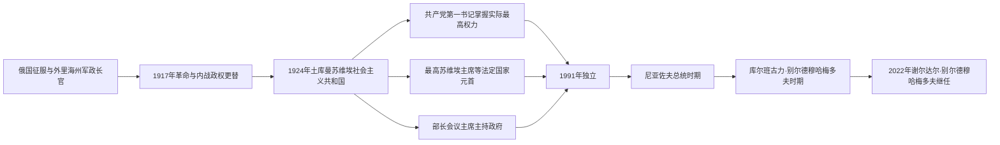

# 土库曼斯坦俄属、苏维埃与共和国领导人表

## 范围与口径

本表覆盖1881年外里海州设立至2026年7月，按制度角色分列：

- **外里海州长／军事长官**由俄罗斯帝国任命，兼有军政权力。
- **土库曼共产党第一书记**是苏维埃时期实际最高领导；中央执行委员会或最高苏维埃主席团主席是法定国家元首；人民委员会或部长会议主席是政府首脑。
- **1992年宪法以后**不再设独立总理，总统兼任政府首脑和内阁主席。
- **2023年以后**总统与人民委员会主席是两个不同高位：总统掌法定行政权，前总统库尔班古力以“民族领袖”和人民委员会主席身份拥有重要制度与政治影响，不能把两人合写为“共同总统”。
- 复任、代理、职位改名和争议过渡不合并。人名按常见中文音译，拉丁字母转写差异不代表不同人物。

## 领导体制演变图

帝俄、苏维埃和独立共和国使用不同的职位体系。苏维埃时期需以共产党第一书记判断实际最高权力，同时另列法定国家元首与政府首脑；独立后则以总统职位为国家权力主轴。

## 俄罗斯帝国外里海州长

外里海州1881年建立，起初隶属高加索军政体系，1898年后纳入突厥斯坦总督区。州长在阿什哈巴德掌军政；个别任期的公历换算在名录中相差数日，本表按年序为主。

| 顺序 | 州长／军事长官 | 任期 | 身份与重要事项 |
|---:|---|---|---|
| 1 | **彼得·雷尔贝格** | 1881—1883年 | 首任外里海州长；格奥克捷佩后组织阿哈尔军政接管。 |
| 2 | **亚历山大·科马罗夫** | 1883—1890年 | 1884年接收梅尔夫；1885年潘杰德事件使英俄接近战争。 |
| 3 | **阿列克谢·库罗帕特金** | 1890—1897/1898年 | 以强势个人行政、铁路和边疆调查著称；后任俄国陆军大臣、突厥斯坦总督。 |
| 4 | 安德烈·博戈柳博夫 | 1898—1900/1901年 | 外里海州转归突厥斯坦总督区初期，续建殖民官署。 |
| 5 | 德扬·苏博蒂奇 | 1901—1902年 | 正式军事长官；后短暂代理突厥斯坦总督。 |
| 6 | 叶夫根尼·乌萨科夫斯基 | 1902—1905年 | 铁路、城市和棉花经济扩张时期。 |
| 7 | 弗拉基米尔·科萨戈夫斯基 | 1905—1908年 | 1905年革命后加强警务与军政控制。 |
| 8 | 米哈伊尔·叶夫列伊诺夫 | 1908—1910年 | 帕连调查揭露地方行政腐败、勒索和权力私人化。 |
| 9 | 费奥多尔·绍斯塔克 | 1911—1912/1913年 | 短任；继续边境与土地行政。 |
| 10 | 列昂尼德·列什 | 1913—1916年 | 第一次世界大战与劳役征调危机时期。 |
| 代理 | 尼古拉·科尔马科夫 | 1916—1917年 | 帝国末期代理，二月革命后旧军政体系瓦解。 |

## 土库曼共产党中央第一书记

第一书记是1924—1991年共和国的实际最高政治职位。1924年底的组织局书记亦列入开端，短期代理不省略。

| 顺序 | 第一书记 | 任期 | 与前任关系及重要事项 |
|---:|---|---|---|
| 1 | 伊万·梅日劳克 | 1924-11-19—1926年 | 最初为组织局负责人，1925年共和国正式建制后续任第一书记。 |
| 2 | 沙伊马尔丹·易卜拉欣莫夫 | 1926-06—1927/1928年 | 建国、本土化和反武装抵抗时期。 |
| 3 | 尼古拉·帕斯库茨基 | 1927—1928年 | 短任；部分年表把其与前任任期交界记作1927或1928。 |
| 4 | 格里戈里·阿龙什塔姆 | 1928-05-11—1930-08 | 集体化初期党务集中。 |
| 5 | 雅科夫·波波克 | 1930-08—1937-04-15 | 强制定居、集体化和清洗前期，后在大清洗中遇害。 |
| 代理 | 安纳·穆罕默多夫 | 1937-04—1937-10 | 清洗高峰中的代理第一书记。 |
| 6 | 雅科夫·丘宾 | 1937-10—1939-11 | 重组遭清洗的共和国党组织。 |
| 7 | 米哈伊尔·福宁 | 1939-11—1947-03 | 二战动员、战后初期。 |
| 8 | 沙贾·巴特罗夫 | 1947-03—1951-07 | 阿什哈巴德地震重建时期。 |
| 9 | 苏汉·巴巴耶夫 | 1951-07—1958-12-14 | 去斯大林化、灌溉与农业扩张。 |
| 10 | 朱马杜尔德·卡拉耶夫 | 1958-12-14—1960-05-04 | 短期领导，卡拉库姆运河工程推进。 |
| 11 | 巴雷什·奥韦佐夫 | 1960-06-13—1969-12-24 | 棉花、运河和工业体系扩大。 |
| 12 | **穆罕默德纳扎尔·加普罗夫** | 1969-12-24—1985-12-21 | 长期掌权；能源开发、城市化与地方干部网络形成。 |
| 13 | **萨帕尔穆拉特·尼亚佐夫** | 1985-12-21—1991-12-16 | 改革末期出任第一书记，1990年兼任总统；独立后党改组。 |

## 苏维埃法定国家元首

| 顺序 | 国家元首 | 任期 | 法定职位与说明 |
|---:|---|---|---|
| 1 | **奈迪尔拜·艾塔科夫** | 1925-02-25—1937-07-22 | 中央执行委员会主席；同时为苏联中央执行委员会主席团成员，清洗中被捕处决。 |
| 代理 | 库尔班杜尔德·阿塔穆拉多夫 | 1937-07-22—1937-08-04 | 副主席代理。 |
| 2 | 巴特尔·阿塔耶夫 | 1937-08-04—1937-10-16 | 短任中央执行委员会主席，后亦遭清洗。 |
| 3 | 希瓦利·巴巴耶夫 | 1937-10-16—1942-01 | 1938年7月前任中央执行委员会主席，之后任最高苏维埃主席团主席；职位改名而本人连续。 |
| 4 | 阿拉别尔德·别尔季耶夫 | 1942-01-27—1948-03-06 | 最高苏维埃主席团主席。 |
| 5 | 阿克马梅德·萨雷耶夫 | 1948-03-06—1959-03-30 | 战后长期法定元首。 |
| 6 | 努尔别尔德·巴伊拉莫夫 | 1959-03-30—1963-03-26 | 最高苏维埃主席团主席。 |
| 7 | 安纳穆罕默德·克雷切夫 | 1963-03-26—1978-12-15 | 长期任法定元首。 |
| 8 | 巴雷·亚兹库利耶夫 | 1978-12-15—1988-08-13 | 最高苏维埃主席团主席。 |
| 9 | 罗扎·巴扎罗娃 | 1988-08-13—1990-01-18 | 末任主席团主席；改革时期职位改制。 |
| 10 | 萨帕尔穆拉特·尼亚佐夫 | 1990-01-18—1990-11-02 | 最高苏维埃主席，随后转任新设总统。 |

## 苏维埃政府首脑

1946年以前称人民委员会主席，后称部长会议主席。1989—1991年的名称和权力因总统制建立而调整。

| 顺序 | 政府首脑 | 任期 | 说明 |
|---:|---|---|---|
| 1 | **盖吉瑟兹·阿塔巴耶夫** | 1925-02-20—1937-07-08 | 首任人民委员会主席；本土化与早期建国核心，清洗中被处决。 |
| 2 | 艾特拜·胡代别尔格诺夫 | 1937-10—1945-10-17 | 清洗后重组政府，主持二战大部时期。 |
| 3 | 苏汉·巴巴耶夫 | 1945-10-17—1951-07-14 | 1946年职位改称部长会议主席，任期连续。 |
| 4 | 巴雷什·奥韦佐夫 | 1951-07-14—1958-01-14 | 第一次任政府首脑。 |
| 5 | 朱马杜尔德·卡拉耶夫 | 1958-01-14—1959-01-20 | 短任。 |
| 6 | 巴雷什·奥韦佐夫 | 1959-01-20—1960-06-13 | 第二次任政府首脑，后转任第一书记。 |
| 7 | 阿卜迪·安纳利耶夫 | 1960-06-13—1963-03-26 | 运河与农业计划时期。 |
| 8 | 穆罕默德纳扎尔·加普罗夫 | 1963-03-26—1969-12-25 | 后转任第一书记。 |
| 9 | 奥拉兹·奥拉兹穆罕默多夫 | 1969-12-25—1975-12-17 | 主持能源与农业计划执行。 |
| 10 | 巴雷·亚兹库利耶夫 | 1975-12-17—1978-12-15 | 后转任法定国家元首。 |
| 11 | 查雷·卡雷耶夫 | 1978-12-15—1985-02-28 | 长期部长会议主席。 |
| 代理 | 格奥尔基·米先科 | 1985-02-28—1985-03-18 | 第一副主席代理。 |
| 12 | 萨帕尔穆拉特·尼亚佐夫 | 1985-03-18—1986-01-04 | 随后已任第一书记，政府首脑另由他人接任。 |
| 13 | 安纳穆拉特·霍贾穆拉多夫 | 1986-01-04—1989-11-17 | 改革时期部长会议主席。 |
| 代理 | 尤里·莫吉列韦茨 | 1989-11-17—1989-12-01 | 第一副主席代理；部分名录与汗·艾哈迈多夫获任日期重叠。 |
| 14 | 汗·艾哈迈多夫 | 1989-12-01—1991-11-13 | 先任部长会议主席，1990年总统制后称总理；独立后短暂续任，随后职位空缺。 |
| — | 总统直接主持政府 | 1991-11-13—1992-05-18 | 未再任命总理；1992年宪法正式取消独立总理职位。 |

## 总统与政府首脑

尼亚佐夫在独立前已任共和国总统，因此总统表从1990年起列。2006年的代理程序有宪制争议，代理期与正式当选期分开。

| 顺序 | 总统 | 任期 | 产生、交接与政府角色 |
|---:|---|---|---|
| 1 | **萨帕尔穆拉特·尼亚佐夫** | 1990-11-02—2006-12-21 | 1991年领导独立；1992年起兼政府首脑，1999年获终身总统地位，任内去世。 |
| 代理 | 库尔班古力·别尔德穆哈梅多夫 | 2006-12-21—2007-02-14 | 时任副总理；议会议长被取消代理资格后出任代总统。 |
| 2 | **库尔班古力·别尔德穆哈梅多夫** | 2007-02-14—2022-03-19 | 经2007、2012、2017年选举任总统兼政府首脑；2022年提前交接。 |
| 3 | **谢尔达尔·别尔德穆哈梅多夫** | 2022-03-19—至今 | 经2022年提前选举就职；任总统、行政权首脑和内阁主席，截至2026年7月在任。 |

### 1992年以后政府首脑对应

| 政府首脑 | 任期 | 法定基础 |
|---|---|---|
| 萨帕尔穆拉特·尼亚佐夫 | 1992-05-18—2006-12-21 | 总统兼内阁主席，不设总理。 |
| 库尔班古力·别尔德穆哈梅多夫 | 2007-02-14—2022-03-19 | 总统兼内阁主席；代理期内已主持政府。 |
| 谢尔达尔·别尔德穆哈梅多夫 | 2022-03-19—至今 | 总统兼内阁主席，截至2026年7月。 |

## 人民委员会主席与实际权力说明

| 主席 | 任期 | 制度地位与说明 |
|---|---|---|
| 库尔班古力·别尔德穆哈梅多夫 | 2021—2022年 | 两院制时期任人民委员会／议会上院主席，与在任总统身份重叠。 |
| 库尔班古力·别尔德穆哈梅多夫 | 2023-01-21—至今 | 重组后的人民委员会主席，并获“土库曼人民民族领袖”称号；截至2026年7月在任。 |

2023年以来，谢尔达尔是宪法规定的国家元首、行政权首脑和政府首脑；库尔班古力主持被称为人民权力最高代表机构的人民委员会，并持续进行高层外交、提出国家议程。材料可据此描述“父子两高位”或“权力连续”，但不应把前总统误列为现任总统，也不应忽略其实际影响。

## 连续性核对

- 外里海州1898年以后受突厥斯坦总督统辖，州长与塔什干总督是上下级，不是两个并列国家元首。
- 希瓦对尧穆特等土库曼群体的王廷权力另见跨区域世系，本表不以俄国州长取代可汗。
- 苏维埃第一书记、法定国家元首、政府首脑三表并行；同一人物转任时不得合并为一条不间断的“总统任期”。
- 1991年11月至1992年5月总理职位实际空缺；1992年宪法后由总统兼政府首脑。
- 库尔班古力2006年12月至2007年2月先代理、后正式就职；谢尔达尔2022年3月19日正式就任。
- 现代现任信息核验截止到2026年7月。

## 返回

- [土库曼部落、俄国征服与苏维埃化](/%E4%BA%BA%E6%96%87%E7%A7%91%E5%AD%A6/%E5%8E%86%E5%8F%B2/%E4%B8%AD%E4%BA%9A/%E5%9C%9F%E5%BA%93%E6%9B%BC%E6%96%AF%E5%9D%A6/%E5%9C%9F%E5%BA%93%E6%9B%BC%E9%83%A8%E8%90%BD%E3%80%81%E4%BF%84%E5%9B%BD%E5%BE%81%E6%9C%8D%E4%B8%8E%E8%8B%8F%E7%BB%B4%E5%9F%83%E5%8C%96.md)
- [独立、中立政策与现代土库曼斯坦](/%E4%BA%BA%E6%96%87%E7%A7%91%E5%AD%A6/%E5%8E%86%E5%8F%B2/%E4%B8%AD%E4%BA%9A/%E5%9C%9F%E5%BA%93%E6%9B%BC%E6%96%AF%E5%9D%A6/%E7%8B%AC%E7%AB%8B%E3%80%81%E4%B8%AD%E7%AB%8B%E6%94%BF%E7%AD%96%E4%B8%8E%E7%8E%B0%E4%BB%A3%E5%9C%9F%E5%BA%93%E6%9B%BC%E6%96%AF%E5%9D%A6.md)
- [土库曼斯坦历史](/%E4%BA%BA%E6%96%87%E7%A7%91%E5%AD%A6/%E5%8E%86%E5%8F%B2/%E4%B8%AD%E4%BA%9A/%E5%9C%9F%E5%BA%93%E6%9B%BC%E6%96%AF%E5%9D%A6/README.md)
