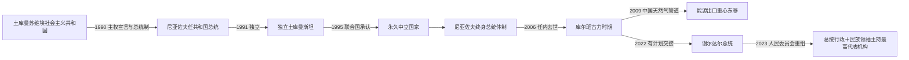

# 土库曼斯坦的独立、中立政策与现代发展

## 时间

1991年至今

## 概括

土库曼斯坦于1991年10月27日经公投宣布独立。前共产党第一书记萨帕尔穆拉特·尼亚佐夫把苏维埃党政、能源和安全体系改造为高度集中的总统国家；1995年联合国大会承认其永久中立地位。2006年尼亚佐夫任内去世后，库尔班古力·别尔德穆哈梅多夫通过非常规继承安排掌权，调整部分政策但保留总统主导体制。2022年其子谢尔达尔就任总统；2023年库尔班古力转任重组后的人民委员会主席并获“土库曼人民民族领袖”法定称号，形成总统与最高代表机构主席并存的权力格局。

天然气储量和出口收入支撑基础设施、公共补贴和国家投资，永久中立降低加入军事集团的约束。另一方面，出口市场集中、价格波动、水资源短缺、农业指标、人口外流信息不透明和有限的政策问责，限制经济多元化。

## 建国背景与宪制形成

1990年8月土库曼加盟共和国宣布国家主权，11月尼亚佐夫经选举出任总统。1991年苏联“八一九事件”失败后，10月举行独立公投并宣布建国。1992年宪法确立总统制，5月以后不再设独立总理，总统兼任内阁主席和政府首脑；各部由副总理协调并向总统负责。原共产党改组为民主党，党政干部、国有企业和安全机构保持连续。

独立初期避免激进私有化，国家控制天然气、石油、电力、棉花、交通和外汇。与俄罗斯、伊朗、阿富汗、乌兹别克斯坦及里海国家保持双边关系，同时减少区域一体化承诺。1995年12月12日联合国大会承认永久中立，政府将其解释为不参加军事同盟、允许多方向经济外交的国家身份。

## 分阶段发展

### 尼亚佐夫时期：建国、个人统治与中立

尼亚佐夫以“土库曼巴希”称号、国家象征和《鲁赫纳玛》塑造统一认同，行政、媒体、教育与文化高度围绕总统。1999年人民委员会授予其终身总统地位。国家用天然气收入和出口换汇维持低价或免费公共服务，但价格、产量和财政缺少透明。2002年官方所称刺杀未遂后，安全清洗和社会控制进一步加强。对外以永久中立平衡俄罗斯、伊朗和阿富汗方向，天然气出口最初高度依赖俄罗斯管网。

### 库尔班古力时期：政策调整与能源转向

2006年12月尼亚佐夫突然去世。按当时宪法应由议会议长暂代，但议长奥韦兹格尔德·阿塔耶夫被刑事调查并失去资格，副总理库尔班古力成为代总统；2007年当选并就职。他恢复或调整部分教育、医疗和社会政策，弱化若干尼亚佐夫个人符号，同时发展自身“阿尔卡达格”领袖形象。

2009年中亚—中国天然气管道投运，显著改变出口结构，中国逐渐成为最重要市场。2016年宪法把总统任期延长至七年并取消候选人最高年龄限制，2017年库尔班古力连任。大型建筑、阿瓦扎旅游区、交通和新城项目展示国家投资能力，也加重财政对能源收入的依赖。

### 谢尔达尔时期与双重高位结构

2021年人民委员会成为议会上院，库尔班古力任主席。2022年提前总统选举后，谢尔达尔于3月19日就职，完成首次有计划的总统交接。2023年两院制被取消，议会恢复单院；人民委员会改为议会之外的“人民权力最高代表机构”，库尔班古力任主席并获“民族领袖”地位。总统在宪法上仍是国家元首、行政权首脑和内阁主席；前总统则通过人民委员会、政治声望和精英网络保持重要议程影响。两者不宜简单写成法定“共同总统”。

截至2026年7月，谢尔达尔·别尔德穆哈梅多夫任总统和政府首脑，库尔班古力·别尔德穆哈梅多夫任人民委员会主席。完整任期和苏维埃职位对应见[俄属、苏维埃与共和国领导人表](/%E4%BA%BA%E6%96%87%E7%A7%91%E5%AD%A6/%E5%8E%86%E5%8F%B2/%E4%B8%AD%E4%BA%9A/%E5%9C%9F%E5%BA%93%E6%9B%BC%E6%96%AF%E5%9D%A6/%E4%BF%84%E5%B1%9E%E3%80%81%E8%8B%8F%E7%BB%B4%E5%9F%83%E4%B8%8E%E5%85%B1%E5%92%8C%E5%9B%BD%E9%A2%86%E5%AF%BC%E4%BA%BA%E8%A1%A8.md)。

## 现代统治结构

| 机构或角色 | 法定职责 | 实际位置 |
|---|---|---|
| 总统 | 国家元首、行政权首脑、武装力量最高统帅、内阁主席 | 任命副总理、部长和地方长官，是日常国家决策中心 |
| 内阁 | 组织经济、财政、社会与外交政策 | 无独立总理；由总统主持，副总理分管部门 |
| 人民委员会 | 2023年起为人民权力最高代表机构，可讨论国家基本方针与宪制议题 | 主席库尔班古力拥有“民族领袖”地位和显著政治影响 |
| 议会 | 单院立法、预算和法律审议 | 法律程序重要，但政治竞争受限 |
| 地方长官 | 管理州、市和区行政 | 由中央任命体系控制，负责农业指标、公共建设与秩序 |
| 国有能源体系 | 勘探、生产、管道和出口 | 财政与外汇核心，重大合同由最高层决策 |
| 民主党及法定政党、群众组织 | 候选提名和社会动员 | 均在国家设定的政治框架内活动 |

## 重要事件

1. 1990年8月22日，加盟共和国通过国家主权宣言。
2. 1990年11月2日，尼亚佐夫出任总统。
3. 1991年10月26日独立公投，10月27日宣布独立。
4. 1992年3月加入联合国，5月通过新宪法。
5. 1993年采用马纳特并推进国家象征、文字改革。
6. 1995年12月12日，联合国大会承认永久中立。
7. 1999年人民委员会授予尼亚佐夫终身总统地位。
8. 2002年11月，官方称发生针对总统车队的袭击未遂，随后大规模逮捕与审判。
9. 2006年12月21日尼亚佐夫去世，继承程序出现宪制争议。
10. 2007年2月库尔班古力当选总统并就职。
11. 2008年宪法调整议会与人民委员会结构。
12. 2009年中亚—中国天然气管道投运，出口重心东移。
13. 2014年传统陆上出口结构继续变化，中国市场集中度上升。
14. 2016年宪法把总统任期改为七年并取消候选人年龄上限。
15. 2017年库尔班古力连任。
16. 2021年议会改为两院制，人民委员会成为上院。
17. 2022年3月谢尔达尔赢得提前选举并就任总统。
18. 2023年1月，人民委员会从议会上院改组为独立最高代表机构，库尔班古力任主席并取得“民族领袖”称号。
19. 2023年阿尔卡达格新城第一阶段启用，体现国家主导城市建设。
20. 2025年土库曼斯坦纪念永久中立三十周年。
21. 2026年，谢尔达尔继续主持内阁和行政，库尔班古力以人民委员会主席身份开展高层外交与国内议程活动。

## 中立政策与能源外交

永久中立不是自我隔绝。土库曼斯坦加入联合国及多边机构，与俄罗斯、中国、伊朗、阿富汗、土耳其和中亚邻国保持双边合作，但不加入集体安全条约组织等军事集团。其外交强调领土不用于针对第三国、斡旋阿富汗和平和能源运输多方向化。

天然气管道决定外交选择。独立初期依赖北向俄罗斯系统，后来开通伊朗方向；2009年以后中国管道成为主要出口通道。跨阿富汗—巴基斯坦—印度管道长期规划但受安全、融资与市场问题制约。里海法律地位和跨里海路线也关系出口多元化。能源提供稳定财政，却使预算、汇率和公共投资易受单一商品与少数买方影响。

## 稳定条件、结构压力与可能转型

### 稳定条件

- 苏维埃党政、安全和国有企业体系在独立时完整保留，避免行政真空。
- 天然气收入支持首都建设、交通、公共服务和精英分配。
- 永久中立降低外部军事卷入，并允许在多国之间平衡。
- 人口规模较小、城市和交通节点集中，中央任命体系较易覆盖。
- 2022年提前安排继承，使领导更替未触发公开精英冲突。

### 结构性压力

- 出口高度依赖天然气及少数管道买方，议价与财政风险集中。
- 卡拉库姆环境和灌溉农业依赖阿姆河，气候变化、盐碱化与跨境分水增加约束。
- 私营部门、可靠统计、劳动力市场和外汇制度的有限开放妨碍多元化。
- 高度集中决策减少公开纠错渠道，个人化象征可能使制度交接依赖精英共识。
- 大型形象工程可推动建设，却与教育、医疗、乡村和产业投资形成机会成本。

### 转型性质

1991年的变化是苏维埃共和国机构主权化，而非旧国家崩溃后从零建国。2006—2007年是任内去世后的精英接续，政策有调整但权力结构连续。2022—2023年则把总统职位交给下一代，同时为前总统设置独立高位机构；它既是制度化交接，也是家族与精英连续性的安排。未来变化将取决于能源收入、双高位协调、干部更新和经济多元化，而非单一事件。

## 演变关系

- 上级：[土库曼斯坦历史](/%E4%BA%BA%E6%96%87%E7%A7%91%E5%AD%A6/%E5%8E%86%E5%8F%B2/%E4%B8%AD%E4%BA%9A/%E5%9C%9F%E5%BA%93%E6%9B%BC%E6%96%AF%E5%9D%A6/README.md)
- 前一阶段：[土库曼部落、俄国征服与苏维埃化](/%E4%BA%BA%E6%96%87%E7%A7%91%E5%AD%A6/%E5%8E%86%E5%8F%B2/%E4%B8%AD%E4%BA%9A/%E5%9C%9F%E5%BA%93%E6%9B%BC%E6%96%AF%E5%9D%A6/%E5%9C%9F%E5%BA%93%E6%9B%BC%E9%83%A8%E8%90%BD%E3%80%81%E4%BF%84%E5%9B%BD%E5%BE%81%E6%9C%8D%E4%B8%8E%E8%8B%8F%E7%BB%B4%E5%9F%83%E5%8C%96.md)
- 区域背景：[中亚历史](/%E4%BA%BA%E6%96%87%E7%A7%91%E5%AD%A6/%E5%8E%86%E5%8F%B2/%E4%B8%AD%E4%BA%9A/README.md)
