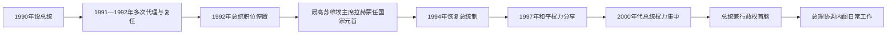

# 塔吉克斯坦国家元首与政府首脑表

## 范围与口径

本表从1990年总统职位设立起列出国家元首，并列出1991年现代共和国总理职位建立后的全部政府首脑。1992—1994年总统职位一度停置，最高苏维埃主席成为国家元首；代理、复任和职位转换均分项记录。

塔吉克斯坦宪法规定总统是国家元首和行政权（政府）首脑，任免总理及其他政府成员；总理负责协调政府日常工作。因此“总理”虽是法定政府职位，实际最高行政权长期集中于总统。截至2026年7月，总统为埃莫马利·拉赫蒙，总理为科希尔·拉苏尔佐达。

## 国家元首

| 顺序 | 姓名 | 职位／性质 | 任期 | 继任关系与关键说明 |
|---|---|---|---|---|
| 1 | 卡哈尔·马赫卡莫夫（Qahhor Mahkamov） | 总统 | 1990-11-30—1991-08-31 | 由苏维埃共和国最高苏维埃选出；支持莫斯科八月政变的政治后果迫使其辞职。 |
| — | 卡德里丁·阿斯洛诺夫（Qadriddin Aslonov） | 代理总统 | 1991-08-31—09-23 | 以最高苏维埃主席身份代理；签署停止共产党活动等决定后被保守派罢免。 |
| 2 | 拉赫蒙·纳比耶夫（Rahmon Nabiyev） | 临时总统 | 1991-09-23—10-06 | 旧党精英推举，随后暂时离职参加总统选举。 |
| — | 阿克巴尔绍·伊斯坎达罗夫（Akbarsho Iskandarov） | 代理总统 | 1991-10-06—12-02 | 最高苏维埃主席代理至民选总统就任。 |
| 2 | 拉赫蒙·纳比耶夫 | 总统 | 1991-12-02—1992-09-07 | 1991年11月当选；内战中被迫辞职。 |
| — | 阿克巴尔绍·伊斯坎达罗夫 | 代理总统 | 1992-09-07—11-20 | 第二次代理；中央权力在内战中迅速破碎。 |
| — | **埃莫马利·拉赫蒙**（Emomali Rahmon；当时姓拉赫莫诺夫） | 最高苏维埃主席、国家元首 | 1992-11-20—1994-11-16 | 胡占德第十六次最高苏维埃会议选出；总统职位停置期间掌国家元首权。 |
| 3 | **埃莫马利·拉赫蒙** | 总统 | 1994-11-16—至今 | 1994年当选，1999、2006、2013、2020年连任；截至2026年7月在任。 |

## 政府首脑

| 顺序 | 姓名 | 任期 | 任命背景 | 关键说明 |
|---|---|---|---|---|
| 1 | 伊扎图洛·哈约耶夫（Izatullo Khayoyev） | 1991-06-25—1992-01-09 | 苏维埃部长会议主席转任共和国总理 | 独立初期行政过渡 |
| 2 | 阿克巴尔·米尔佐耶夫（Akbar Mirzoyev） | 1992-01-09—09-21 | 纳比耶夫任命 | 示威和内战初期政府 |
| 3 | 阿卜杜马利克·阿卜杜拉贾诺夫（Abdumalik Abdullajanov） | 1992-09-21—1993-12-18 | 内战中由北部精英支持 | 1994年成为拉赫蒙总统选举对手 |
| 4 | 阿卜杜贾利尔·萨马多夫（Abdujalil Samadov） | 1993-12-18—1994-12-02 | 战时政府重组 | 1994年宪法和总统选举过渡 |
| 5 | 贾姆希德·卡里莫夫（Jamshed Karimov） | 1994-12-02—1996-02-08 | 拉赫蒙任命 | 战争与谈判并行期 |
| 6 | 叶海亚·阿齐莫夫（Yahyo Azimov） | 1996-02-08—1999-12-20 | 和平谈判和协议落实期 | 1997年和平后权力分享开始 |
| 7 | 奥基尔·奥基洛夫（Oqil Oqilov） | 1999-12-20—2013-11-23 | 拉赫蒙任命 | 长期主持战后重建和基础设施政策 |
| 8 | **科希尔·拉苏尔佐达**（Qohir Rasulzoda） | 2013-11-23—至今 | 拉赫蒙任命 | 负责协调政府日常工作；截至2026年7月官方活动确认在任 |

## 实际权力结构的阶段变化

| 时期 | 法定制度 | 实际权力中心 | 总理与其他力量 |
|---|---|---|---|
| 1991—春1992年 | 总统、最高苏维埃和政府并存 | 纳比耶夫总统、旧共产党—列宁纳巴德网络 | 反对派以街头动员迫使权力分享，政府控制有限 |
| 1992—1994年 | 总统职位停置，最高苏维埃主席为元首 | 人民阵线、库洛布军政网络与拉赫蒙领导的最高苏维埃 | 总理管理残存行政；联合塔吉克反对派控制部分东部并以阿富汗为后方 |
| 1994—1997年 | 总统共和国 | 拉赫蒙总统、政府军、安全机构，受俄罗斯与乌兹别克斯坦支持 | 总理负责战时行政；反对派是并行军事—政治中心 |
| 1997—2000年 | 和平协定下的过渡和权力分享 | 总统仍居核心，民族和解委员会由政府与反对派平等组成 | 联合反对派按协议获得一定比例行政职位，武装整编、难民返回 |
| 2000—2015年 | 两院制总统共和国 | 总统办公厅、执政党、安全机构及地方行政任命体系 | 总理协调经济行政；前反对派指挥官和政党逐步被边缘化 |
| 2015年至今 | 强总统制 | 总统兼国家元首、行政权首脑；安全与地方行政高度垂直 | 伊斯兰复兴党被取缔，议会反对力量收缩；总理不构成独立权力中心 |

## 现任核验

截至2026年7月：

- 埃莫马利·拉赫蒙仍任总统；宪法明确总统是国家元首和行政权（政府）首脑。
- 科希尔·拉苏尔佐达仍任总理；2026年2月、5月的塔吉克斯坦官方政府与外交活动均以总理身份列名。
- 因此不能把两人简单写成两个并列“政府首脑”：总理负责内阁协调，政治和宪法上的最高行政权在总统。

## 相关笔记

- [独立、内战与现代塔吉克斯坦](/%E4%BA%BA%E6%96%87%E7%A7%91%E5%AD%A6/%E5%8E%86%E5%8F%B2/%E4%B8%AD%E4%BA%9A/%E5%A1%94%E5%90%89%E5%85%8B%E6%96%AF%E5%9D%A6/%E7%8B%AC%E7%AB%8B%E3%80%81%E5%86%85%E6%88%98%E4%B8%8E%E7%8E%B0%E4%BB%A3%E5%A1%94%E5%90%89%E5%85%8B%E6%96%AF%E5%9D%A6.md)
- [塔吉克斯坦历史](/%E4%BA%BA%E6%96%87%E7%A7%91%E5%AD%A6/%E5%8E%86%E5%8F%B2/%E4%B8%AD%E4%BA%9A/%E5%A1%94%E5%90%89%E5%85%8B%E6%96%AF%E5%9D%A6/README.md)
