# 塔吉克斯坦的独立、内战与现代发展

## 时间

1991年—2026年7月

## 概括

塔吉克斯坦独立时继承了贫弱而高度依赖联盟转移的经济、地区化干部网络和缺乏独立国家经验的安全机构。旧共产党精英、民主与民族主义运动、伊斯兰复兴力量以及列宁纳巴德、库洛布、加尔姆、希萨尔和帕米尔等地区网络的竞争，在1992年国家制度崩解后升级为内战。战争并非单纯宗教冲突：职位、资源、地区代表、苏维埃遗产、地方武装和邻国介入共同塑造阵营。

1997年政府与联合塔吉克反对派签署和平与民族和解总协定，以权力分享、解除武装、难民返回和宪制改革结束大规模战争。协议稳定国家，却未形成长期均衡多元体制；2000年代以后，总统埃莫马利·拉赫蒙逐步吸纳或清除独立武装和前反对派，权力集中于总统、执政党与安全机构。劳工汇款、水电、棉花、铝业、阿富汗边境和吉尔吉斯边界持续影响国家发展。

```mermaid
flowchart LR
    A["1991年独立"] --> B["纳比耶夫当选总统"]
    B --> C["1992年示威与联合政府"]
    C --> D["内战与国家崩解"]
    D --> E["1992年末人民阵线取得杜尚别"]
    E --> F["1994年宪法、停火与总统选举"]
    F --> G["1997年和平总协定"]
    G --> H["权力分享、解除武装与难民返回"]
    H --> I["2000年代国家再集中"]
    I --> J["2015年反对派合法空间收缩"]
    J --> K["2021—2022年边境与帕米尔危机"]
    K --> L["2025年吉塔国界条约"]
    L --> M["截至2026年7月的强总统制"]
```

## 建立背景

1989年语言法、1990年杜尚别骚乱和苏联开放政策使民族、宗教与民主诉求公开化。1991年8月莫斯科政变失败后，卡哈尔·马赫卡莫夫辞职；最高苏维埃于9月9日宣布独立。旧党精英迅速让拉赫蒙·纳比耶夫复出，他在11月总统选举中击败电影人兼反对派候选人达夫拉特·胡多纳扎罗夫。反对派质疑资源和媒体不平等，旧政府则担忧伊斯兰及民族主义力量夺权。

苏维埃时期职位和经济资源长期偏向列宁纳巴德精英；库洛布干部掌握部分安全和农庄网络，加尔姆与帕米尔群体在中央代表不足。独立造成财政和指挥链断裂后，这些差异从党内竞争转成武装结盟的基础，但各地区内部仍有分裂，不能把战争画成固定“地区民族”对抗。

## 内战的具体过程

### 从示威到武装冲突（1992年春—秋）

1992年3—4月，反对派在杜尚别沙希顿广场持续示威，政府支持者则在奥佐迪广场集会。纳比耶夫政府逮捕反对派人物并组织支持者武装，反对派也建立自卫队。5月冲突造成死亡后，双方组成包含民主派、伊斯兰复兴党和地方代表的联合政府，但军队、内务系统和地方武装没有统一指挥，妥协很快失效。

南部库尔干秋别地区出现大规模战斗和针对平民的报复。库洛布与希萨尔武装逐渐组成“人民阵线”，反对派联盟主要依托加尔姆、卡拉捷金和帕米尔网络。9月7日，纳比耶夫在杜尚别机场被迫辞职；代理领导无法恢复秩序。

### 人民阵线上升与反对派外撤（1992年末—1994年）

1992年11月，最高苏维埃在胡占德开会，选出埃莫马利·拉赫蒙任主席和国家元首。人民阵线在俄罗斯第201师及乌兹别克斯坦等外部支持形成的安全环境中推进，12月控制杜尚别。反对派武装和大量平民退往加尔姆、帕米尔及阿富汗北部，政府军与地方武装实施清剿，战争造成数万死亡和数十万至近百万人不同程度流离失所；具体死亡数字因统计范围不同而有差异。

联合塔吉克反对派逐渐把伊斯兰复兴党、民主派、民族主义者和流亡武装组织起来，以阿富汗为后方。俄罗斯和中亚维和力量守卫边境并支持政府安全，阿富汗塔吉克派别向反对派提供活动空间，伊朗、俄罗斯、联合国及邻国则逐步推动谈判。

### 停火、谈判与和平协议（1994—1997年）

1994年双方在联合国斡旋下开始正式谈判并达成临时停火，联合国塔吉克斯坦观察团随后部署。同年新宪法恢复总统制，拉赫蒙在反对派未能平等参选的环境中当选。战斗仍在卡拉捷金、塔维尔达拉和边境地区反复，停火与战场压力共同促使双方谈判。

1996年12月，拉赫蒙与联合反对派领袖赛义德·阿卜杜洛·努里达成政治框架。1997年6月27日，双方在莫斯科签署和平与民族和解总协定。协议体系规定成立由政府与反对派平等组成的民族和解委员会，给联合反对派一定比例的行政职位，推进武装解除、复员或编入国家部队，允许难民返回，并修改政党和选举制度。

## 和平落实与国家重建

1997—2000年，难民回返、反对派部队登记和整编逐步进行。1999年宪法公投一度允许宗教性质政党合法参政，伊斯兰复兴党进入议会；联合反对派宣布解散武装，民族和解委员会在2000年完成使命。并非所有指挥官都服从整编，部分地方仍有暗杀、叛乱和犯罪网络，但全国性战争没有复发。

和平能够维持，既因为双方军事上难以彻底消灭对方，也因为俄罗斯、伊朗、乌兹别克斯坦、阿富汗相关力量和联合国形成了支持妥协的外部环境。国家职位、武装整编和难民返回给反对派提供退出战争的保障；公众对战争创伤的厌倦则构成社会基础。

## 权力再集中

2000年代，政府重建税收、军队、边防和地方行政，并逐步解除独立军阀权力。前联合反对派人物有的进入政府，有的被解除职务、流亡或起诉。2010年拉什特谷地冲突、2012年霍罗格安全行动显示中央对东部和前指挥官网络的控制仍不完全；政府以反恐、禁毒和国家统一为理由扩大安全权力。

2015年，伊斯兰复兴党失去议会席位后被取缔并列为极端组织，其领导人被捕或流亡；同年国防部前副部长纳扎尔佐达相关武装事件加速镇压。2016年宪法公投取消宗教性质政党的合法空间，并使“民族领袖”拉赫蒙不受通常任期限制。2015—2016年的变化实质上终结了1997年协议留下的主要合法反对派渠道。

2020年拉赫蒙再次当选总统。2022年戈尔诺—巴达赫尚自治州抗议及安全行动造成伤亡、逮捕和通信中断；事件既涉及地方自治、非正式领袖和执法问责，也体现中央消除独立权力网络的长期政策。

## 经济、社会与对外关系

- **劳工汇款**：大量公民赴俄罗斯工作，汇款长期占经济重要比重。它减轻就业压力，也使家庭和国家易受俄罗斯移民政策、汇率及战争经济波动影响。
- **棉花、铝业与水电**：苏维埃遗留的棉花和铝业仍重要；努列克与罗贡水电项目承载能源独立和出口目标。大型工程需要巨额融资，并涉及下游国家水资源协调。
- **阿富汗边境**：毒品走私、武装组织和难民风险长期影响安全政策。2021年塔利班重新控制阿富汗后，塔吉克斯坦强化边境和对阿富汗塔吉克群体的关注。
- **俄罗斯与中国**：俄罗斯第201军事基地、安全合作和劳务市场影响深；中国在道路、矿业、贷款和边境贸易中作用上升。国家同时利用联合国和中亚区域合作争取多边空间。
- **吉尔吉斯边界**：苏维埃时期飞地、道路、牧场和水渠安排在独立后引发摩擦，2021、2022年升级为大规模武装冲突。2025年3月13日两国签署国界条约并恢复口岸，为边界治理提供法律框架。

## 国家元首、政府首脑与实际权力

完整序列见[塔吉克斯坦国家元首与政府首脑表](/%E4%BA%BA%E6%96%87%E7%A7%91%E5%AD%A6/%E5%8E%86%E5%8F%B2/%E4%B8%AD%E4%BA%9A/%E5%A1%94%E5%90%89%E5%85%8B%E6%96%AF%E5%9D%A6/%E5%9B%BD%E5%AE%B6%E5%85%83%E9%A6%96%E4%B8%8E%E6%94%BF%E5%BA%9C%E9%A6%96%E8%84%91%E8%A1%A8.md)。

截至2026年7月，埃莫马利·拉赫蒙任总统，科希尔·拉苏尔佐达任总理。宪法明确总统既是国家元首，又是行政权（政府）首脑；总统决定内外政策、任免总理和政府成员并领导安全委员会。总理协调政府日常行政，不是与总统并列的独立权力中心。

## 重要事件

| 时间 | 事件 | 过程与影响 |
|---|---|---|
| 1991-09-09 | 宣布独立 | 苏维埃机构转为主权国家，但财政和安全体系脆弱 |
| 1991年11—12月 | 纳比耶夫当选并就任总统 | 旧党精英复出，反对派质疑选举公平 |
| 1992年3—5月 | 杜尚别对峙与联合政府 | 街头动员转为武装冲突，联合政府未能统一军警 |
| 1992-09-07 | 纳比耶夫被迫辞职 | 总统权威崩解 |
| 1992年11—12月 | 拉赫蒙成为国家元首、人民阵线控制杜尚别 | 政府阵营重组，反对派和难民向东部、阿富汗撤退 |
| 1994年 | 停火谈判、宪法与总统选举 | 联合国斡旋制度化，总统制恢复 |
| 1996年12月 | 拉赫蒙—努里政治协议 | 为最终和平文件解决权力分享框架 |
| 1997-06-27 | 和平与民族和解总协定 | 全国性战争终结，启动和解委员会、整编与难民返回 |
| 1999年 | 宪法公投与宗教政党合法参政 | 伊斯兰复兴党获得制度渠道 |
| 2000年 | 民族和解委员会结束使命 | 主要武装整编和过渡安排完成 |
| 2010年 | 拉什特谷地冲突 | 前反对派和地方武装问题仍未完全消失 |
| 2012年 | 霍罗格安全行动 | 中央与帕米尔地方网络紧张公开化 |
| 2015年 | 伊斯兰复兴党被取缔 | 和平后主要合法反对党退出政治体系 |
| 2016年 | 宪法公投 | 总统权力与继任安排进一步集中 |
| 2018、2019年 | 罗贡水电站首批机组投运 | 能源国家工程进入发电阶段 |
| 2021年 | 阿富汗政权更替 | 边境安全和地区外交压力上升 |
| 2022年5月 | 巴达赫尚抗议与安全行动 | 地方自治、问责和中央控制矛盾加剧 |
| 2021、2022年 | 与吉尔吉斯斯坦边境冲突 | 未定边界、水利和道路争议造成严重伤亡与撤离 |
| 2025-03-13 | 吉塔国界条约 | 完成双边边界法律协议并重开口岸 |
| 2025年3月 | 议会选举 | 执政人民民主党继续掌握下院多数，合法反对空间有限 |
| 2026年7月 | 现任体制核验 | 拉赫蒙总统、拉苏尔佐达总理在任 |

## 内战与战后体制的因果分析

### 战争爆发的结构因素

- 苏维埃末期国家机构缺乏独立财政、军队和被普遍接受的继任规则。
- 资源与职位长期按地区和关系网络分配，开放后竞争迅速公开化。
- 经济崩溃、失业和返乡人口为地方武装提供动员条件。
- 民主、民族主义、伊斯兰复兴和旧党保守力量对国家方向存在真实分歧，但阵营内部也高度多样。

### 外部压力

阿富汗战争提供后方和武器流动，俄罗斯与乌兹别克斯坦担忧伊斯兰武装和边境不稳，伊朗、俄罗斯与联合国又推动谈判。外部支持改变力量平衡，却不是战争唯一原因。

### 直接触发

1992年逮捕、对立广场集会、武装支持者进入首都以及5月流血，使原本可通过制度谈判的危机转为安全困境。联合政府未统一武装，9月总统被迫辞职后国家权威彻底断裂。

### 和平成功的条件

军事僵局、战争疲劳、外部担保、职位分享、难民返回和武装整编共同发挥作用。任何单一条款都不足以解释和平；协议能持续，还因为政府在重建行政的同时给主要反对派提供初期合法退出路径。

### 权力集中的稳定与代价

总统制、统一军警和地方任命结束多中心武装政治，降低全国内战复发风险；经济增长、汇款和基础设施也提供稳定资源。但反对派、媒体和地方自治空间收缩，使冲突更多转入安全治理而非公开协商。长期风险包括继任不确定、劳务经济依赖、青年就业、水电融资及帕米尔和边境社区的信任缺口。

## 演变关系

- 前一阶段：[河中诸王朝、布哈拉与俄罗斯—苏维埃统治](/%E4%BA%BA%E6%96%87%E7%A7%91%E5%AD%A6/%E5%8E%86%E5%8F%B2/%E4%B8%AD%E4%BA%9A/%E5%A1%94%E5%90%89%E5%85%8B%E6%96%AF%E5%9D%A6/%E6%B2%B3%E4%B8%AD%E8%AF%B8%E7%8E%8B%E6%9C%9D%E3%80%81%E5%B8%83%E5%93%88%E6%8B%89%E4%B8%8E%E4%BF%84%E7%BD%97%E6%96%AF%E2%80%94%E8%8B%8F%E7%BB%B4%E5%9F%83%E7%BB%9F%E6%B2%BB.md)
- 上级：[塔吉克斯坦历史](/%E4%BA%BA%E6%96%87%E7%A7%91%E5%AD%A6/%E5%8E%86%E5%8F%B2/%E4%B8%AD%E4%BA%9A/%E5%A1%94%E5%90%89%E5%85%8B%E6%96%AF%E5%9D%A6/README.md)
- 领导人专表：[国家元首与政府首脑表](/%E4%BA%BA%E6%96%87%E7%A7%91%E5%AD%A6/%E5%8E%86%E5%8F%B2/%E4%B8%AD%E4%BA%9A/%E5%A1%94%E5%90%89%E5%85%8B%E6%96%AF%E5%9D%A6/%E5%9B%BD%E5%AE%B6%E5%85%83%E9%A6%96%E4%B8%8E%E6%94%BF%E5%BA%9C%E9%A6%96%E8%84%91%E8%A1%A8.md)
- 邻国对照：[独立、革命与现代吉尔吉斯斯坦](/%E4%BA%BA%E6%96%87%E7%A7%91%E5%AD%A6/%E5%8E%86%E5%8F%B2/%E4%B8%AD%E4%BA%9A/%E5%90%89%E5%B0%94%E5%90%89%E6%96%AF%E6%96%AF%E5%9D%A6/%E7%8B%AC%E7%AB%8B%E3%80%81%E9%9D%A9%E5%91%BD%E4%B8%8E%E7%8E%B0%E4%BB%A3%E5%90%89%E5%B0%94%E5%90%89%E6%96%AF%E6%96%AF%E5%9D%A6.md)
