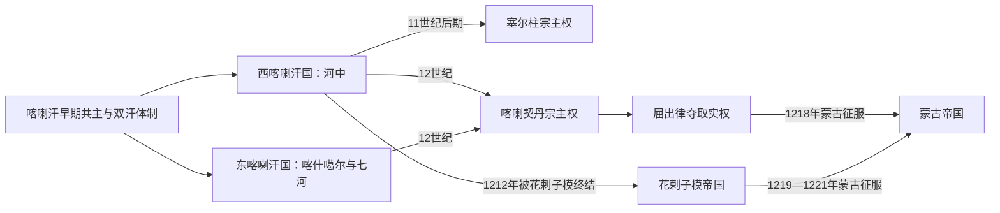

# 喀喇汗、喀喇契丹与花剌子模世系表

## 说明

喀喇汗王朝采用同族多人分封和“大可汗—副可汗”结构，早期两支、1040年代后的东西汗国以及费尔干纳地方王可能同时铸币。不同研究依钱币、称号和稀少编年材料重建出的先后略有差异，下表采用较常见序列，并把重叠与不定年明确保留，不能把所有姓名误读为一条单线帝王世系。

## 政权承接与宗主关系图

三组世系之间既有王朝替代，也有名义君主继续在位而宗主权转移的阶段。阅读表格时应把“可汗或沙阿的家族继承”与“塞尔柱、喀喇契丹及蒙古的实际支配”分开。

## 喀喇汗早期共主与主要分支

| 顺序 | 统治者 | 约在位 | 地位与关系 | 备注 |
|---|---|---|---|---|
| 1 | 毗伽阙·阙·卡迪尔汗 | 840—893年 | 早期联盟首领 | 身世与部族来源有争议，常列为王朝起点 |
| 2a | 巴兹尔·阿尔斯兰汗 | 893—920年 | 前任之子或近亲 | 与乌古尔恰克支系并立 |
| 2b | 乌古尔恰克·卡迪尔汗 | 893—940年 | 前任家族成员 | 在喀什噶尔一带统治；与萨图克发生权力冲突 |
| 3 | **萨图克·博格拉汗** | 约920—955年；约940年掌握主位 | 巴兹尔之子或侄，关系记载不一 | 首位著名穆斯林可汗；改宗年代约932—934年 |
| 4 | 穆萨·博格拉汗 | 955—958年 | 萨图克之子 | 推动王族和国家伊斯兰化 |
| 5 | 苏莱曼·阿尔斯兰汗 | 958—970年 | 同族继承 | 资料较少 |
| 6 | 阿里·阿尔斯兰汗 | 970—998年 | 萨图克后裔 | 大可汗；东向战争中死亡的传统与细节有争议 |
| 7 | 艾哈迈德·阿尔斯兰·喀喇汗 | 998—1017年 | 阿里之子 | 维持大可汗地位 |
| 8 | 曼苏尔·阿尔斯兰汗 | 1017—1024年 | 艾哈迈德之弟 | 阿里支系末期共主 |
| 9 | 穆罕默德·桃花石汗 | 1024—1026年 | 哈桑·博格拉汗之子 | 哈桑支系取得主位 |
| 10 | 优素福·卡迪尔汗 | 1026—1032年 | 前任之弟 | 统治喀什噶尔，与加兹尼王马哈茂德外交 |
| 并立 | 阿里·特勤·博格拉汗 | 约1020—1034年 | 哈桑之子、优素福之兄弟 | 控制布哈拉、撒马尔罕，实际独立 |
| 11 | 阿布·舒贾·苏莱曼 | 1034—1042年 | 同族继承 | 王朝正式东西分裂前的过渡共主 |

## 西喀喇汗国

| 顺序 | 统治者 | 在位 | 与前任关系 | 关键备注 |
|---|---|---|---|---|
| 1 | **伊卜拉欣·塔姆加奇·博格拉汗** | 约1040—1068年 | 纳斯尔·本·阿里之子，击败阿里·特勤诸子 | 以撒马尔罕为都，限制分封内斗 |
| 2 | 沙姆斯·穆尔克·纳斯尔 | 1068—1080年 | 前任之子 | 与塞尔柱和谈并联姻，建设拉巴特与城市设施 |
| 3 | 希德尔汗 | 1080—1081年 | 前任之弟或近亲 | 在位短 |
| 4 | 艾哈迈德汗 | 1081—1089年 | 希德尔之子 | 1089年塞尔柱介入后被废 |
| 5 | 雅库布·卡迪尔汗 | 1089—1095年 | 塞尔柱扶立的同族 | 藩属化初期；部分年表与艾哈迈德复位安排不同 |
| 6 | 马苏德一世 | 1095—1097年 | 同族 | 短期 |
| 7 | 苏莱曼·卡迪尔·塔姆加奇汗 | 1097年 | 同族 | 短期 |
| 8 | 马哈茂德·阿尔斯兰汗 | 1097—1099年 | 同族 | 钱币可考 |
| 9 | 吉卜里勒·阿尔斯兰汗 | 1099—1102年 | 同族 | 扩张失败后被杀 |
| 10 | 穆罕默德·阿尔斯兰汗 | 1102—1129年 | 同族 | 长期统治，与塞尔柱桑贾尔关系由合作转冲突 |
| 11 | 纳斯尔二世 | 1129年 | 前任之子或近亲 | 在位极短 |
| 12 | 艾哈迈德·卡迪尔汗 | 1129—1130年 | 同族 | 在位短 |
| 13 | 哈桑·贾拉勒·杜尼亚 | 1130—1132年 | 同族 | 部分钱币称号重建存在分歧 |
| 14 | 伊卜拉欣·鲁克恩·杜尼亚 | 1132年 | 同族 | 在位极短 |
| 15 | 马哈茂德二世 | 1132—1141年 | 穆罕默德·阿尔斯兰汗之子 | 卡特万战役时的西喀喇汗，后受西辽支配 |
| 16 | 伊卜拉欣三世·塔姆加奇汗 | 1141—1156年 | 同族 | 西辽藩属 |
| 17 | 阿里·察合里汗 | 1156—1161年 | 同族 | 西辽藩属 |
| 18 | 马苏德二世·塔姆加奇汗 | 1161—1171年 | 同族 | 城市建设与钱币可考 |
| 19 | 穆罕默德二世·塔姆加奇汗 | 1171—1178年 | 同族 | 西辽藩属 |
| 20 | 伊卜拉欣四世·阿尔斯兰汗 | 1178—1202年 | 同族 | 花剌子模影响上升 |
| 21 | **奥斯曼·本·伊卜拉欣** | 1202—1212年 | 前任之子 | 在西辽与花剌子模间倒向，最终被穆罕默德二世处死，西支灭亡 |

## 东喀喇汗国

| 顺序 | 统治者 | 在位 | 与前任关系 | 关键备注 |
|---|---|---|---|---|
| 1 | 阿布·舒贾·苏莱曼 | 1042—1056年 | 早期共主延续东支 | 以巴拉沙衮—喀什噶尔为核心 |
| 2 | 穆罕默德·本·优素福 | 1056—1057年 | 优素福·卡迪尔汗之子 | 在位短 |
| 3 | 伊卜拉欣·本·穆罕默德 | 1057—1059年 | 前任之子 | 在位短 |
| 4 | 马哈茂德汗 | 1059—1075年 | 同族 | 资料主要依钱币与后世记载 |
| 5 | 欧麦尔汗 | 1075年 | 同族 | 在位极短 |
| 6 | 阿布·阿里·哈桑 | 1075—1102年 | 同族 | 统治较久 |
| 7 | 艾哈迈德汗 | 1102—1128年 | 前任之后 | 面对部落和西方政治压力 |
| 8 | 伊卜拉欣·本·艾哈迈德 | 1128—1158年 | 前任之子 | 西辽兴起后成为藩属 |
| 9 | 穆罕默德·本·伊卜拉欣 | 1158年—不详 | 前任之子 | 终年不定，部分统治与地方王并立 |
| 10 | 优素福·本·穆罕默德 | 不详—1205年 | 前任之子 | 末期可汗；西辽扣留其子为人质 |
| 11 | 阿布·法特赫·穆罕默德 | 1205—1211年 | 前任之子 | 被释放返喀什噶尔前遭当地贵族杀害，东支未能复国 |

## 喀喇契丹（西辽）古儿汗

| 顺序 | 统治者 | 在位 | 身份与继承 | 关键事件 |
|---|---|---|---|---|
| 1 | **耶律大石** | 1124—1143年；1132年前后称古儿汗 | 辽宗室西迁领袖 | 建都巴拉沙衮；1141年卡特万大胜 |
| 2 | 萧塔不烟 | 1143—1150年摄政 | 耶律大石皇后，为幼子摄政 | 中文史料以感天皇后记载 |
| 3 | 耶律夷列 | 1150—1163年 | 耶律大石之子 | 继续以藩属贡赋制统治 |
| 4 | 耶律普速完 | 1163—1177年摄政 | 耶律夷列之妹，为侄摄政 | 号承天太后；卷入宫廷关系后被杀 |
| 5 | **耶律直鲁古** | 1177/1178—1211年 | 耶律夷列之子 | 末代耶律古儿汗；受花剌子模与乃蛮双重压力 |
| 6 | 屈出律 | 1211—1218年 | 乃蛮王子、耶律直鲁古女婿，篡位者 | 非耶律世系；改变宗教政策，后被蒙古哲别追杀 |

## 花剌子模沙阿：阿努什特勤系与过渡者

| 顺序 | 统治者 | 在位或任职 | 与前任关系 | 关键事件与备注 |
|---|---|---|---|---|
| 前身 | 阿努什特勤·加尔查伊 | 约1077—1097年 | 塞尔柱军奴与宫廷官员 | 获名义花剌子模职，未必长期亲自治理 |
| 过渡 | 埃金奇·本·科奇卡尔 | 1097年 | 非阿努什特勤家族 | 短暂花剌子模沙阿，被杀 |
| 1 | 库特布丁·穆罕默德一世 | 1097—1127年 | 阿努什特勤之子 | 建立世袭统治，名义臣属塞尔柱 |
| 2 | **阿即思** | 1127—1156年 | 前任之子 | 在塞尔柱与西辽间多次反叛、臣服，扩大自主 |
| 3 | 伊尔·阿尔斯兰 | 1156—1172年 | 前任之子 | 继续扩张至呼罗珊和草原边缘 |
| 4a | **塔乞失** | 1172—1200年 | 前任长子 | 借西辽援助即位；1194年消灭大塞尔柱主线 |
| 4b | 苏丹沙阿 | 1172—1193年并立 | 塔乞失之弟 | 受母亲支持控制呼罗珊部分地区，死后领地归兄 |
| 5 | **阿拉乌丁·穆罕默德二世** | 1200—1220年 | 塔乞失之子 | 吞并古尔、河中与伊朗多地；1219年遭蒙古全面入侵 |
| 6 | **札兰丁·明布尔努** | 1220—1231年 | 前任之子 | 在八鲁湾胜蒙古、印度河败退；后于伊朗—高加索流动作战，遇害后王朝终结 |

## 关系辨析

- 喀喇汗“顺序”只在各分表内部有效，不能把东、西两表首尾连接成一条帝位序列。
- 女性摄政萧塔不烟、耶律普速完实际行使古儿汗最高权力，应列入统治序列，而非附在男性君主名下。
- 屈出律继承了西辽国家机器，却是通过军事与婚姻篡权的乃蛮统治者，不属于耶律王朝。
- 塔乞失和苏丹沙阿从1172年起长期并立；只列塔乞失会掩盖花剌子模继承战争。
- 札兰丁在核心领土失陷后仍被同代人承认为沙阿，并维持独立军政至1231年，因此不应把王朝终点简单写成1220年。

## 相关笔记

- [喀喇汗、花剌子模与蒙古征服](/%E4%BA%BA%E6%96%87%E7%A7%91%E5%AD%A6/%E5%8E%86%E5%8F%B2/%E4%B8%AD%E4%BA%9A/%E6%B2%B3%E4%B8%AD%E5%9C%B0%E5%8C%BA/%E5%96%80%E5%96%87%E6%B1%97%E3%80%81%E8%8A%B1%E5%89%8C%E5%AD%90%E6%A8%A1%E4%B8%8E%E8%92%99%E5%8F%A4%E5%BE%81%E6%9C%8D.md)
- [河中绿洲、粟特与萨曼王朝](/%E4%BA%BA%E6%96%87%E7%A7%91%E5%AD%A6/%E5%8E%86%E5%8F%B2/%E4%B8%AD%E4%BA%9A/%E6%B2%B3%E4%B8%AD%E5%9C%B0%E5%8C%BA/%E6%B2%B3%E4%B8%AD%E7%BB%BF%E6%B4%B2%E3%80%81%E7%B2%9F%E7%89%B9%E4%B8%8E%E8%90%A8%E6%9B%BC%E7%8E%8B%E6%9C%9D.md)
- [帖木儿、汗国与近世城市](/%E4%BA%BA%E6%96%87%E7%A7%91%E5%AD%A6/%E5%8E%86%E5%8F%B2/%E4%B8%AD%E4%BA%9A/%E6%B2%B3%E4%B8%AD%E5%9C%B0%E5%8C%BA/%E5%B8%96%E6%9C%A8%E5%84%BF%E3%80%81%E6%B1%97%E5%9B%BD%E4%B8%8E%E8%BF%91%E4%B8%96%E5%9F%8E%E5%B8%82.md)
- [河中地区历史](/%E4%BA%BA%E6%96%87%E7%A7%91%E5%AD%A6/%E5%8E%86%E5%8F%B2/%E4%B8%AD%E4%BA%9A/%E6%B2%B3%E4%B8%AD%E5%9C%B0%E5%8C%BA/README.md)
- 国家空间落点：[乌兹别克斯坦的粟特、花剌子模与河中绿洲](/%E4%BA%BA%E6%96%87%E7%A7%91%E5%AD%A6/%E5%8E%86%E5%8F%B2/%E4%B8%AD%E4%BA%9A/%E4%B9%8C%E5%85%B9%E5%88%AB%E5%85%8B%E6%96%AF%E5%9D%A6/%E7%B2%9F%E7%89%B9%E3%80%81%E8%8A%B1%E5%89%8C%E5%AD%90%E6%A8%A1%E4%B8%8E%E6%B2%B3%E4%B8%AD%E7%BB%BF%E6%B4%B2.md)；[土库曼斯坦的古代绿洲、帕提亚与梅尔夫](/%E4%BA%BA%E6%96%87%E7%A7%91%E5%AD%A6/%E5%8E%86%E5%8F%B2/%E4%B8%AD%E4%BA%9A/%E5%9C%9F%E5%BA%93%E6%9B%BC%E6%96%AF%E5%9D%A6/%E5%8F%A4%E4%BB%A3%E7%BB%BF%E6%B4%B2%E3%80%81%E5%B8%95%E6%8F%90%E4%BA%9A%E4%B8%8E%E6%A2%85%E5%B0%94%E5%A4%AB.md)
