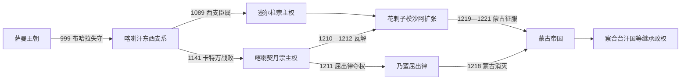

# 喀喇汗、花剌子模与蒙古征服

## 时间

约840—1231年

## 概括

喀喇汗王朝源于七河与西天山的葛逻禄、样磨、处月等突厥政治网络。萨图克·博格拉汗改宗伊斯兰及其后裔征服于阗、河中，使突厥王族第一次长期统治中亚主要穆斯林绿洲。王朝实行多可汗、分封领和东西支系并立，不能按单一父子主线叙述。11世纪末西支先后成为塞尔柱和喀喇契丹藩属。契丹人耶律大石建立的西辽以古儿汗为中心，通过地方王朝和贡赋间接统治；花剌子模沙阿随后利用塞尔柱衰落、钦察军队和绿洲财政迅速扩张，却在1219年后与蒙古帝国的全面战争中崩溃。

完整支系、复位、并立和争议年代见[喀喇汗、喀喇契丹与花剌子模世系表](/%E4%BA%BA%E6%96%87%E7%A7%91%E5%AD%A6/%E5%8E%86%E5%8F%B2/%E4%B8%AD%E4%BA%9A/%E6%B2%B3%E4%B8%AD%E5%9C%B0%E5%8C%BA/%E5%96%80%E5%96%87%E6%B1%97%E3%80%81%E5%96%80%E5%96%87%E5%A5%91%E4%B8%B9%E4%B8%8E%E8%8A%B1%E5%89%8C%E5%AD%90%E6%A8%A1%E4%B8%96%E7%B3%BB%E8%A1%A8.md)。

## 建立背景与崛起机制

### 喀喇汗王朝

- 840年回鹘汗国崩溃后，七河和西天山的部落联盟重组；“喀喇汗”是后世依王号概括的名称，王族自称及外部记载并不统一。
- 王权采用“大可汗—副可汗—分封王”体系，巴拉沙衮、喀什噶尔、怛逻斯、费尔干纳、撒马尔罕等可由同族成员同时掌管。
- 萨图克·博格拉汗约10世纪前半改宗，其后穆萨等推动王族伊斯兰化；这一过程兼有宫廷斗争、商贸和宗教网络，不是全体突厥人同日改宗。
- 992年哈桑·博格拉汗短暂占领布哈拉，999年纳斯尔·本·阿里再次攻城并终结萨曼统治；阿姆河成为与加兹尼势力的大致边界。

### 喀喇契丹（西辽）

- 金灭辽之际，耶律大石1124年率契丹残部西迁，吸收突厥和蒙古部众，在巴拉沙衮建立新核心。
- 1141年卡特万战役击败塞尔柱苏丹桑贾尔与西喀喇汗联军，河中、东喀喇汗、畏兀儿和花剌子模先后成为不同程度的藩属。
- 古儿汗对直属契丹人口管理较紧，对穆斯林城市则保留喀喇汗国王、法官、税务和宗教制度，以使者、牌符、户税和年贡维系宗主权。
- 统治集团保持契丹—汉制年号、印玺和仪礼，宗教上兼容佛教、景教、伊斯兰和地方信仰。

### 花剌子模沙阿

- 阿努什特勤本是塞尔柱宫廷军奴，1077年前后获名义花剌子模职；1097年其子库特布丁·穆罕默德建立世袭总督线。
- 阿即思、伊尔·阿尔斯兰在塞尔柱与喀喇契丹之间周旋，以阿姆河三角洲农业、乌尔根奇贸易和草原骑兵扩大自主权。
- 塔乞失击败兄弟苏丹沙阿并于1194年消灭最后一位大塞尔柱苏丹，取得呼罗珊与伊朗部分地区。
- 阿拉乌丁·穆罕默德二世又吞并古尔、喀喇汗和喀喇契丹旧属，一度控制从锡尔河至伊朗的辽阔帝国。

## 统治结构与社会

| 政权 | 最高权力 | 地方治理 | 财政与军队 |
|---|---|---|---|
| 喀喇汗 | 大可汗与同族副可汗并立，支系间地位可变 | 王族分封城市，沿用波斯语文官、伊斯兰法官和地方地主 | 绿洲土地税、铸币、关税；突厥部落和扈从军 |
| 塞尔柱宗主期 | 西喀喇汗国王保留王号，塞尔柱苏丹可废立 | 撒马尔罕、布哈拉仍由本地王与城市机构管理 | 年贡、军役与婚姻联盟 |
| 喀喇契丹 | 古儿汗及契丹宫廷 | 大部分城市由喀喇汗王、畏兀儿亦都护和地方官继续统治 | 户税、贡赋、少量驻使；机动骑兵在核心区集中 |
| 花剌子模 | 沙阿、王太后与钦察军头共同影响决策 | 波斯语宰相和文官治理新征服区，地方忠诚不稳 | 灌溉税、商路、钦察与乌古斯军队、城市驻军 |

## 重要事件与具体过程

1. **约934—955年萨图克改宗与夺权**：后世圣徒传说增加了细节，确切年份有分歧，但王族伊斯兰化由此获得象征起点。
2. **970—1006年向河中和于阗扩张**：阿里、哈桑及其后裔分别向西、向东征战；1006年前后于阗王国结束。
3. **999年占领布哈拉**：萨曼埃米尔被俘，河中转入突厥穆斯林王族统治；波斯语城市文化并未中断。
4. **1040年代东西汗国成形**：分封制和阿里、哈桑两支竞争使统一可汗权瓦解；费尔干纳成为反复争夺区。
5. **1089年塞尔柱介入**：马立克沙进入撒马尔罕，西喀喇汗转为塞尔柱藩属；国王仍保留地方行政与铸币。
6. **文化整合**：《福乐智慧》与《突厥语大词典》显示突厥书写、伊斯兰政治伦理、波斯—阿拉伯学术和多语城市环境结合。
7. **1124—1134年耶律大石西迁建国**：先在叶密立集结，再受巴拉沙衮统治者邀请介入内乱并接管城市。
8. **1141年卡特万战役**：塞尔柱—西喀喇汗联军惨败，桑贾尔在河中威望崩溃，西辽成为中亚宗主。
9. **1172年花剌子模继承战争**：塔乞失借西辽援助击败弟苏丹沙阿，但两人长期并立，显示外部宗主权可介入王位。
10. **1194年塔乞失击败图格里勒三世**：大塞尔柱在伊朗的主线终结，花剌子模沙阿跃升为东部伊斯兰世界强权。
11. **1209—1212年西辽与喀喇汗瓦解**：花剌子模击败西辽军并控制河中；乃蛮王子屈出律夺古儿汗权；末代西喀喇汗奥斯曼又因倒向西辽被穆罕默德二世处死。
12. **1218年蒙古消灭屈出律**：哲别利用其压迫喀什噶尔穆斯林造成的反感迅速取得支持，蒙古与花剌子模直接接壤。
13. **讹答剌事件**：花剌子模地方长官亦纳勒术扣押并杀害蒙古商队，穆罕默德二世又处死或羞辱使者，使贸易冲突转成战争理由。
14. **1219—1221年蒙古入侵**：成吉思汗分军越过锡尔河防线，布哈拉、撒马尔罕、讹答剌和乌尔根奇先后陷落；守军分散、指挥不统一放大了蒙古机动优势。
15. **札兰丁抵抗**：札兰丁·明布尔努在八鲁湾击败一支蒙古军，后于印度河败退；1224年返伊朗后重建流动政权，1231年遇害。

## 鼎盛条件

### 喀喇汗

- 把草原骑兵和河中成熟税收、铸币、灌溉及文官结合。
- 控制喀什噶尔—费尔干纳—撒马尔罕商路，并以伊斯兰身份取得城市精英合作。
- 分封同族可快速覆盖广域，却也为后来的长期内战埋下结构性风险。

### 喀喇契丹

- 契丹军队规模有限，但通过保留地方统治者降低直接行政成本。
- 卡特万胜利带来军事威望和稳定贡赋，多宗教宽容减少城市反抗。
- 位于中国制度传统、草原军事和伊斯兰商业三者交界，能利用多种合法性。

### 花剌子模

- 阿姆河三角洲的灌溉农业、乌尔根奇贸易与草原马匹提供财政和军力。
- 塞尔柱、古尔与西辽先后衰退，产生快速扩张窗口。
- 王室与钦察部落婚姻带来骑兵，波斯官僚则维持税收和文书。

## 衰落与灭亡原因

### 喀喇汗

- 多可汗与分封制度导致支系战争，国王常借塞尔柱或西辽外援争位，反而丧失自主。
- 游牧军人、城市精英和宗主国之间利益不一致，中央无法建立稳定继承。
- 1212年穆罕默德二世处死奥斯曼，西支直接灭亡；东支此前已在西辽和屈出律控制下终结。

### 喀喇契丹

- 地方依赖贡赋而非直属行政，遇到花剌子模拒贡和边缘叛乱时难以迅速补充军力。
- 末代古儿汗耶律直鲁古同时面对西方花剌子模和东方蒙古压力。
- 屈出律借婚姻和军队夺权后改变宗教政策，失去喀什噶尔等穆斯林城市支持；1218年被蒙古军追杀。

### 花剌子模

- **结构因素**：帝国扩张快于行政整合，穆罕默德二世与王太后秃儿罕可敦各有任命和军队网络；新征服城市驻军彼此孤立。
- **外部压力**：蒙古帝国已经统一草原并吸收西辽旧地，拥有更灵活的情报、分进合击和攻城能力。
- **直接触发**：讹答剌商队与使节事件使成吉思汗决定全面报复；沙阿没有集中主力，而把部队分散守城。
- **直接灭亡**：穆罕默德二世逃亡并于1220年病死，河中与花剌子模核心在1221年前后失守。札兰丁虽延续王号十年，却无法恢复原帝国，1231年死后世系结束。

## 蒙古征服的影响辨析

- 战争确实造成屠杀、奴役、灌溉破坏和城市人口流失，但不同城市破坏程度、死亡数字和恢复速度差异很大，编年史中的极大数字不能照单全收。
- 蒙古并非只留下毁灭：征服后重新登记户口、征税、组织驿站和跨洲交通，河中又进入察合台汗国等新政治体系。
- 乌尔根奇因河道与战争严重受损，布哈拉和撒马尔罕则在后续数十年逐步恢复；城市中心迁移与灌溉变化同样重要。
- 突厥语军人、波斯语文官、穆斯林法学家和蒙古王族在新秩序中重组，构成帖木儿时代的社会背景。

## 演变关系

- 完整统治序列：[喀喇汗、喀喇契丹与花剌子模世系表](/%E4%BA%BA%E6%96%87%E7%A7%91%E5%AD%A6/%E5%8E%86%E5%8F%B2/%E4%B8%AD%E4%BA%9A/%E6%B2%B3%E4%B8%AD%E5%9C%B0%E5%8C%BA/%E5%96%80%E5%96%87%E6%B1%97%E3%80%81%E5%96%80%E5%96%87%E5%A5%91%E4%B8%B9%E4%B8%8E%E8%8A%B1%E5%89%8C%E5%AD%90%E6%A8%A1%E4%B8%96%E7%B3%BB%E8%A1%A8.md)
- 前一阶段：[河中绿洲、粟特与萨曼王朝](/%E4%BA%BA%E6%96%87%E7%A7%91%E5%AD%A6/%E5%8E%86%E5%8F%B2/%E4%B8%AD%E4%BA%9A/%E6%B2%B3%E4%B8%AD%E5%9C%B0%E5%8C%BA/%E6%B2%B3%E4%B8%AD%E7%BB%BF%E6%B4%B2%E3%80%81%E7%B2%9F%E7%89%B9%E4%B8%8E%E8%90%A8%E6%9B%BC%E7%8E%8B%E6%9C%9D.md)
- 后一阶段：[帖木儿、汗国与近世城市](/%E4%BA%BA%E6%96%87%E7%A7%91%E5%AD%A6/%E5%8E%86%E5%8F%B2/%E4%B8%AD%E4%BA%9A/%E6%B2%B3%E4%B8%AD%E5%9C%B0%E5%8C%BA/%E5%B8%96%E6%9C%A8%E5%84%BF%E3%80%81%E6%B1%97%E5%9B%BD%E4%B8%8E%E8%BF%91%E4%B8%96%E5%9F%8E%E5%B8%82.md)
- 上级：[河中地区历史](/%E4%BA%BA%E6%96%87%E7%A7%91%E5%AD%A6/%E5%8E%86%E5%8F%B2/%E4%B8%AD%E4%BA%9A/%E6%B2%B3%E4%B8%AD%E5%9C%B0%E5%8C%BA/README.md)
