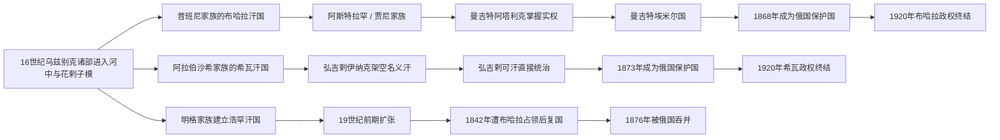

# 布哈拉、希瓦与浩罕统治者表

## 时间

1500—1920年

## 使用说明

三国的“王位”并不总等于实际权力。布哈拉18世纪后期的阿塔利克、希瓦18世纪后期的伊纳克以及浩罕若干摄政者，常在名义可汗之下掌握军队、任官和财政。本表因此把名义统治者与实际掌权者分列；复位按不同任期逐项记录，共治、傀儡、极短在位和争议人选均在备注中说明。

16—18世纪纪年常由伊斯兰历换算，花剌子模在1685—1804年又处于多中心受立状态。不同学术年表对部分姓名、编号和起止年有冲突，表中以“约”“存疑”“并立”明确标识，不把不确定值伪装成精确单线。

## 三大汗国演变图

这三条序列并非彼此隔绝：布哈拉多次干预浩罕继承，希瓦与布哈拉又围绕花剌子模、呼罗珊和商路竞争；19世纪后期，俄国的军事征服把三者先后纳入同一殖民秩序。

## 布哈拉

### 昔班尼王朝

| 顺序 | 统治者 | 王室／称号 | 在位时间 | 继承关系 | 状态与重要事件 |
|---|---|---|---|---|---|
| 1 | **穆罕默德·昔班尼汗** | 阿布海儿系昔班尼 | 1500/01—1510 | 以乌兹别克部众征服河中 | 攻取布哈拉、撒马尔罕，1507年入赫拉特；1510年在梅尔夫战死。 |
| 2 | 速云赤·火者汗 | 昔班尼叔父；塔什干支 | 1511—1512 | 宗族长辈 | 昔班尼死后复国联盟的年长首领；是否列为布哈拉最高可汗存在分类差异，实际中心在塔什干。 |
| 3 | 库赤昆赤·穆罕默德汗 | 昔班尼叔父 | 1512—1530/31 | 叔侄；宗族推戴 | 吉日杜万胜利后成为公认最高可汗；封地仍由宗族王子分治。 |
| 4 | 阿布·赛义德汗 | 库赤昆赤之子 | 1530/31—1533/34 | 父子 | 在位较短，布哈拉的乌拜杜拉势力日益突出。 |
| 5 | **乌拜杜拉汗** | 昔班尼侄子 | 1533/34—1539/40；此前自1512年据布哈拉 | 同宗旁支 | 以布哈拉为主要中心，多次与萨法维争夺呼罗珊，使“布哈拉汗国”名称逐渐固定。 |
| 6 | 阿卜杜拉一世 | 库赤昆赤之子 | 1540（约数月） | 同宗堂支 | 短暂受立后去世，宗族封地争夺加剧。 |
| 7 | 阿卜杜勒·拉蒂夫汗 | 库赤昆赤之子 | 1540—1552 | 阿卜杜拉一世之兄弟 | 主要依托撒马尔罕；各支仍保持较强独立性。 |
| 8 | 纳兀鲁兹·艾哈迈德汗（巴剌克汗） | 速云赤·火者之子；塔什干支 | 1552—1556 | 同宗旁支 | 以塔什干力量进入撒马尔罕、布哈拉，死后南北封地重新分配。 |
| 9 | 皮儿·穆罕默德一世 | 昔班尼兄弟马哈茂德之子 | 1556—1561 | 同宗旁支 | 中心在巴尔赫，作为宗族长辈保有最高称号；布哈拉实际由阿卜杜拉二世扩张。 |
| 10 | 伊斯坎德尔汗 | 贾尼别克之子 | 1561—1583（名义） | 阿卜杜拉二世之父 | 由儿子拥立，礼仪与法统地位高于实权。 |
| 11 | **阿卜杜拉二世** | 伊斯坎德尔之子 | 约1557/61—1583实际掌权；1583—1598正式为汗 | 父子 | 统一多数宗族封地，整顿税收、驿路和水利，汗国达到昔班尼时期高峰。 |
| 12 | 阿卜杜勒·穆明汗 | 阿卜杜拉二世之子 | 1598（约半年） | 父子 | 继位后清洗重臣，旋遭刺杀；直系继承危机爆发。 |
| 13 | 皮儿·穆罕默德二世 | 昔班尼家族旁支 | 1598—1599 | 同宗旁支 | 败于巴基·穆罕默德并战死，昔班尼王朝在布哈拉终结。 |

### 贾尼／阿斯特拉罕王朝及名义可汗

| 顺序 | 统治者 | 王室／称号 | 在位时间 | 继承关系 | 状态与重要事件 |
|---|---|---|---|---|---|
| 1 | 贾尼·穆罕默德 | 图盖帖木儿系；阿斯特拉罕王族 | 1599—1603（传统名义年表） | 与昔班尼家族联姻 | 部分传统年表把他列为首位贾尼可汗；另一些研究认为他未正式即位，实权从一开始就在儿子巴基手中。 |
| 2 | **巴基·穆罕默德汗** | 贾尼之子 | 1599或1603—1605 | 父子；战胜皮儿·穆罕默德二世 | 广泛被视为首位有效统治者；首年与贾尼名义任期重叠是史学分歧，不是共治定论。 |
| 3 | 瓦利·穆罕默德汗 | 巴基之弟 | 1605—1611 | 兄弟 | 遭贵族反对后求援萨法维，最终被伊玛目·库里击败。 |
| 4 | **伊玛目·库里汗** | 巴基之侄 | 1611—1642 | 侄承叔位 | 长期在位，维持布哈拉—撒马尔罕核心；晚年失明后退位。 |
| 5 | 纳德尔·穆罕默德汗 | 伊玛目·库里之弟 | 1642—1645 | 兄弟 | 先长期治理巴尔赫；登位后与贵族、诸子冲突，失去布哈拉。 |
| 6 | 阿卜杜勒·阿齐兹汗 | 纳德尔之子 | 1645—1680/81 | 父子；在叛乱中被拥立 | 与父亲一度分别控制布哈拉和巴尔赫；晚年退位朝觐。 |
| 7 | 苏布罕·库里汗 | 纳德尔之子 | 1680/81—1702 | 兄弟 | 此前据巴尔赫；对外应付哈萨克、希瓦压力，对内依赖部族军政首领。 |
| 8 | 乌拜杜拉二世 | 苏布罕·库里之子 | 1702—1711 | 父子 | 试图限制部族与阿塔利克权力，因货币、财政与派系冲突被杀。 |
| 9 | 阿布·费兹汗 | 苏布罕·库里之子 | 1711—1747 | 兄弟 | 后期权力缩至布哈拉近郊；1740年向纳迪尔沙臣服，1747年被曼吉特首领穆罕默德·拉希姆处死。 |
| 10 | 阿卜杜勒·穆明汗 | 阿布·费兹之子 | 1747—约1750/51（傀儡） | 父子 | 幼年受立，实权属于穆罕默德·拉希姆；随后被废杀。 |
| 11 | 乌拜杜拉三世 | 贾尼家族幼支 | 约1751—1753/54（傀儡） | 同宗继位 | 仅保留成吉思汗系合法性；姓名、年龄和准确年限在年表中有差异。 |
| 12a | 希尔·加齐汗 | 成吉思汗系受立者 | 约1754—1756（存疑傀儡） | 来源与前任关系不详 | 部分年表列此人，另一些把同一时段归给阿布·加齐；两者不能强行合并为一人。 |
| 12b | 阿布·加齐汗 | 贾尼系或外来成吉思汗系 | 约1754—1756（第一次，年表存疑） | 受曼吉特拥立 | 部分重建认为其先在穆罕默德·拉希姆称汗前短暂在位。 |
| 13 | 法兹勒·托列 | 穆罕默德·拉希姆之外孙；成吉思汗母系合法性不足 | 1758（短期傀儡） | 外孙／幼童 | 穆罕默德·拉希姆死后短暂受立，实际由达尼亚尔·比执政；是否算正式可汗存在争议。 |
| 14 | 阿布·加齐汗 | 成吉思汗系名义可汗 | 1758—1785（第二次或重新受立） | 由达尼亚尔·比拥立 | 长期只承担礼仪法统；1785年沙·穆拉德取消傀儡汗安排。 |

### 曼吉特实际统治者与埃米尔

| 顺序 | 统治者 | 身份 | 掌权／在位时间 | 继承关系 | 状态与重要事件 |
|---|---|---|---|---|---|
| 1 | 穆罕默德·哈基姆·比 | 阿塔利克／曼吉特首领 | 约1740—1743实际掌权 | 受阿布·费兹任命 | 纳迪尔沙入侵后成为最高军政中介，为曼吉特接管奠基。 |
| 2 | **穆罕默德·拉希姆** | 阿塔利克；后称汗 | 1745/47—1756实际掌权；1756—1758/59称汗 | 穆罕默德·哈基姆之子 | 杀阿布·费兹，以傀儡汗过渡；非成吉思汗男系，靠联姻、军队和乌里玛支持集中权力。 |
| 3 | 达尼亚尔·比 | 阿塔利克 | 1758/59—1785实际掌权 | 穆罕默德·拉希姆之叔 | 在阿布·加齐名下执政；地方首领仍强，税负与派系引起多次反抗。 |
| 4 | **沙·穆拉德** | 埃米尔 | 1785—1800 | 达尼亚尔之子 | 废除名义可汗，正式采用埃米尔法统；整顿税制、司法并重建中央权威。 |
| 5 | 海达尔 | 埃米尔 | 1800—1826 | 父子 | 强化宗教合法性，却长期应付米扬卡勒、沙赫里萨布兹和浩罕方向战争。 |
| 6 | 侯赛因 | 埃米尔 | 1826（约两个月） | 海达尔之子 | 短期继位后死亡，宫廷继承斗争爆发。 |
| 7 | 乌马尔 | 埃米尔 | 1826—1827（约数月） | 侯赛因之弟 | 被兄弟纳斯鲁拉击败；短任不能省略。 |
| 8 | **纳斯鲁拉** | 埃米尔 | 1827—1860 | 海达尔之子 | 通过清洗和常备军集中权力；1842年占领浩罕并处死其统治者，但十周后被逐。 |
| 9 | 穆扎法尔 | 埃米尔 | 1860—1885 | 父子 | 1866—1868年败于俄军；1868年和约后保留内政但成为俄国保护国。 |
| 10 | 阿卜杜勒·阿哈德 | 埃米尔 | 1885—1910 | 父子 | 在俄国保护下统治，外交与军事受限，宫廷官僚和地方行政继续运作。 |
| 11 | **穆罕默德·阿里木** | 末代埃米尔 | 1910—1920 | 父子 | 改革派与保守派冲突加深；1920年红军和青年布哈拉人攻入布哈拉，流亡阿富汗。 |

## 希瓦／花剌子模

### 阿拉伯沙希与后续受立可汗

阿拉伯沙希的稳定男系统治在17世纪末至18世纪初逐渐断裂，此后部族首领常从不同成吉思汗系支派迎立名义可汗。1685—1804年的表不是一条稳定父子王统，而是把现存王表中有名可考的受立者逐项展开；互相重叠者代表并立或纪年分歧。

| 顺序 | 统治者 | 王室／身份 | 在位时间 | 继承关系 | 状态与重要事件 |
|---|---|---|---|---|---|
| 1 | **伊勒巴尔斯一世** | 阿拉伯沙希 | 1511—1518 | 伯勒克之子 | 应花剌子模地方势力邀请驱逐萨法维驻军，建立不同于河中昔班尼支的乌兹别克王朝。 |
| 2 | 苏丹·哈吉 | 阿拉伯沙希 | 1518—1519 | 伊勒巴尔斯之侄 | 短期在位，实权多由堂亲苏丹·加齐掌握。 |
| 3 | 哈桑·库里 | 阿拉伯沙希 | 1519—1524 | 伊勒巴尔斯堂亲 | 与伊勒巴尔斯诸子冲突，围城后被杀。 |
| 4 | 布朱加 | 阿拉伯沙希 | 约1524—1529 | 苏菲扬之兄弟 | 年代与苏菲扬先后次序在不同编年重建中相反。 |
| 5 | 苏菲扬 | 阿拉伯沙希 | 约1529—1535 | 布朱加之兄弟 | 对土库曼与呼罗珊用兵；另一套纪年把其统治提前至1519—1522。 |
| 6 | 阿夫尼克 | 阿拉伯沙希 | 约1535—1538 | 苏菲扬之兄弟 | 宗族仇杀引来布哈拉干预，死后花剌子模一度被占。 |
| 7 | 卡勒汗 | 阿拉伯沙希 | 约1539/41—1549 | 阿夫尼克之子 | 在布哈拉占领中恢复本地王权，具体起年有差异。 |
| 8 | 阿卡泰汗 | 阿拉伯沙希 | 1549—1557 | 苏菲扬之兄弟 | 与侄辈争权，败亡。 |
| 9 | 杜斯特·穆罕默德汗 | 阿拉伯沙希 | 1557—1558 | 阿卡泰家族后继者 | 与兄弟伊什争位，双方均死于冲突。 |
| 10 | 哈吉·穆罕默德一世 | 阿拉伯沙希 | 1558—1602 | 阿卡泰之子 | 多次遭布哈拉驱逐又复位，维持王朝并扩大希瓦作为政治中心的重要性。 |
| 11 | 阿拉伯·穆罕默德一世 | 阿拉伯沙希 | 1602—1621/23 | 父子 | 抵御哥萨克与卡尔梅克侵袭；被儿子哈巴什、伊勒巴尔斯叛乱推翻、弄瞎并杀害。 |
| 12a | 哈巴什·苏丹 | 阿拉伯沙希叛乱支 | 1621—1623（共同争位） | 阿拉伯·穆罕默德之子 | 与兄弟共同控制王廷；属于武力篡位者，不能并成一个合称。 |
| 12b | 伊勒巴尔斯·苏丹 | 阿拉伯沙希叛乱支 | 1621—1623（共同争位） | 阿拉伯·穆罕默德之子 | 与哈巴什并立；伊斯凡迪亚尔回师后被处死。 |
| 13 | 伊斯凡迪亚尔汗 | 阿拉伯沙希 | 1623—1642/43 | 阿拉伯·穆罕默德之子 | 依靠土库曼力量复位王室，对乌兹别克部众政策引起反对。 |
| 14 | **阿布·加齐一世** | 阿拉伯沙希 | 1643/45—1663 | 伊斯凡迪亚尔之弟 | 经历流亡后夺权，重组部族配置；又以史书编纂闻名。 |
| 15 | 阿努沙·穆罕默德汗 | 阿拉伯沙希 | 1663—1685/87 | 父子 | 多次进攻布哈拉，一度占城；晚年被推翻和弄瞎。 |
| 16 | 胡达达德汗一世 | 阿拉伯沙希 | 1685/87—1689 | 阿努沙之子 | 少年受立后被杀；起年随阿努沙退位纪年而异。 |
| 17 | 穆罕默德·奥朗一世 | 阿拉伯沙希 | 1689—1694/95 | 阿努沙之子 | 继续干预布哈拉，意外死亡后王统迅速破碎。 |
| 18 | 乔恰克／术赤汗 | 阿拉伯沙希旁支 | 1694—1697（存疑） | 哈吉·穆罕默德一世后裔 | 见于部分编年重建；同时期地方割据使其控制范围不明。 |
| 19 | 瓦利汗 | 阿拉伯沙希旁支 | 1697—1698（存疑） | 关系不详 | 短期受立，未能稳定局势。 |
| 20 | 伊沙克·阿合·沙·尼亚兹 | 卡塔干或旁支，谱系不定 | 1698—1703 | 可能承乔恰克支 | 其血统与起止年均有争议，部分记载把沙·尼亚兹的受立提前。 |
| 21 | 奥朗二世 | 阿拉伯沙希旁支 | 约1701—1702（并立／存疑） | 关系不详 | 与沙·尼亚兹时段重叠，反映不同城市或部族各拥一汗。 |
| 22 | 沙·巴赫特汗 | 受立可汗 | 1703—1704 | 沙·尼亚兹之子或近亲 | 短期在位。 |
| 23 | 穆萨汗 | 受立可汗 | 约1703—1704，或延至1712（存疑并立） | 关系不详 | 不同传统对其任期差距很大，应保留为争议人选。 |
| 24 | 赛义德·阿里汗 | 受立可汗 | 1704—1705（短期） | 关系不详 | 在派系冲突中迅速更换。 |
| 25 | 雅德加尔一世 | 阿拉伯沙希旁支 | 约1707—1713 | 阿努沙后裔或旁支 | 任期与穆萨、奥朗等记载部分重叠。 |
| 26 | 奥朗三世 | 受立可汗 | 约1713—1714（短期） | 关系不详 | 仅见于部分王表，控制范围有限。 |
| 27 | 哈吉·穆罕默德二世 | 受立可汗 | 约1714（短期） | 关系不详 | 曾向俄国派使的记载与其他人名可能互有混同。 |
| 28 | 希尔·加齐汗 | 成吉思汗系外来受立者 | 约1715—1727/29 | 由部族首领拥立 | 击败别科维奇远征；被奴隶所杀。年代有1714—1727与约1715—1729两套。 |
| 29 | 萨雷格·艾吉尔汗 | 受立者 | 约1727（极短，存疑） | 关系不详 | 只见于较晚王表；与希尔·加齐末年、伊勒巴尔斯二世初年重叠。 |
| 30 | 伊勒巴尔斯二世 | 成吉思汗系受立者 | 约1727/29—1740 | 关系与编号有争议 | 拒绝纳迪尔沙臣服并杀使者；1740年战败被处死。 |
| 31 | 阿布·海儿汗 | 哈萨克小玉兹汗 | 1740（约六日） | 外来成吉思汗系 | 纳迪尔沙进军时短暂被拥立，旋即离开；必须与18世纪布哈拉阿布海儿人物区分。 |
| 32 | 努尔·阿里一世 | 哈萨克系受立者 | 1741（短期） | 外来可汗 | 纳迪尔沙撤军后的反抗中受立，迅速被更换。 |
| 33 | 阿布·穆罕默德汗 | 成吉思汗系受立者 | 约1742（短期，存疑） | 可能为伊勒巴尔斯二世之子 | 仅部分王表单列。 |
| 34 | 阿布·加齐二世 | 成吉思汗系受立者 | 约1741/42—1745/47 | 关系不详 | 早期复国可汗之一，日期与努尔·阿里、阿布·穆罕默德重叠。 |
| 35 | 加伊布／凯普汗 | 哈萨克系受立者 | 约1745/47—1756/58 | 外来可汗 | 在花剌子模部族平衡中受立，后被逐；不同年表终年相差两年。 |
| 36 | 阿卜杜拉·卡拉·别格汗 | 受立可汗 | 1758（短期，存疑） | 关系不详 | 只在较详尽地方王表中出现。 |
| 37 | 帖木儿·加齐汗 | 受立可汗 | 约1758—1764 | 关系不详 | 依赖部族和宫廷首领，实权有限。 |
| 38 | 陶克汗 | 哈萨克系受立者 | 约1764—1766 | 外来可汗 | 短期法统工具。 |
| 39 | 沙·加齐汗 | 受立可汗 | 约1766—1768 | 关系不详 | 与阿布·加齐三世的起年在不同年表中重叠。 |
| 40 | 阿布·加齐三世 | 成吉思汗系受立者 | 约1766/68—1769 | 关系不详 | 较简年表只记录1766—1767；详表把其延至1769。 |
| 41 | 努尔·阿里二世 | 哈萨克系受立者 | 1769（短期） | 关系不详 | 不要与1741年的同名可汗混同。 |
| 42 | 贾汉吉尔汗 | 受立可汗 | 约1769—1770 | 关系不详 | 短期在位。 |
| 43 | 伯列凯汗 | 受立可汗 | 1770（短期） | 关系不详 | 短任，权力局限于拥立集团。 |
| 44 | 阿基姆汗 | 受立可汗 | 约1770—1771（第一次） | 关系不详 | 后被再次拥立。 |
| 45 | 阿卜杜勒·阿齐兹汗 | 受立可汗 | 约1771（短期） | 关系不详 | 与阿基姆两次任期之间衔接。 |
| 46 | 阿尔图克·加齐汗 | 受立可汗 | 约1772（短期） | 关系不详 | 年代仅能约定。 |
| 47 | 阿卜杜拉汗 | 受立可汗 | 约1772（短期） | 关系不详 | 同年多次废立的一员。 |
| 48 | 阿基姆汗 | 受立可汗 | 约1772—1773（第二次） | 复位 | 仍无独立军政基础。 |
| 49 | 雅德加尔二世 | 受立可汗 | 约1773—1775（第一次） | 关系不详 | 此后两度复位。 |
| 50 | 阿布·费兹汗 | 受立可汗 | 约1775—1779 | 关系不详 | 名义统治，弘吉剌伊纳克权力上升。 |
| 51 | 雅德加尔二世 | 受立可汗 | 约1779—1781（第二次） | 复位 | 由实际掌权集团再次拥立。 |
| 52 | 普拉德·加齐汗 | 受立可汗 | 约1781—1783 | 关系不详 | 名义任期。 |
| 53 | 雅德加尔二世 | 受立可汗 | 约1783—1790（第三次） | 第二次复位 | 三次任期需分开列出，显示“可汗游戏”式废立。 |
| 54 | 阿布·加齐四世 | 受立可汗 | 约1790—1802 | 关系不详 | 部分权威简表只把“阿布·加齐四世”置于1802—1804，因此编号存在冲突。 |
| 55 | 阿布·加齐五世 | 受立可汗 | 1802—1804 | 加伊布之子或近支 | 部分简表将其编号作“阿布·加齐四世”；1804年被伊勒图泽尔取代。 |

### 弘吉剌伊纳克的实际权力

| 顺序 | 实际掌权者 | 身份 | 掌权时间 | 说明 |
|---|---|---|---|---|
| 1 | **穆罕默德·阿明·伊纳克** | 弘吉剌首领／伊纳克 | 约1763—1790 | 在多名傀儡汗名下掌握军政，建立家族实际统治。 |
| 2 | 阿瓦兹·伊纳克 | 弘吉剌伊纳克 | 1790—1804 | 穆罕默德·阿明之子；继续拥立成吉思汗系名义可汗。 |
| 3 | **伊勒图泽尔·伊纳克** | 弘吉剌伊纳克；后称汗 | 1804（称汗前） | 阿瓦兹之子；废去阿布·加齐，放弃以傀儡汗提供法统。 |

### 弘吉剌王朝可汗

| 顺序 | 统治者 | 王室 | 在位时间 | 继承关系 | 状态与重要事件 |
|---|---|---|---|---|---|
| 1 | **伊勒图泽尔汗** | 弘吉剌 | 1804—1806 | 阿瓦兹·伊纳克之子 | 首位以非成吉思汗男系身份直接称汗者；对布哈拉作战时溺亡。 |
| 2 | **穆罕默德·拉希姆一世** | 弘吉剌 | 1806—1825 | 伊勒图泽尔之弟 | 加强税收、铸币与中央任命，压服若干部族，奠定19世纪国家结构。 |
| 3 | 阿拉·库里汗 | 弘吉剌 | 1825—1842 | 穆罕默德·拉希姆一世之子 | 扩建宫殿、商栈与灌溉；1839—1840年俄国佩罗夫斯基远征因严冬和补给失败撤退。 |
| 4 | 拉希姆·库里汗 | 弘吉剌 | 1842—1846 | 阿拉·库里之子 | 继续处理土库曼、卡拉卡尔帕克与布哈拉边境问题。 |
| 5 | 穆罕默德·阿明汗 | 弘吉剌 | 1846—1855 | 拉希姆·库里之弟 | 加强部族首领的宫廷编制；1855年萨拉赫斯战役败于土库曼并被杀。 |
| 6 | 阿卜杜拉汗 | 弘吉剌 | 1855（约六个月） | 穆罕默德·阿明之子 | 在土库曼与卡拉卡尔帕克动乱中战死。 |
| 7 | 库特鲁格·穆罕默德·穆拉德汗 | 弘吉剌 | 1855—1856（约数月） | 阿卜杜拉之弟 | 试图与反叛土库曼谈判时遇刺。 |
| 8 | 赛义德·穆罕默德汗 | 弘吉剌 | 1856—1864 | 穆罕默德·拉希姆一世之子；前两位的叔祖 | 平定继承危机并恢复秩序。 |
| 9 | **赛义德·穆罕默德·拉希姆二世**（费鲁兹汗） | 弘吉剌 | 1864—1910 | 赛义德·穆罕默德之子 | 1873年战败后签订甘迪米扬条约，成为俄国保护国；仍主持内政和文化赞助。 |
| 10 | 伊斯凡迪亚尔汗 | 弘吉剌 | 1910—1918 | 父子 | 改革派、保守官僚和土库曼武装冲突；1918年被朱奈德汗势力杀害。 |
| 11 | 赛义德·阿卜杜拉汗 | 弘吉剌；末代名义可汗 | 1918—1920 | 伊斯凡迪亚尔之弟 | 由朱奈德汗拥立，几无实权；1920年红军与青年希瓦人推翻汗国。 |

### 末期实际权力

| 顺序 | 实际掌权者 | 身份 | 掌权时间 | 说明 |
|---|---|---|---|---|
| 1 | **朱奈德汗** | 土库曼尧穆特军事首领 | 1918—1920实际掌权 | 控制军队并拥立赛义德·阿卜杜拉；其权力与末代可汗必须分列。 |

## 浩罕

### 明格王朝统治者与争位者

| 顺序 | 统治者 | 王室／称号 | 在位时间 | 继承关系 | 状态与重要事件 |
|---|---|---|---|---|---|
| 1 | 沙鲁赫·比 | 明格部首领 | 1709—1722 | 被费尔干纳明格部与城市势力拥立 | 以浩罕周边为核心取得独立地位。 |
| 2 | 阿卜杜勒·拉希姆·比 | 明格 | 1722—1734 | 沙鲁赫之子 | 扩张至胡占德等地，推进新都建设。 |
| 3 | 阿卜杜勒·卡里姆·比 | 明格 | 1734—1751 | 兄弟或近亲继承 | 约1740年修建浩罕新宫城；抵御准噶尔压力。 |
| 4 | 伊尔达纳·比 | 明格 | 1751—1752（第一次） | 同族继位 | 被准噶尔支持的巴巴取代。 |
| 5 | 巴巴·比 | 明格／准噶尔支持者 | 1752—1753 | 政变取代伊尔达纳 | 短暂傀儡，准噶尔影响减弱后失位。 |
| 6 | **伊尔达纳·比** | 明格 | 1753—1769（第二次） | 复位 | 扩展外交和贸易，1754年一度与布哈拉联合行动。 |
| 7 | 苏莱曼·比 | 明格 | 1769—1770（约三至六个月） | 同族继位 | 极短在位，具体月数有差异。 |
| 8 | 纳尔布塔·比 | 明格 | 1770—1799 | 同族继位 | 整合费尔干纳绿洲、发展灌溉与市场，为称汗和外扩奠基。 |
| 9 | **阿里木汗** | 明格；首位正式称汗者 | 1799—1811 | 纳尔布塔之子 | 建山地步兵并征服塔什干、奇姆肯特方向；中央集权引发贵族反弹，遇刺。 |
| 10 | 乌马尔汗 | 明格 | 1811—1822 | 阿里木之弟 | 巩固塔什干和草原堡垒线，宫廷文学与宗教赞助兴盛。 |
| 11 | **穆罕默德·阿里汗**（马达里汗） | 明格 | 1822—1842 | 乌马尔之子 | 领土扩至高峰并介入喀什噶尔和山地；内部分裂给布哈拉干预机会，1842年被处死。 |
| 11a | 苏丹·马哈茂德汗 | 明格；塔什干支／共同称号 | 1841—1842（并立或共同统治，存疑） | 穆罕默德·阿里之弟 | 部分年表单列其为塔什干可汗或末年共同统治者；与兄同被布哈拉处死。 |
| 12 | 希尔·阿里汗 | 明格旁支 | 1842—1845 | 纳尔布塔之弟哈吉比之子 | 布哈拉占领约十周后由费尔干纳反抗者拥立；在派系斗争中被穆拉德杀害。 |
| 13 | 穆拉德汗 | 明格 | 1845（约九日；部分纪年作1844） | 阿里木汗之子 | 在布哈拉支持下篡位，迅速被穆斯林库里推翻并杀死。 |
| 14 | **胡达雅尔汗** | 明格 | 1845—1858（第一次） | 希尔·阿里之子 | 年幼受立，1845—1852年穆斯林库里掌实权；后清洗钦察集团并亲政，1858年被逐。 |
| 15 | 马拉汗 | 明格 | 1858—1862 | 胡达雅尔之兄 | 由反胡达雅尔联盟拥立，遇刺后内战再起。 |
| 16 | 沙·穆拉德汗 | 明格 | 1862年2—6月（傀儡） | 希尔·阿里之孙或近支 | 被部分派系拥立，短期名义统治。 |
| 17 | **胡达雅尔汗** | 明格 | 1862—1863（第二次） | 复位 | 借布哈拉支持返位，旋被游牧联盟逐出。 |
| 18 | 苏丹·赛义德汗 | 明格 | 1863—1865（名义） | 马拉汗之子 | 阿里木库里以摄政兼军队统帅掌握实权；1865年俄军攻塔什干时权力结构瓦解。 |
| 19 | 胡达伊库里汗（比勒·巴赫奇汗） | 明格旁支 | 1865年5—7月（极短） | 关系不详 | 阿里木库里阵亡后受立，旋被布哈拉军逐走。 |
| 20 | **胡达雅尔汗** | 明格 | 1865—1875（第三次） | 在布哈拉和俄国压力下复位 | 1868年贸易条约后近似俄国保护国；税负、宫廷政策和边疆失地促成1875年起义。 |
| 21 | 纳斯尔丁汗 | 明格 | 1875（第一次） | 胡达雅尔之子 | 起义中取代父亲，与俄国议和后又被反对者驱逐。 |
| 22 | “普拉德汗”／毛拉·伊斯哈克 | 冒名王室的起义领袖 | 1875—1876（争位者） | 并非可靠的明格王子 | 以“普拉德汗”身份凝聚反俄、反宫廷力量；被俄军俘获处死。 |
| 23 | 纳斯尔丁汗 | 明格；末代名义可汗 | 1876（第二次复位） | 复位 | 俄国在平乱过程中短暂恢复其名位，1876年2月正式兼并汗国。 |

胡达雅尔在本表列三次正式在位：1845—1858、1862—1863、1865—1875。部分旧王表把1852年摆脱摄政视作“第二次在位”，于是把他分成四任；但其1852年并未离位，本表不把权力阶段变化误写成一次废立。

### 摄政与实际掌权者

| 顺序 | 实际掌权者 | 身份 | 掌权时间 | 说明 |
|---|---|---|---|---|
| 1 | **穆斯林库里** | 明巴希／摄政 | 1845—1852实际掌权 | 在胡达雅尔第一次在位初期控制军政，代表钦察集团；1852年被胡达雅尔清除。 |
| 2 | **阿里木库里** | 阿米尔·拉什卡尔／摄政 | 1863—1865实际掌权 | 以苏丹·赛义德为名义可汗重建军政；1865年防守塔什干时战死。 |

## 连续性核对

- 布哈拉昔班尼制度在早期是宗族共同占有与封地分治，最高可汗的年表不能替代各地王子的实际权力史。
- 贾尼王朝首位统治者存在“贾尼·穆罕默德名义先立”与“巴基·穆罕默德直接开国”两种重建，本表并列说明。
- 1754—1756年布哈拉傀儡汗的姓名有希尔·加齐和阿布·加齐两套记录；1758年后阿布·加齐的长期名义在位与达尼亚尔·比实际掌权并行。
- 希瓦1685—1804年的多次废立不能压缩为无名过渡期；雅德加尔二世三次受立、阿基姆两次受立分别列出。
- 1804年伊勒图泽尔由伊纳克直接称汗，是希瓦法统从成吉思汗系傀儡转向弘吉剌世袭王朝的制度转折。
- 浩罕1842年布哈拉占领只持续约十周；1845—1852年穆斯林库里、1863—1865年阿里木库里掌实权，但名义可汗仍分别是胡达雅尔和苏丹·赛义德。
- 1873年后的希瓦和1868年后的布哈拉保留内政王廷，却失去独立外交；这类保护国状态不能等同于立即灭亡。

## 相关笔记

- [河中帖木儿、汗国与近世城市](/%E4%BA%BA%E6%96%87%E7%A7%91%E5%AD%A6/%E5%8E%86%E5%8F%B2/%E4%B8%AD%E4%BA%9A/%E6%B2%B3%E4%B8%AD%E5%9C%B0%E5%8C%BA/%E5%B8%96%E6%9C%A8%E5%84%BF%E3%80%81%E6%B1%97%E5%9B%BD%E4%B8%8E%E8%BF%91%E4%B8%96%E5%9F%8E%E5%B8%82.md)
- [河中地区](/%E4%BA%BA%E6%96%87%E7%A7%91%E5%AD%A6/%E5%8E%86%E5%8F%B2/%E4%B8%AD%E4%BA%9A/%E6%B2%B3%E4%B8%AD%E5%9C%B0%E5%8C%BA/README.md)
- 国家空间落点：[乌兹别克斯坦的帖木儿、乌兹别克汗国与三大汗国](/%E4%BA%BA%E6%96%87%E7%A7%91%E5%AD%A6/%E5%8E%86%E5%8F%B2/%E4%B8%AD%E4%BA%9A/%E4%B9%8C%E5%85%B9%E5%88%AB%E5%85%8B%E6%96%AF%E5%9D%A6/%E5%B8%96%E6%9C%A8%E5%84%BF%E3%80%81%E4%B9%8C%E5%85%B9%E5%88%AB%E5%85%8B%E6%B1%97%E5%9B%BD%E4%B8%8E%E4%B8%89%E5%A4%A7%E6%B1%97%E5%9B%BD.md)；[土库曼部落、俄国征服与苏维埃化](/%E4%BA%BA%E6%96%87%E7%A7%91%E5%AD%A6/%E5%8E%86%E5%8F%B2/%E4%B8%AD%E4%BA%9A/%E5%9C%9F%E5%BA%93%E6%9B%BC%E6%96%AF%E5%9D%A6/%E5%9C%9F%E5%BA%93%E6%9B%BC%E9%83%A8%E8%90%BD%E3%80%81%E4%BF%84%E5%9B%BD%E5%BE%81%E6%9C%8D%E4%B8%8E%E8%8B%8F%E7%BB%B4%E5%9F%83%E5%8C%96.md)
